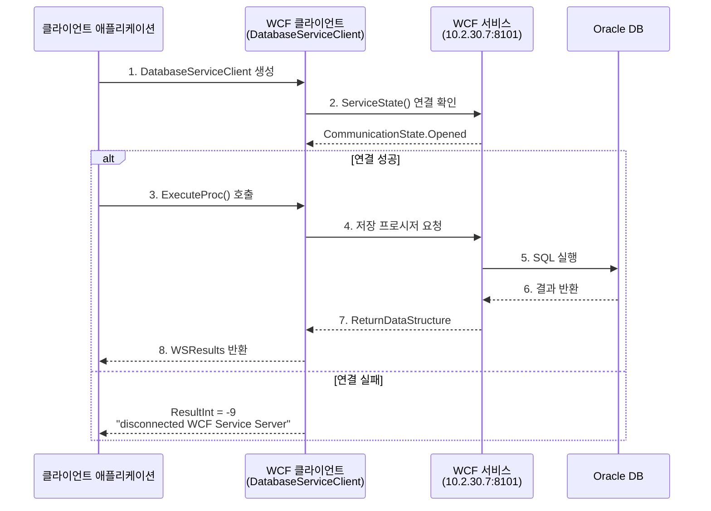

# WCF 서비스

> **Windows Communication Foundation (WCF)** 기반의 고성능 데이터베이스 서비스 클라이언트

---

## 서비스 엔드포인트

```http
net.tcp://10.2.30.7:8101/WCF_SERVICE
```

| 속성 | 값 |
|------|-----|
| **프로토콜** | NetTcp |
| **IP 주소** | 10.2.30.7 |
| **포트** | 8101 |
| **서비스명** | WCF_SERVICE |
| **네임스페이스** | `NGS.WCFClient.DatabaseService` |

---

## 바인딩 구성 (NetTcpBinding)

### 기본 설정

```csharp
var binding = new NetTcpBinding
{
    // 보안 설정
    Security = {
        Mode = SecurityMode.Transport,
        Transport = {
            ClientCredentialType = TcpClientCredentialType.Windows
        }
    },
    
    // 타임아웃 설정
    OpenTimeout = TimeSpan.FromMinutes(5),
    CloseTimeout = TimeSpan.FromMinutes(5),
    SendTimeout = TimeSpan.FromMinutes(5),
    ReceiveTimeout = TimeSpan.FromMinutes(10),
    
    // 메시지 크기 제한
    MaxBufferSize = 2147483647,
    MaxBufferPoolSize = 524288,
    MaxReceivedMessageSize = 2147483647,
    
    // 리더 할당량
    ReaderQuotas = {
        MaxDepth = 32,
        MaxStringContentLength = 2147483647,
        MaxArrayLength = 2147483647,
        MaxBytesPerRead = 4096,
        MaxNameTableCharCount = 16384
    }
};
```

### 압축 및 암호화 설정

```csharp
public class ServiceSettings
{
    public bool Compression { get; set; } = false;  // GZip 압축 사용
    public bool Encryption { get; set; } = false;   // 3DES 암호화 사용
    public int TimeoutMinute { get; set; } = 5;     // 타임아웃(분)
}
```

---

## 인터페이스 정의

### IDatabaseService 인터페이스

```csharp
[ServiceContract(ConfigurationName = "DatabaseService.IDatabaseService")]
public interface IDatabaseService
{
    // 사용자 인증
    [OperationContract]
    bool CheckUserIDAndPassword(string userid, string password);
    
    // SQL 쿼리 실행
    [OperationContract]
    ReturnDataStructure ExecuteQuery(string strSql);
    
    // DataSet 반환 쿼리 실행
    [OperationContract]
    ReturnDataStructure ExecuteQueryReturnDataSet(string strSql);
    
    // 저장 프로시저 실행 (DataSet 반환)
    [OperationContract]
    ReturnDataStructure ExecuteProcReturnDataSet(
        string procName, 
        int overload, 
        Dictionary<string, object> param);
    
    // 저장 프로시저 실행 (반환 없음)
    [OperationContract]
    ReturnDataStructure ExecuteProcNoReturnDataSet(
        string procName, 
        int overload, 
        Dictionary<string, object> param);
    
    // 서비스 로그인
    [OperationContract]
    bool ServiceLogin(string userid, string password);
    
    // 서비스 상태 확인
    [OperationContract]
    CommunicationState ServiceState();
    
    // 바코드 인쇄
    [OperationContract]
    bool BarcodePrint(string _PrinterName, string _BarcodePrintCommand);
}
```

---

## 서비스 메서드

### ExecuteProc

저장 프로시저를 실행하고 결과를 반환합니다.

```csharp
public WSResults ExecuteProcCls(string ProcName, int overload, Dictionary<string, object> param)
```

| 매개변수 | 타입 | 설명 |
|---------|------|------|
| `ProcName` | `string` | 실행할 저장 프로시저 이름 |
| `overload` | `int` | 프로시저 오버로드 번호 |
| `param` | `Dictionary<string, object>` | 프로시저 매개변수 |

**반환값:**

| 속성 | 타입 | 설명 |
|------|------|------|
| `ResultDataSet` | `DataSet` | 쿼리 결과 데이터 |
| `ResultInt` | `int` | 실행 결과 코드 (0: 성공, -9: 연결 실패) |
| `ResultString` | `string` | 실행 결과 메시지 |

**사용 예제:**

```csharp
// WCF 서비스 프로세서 초기화
var wcfProcess = new WCFServiceProcess();

// 매개변수 설정
var parameters = new Dictionary<string, object>
{
    { "P_USER_ID", "ADMIN" },
    { "P_DEPT_CODE", "P200" },
    { "P_FROM_DATE", DateTime.Now.AddDays(-7) },
    { "P_TO_DATE", DateTime.Now }
};

// 프로시저 실행
WSResults result = wcfProcess.ExecuteProcCls(
    "USP_PRODUCTION_QUERY", 
    1, 
    parameters
);

// 결과 확인
if (result.ResultInt == 0)
{
    DataTable data = result.ResultDataSet.Tables[0];
    // 데이터 처리...
}
else
{
    Console.WriteLine($"오류: {result.ResultString}");
}
```

---

### ExecuteQuery

SQL 쿼리를 실행하고 결과 DataSet을 반환합니다.

```csharp
public ReturnDataStructure ExecuteQuery(string strSql)
```

```csharp
// 직접 쿼리 실행
string query = @"
    SELECT * 
    FROM TB_PRODUCTION 
    WHERE WORK_DATE >= :FROM_DATE
";

var result = wcfClient.ExecuteQuery(query);

if (result.ReturnInt == 0)
{
    DataSet data = result.ReturnDataSet;
    // 데이터 처리
}
```

!!! warning "보안 주의"
    직접 SQL 쿼리 실행 시 SQL Injection에 주의하세요. 가능한 저장 프로시저를 사용하는 것을 권장합니다.

---

### CheckConnection

WCF 서비스 연결 상태를 확인합니다.

```csharp
public bool GetWsConnectStatus()
```

```csharp
// 연결 상태 확인
bool isConnected = wcfProcess.GetWsConnectStatus();

if (isConnected)
{
    Console.WriteLine("WCF 서비스 연결됨");
}
else
{
    Console.WriteLine("WCF 서비스 연결 실패");
}
```

---

## 통신 흐름 다이어그램



---

## 데이터 구조

### ReturnDataStructure

WCF 서비스에서 반환하는 기본 데이터 구조입니다.

```csharp
[DataContract]
public class ReturnDataStructure
{
    [DataMember]
    public DataSet ReturnDataSet { get; set; }     // 결과 데이터셋
    
    [DataMember]
    public int ReturnInt { get; set; }              // 결과 코드
    
    [DataMember]
    public string ReturnString { get; set; }        // 결과 메시지
    
    [DataMember]
    public OutputParameterValue[] OutputParamList { get; set; }  // 출력 매개변수
}
```

### OutputParameterValue

저장 프로시저의 출력 매개변수를 나타냅니다.

```csharp
[DataContract]
public class OutputParameterValue
{
    [DataMember]
    public string ParamName { get; set; }    // 매개변수 이름
    
    [DataMember]
    public object ParamValue { get; set; }   // 매개변수 값
}
```

---

## 오류 처리

### 예외 처리 패턴

```csharp
try
{
    ReturnDataStructure result = WcfSvr.ExecuteProc(procName, overload);
}
catch (CommunicationException ex)
{
    // 통신 오류 처리
    LogHelper.WriteLog($"통신 오류: {ex.Message}");
}
catch (TimeoutException ex)
{
    // 타임아웃 오류 처리
    LogHelper.WriteLog($"타임아웃: {ex.Message}");
}
catch (FaultException ex)
{
    // 서비스 오류 처리
    LogHelper.WriteLog($"서비스 오류: {ex.Message}");
}
finally
{
    // 리소스 정리
    WcfSvr.Close();
}
```

### 결과 코드 정의

| 코드 | 의미 | 설명 |
|------|------|------|
| `0` | 성공 | 정상적으로 실행됨 |
| `-9` | 연결 실패 | WCF 서비스 서버와 연결할 수 없음 |
| `-1` | 오류 | 실행 중 오류 발생 |

---

## 보안 설정

### 3DES 암호화

```csharp
public class SecurityTripleDES
{
    // 데이터 암호화
    public static string Encrypt(string plainText, string key)
    {
        // TripleDES 암호화 로직
    }
    
    // 데이터 복호화
    public static string Decrypt(string cipherText, string key)
    {
        // TripleDES 복호화 로직
    }
}
```

### GZip 압축

```csharp
// 메시지 인코딩에 GZip 사용
public class GZipMessageEncodingBindingElement : MessageEncodingBindingElement
{
    public override MessageEncoderFactory CreateMessageEncoderFactory()
    {
        return new GZipMessageEncoderFactory(innerEncoderFactory);
    }
}
```

!!! tip "압축 사용 권장"
    대용량 데이터 전송 시 GZip 압축을 활성화하면 네트워크 대역폭을 크게 절약할 수 있습니다.

---

## 클라이언트 사용 예제

### 기본 사용법

```csharp
using NGS.WCFClient;
using NGS.WCFClient.DatabaseService;

// 설정 초기화
var settings = new ServiceSettings
{
    IPAddress = "10.2.30.7",
    Port = 8101,
    ServiceName = "WCF_SERVICE",
    Protocol = ProtocolKind.NetTcp,
    TimeoutMinute = 5
};

// 클라이언트 헬퍼 생성
var clientHelper = new DatabaseServiceClientHelper();
clientHelper.DatabaseServiceSettings = settings;

// 저장 프로시저 매개변수 설정
clientHelper.SpParam = new Dictionary<string, object>
{
    { "P_ITEM_CODE", "ITEM001" },
    { "P_QTY", 100 }
};

// 프로시저 실행
ReturnDataStructure result = clientHelper.ExecuteProc("USP_INSERT_ORDER", 1);

// 결과 처리
if (result.ReturnInt == 0)
{
    Console.WriteLine("성공적으로 처리되었습니다.");
    DataSet ds = result.ReturnDataSet;
}
```

### 싱글톤 패턴 적용

```csharp
public sealed class WCFServiceManager
{
    private static readonly Lazy<WCFServiceManager> lazy =
        new Lazy<WCFServiceManager>(() => new WCFServiceManager());
    
    public static WCFServiceManager Instance => lazy.Value;
    
    private DatabaseServiceClientHelper _client;
    
    private WCFServiceManager()
    {
        _client = new DatabaseServiceClientHelper();
        _client.DatabaseServiceSettings = Program.m_DatabaseSettings;
    }
    
    public WSResults ExecuteProcedure(string procName, Dictionary<string, object> param)
    {
        var process = new WCFServiceProcess();
        return process.ExecuteProcCls(procName, 1, param);
    }
}
```
