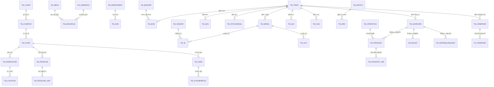
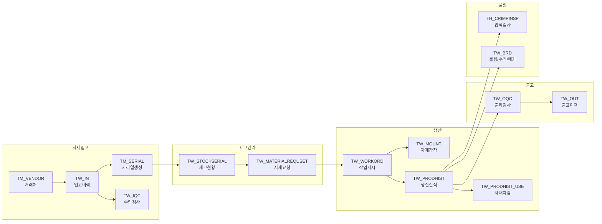

# ERD (Entity Relationship Diagram)

!!! info "자동 생성 문서"
    이 문서는 HANES Oracle DB(MESUSER@CDBHNSMES)에서 자동 추출하여 생성되었습니다.
    FK 제약은 DB에 미설정 - 컬럼명 기반 논리적 관계를 표시합니다.
    최종 추출일: 2026-02-15

## 1. 전체 구조 개요



## 2. 핵심 엔티티 상세

### TM_CLIENT (법인마스터)

행수: **1**

```
┌─────────────────────────────────────────────────────────────────┐
│                            TM_CLIENT                            │
├─────────────────────────────────────────────────────────────────┤
│ PK │ CLIENT                    │ VARCHAR2(5)     │ NN │         │
│    │ CLIENTNAME                │ VARCHAR2(50)    │ NN │         │
│    │ UDF1                      │ NUMBER          │    │         │
│    │ UDF2                      │ NUMBER          │    │         │
│    │ UDF3                      │ NUMBER          │    │         │
│    │ USEFLAG                   │ VARCHAR2(1)     │    │         │
│    │ REMARKS                   │ VARCHAR2(4000)  │    │         │
│    │ CREATETIMEKEY             │ VARCHAR2(20)    │    │         │
│    │ CREATEUSER                │ VARCHAR2(10)    │    │         │
│    │ UPDATETIMEKEY             │ VARCHAR2(20)    │    │         │
│    │ UPDATEUSER                │ VARCHAR2(10)    │    │         │
└─────────────────────────────────────────────────────────────────┘
```

### TM_COMPANY (부속회사마스터)

행수: **1**

```
┌─────────────────────────────────────────────────────────────────┐
│                           TM_COMPANY                            │
├─────────────────────────────────────────────────────────────────┤
│ PK │ CLIENT                    │ VARCHAR2(5)     │ NN │         │
│ PK │ COMPANY                   │ VARCHAR2(5)     │ NN │         │
│    │ COMPANYNAME               │ VARCHAR2(50)    │ NN │         │
│    │ UDF1                      │ NUMBER          │    │         │
│    │ UDF2                      │ NUMBER          │    │         │
│    │ UDF3                      │ NUMBER          │    │         │
│    │ USEFLAG                   │ VARCHAR2(1)     │    │         │
│    │ REMARKS                   │ VARCHAR2(4000)  │    │         │
│    │ CREATETIMEKEY             │ VARCHAR2(20)    │    │         │
│    │ CREATEUSER                │ VARCHAR2(10)    │    │         │
│    │ UPDATETIMEKEY             │ VARCHAR2(20)    │    │         │
│    │ UPDATEUSER                │ VARCHAR2(10)    │    │         │
└─────────────────────────────────────────────────────────────────┘
```

### TM_PLANT (공장마스터)

행수: **1**

```
┌─────────────────────────────────────────────────────────────────┐
│                            TM_PLANT                             │
├─────────────────────────────────────────────────────────────────┤
│ PK │ CLIENT                    │ VARCHAR2(5)     │ NN │         │
│ PK │ COMPANY                   │ VARCHAR2(5)     │ NN │         │
│ PK │ PLANT                     │ VARCHAR2(10)    │ NN │         │
│    │ PLANTNAME                 │ VARCHAR2(50)    │ NN │         │
│    │ PLANTTYPE                 │ VARCHAR2(30)    │    │         │
│    │ UDF1                      │ NUMBER          │    │         │
│    │ UDF2                      │ NUMBER          │    │         │
│    │ UDF3                      │ NUMBER          │    │         │
│    │ USEFLAG                   │ VARCHAR2(1)     │    │         │
│    │ REMARKS                   │ VARCHAR2(4000)  │    │         │
│    │ CREATETIMEKEY             │ VARCHAR2(20)    │    │         │
│    │ CREATEUSER                │ VARCHAR2(10)    │    │         │
│    │ UPDATETIMEKEY             │ VARCHAR2(20)    │    │         │
│    │ UPDATEUSER                │ VARCHAR2(10)    │    │         │
└─────────────────────────────────────────────────────────────────┘
```

### TM_USER (사용자마스터)

행수: **88**

```
┌─────────────────────────────────────────────────────────────────┐
│                             TM_USER                             │
├─────────────────────────────────────────────────────────────────┤
│ PK │ CLIENT                    │ VARCHAR2(5)     │ NN │         │
│ PK │ COMPANY                   │ VARCHAR2(5)     │ NN │         │
│ PK │ PLANT                     │ VARCHAR2(10)    │ NN │         │
│ PK │ USERID                    │ VARCHAR2(10)    │ NN │         │
│    │ PASSWORD                  │ VARCHAR2(100)   │    │         │
│    │ EHRCODE                   │ VARCHAR2(10)    │    │         │
│    │ LOCUSERNAME               │ VARCHAR2(50)    │    │         │
│    │ VALIDTODATE               │ VARCHAR2(8)     │    │         │
│    │ UDF1                      │ NUMBER          │    │         │
│    │ UDF2                      │ NUMBER          │    │         │
│    │ UDF3                      │ NUMBER          │    │         │
│    │ USEFLAG                   │ VARCHAR2(1)     │    │         │
│    │ REMARKS                   │ VARCHAR2(4000)  │    │         │
│    │ CREATETIMEKEY             │ VARCHAR2(20)    │    │         │
│    │ CREATEUSER                │ VARCHAR2(10)    │    │         │
│    │ UPDATETIMEKEY             │ VARCHAR2(20)    │    │         │
│    │ UPDATEUSER                │ VARCHAR2(10)    │    │         │
└─────────────────────────────────────────────────────────────────┘
```

### TM_ITEMS (품목마스터)

행수: **1,315**

```
┌─────────────────────────────────────────────────────────────────┐
│                            TM_ITEMS                             │
├─────────────────────────────────────────────────────────────────┤
│ PK │ CLIENT                    │ VARCHAR2(5)     │ NN │         │
│ PK │ COMPANY                   │ VARCHAR2(5)     │ NN │         │
│ PK │ PLANT                     │ VARCHAR2(10)    │ NN │         │
│ PK │ ITEMCODE                  │ NUMBER          │ NN │         │
│    │ ITEMNAME                  │ VARCHAR2(100)   │ NN │         │
│    │ PARTNO                    │ VARCHAR2(30)    │ NN │         │
│    │ CUSTPARTNO                │ VARCHAR2(30)    │    │         │
│    │ SPEC                      │ VARCHAR2(4000)  │    │         │
│    │ REV                       │ VARCHAR2(5)     │    │         │
│    │ ROOTITEM                  │ NUMBER          │    │         │
│    │ ITEMTYPE                  │ VARCHAR2(30)    │    │         │
│    │ UNITCODE                  │ VARCHAR2(4)     │    │         │
│    │ VALIDFROMDATE             │ VARCHAR2(8)     │    │         │
│    │ SAFTYQTY                  │ NUMBER          │    │         │
│    │ LOTUNITQTY                │ NUMBER          │    │         │
│    │ BOXQTY                    │ NUMBER          │    │         │
│    │ UNITNO                    │ VARCHAR2(10)    │    │         │
│    │ IQCFLAG                   │ VARCHAR2(1)     │    │         │
│    │ CURRFLOWINSFLAG           │ VARCHAR2(10)    │    │         │
│    │ TERMINALFLAG              │ VARCHAR2(1)     │    │         │
│    │ PRINTUNIT                 │ NUMBER          │    │         │
│    │ QTYOUTFLAG                │ VARCHAR2(1)     │    │         │
│    │ QTYPACKFLAG               │ VARCHAR2(1)     │    │         │
│    │ PRINTTYPE                 │ VARCHAR2(1)     │    │         │
│    │ TACTTIME                  │ NUMBER          │    │         │
│    │ LABELTEXT                 │ VARCHAR2(1)     │    │         │
│    │ PRODUCTTYPE               │ VARCHAR2(8)     │    │         │
│    │ VISUALTACTTIME            │ NUMBER          │    │         │
│    │ TOOL                      │ VARCHAR2(100)   │    │         │
│    │ PARTNOSIZE                │ VARCHAR2(100)   │    │         │
│    │ PARTNOTYPE                │ VARCHAR2(100)   │    │         │
│    │ IMAGE                     │ BLOB            │    │         │
│    │ IMAGE2                    │ BLOB            │    │         │
│    │ EXPIRYDATE                │ NUMBER          │    │         │
│    │ ERPFLAG                   │ VARCHAR2(1)     │    │         │
│    │ USEFLAG                   │ VARCHAR2(1)     │    │         │
│    │ LONGTERMDATE              │ NUMBER          │    │         │
│    │ UDF2                      │ NUMBER          │    │         │
│    │ UDF3                      │ NUMBER          │    │         │
│    │ REMARKS                   │ VARCHAR2(4000)  │    │         │
│    │ CREATETIMEKEY             │ VARCHAR2(20)    │    │         │
│    │ CREATEUSER                │ VARCHAR2(10)    │    │         │
│    │ UPDATETIMEKEY             │ VARCHAR2(20)    │    │         │
│    │ UPDATEUSER                │ VARCHAR2(10)    │    │         │
└─────────────────────────────────────────────────────────────────┘
```

### TM_SERIAL (시리얼마스터)

행수: **1,868,570**

```
┌─────────────────────────────────────────────────────────────────┐
│                            TM_SERIAL                            │
├─────────────────────────────────────────────────────────────────┤
│ PK │ CLIENT                    │ VARCHAR2(5)     │ NN │         │
│ PK │ COMPANY                   │ VARCHAR2(5)     │ NN │         │
│ PK │ PLANT                     │ VARCHAR2(10)    │ NN │         │
│ PK │ SERIAL                    │ VARCHAR2(100)   │ NN │         │
│    │ SERIALTYPE                │ VARCHAR2(1)     │ NN │         │
│    │ PRESERIAL                 │ VARCHAR2(50)    │    │         │
│    │ INDATE                    │ VARCHAR2(8)     │    │         │
│    │ TXNCODE                   │ VARCHAR2(5)     │    │         │
│    │ ITEMCODE                  │ NUMBER          │    │         │
│    │ QTY                       │ NUMBER          │ NN │         │
│    │ WRKORD                    │ VARCHAR2(30)    │    │         │
│    │ WRKORDSEQ                 │ NUMBER          │    │         │
│    │ ORDERNO                   │ VARCHAR2(12)    │    │         │
│    │ ORDERSEQ                  │ NUMBER          │    │         │
│    │ INVOICENO                 │ VARCHAR2(30)    │    │         │
│    │ VENDOR                    │ VARCHAR2(10)    │    │         │
│    │ MAKER                     │ VARCHAR2(10)    │    │         │
│    │ BCDDATA                   │ VARCHAR2(100)   │    │         │
│    │ BCDLOT                    │ VARCHAR2(100)   │    │         │
│    │ PRINTFLAG                 │ VARCHAR2(1)     │    │         │
│    │ SLIPNO                    │ VARCHAR2(100)   │    │         │
│    │ IQCNO                     │ NUMBER          │    │         │
│    │ BOXNO                     │ VARCHAR2(50)    │    │         │
│    │ REPRINTCNT                │ NUMBER          │    │         │
│    │ PRINTCNT                  │ NUMBER          │    │         │
│    │ UDF3                      │ NUMBER          │    │         │
│    │ USEFLAG                   │ VARCHAR2(1)     │    │         │
│    │ REMARKS                   │ VARCHAR2(4000)  │    │         │
│    │ CREATETIMEKEY             │ VARCHAR2(20)    │    │         │
│    │ CREATEUSER                │ VARCHAR2(10)    │    │         │
│    │ UPDATETIMEKEY             │ VARCHAR2(20)    │    │         │
│    │ UPDATEUSER                │ VARCHAR2(10)    │    │         │
└─────────────────────────────────────────────────────────────────┘
```

### TM_BOM (BOM마스터)

행수: **9,206**

```
┌─────────────────────────────────────────────────────────────────┐
│                             TM_BOM                              │
├─────────────────────────────────────────────────────────────────┤
│ PK │ CLIENT                    │ VARCHAR2(5)     │ NN │         │
│ PK │ COMPANY                   │ VARCHAR2(5)     │ NN │         │
│ PK │ PLANT                     │ VARCHAR2(10)    │ NN │         │
│ PK │ IDX                       │ NUMBER          │ NN │         │
│ PK │ UPRIDX                    │ NUMBER          │ NN │         │
│ PK │ BOMGRP                    │ VARCHAR2(30)    │ NN │         │
│ PK │ REV                       │ NUMBER          │ NN │         │
│    │ UPRITEM                   │ NUMBER          │ NN │         │
│    │ ITEMCODE                  │ NUMBER          │ NN │         │
│    │ SEQ                       │ NUMBER          │    │         │
│    │ OPER                      │ VARCHAR2(6)     │    │         │
│    │ ASSYOPER                  │ VARCHAR2(6)     │    │         │
│    │ ASSYUSAGE                 │ NUMBER          │ NN │         │
│    │ SIDE                      │ VARCHAR2(30)    │ NN │         │
│    │ STORAGEFLAG               │ VARCHAR2(1)     │ NN │         │
│    │ ASSYFLAG                  │ VARCHAR2(1)     │ NN │         │
│    │ VALIDFROMDATE             │ VARCHAR2(20)    │    │         │
│    │ STARTDATE                 │ VARCHAR2(8)     │    │         │
│    │ ENDDATE                   │ VARCHAR2(8)     │    │         │
│    │ REPLACEFLAG               │ VARCHAR2(1)     │    │         │
│    │ UDF2                      │ NUMBER          │    │         │
│    │ UDF3                      │ NUMBER          │    │         │
│    │ USEFLAG                   │ VARCHAR2(1)     │    │         │
│    │ REMARKS                   │ VARCHAR2(4000)  │    │         │
│    │ CREATETIMEKEY             │ VARCHAR2(20)    │    │         │
│    │ CREATEUSER                │ VARCHAR2(10)    │    │         │
│    │ UPDATETIMEKEY             │ VARCHAR2(20)    │    │         │
│    │ UPDATEUSER                │ VARCHAR2(10)    │    │         │
└─────────────────────────────────────────────────────────────────┘
```

### TM_WAREHOUSE (창고마스터)

행수: **6**

```
┌─────────────────────────────────────────────────────────────────┐
│                          TM_WAREHOUSE                           │
├─────────────────────────────────────────────────────────────────┤
│ PK │ CLIENT                    │ VARCHAR2(5)     │ NN │         │
│ PK │ COMPANY                   │ VARCHAR2(5)     │ NN │         │
│ PK │ PLANT                     │ VARCHAR2(10)    │ NN │         │
│ PK │ WAREHOUSE                 │ VARCHAR2(10)    │ NN │         │
│    │ WAREHOUSENAME             │ VARCHAR2(100)   │ NN │         │
│    │ WAREHOUSETYPE             │ VARCHAR2(4)     │    │         │
│    │ VENDOR                    │ VARCHAR2(10)    │    │         │
│    │ UDF1                      │ NUMBER          │    │         │
│    │ UDF2                      │ NUMBER          │    │         │
│    │ UDF3                      │ NUMBER          │    │         │
│    │ USEFLAG                   │ VARCHAR2(1)     │    │         │
│    │ REMARKS                   │ VARCHAR2(4000)  │    │         │
│    │ CREATETIMEKEY             │ VARCHAR2(20)    │    │         │
│    │ CREATEUSER                │ VARCHAR2(10)    │    │         │
│    │ UPDATETIMEKEY             │ VARCHAR2(20)    │    │         │
│    │ UPDATEUSER                │ VARCHAR2(10)    │    │         │
└─────────────────────────────────────────────────────────────────┘
```

### TM_LOCATION (창고별위치마스터)

행수: **10**

```
┌─────────────────────────────────────────────────────────────────┐
│                           TM_LOCATION                           │
├─────────────────────────────────────────────────────────────────┤
│ PK │ CLIENT                    │ VARCHAR2(5)     │ NN │         │
│ PK │ COMPANY                   │ VARCHAR2(5)     │ NN │         │
│ PK │ PLANT                     │ VARCHAR2(10)    │ NN │         │
│ PK │ WHLOC                     │ VARCHAR2(10)    │ NN │         │
│    │ WHLOCNAME                 │ VARCHAR2(100)   │ NN │         │
│    │ WAREHOUSE                 │ VARCHAR2(10)    │ NN │         │
│    │ PRODLINE                  │ VARCHAR2(10)    │    │         │
│    │ ERPLOCCODE                │ VARCHAR2(50)    │    │         │
│    │ VENDOR                    │ VARCHAR2(10)    │    │         │
│    │ OQCWHLOC                  │ VARCHAR2(10)    │    │         │
│    │ LOCTYPE                   │ VARCHAR2(1)     │    │         │
│    │ PURCHASEFLAG              │ VARCHAR2(1)     │    │         │
│    │ BADWHFLAG                 │ VARCHAR2(1)     │ NN │         │
│    │ RETRIEVALFLAG             │ VARCHAR2(1)     │ NN │         │
│    │ STOCKINSPFLAG             │ VARCHAR2(1)     │ NN │         │
│    │ SERIALDESTFLAG            │ VARCHAR2(1)     │ NN │         │
│    │ REPAIRFLAG                │ VARCHAR2(1)     │ NN │         │
│    │ OTHERINFLAG               │ VARCHAR2(1)     │ NN │         │
│    │ PUBFLAG                   │ VARCHAR2(1)     │ NN │         │
│    │ FIFOFLAG                  │ VARCHAR2(1)     │    │         │
│    │ UDF1                      │ NUMBER          │    │         │
│    │ UDF2                      │ NUMBER          │    │         │
│    │ UDF3                      │ NUMBER          │    │         │
│    │ USEFLAG                   │ VARCHAR2(1)     │    │         │
│    │ REMARKS                   │ VARCHAR2(4000)  │    │         │
│    │ CREATETIMEKEY             │ VARCHAR2(20)    │    │         │
│    │ CREATEUSER                │ VARCHAR2(10)    │    │         │
│    │ UPDATETIMEKEY             │ VARCHAR2(20)    │    │         │
│    │ UPDATEUSER                │ VARCHAR2(10)    │    │         │
└─────────────────────────────────────────────────────────────────┘
```

### TM_VENDOR (거래처마스터)

행수: **5**

```
┌─────────────────────────────────────────────────────────────────┐
│                            TM_VENDOR                            │
├─────────────────────────────────────────────────────────────────┤
│ PK │ CLIENT                    │ VARCHAR2(5)     │ NN │         │
│ PK │ COMPANY                   │ VARCHAR2(5)     │ NN │         │
│ PK │ PLANT                     │ VARCHAR2(10)    │ NN │         │
│ PK │ VENDOR                    │ VARCHAR2(10)    │ NN │         │
│    │ VENDORNAME                │ VARCHAR2(100)   │ NN │         │
│    │ MAKER                     │ VARCHAR2(30)    │    │         │
│    │ ENTRYNO                   │ VARCHAR2(15)    │    │         │
│    │ CONTRYNO                  │ VARCHAR2(30)    │    │         │
│    │ CEONAME                   │ VARCHAR2(30)    │    │         │
│    │ PHONE                     │ VARCHAR2(20)    │    │         │
│    │ FAXNO                     │ VARCHAR2(20)    │    │         │
│    │ ADDRESS                   │ VARCHAR2(300)   │    │         │
│    │ PRCFLAG                   │ VARCHAR2(1)     │ NN │         │
│    │ SALFLAG                   │ VARCHAR2(1)     │ NN │         │
│    │ OSCFLAG                   │ VARCHAR2(1)     │ NN │         │
│    │ UDF1                      │ NUMBER          │    │         │
│    │ UDF2                      │ NUMBER          │    │         │
│    │ UDF3                      │ NUMBER          │    │         │
│    │ USEFLAG                   │ VARCHAR2(1)     │    │         │
│    │ REMARKS                   │ VARCHAR2(4000)  │    │         │
│    │ CREATETIMEKEY             │ VARCHAR2(20)    │    │         │
│    │ CREATEUSER                │ VARCHAR2(10)    │    │         │
│    │ UPDATETIMEKEY             │ VARCHAR2(20)    │    │         │
│    │ UPDATEUSER                │ VARCHAR2(10)    │    │         │
└─────────────────────────────────────────────────────────────────┘
```

### TM_OPERATION (공정마스터)

행수: **11**

```
┌─────────────────────────────────────────────────────────────────┐
│                          TM_OPERATION                           │
├─────────────────────────────────────────────────────────────────┤
│ PK │ CLIENT                    │ VARCHAR2(5)     │ NN │         │
│ PK │ COMPANY                   │ VARCHAR2(5)     │ NN │         │
│ PK │ PLANT                     │ VARCHAR2(10)    │ NN │         │
│ PK │ OPER                      │ VARCHAR2(6)     │ NN │         │
│    │ OPERNAME                  │ VARCHAR2(50)    │ NN │         │
│    │ OPERCODE                  │ VARCHAR2(30)    │    │         │
│    │ OPERTYPE                  │ NUMBER          │    │         │
│    │ PERMISSIONRATE            │ NUMBER          │    │         │
│    │ PRECEDE                   │ NUMBER          │    │         │
│    │ UDF1                      │ NUMBER          │    │         │
│    │ UDF2                      │ NUMBER          │    │         │
│    │ USEFLAG                   │ VARCHAR2(1)     │    │         │
│    │ REMARKS                   │ VARCHAR2(4000)  │    │         │
│    │ CREATETIMEKEY             │ VARCHAR2(20)    │    │         │
│    │ CREATEUSER                │ VARCHAR2(10)    │    │         │
│    │ UPDATETIMEKEY             │ VARCHAR2(20)    │    │         │
│    │ UPDATEUSER                │ VARCHAR2(10)    │    │         │
└─────────────────────────────────────────────────────────────────┘
```

### TM_PRODLINE (생산라인마스터)

행수: **10**

```
┌─────────────────────────────────────────────────────────────────┐
│                           TM_PRODLINE                           │
├─────────────────────────────────────────────────────────────────┤
│ PK │ CLIENT                    │ VARCHAR2(5)     │ NN │         │
│ PK │ COMPANY                   │ VARCHAR2(5)     │ NN │         │
│ PK │ PLANT                     │ VARCHAR2(10)    │ NN │         │
│ PK │ PRODLINE                  │ VARCHAR2(10)    │ NN │         │
│    │ PRODLINENAME              │ VARCHAR2(50)    │ NN │         │
│    │ WHLOC                     │ VARCHAR2(10)    │ NN │         │
│    │ ERPCODE                   │ VARCHAR2(10)    │    │         │
│    │ OPER                      │ VARCHAR2(6)     │    │         │
│    │ TYPE                      │ VARCHAR2(20)    │    │         │
│    │ UDF1                      │ NUMBER          │    │         │
│    │ UDF2                      │ NUMBER          │    │         │
│    │ USEFLAG                   │ VARCHAR2(1)     │    │         │
│    │ REMARKS                   │ VARCHAR2(4000)  │    │         │
│    │ CREATETIMEKEY             │ VARCHAR2(20)    │    │         │
│    │ CREATEUSER                │ VARCHAR2(10)    │    │         │
│    │ UPDATETIMEKEY             │ VARCHAR2(20)    │    │         │
│    │ UPDATEUSER                │ VARCHAR2(10)    │    │         │
└─────────────────────────────────────────────────────────────────┘
```

### TW_IN (입고 이력)

행수: **1,750,960**

```
┌─────────────────────────────────────────────────────────────────┐
│                              TW_IN                              │
├─────────────────────────────────────────────────────────────────┤
│ PK │ CLIENT                    │ VARCHAR2(5)     │ NN │         │
│ PK │ COMPANY                   │ VARCHAR2(5)     │ NN │         │
│ PK │ PLANT                     │ VARCHAR2(5)     │ NN │         │
│ PK │ INDATE                    │ VARCHAR2(8)     │ NN │         │
│ PK │ SERIAL                    │ VARCHAR2(50)    │ NN │         │
│ PK │ ITEMCODE                  │ NUMBER          │ NN │         │
│ PK │ STOCKTYPE                 │ VARCHAR2(1)     │ NN │         │
│ PK │ INQTY                     │ NUMBER          │ NN │         │
│ PK │ TXNTIMEKEY                │ VARCHAR2(20)    │ NN │         │
│ PK │ TXNCODE                   │ VARCHAR2(5)     │ NN │         │
│ PK │ WHLOC                     │ VARCHAR2(10)    │ NN │         │
│    │ VENDOR                    │ VARCHAR2(10)    │    │         │
│    │ FROMWHLOC                 │ VARCHAR2(10)    │    │         │
│    │ FROMVENDOR                │ VARCHAR2(10)    │    │         │
│    │ WRKORD                    │ VARCHAR2(15)    │    │         │
│    │ WRKORDSEQ                 │ NUMBER          │    │         │
│    │ INNO                      │ VARCHAR2(20)    │    │         │
│    │ OUTNO                     │ VARCHAR2(20)    │    │         │
│    │ ORDERNO                   │ VARCHAR2(30)    │    │         │
│    │ ORDERSEQ                  │ NUMBER          │    │         │
│    │ INVOICENO                 │ VARCHAR2(30)    │    │         │
│    │ IQCNO                     │ NUMBER          │    │         │
│    │ BOXNO                     │ VARCHAR2(50)    │    │         │
│    │ OPER                      │ VARCHAR2(6)     │    │         │
│    │ PRODLINE                  │ VARCHAR2(10)    │    │         │
│    │ SIDE                      │ VARCHAR2(1)     │ NN │         │
│    │ OUTSOURCINGFLAG           │ VARCHAR2(1)     │ NN │         │
│    │ ERPFLAG                   │ VARCHAR2(1)     │ NN │         │
│    │ CLOSINGFLAG               │ VARCHAR2(1)     │ NN │         │
│    │ UDF1                      │ NUMBER          │    │         │
│    │ UDF2                      │ NUMBER          │    │         │
│    │ UDF3                      │ NUMBER          │    │         │
│    │ USEFLAG                   │ VARCHAR2(1)     │    │         │
│    │ REMARKS                   │ VARCHAR2(4000)  │    │         │
│    │ CREATETIMEKEY             │ VARCHAR2(20)    │    │         │
│    │ CREATEUSER                │ VARCHAR2(10)    │    │         │
│    │ UPDATETIMEKEY             │ VARCHAR2(20)    │    │         │
│    │ UPDATEUSER                │ VARCHAR2(10)    │    │         │
└─────────────────────────────────────────────────────────────────┘
```

### TW_OUT (출고 이력)

행수: **9,271,825**

```
┌─────────────────────────────────────────────────────────────────┐
│                             TW_OUT                              │
├─────────────────────────────────────────────────────────────────┤
│ PK │ CLIENT                    │ VARCHAR2(5)     │ NN │         │
│ PK │ COMPANY                   │ VARCHAR2(5)     │ NN │         │
│ PK │ PLANT                     │ VARCHAR2(5)     │ NN │         │
│ PK │ OUTDATE                   │ VARCHAR2(8)     │ NN │         │
│ PK │ SERIAL                    │ VARCHAR2(50)    │ NN │         │
│ PK │ ITEMCODE                  │ NUMBER          │ NN │         │
│ PK │ STOCKTYPE                 │ VARCHAR2(1)     │ NN │         │
│ PK │ OUTQTY                    │ NUMBER          │ NN │         │
│ PK │ TXNTIMEKEY                │ VARCHAR2(20)    │ NN │         │
│ PK │ TXNCODE                   │ VARCHAR2(5)     │ NN │         │
│ PK │ WHLOC                     │ VARCHAR2(10)    │ NN │         │
│    │ VENDOR                    │ VARCHAR2(10)    │    │         │
│    │ TOWHLOC                   │ VARCHAR2(10)    │    │         │
│    │ TOVENDOR                  │ VARCHAR2(10)    │    │         │
│    │ WRKORD                    │ VARCHAR2(15)    │    │         │
│    │ WRKORDSEQ                 │ NUMBER          │    │         │
│    │ INNO                      │ VARCHAR2(20)    │    │         │
│    │ OUTNO                     │ VARCHAR2(20)    │    │         │
│    │ ORDERNO                   │ VARCHAR2(30)    │    │         │
│    │ ORDERSEQ                  │ NUMBER          │    │         │
│    │ INVOICENO                 │ VARCHAR2(30)    │    │         │
│    │ IQCNO                     │ NUMBER          │    │         │
│    │ BOXNO                     │ VARCHAR2(50)    │    │         │
│    │ OPER                      │ VARCHAR2(6)     │    │         │
│    │ PRODLINE                  │ VARCHAR2(10)    │    │         │
│    │ SIDE                      │ VARCHAR2(1)     │ NN │         │
│    │ OUTSOURCINGFLAG           │ VARCHAR2(1)     │ NN │         │
│    │ ERPFLAG                   │ VARCHAR2(1)     │ NN │         │
│    │ CLOSINGFLAG               │ VARCHAR2(1)     │ NN │         │
│    │ RESPONSENO                │ VARCHAR2(50)    │    │         │
│    │ UDF2                      │ NUMBER          │    │         │
│    │ UDF3                      │ NUMBER          │    │         │
│    │ USEFLAG                   │ VARCHAR2(1)     │    │         │
│    │ REMARKS                   │ VARCHAR2(4000)  │    │         │
│    │ CREATETIMEKEY             │ VARCHAR2(20)    │    │         │
│    │ CREATEUSER                │ VARCHAR2(10)    │    │         │
│    │ UPDATETIMEKEY             │ VARCHAR2(20)    │    │         │
│    │ UPDATEUSER                │ VARCHAR2(10)    │    │         │
└─────────────────────────────────────────────────────────────────┘
```

### TW_WORKORD (작업지시마스터정보)

행수: **34,862**

```
┌─────────────────────────────────────────────────────────────────┐
│                           TW_WORKORD                            │
├─────────────────────────────────────────────────────────────────┤
│ PK │ CLIENT                    │ VARCHAR2(5)     │ NN │         │
│ PK │ COMPANY                   │ VARCHAR2(5)     │ NN │         │
│ PK │ PLANT                     │ VARCHAR2(5)     │ NN │         │
│ PK │ WRKDATE                   │ VARCHAR2(8)     │ NN │         │
│ PK │ WRKORD                    │ VARCHAR2(15)    │ NN │         │
│ PK │ WRKORDSEQ                 │ NUMBER          │ NN │         │
│ PK │ WRKORDTYPE                │ VARCHAR2(1)     │ NN │         │
│ PK │ WRKORDSTATE               │ VARCHAR2(30)    │ NN │         │
│ PK │ BOMGRP                    │ VARCHAR2(30)    │ NN │         │
│ PK │ ITEMCODE                  │ NUMBER          │ NN │         │
│ PK │ ORDQTY                    │ NUMBER          │ NN │         │
│    │ UPRWRKORD                 │ VARCHAR2(15)    │    │         │
│    │ UPRWRKORDSEQ              │ NUMBER          │    │         │
│    │ MATREQUESTNO              │ VARCHAR2(15)    │    │         │
│    │ OPER                      │ VARCHAR2(6)     │    │         │
│    │ UNITNO                    │ VARCHAR2(10)    │    │         │
│    │ VENDOR                    │ VARCHAR2(10)    │    │         │
│    │ PLANSTARTTIME             │ VARCHAR2(20)    │    │         │
│    │ PLANENDTIME               │ VARCHAR2(20)    │    │         │
│    │ WRKSTARTTIME              │ VARCHAR2(20)    │    │         │
│    │ WRKENDTIME                │ VARCHAR2(20)    │    │         │
│    │ UDF1                      │ NUMBER          │    │         │
│    │ UDF2                      │ NUMBER          │    │         │
│    │ UDF3                      │ NUMBER          │    │         │
│    │ USEFLAG                   │ VARCHAR2(1)     │    │         │
│    │ REMARKS                   │ VARCHAR2(4000)  │    │         │
│    │ CREATETIMEKEY             │ VARCHAR2(20)    │    │         │
│    │ CREATEUSER                │ VARCHAR2(10)    │    │         │
│    │ UPDATETIMEKEY             │ VARCHAR2(20)    │    │         │
│    │ UPDATEUSER                │ VARCHAR2(10)    │    │         │
└─────────────────────────────────────────────────────────────────┘
```

### TW_PRODHIST (생산실적정보)

행수: **6,354,665**

```
┌─────────────────────────────────────────────────────────────────┐
│                           TW_PRODHIST                           │
├─────────────────────────────────────────────────────────────────┤
│ PK │ CLIENT                    │ VARCHAR2(5)     │ NN │         │
│ PK │ COMPANY                   │ VARCHAR2(5)     │ NN │         │
│ PK │ PLANT                     │ VARCHAR2(10)    │ NN │         │
│ PK │ TXNTIMEKEY                │ VARCHAR2(20)    │ NN │         │
│ PK │ PRODDATE                  │ VARCHAR2(8)     │ NN │         │
│ PK │ PRODTYPE                  │ VARCHAR2(1)     │ NN │         │
│ PK │ PRODPROGNO                │ VARCHAR2(30)    │ NN │         │
│ PK │ ITEMCODE                  │ NUMBER          │ NN │         │
│ PK │ TXNCODE                   │ VARCHAR2(5)     │ NN │         │
│ PK │ SERIAL                    │ VARCHAR2(30)    │ NN │         │
│    │ PRODQTY                   │ NUMBER          │    │         │
│    │ WRKORD                    │ VARCHAR2(15)    │    │         │
│    │ WRKORDSEQ                 │ NUMBER          │    │         │
│    │ UNITNO                    │ VARCHAR2(10)    │    │         │
│    │ BOXNO                     │ VARCHAR2(50)    │    │         │
│    │ JUDGE                     │ VARCHAR2(1)     │    │         │
│    │ DEFECT                    │ VARCHAR2(10)    │    │         │
│    │ WHLOC                     │ VARCHAR2(10)    │    │         │
│    │ REWORK                    │ VARCHAR2(1)     │    │         │
│    │ UDF2                      │ NUMBER          │    │         │
│    │ USEFLAG                   │ VARCHAR2(1)     │    │         │
│    │ REMARKS                   │ VARCHAR2(4000)  │    │         │
│    │ CREATETIMEKEY             │ VARCHAR2(20)    │    │         │
│    │ CREATEUSER                │ VARCHAR2(10)    │    │         │
│    │ UPDATETIMEKEY             │ VARCHAR2(20)    │    │         │
│    │ UPDATEUSER                │ VARCHAR2(10)    │    │         │
└─────────────────────────────────────────────────────────────────┘
```

### TW_STOCKSERIAL (재고 현황)

행수: **128,276**

```
┌─────────────────────────────────────────────────────────────────┐
│                         TW_STOCKSERIAL                          │
├─────────────────────────────────────────────────────────────────┤
│ PK │ CLIENT                    │ VARCHAR2(5)     │ NN │         │
│ PK │ COMPANY                   │ VARCHAR2(5)     │ NN │         │
│ PK │ PLANT                     │ VARCHAR2(5)     │ NN │         │
│ PK │ SERIAL                    │ VARCHAR2(50)    │ NN │         │
│ PK │ ITEMCODE                  │ NUMBER          │ NN │         │
│ PK │ WHLOC                     │ VARCHAR2(10)    │ NN │         │
│    │ GOODQTY                   │ NUMBER          │    │         │
│    │ BADQTY                    │ NUMBER          │    │         │
│    │ WRKORD                    │ VARCHAR2(15)    │    │         │
│    │ OPER                      │ VARCHAR2(6)     │    │         │
│    │ PRODLINE                  │ VARCHAR2(10)    │    │         │
│    │ LASTTXNTIMEKEY            │ VARCHAR2(20)    │    │         │
│    │ LASTTXNCODE               │ VARCHAR2(10)    │    │         │
│    │ UDF1                      │ NUMBER          │    │         │
│    │ UDF2                      │ NUMBER          │    │         │
│    │ UDF3                      │ NUMBER          │    │         │
│    │ USEFLAG                   │ VARCHAR2(1)     │    │         │
│    │ REMARKS                   │ VARCHAR2(4000)  │    │         │
│    │ CREATETIMEKEY             │ VARCHAR2(20)    │    │         │
│    │ CREATEUSER                │ VARCHAR2(10)    │    │         │
│    │ UPDATETIMEKEY             │ VARCHAR2(20)    │    │         │
│    │ UPDATEUSER                │ VARCHAR2(10)    │    │         │
└─────────────────────────────────────────────────────────────────┘
```

### TW_MOUNT (생산 자재 장착 정보)

행수: **154,126**

```
┌─────────────────────────────────────────────────────────────────┐
│                            TW_MOUNT                             │
├─────────────────────────────────────────────────────────────────┤
│ PK │ CLIENT                    │ VARCHAR2(5)     │ NN │         │
│ PK │ COMPANY                   │ VARCHAR2(5)     │ NN │         │
│ PK │ PLANT                     │ VARCHAR2(10)    │ NN │         │
│ PK │ WRKORD                    │ VARCHAR2(30)    │ NN │         │
│ PK │ WRKORDSEQ                 │ NUMBER          │ NN │         │
│ PK │ PRODPROGNO                │ VARCHAR2(30)    │ NN │         │
│ PK │ SERIAL                    │ VARCHAR2(30)    │ NN │         │
│ PK │ ITEMCODE                  │ NUMBER          │ NN │         │
│    │ SUBITEMCODE               │ NUMBER          │    │         │
│ PK │ UNITNO                    │ VARCHAR2(10)    │ NN │         │
│ PK │ SIDE                      │ VARCHAR2(1)     │ NN │         │
│ PK │ SEQ                       │ NUMBER          │ NN │         │
│    │ STOCKQTY                  │ NUMBER          │    │         │
│    │ USAGE                     │ NUMBER          │    │         │
│    │ UDF1                      │ NUMBER          │    │         │
│    │ UDF2                      │ NUMBER          │    │         │
│    │ UDF3                      │ NUMBER          │    │         │
│    │ USEFLAG                   │ VARCHAR2(1)     │    │         │
│    │ REMARKS                   │ VARCHAR2(4000)  │    │         │
│    │ CREATETIMEKEY             │ VARCHAR2(20)    │    │         │
│    │ CREATEUSER                │ VARCHAR2(10)    │    │         │
│    │ UPDATETIMEKEY             │ VARCHAR2(20)    │    │         │
│    │ UPDATEUSER                │ VARCHAR2(10)    │    │         │
└─────────────────────────────────────────────────────────────────┘
```

### TW_IQC (IQC정보)

행수: **3,639**

```
┌─────────────────────────────────────────────────────────────────┐
│                             TW_IQC                              │
├─────────────────────────────────────────────────────────────────┤
│ PK │ CLIENT                    │ VARCHAR2(5)     │ NN │         │
│ PK │ COMPANY                   │ VARCHAR2(5)     │ NN │         │
│ PK │ PLANT                     │ VARCHAR2(5)     │ NN │         │
│ PK │ IQCNO                     │ VARCHAR2(30)    │ NN │         │
│    │ ORDERNO                   │ VARCHAR2(12)    │    │         │
│    │ ORDERSEQ                  │ NUMBER          │    │         │
│    │ INVOICENO                 │ VARCHAR2(30)    │    │         │
│    │ ITEMCODE                  │ NUMBER          │    │         │
│    │ IQCDATE                   │ VARCHAR2(8)     │    │         │
│    │ IQCQTY                    │ NUMBER          │    │         │
│    │ IQCJUDGE                  │ VARCHAR2(8)     │    │         │
│    │ LABISSNUM                 │ NUMBER          │    │         │
│    │ LABISSFLAG                │ VARCHAR2(1)     │ NN │         │
│    │ FPATH                     │ VARCHAR2(1000)  │    │         │
│    │ DOCDATE                   │ VARCHAR2(8)     │    │         │
│    │ UDF2                      │ NUMBER          │    │         │
│    │ UDF3                      │ NUMBER          │    │         │
│    │ USEFLAG                   │ VARCHAR2(1)     │ NN │         │
│    │ REMARKS                   │ VARCHAR2(4000)  │    │         │
│    │ CREATETIMEKEY             │ VARCHAR2(20)    │ NN │         │
│    │ CREATEUSER                │ VARCHAR2(10)    │    │         │
│    │ UPDATETIMEKEY             │ VARCHAR2(20)    │    │         │
│    │ UPDATEUSER                │ VARCHAR2(10)    │    │         │
└─────────────────────────────────────────────────────────────────┘
```

### TW_OQC (출고 이력(OQC))

행수: **59,396**

```
┌─────────────────────────────────────────────────────────────────┐
│                             TW_OQC                              │
├─────────────────────────────────────────────────────────────────┤
│    │ CLIENT                    │ VARCHAR2(5)     │ NN │         │
│    │ COMPANY                   │ VARCHAR2(5)     │ NN │         │
│    │ PLANT                     │ VARCHAR2(5)     │ NN │         │
│    │ OUTDATE                   │ VARCHAR2(8)     │ NN │         │
│    │ ITEMCODE                  │ NUMBER          │ NN │         │
│    │ STOCKTYPE                 │ VARCHAR2(1)     │ NN │         │
│    │ OUTQTY                    │ NUMBER          │ NN │         │
│    │ TXNTIMEKEY                │ VARCHAR2(20)    │ NN │         │
│    │ TXNCODE                   │ VARCHAR2(5)     │ NN │         │
│    │ WHLOC                     │ VARCHAR2(10)    │ NN │         │
│    │ TOWHLOC                   │ VARCHAR2(10)    │ NN │         │
│    │ OQCDATE                   │ VARCHAR2(8)     │    │         │
│    │ INNO                      │ VARCHAR2(20)    │    │         │
│    │ OUTNO                     │ VARCHAR2(20)    │    │         │
│    │ BOXNO                     │ VARCHAR2(50)    │    │         │
│    │ ERPFLAG                   │ VARCHAR2(1)     │ NN │         │
│    │ UDF1                      │ NUMBER          │    │         │
│    │ UDF2                      │ NUMBER          │    │         │
│    │ UDF3                      │ NUMBER          │    │         │
│    │ USEFLAG                   │ VARCHAR2(1)     │    │         │
│    │ REMARKS                   │ VARCHAR2(4000)  │    │         │
│    │ CREATETIMEKEY             │ VARCHAR2(20)    │    │         │
│    │ CREATEUSER                │ VARCHAR2(10)    │    │         │
│    │ UPDATETIMEKEY             │ VARCHAR2(20)    │    │         │
│    │ UPDATEUSER                │ VARCHAR2(10)    │    │         │
└─────────────────────────────────────────────────────────────────┘
```

### TW_BRD (불량/수리/폐기 이력)

행수: **728**

```
┌─────────────────────────────────────────────────────────────────┐
│                             TW_BRD                              │
├─────────────────────────────────────────────────────────────────┤
│ PK │ CLIENT                    │ VARCHAR2(5)     │ NN │         │
│ PK │ COMPANY                   │ VARCHAR2(5)     │ NN │         │
│ PK │ PLANT                     │ VARCHAR2(10)    │ NN │         │
│ PK │ TXNTIMEKEY                │ VARCHAR2(20)    │ NN │         │
│ PK │ BRDDATE                   │ VARCHAR2(8)     │ NN │         │
│ PK │ DEFECT                    │ VARCHAR2(10)    │ NN │         │
│    │ DEFECT2                   │ VARCHAR2(10)    │    │         │
│    │ DEFECT3                   │ VARCHAR2(10)    │    │         │
│    │ DEFECT4                   │ VARCHAR2(10)    │    │         │
│    │ DEFECT5                   │ VARCHAR2(10)    │    │         │
│ PK │ SERIAL                    │ VARCHAR2(50)    │ NN │         │
│    │ FROMWHLOC                 │ VARCHAR2(10)    │    │         │
│    │ TOWHLOC                   │ VARCHAR2(10)    │    │         │
│    │ OPER                      │ VARCHAR2(6)     │    │         │
│    │ PRODLINE                  │ VARCHAR2(10)    │    │         │
│    │ UNITNO                    │ VARCHAR2(10)    │    │         │
│    │ ITEMCODE                  │ NUMBER          │    │         │
│    │ BRDQTY                    │ NUMBER          │    │         │
│    │ REPAIRQTY                 │ NUMBER          │    │         │
│    │ DISPOSEQTY                │ NUMBER          │    │         │
│    │ WRKORD                    │ VARCHAR2(15)    │    │         │
│    │ WRKORDSEQ                 │ NUMBER          │    │         │
│    │ UDF1                      │ NUMBER          │    │         │
│    │ UDF2                      │ NUMBER          │    │         │
│    │ UDF3                      │ NUMBER          │    │         │
│    │ USEFLAG                   │ VARCHAR2(1)     │    │         │
│    │ REMARKS                   │ VARCHAR2(4000)  │    │         │
│    │ CREATETIMEKEY             │ VARCHAR2(20)    │    │         │
│    │ CREATEUSER                │ VARCHAR2(10)    │    │         │
│    │ UPDATETIMEKEY             │ VARCHAR2(20)    │    │         │
│    │ UPDATEUSER                │ VARCHAR2(10)    │    │         │
└─────────────────────────────────────────────────────────────────┘
```

### TW_MATERIALREQUSET (자재 요청 정보)

행수: **12,966**

```
┌─────────────────────────────────────────────────────────────────┐
│                       TW_MATERIALREQUSET                        │
├─────────────────────────────────────────────────────────────────┤
│ PK │ CLIENT                    │ VARCHAR2(5)     │ NN │         │
│ PK │ COMPANY                   │ VARCHAR2(5)     │ NN │         │
│ PK │ PLANT                     │ VARCHAR2(10)    │ NN │         │
│ PK │ REQUESTDATE               │ VARCHAR2(8)     │ NN │         │
│ PK │ REQUESTMATNO              │ VARCHAR2(15)    │ NN │         │
│ PK │ SEQ                       │ NUMBER          │ NN │         │
│    │ ITEMCODE                  │ NUMBER          │ NN │         │
│    │ ASSYUSAGE                 │ NUMBER          │ NN │         │
│    │ REQUESTQTY                │ NUMBER          │ NN │         │
│    │ VENDOR                    │ VARCHAR2(10)    │    │         │
│    │ UDF2                      │ NUMBER          │    │         │
│    │ UDF3                      │ NUMBER          │    │         │
│    │ USEFLAG                   │ VARCHAR2(1)     │    │         │
│    │ REMARKS                   │ VARCHAR2(4000)  │    │         │
│    │ CREATETIMEKEY             │ VARCHAR2(20)    │    │         │
│    │ CREATEUSER                │ VARCHAR2(10)    │    │         │
│    │ UPDATETIMEKEY             │ VARCHAR2(20)    │    │         │
│    │ UPDATEUSER                │ VARCHAR2(10)    │    │         │
└─────────────────────────────────────────────────────────────────┘
```

## 3. 핵심 데이터 흐름



## 4. 주요 조인 키

| 조인 키 | 관련 테이블 | 설명 |
|---------|------------|------|
| `CLIENT, COMPANY, PLANT` | 거의 모든 테이블 | 멀티테넌트 기본키 |
| `ITEMCODE` (NUMBER) | TM_ITEMS, TM_SERIAL, TW_IN, TW_OUT, TW_STOCKSERIAL 등 | 품목 조인 |
| `SERIAL` (VARCHAR2) | TM_SERIAL, TW_IN, TW_OUT, TW_STOCKSERIAL, TW_PRODHIST 등 | 시리얼 추적 |
| `WHLOC` (VARCHAR2) | TM_LOCATION, TW_IN, TW_OUT, TW_STOCKSERIAL | 창고+위치 코드 |
| `BOXNO` (VARCHAR2) | TM_BOX, TM_SERIAL, TW_IN, TW_OUT | 박스 추적 |
| `WRKORD` (VARCHAR2) | TW_WORKORD, TW_PRODHIST, TW_MOUNT, TM_SERIAL | 작업지시번호 |
| `OPER` (VARCHAR2) | TM_OPERATION, TW_PRODHIST, TW_IN | 공정코드 |
| `VENDOR` (VARCHAR2) | TM_VENDOR, TW_IN, TM_SERIAL | 거래처코드 |
| `USERID` (VARCHAR2) | TM_USER, CREATEUSER/UPDATEUSER | 사용자 참조 |
| `PRODLINE` (VARCHAR2) | TM_PRODLINE, TW_WORKORD, TW_PRODHIST | 생산라인 |

!!! warning "ITEMCODE 타입 주의"
    `ITEMCODE`는 **NUMBER** 타입입니다 (VARCHAR2가 아님).
    TM_ITEMS.ITEMCODE를 조인할 때 타입 변환에 주의하세요.
