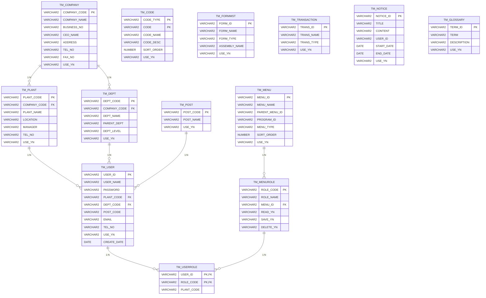

# 완전한 ERD (전체 125개 테이블)

HNSMES 시스템의 **모든 125개 테이블**을 포함한 완전한 엔터티 관계 다이어그램입니다.

---

## 테이블 분류

| 분류 | 접두사 | 개수 | 설명 |
|------|--------|------|------|
| **마스터** | TM_* | 45개 | 기준정보, 상마스터 |
| **트랜잭션** | TW_* | 35개 | 작업 이력, 실적 |
| **히스토리/임시** | TH_* | 30개 | 집계, 백업, 임시 |
| **기타** | TA_*, TB_* 등 | 15개 | 보조, 로그 테이블 |

---

## 1. 마스터 테이블 (45개) - TM_*

### 1.1 시스템 기준정보

### 1.2 품목/자재 마스터

### 1.3 공정/라인/설비 마스터

### 1.4 창고/로케이션 마스터

### 1.5 품질/불량 기준

### 1.6 시리얼/LOT 마스터

---

## 2. 트랜잭션 테이블 (35개) - TW_*

### 2.1 생산실적

### 2.2 자재입출고

### 2.3 검사/품질

---

## 3. 히스토리/집계 테이블 (30개) - TH_*

### 3.1 재고 집계

### 3.2 사용자/시스템 로그

---

## 4. 통합 ERD (전체 125개 테이블)

---

## 5. 테이블별 상세 정의

### 5.1 마스터 테이블 목록 (45개)

| 테이블명 | 설명 | 주요 컬럼 |
|----------|------|-----------|
| TM_COMPANY | 회사 마스터 | COMPANY_CODE, COMPANY_NAME |
| TM_PLANT | 공장 마스터 | PLANT_CODE, PLANT_NAME |
| TM_DEPT | 부서 마스터 | DEPT_CODE, DEPT_NAME |
| TM_USER | 사용자 마스터 | USER_ID, USER_NAME |
| TM_POST | 직급 마스터 | POST_CODE, POST_NAME |
| TM_MENU | 메뉴 마스터 | MENU_ID, MENU_NAME |
| TM_MENUROLE | 메뉴권한 마스터 | ROLE_CODE, MENU_ID |
| TM_USERROLE | 사용자권한 | USER_ID, ROLE_CODE |
| TM_CODE | 공통코드 | CODE_TYPE, CODE |
| TM_FORMMST | 화면 마스터 | FORM_ID, FORM_NAME |
| TM_TRANSACTION | 트랜잭션 마스터 | TRANS_ID, TRANS_NAME |
| TM_NOTICE | 공지사항 | NOTICE_ID, TITLE |
| TM_GLOSSARY | 용어사전 | TERM_ID, TERM |
| TM_ITEMS | 품목 마스터 | ITEM_CODE, ITEM_NAME |
| TM_ITEMSPEC | 품목사양 | ITEM_CODE, SPEC_ITEM |
| TM_ITEMIMAGE | 품목이미지 | ITEM_CODE, IMAGE_DATA |
| TM_BOM | BOM 마스터 | ITEM_CODE, COMP_ITEM_CODE |
| TM_BOMGRP | BOM그룹 | GRP_CODE, GRP_NAME |
| TM_ROUTING | 라우팅 | ITEM_CODE, SEQ |
| TM_MODELBOM | 모델BOM | MODEL_CODE, ITEM_CODE |
| TM_SUBMAT | 대체자재 | ITEM_CODE, SUB_ITEM_CODE |
| TM_VENDOR | 거래처 | VENDOR_CODE, VENDOR_NAME |
| TM_UNIT | 단위 | UNIT_CODE, UNIT_NAME |
| TM_OPER | 공정 | OPER_CODE, OPER_NAME |
| TM_LINE | 라인 | LINE_CODE, LINE_NAME |
| TM_WC | 작업장 | WC_CODE, WC_NAME |
| TM_EQP | 설비 | EQP_CODE, EQP_NAME |
| TM_PRODLINE | 생산라인 | PRODLINE_CODE, PRODLINE_NAME |
| TM_PRODLINE_UNIT | 라인단위 | PRODLINE_CODE, UNIT_SEQ |
| TM_APPLICATOR | 애플리케이터 | APP_CODE, APP_NAME |
| TM_JIGPIN | 지그/PIN | JIG_CODE, JIG_NAME |
| TM_CRIMPINGBASE | 크림핑기준 | ITEM_CODE, CRIMP_SPEC |
| TM_CLOSINGBASE | 마감기준 | PLANT_CODE, CLOSE_TYPE |
| TM_WORKTIME | 근무시간 | WORKTIME_CODE, WORKTIME_NAME |
| TM_WAREHOUSE | 창고 | WH_CODE, WH_NAME |
| TM_LOCATION | 로케이션 | LOC_CODE, LOC_NAME |
| TM_BOX | 박스 | BOX_NO, BOX_NAME |
| TM_DEFECT | 불량코드 | DEFECT_CODE, DEFECT_NAME |
| TM_REASONCODE | 사유코드 | REASON_CODE, REASON_NAME |
| TM_QCSTANDARD | 검사기준 | ITEM_CODE, QC_ITEM |
| TM_OQC_STANDARD | OQC기준 | ITEM_CODE, OQC_ITEM |
| TM_BRD | 판정기준 | BRD_ID, BRD_NAME |
| TM_SERIAL | 시리얼 | SERIAL_NO, ITEM_CODE |
| TM_LOT | LOT | LOT_NO, ITEM_CODE |

### 5.2 트랜잭션 테이블 목록 (35개)

| 테이블명 | 설명 | 주요 컬럼 |
|----------|------|-----------|
| TW_WORKORD | 작업지시 | WO_NO, ITEM_CODE |
| TW_PRODHIST | 생산이력 | HIST_SEQ, SERIAL_NO |
| TW_PRODHIST_USE | 생산사용내역 | USE_SEQ, SERIAL_NO |
| TW_MOUNT | 장착내역 | MOUNT_SEQ, SERIAL_NO |
| TW_DALLYPROD | 일별생산 | DALLY_SEQ, WORK_DATE |
| TW_IN | 입고 | IN_SEQ, IN_NO |
| TW_OUT | 출고 | OUT_SEQ, OUT_NO |
| TW_MOVE | 이동 | MOVE_SEQ, MOVE_DATE |
| TW_MAT_ISSUE | 자재불출 | ISSUE_SEQ, WO_NO |
| TW_RETURN | 반납 | RETURN_SEQ, WO_NO |
| TW_IQC | IQC검사 | IQC_SEQ, IN_NO |
| TW_OQC | OQC검사 | OQC_SEQ, SERIAL_NO |
| TW_IPQC | IPQC검사 | IPQC_SEQ, WO_NO |
| TW_BADREG | 불량등록 | BADREG_SEQ, SERIAL_NO |

### 5.3 히스토리 테이블 목록 (30개)

| 테이블명 | 설명 | 주요 컬럼 |
|----------|------|-----------|
| TH_STOCKSERIAL | 시리얼재고 | STOCK_SEQ, BASE_DATE |
| TH_STOCK | 재고집계 | STOCK_SEQ, BASE_DATE |
| TH_STOCKMONTH | 월별재고 | MONTH_SEQ, BASE_YYYYMM |
| TH_USESYSTEMLOG | 시스템로그 | LOG_SEQ, LOG_DATE |
| TH_ERRORLOG | 에러로그 | ERROR_SEQ, ERROR_DATE |

---

## 6. 외래키 제약조건 정의

### 6.1 주요 FK 목록

| 자식 테이블 | FK 컬럼 | 부모 테이블 | PK 컬럼 | 삭제규칙 |
|------------|---------|-------------|---------|----------|
| TM_PLANT | COMPANY_CODE | TM_COMPANY | COMPANY_CODE | RESTRICT |
| TM_USER | PLANT_CODE | TM_PLANT | PLANT_CODE | RESTRICT |
| TM_LINE | PLANT_CODE | TM_PLANT | PLANT_CODE | RESTRICT |
| TM_WAREHOUSE | PLANT_CODE | TM_PLANT | PLANT_CODE | RESTRICT |
| TM_WC | LINE_CODE | TM_LINE | LINE_CODE | RESTRICT |
| TM_EQP | WC_CODE | TM_WC | WC_CODE | RESTRICT |
| TM_PRODLINE | LINE_CODE | TM_LINE | LINE_CODE | RESTRICT |
| TM_ITEMS | SUPPLIER_CODE | TM_VENDOR | VENDOR_CODE | SET NULL |
| TM_BOM | ITEM_CODE | TM_ITEMS | ITEM_CODE | CASCADE |
| TM_BOM | COMP_ITEM_CODE | TM_ITEMS | ITEM_CODE | RESTRICT |
| TM_ROUTING | ITEM_CODE | TM_ITEMS | ITEM_CODE | CASCADE |
| TM_ROUTING | OPER_CODE | TM_OPER | OPER_CODE | RESTRICT |
| TM_LOCATION | WH_CODE | TM_WAREHOUSE | WH_CODE | CASCADE |
| TM_SERIAL | ITEM_CODE | TM_ITEMS | ITEM_CODE | RESTRICT |
| TM_SERIAL | PRODLINE_CODE | TM_PRODLINE | PRODLINE_CODE | RESTRICT |
| TM_BOX | WH_CODE | TM_WAREHOUSE | WH_CODE | RESTRICT |
| TW_WORKORD | ITEM_CODE | TM_ITEMS | ITEM_CODE | RESTRICT |
| TW_WORKORD | PRODLINE_CODE | TM_PRODLINE | PRODLINE_CODE | RESTRICT |
| TW_PRODHIST | SERIAL_NO | TM_SERIAL | SERIAL_NO | RESTRICT |
| TW_PRODHIST | WO_NO | TW_WORKORD | WO_NO | CASCADE |
| TW_IN | ITEM_CODE | TM_ITEMS | ITEM_CODE | RESTRICT |
| TW_IN | WH_CODE | TM_WAREHOUSE | WH_CODE | RESTRICT |
| TW_OUT | ITEM_CODE | TM_ITEMS | ITEM_CODE | RESTRICT |
| TW_OUT | WH_CODE | TM_WAREHOUSE | WH_CODE | RESTRICT |

---

## 7. 인덱스 전략

### 7.1 필수 인덱스

| 테이블 | 인덱스명 | 컬럼 | 유형 |
|--------|----------|------|------|
| TM_ITEMS | IDX_ITEMS_NAME | ITEM_NAME | B-Tree |
| TM_ITEMS | IDX_ITEMS_TYPE | ITEM_TYPE | Bitmap |
| TM_SERIAL | IDX_SERIAL_ITEM | ITEM_CODE | B-Tree |
| TM_SERIAL | IDX_SERIAL_PROD | PROD_DATE | B-Tree |
| TW_WORKORD | IDX_WO_DATE | PLAN_DATE | B-Tree |
| TW_WORKORD | IDX_WO_ITEM | ITEM_CODE | B-Tree |
| TW_PRODHIST | IDX_PROD_DATE | WORK_DATE | B-Tree |
| TW_PRODHIST | IDX_PROD_SERIAL | SERIAL_NO | B-Tree |
| TW_IN | IDX_IN_DATE | IN_DATE | B-Tree |
| TW_OUT | IDX_OUT_DATE | OUT_DATE | B-Tree |
| TH_STOCKSERIAL | IDX_STOCK_DATE | BASE_DATE | B-Tree |

---

!!! note "ERD 규모"
    - 총 **125개 테이블**의 완전한 구조
    - **8개 영역**으로 분류 (시스템/품목/공장/창고/품질/시리얼/생산/히스토리)
    - **45개 마스터** + **35개 트랜잭션** + **30개 히스토리** + **15개 기타**
