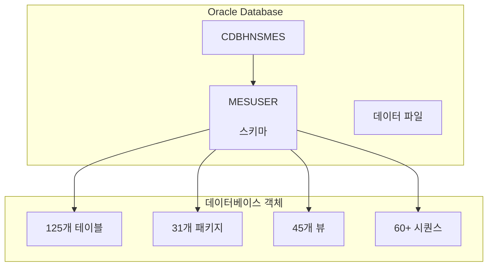
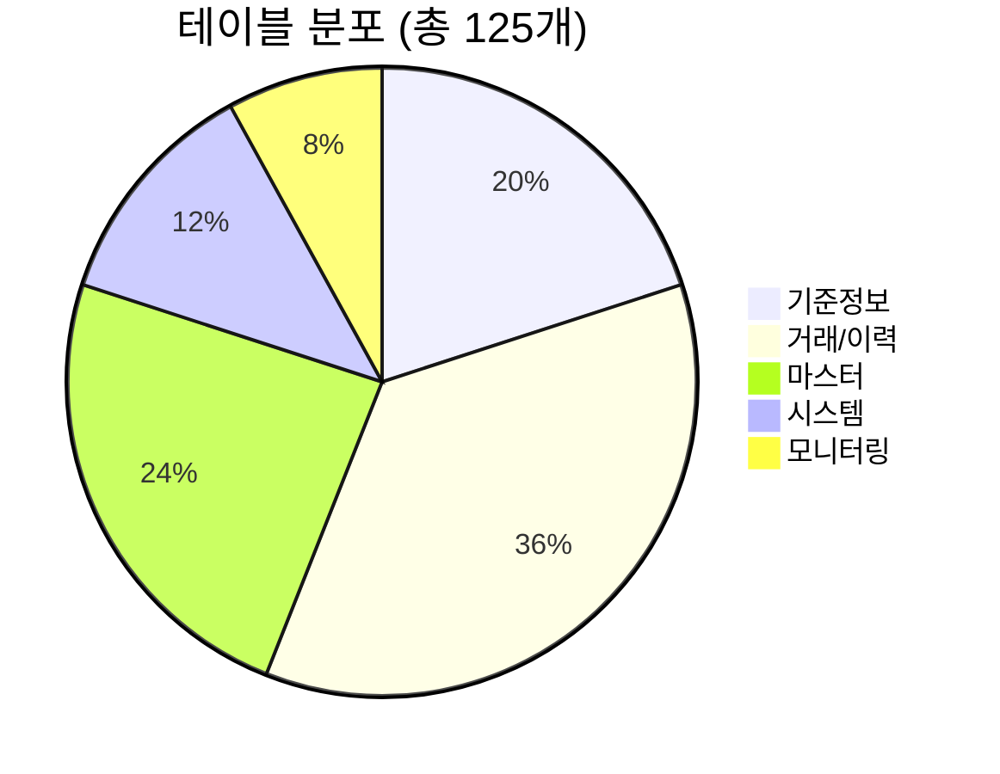
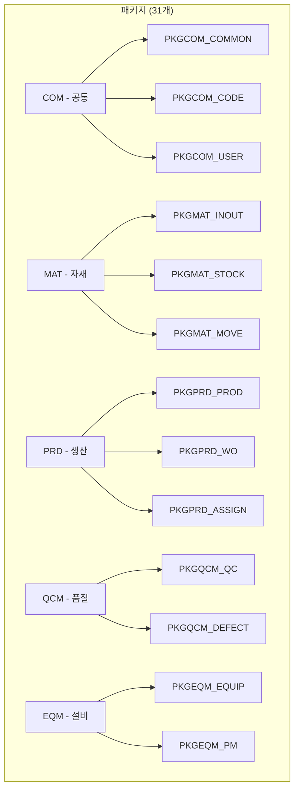
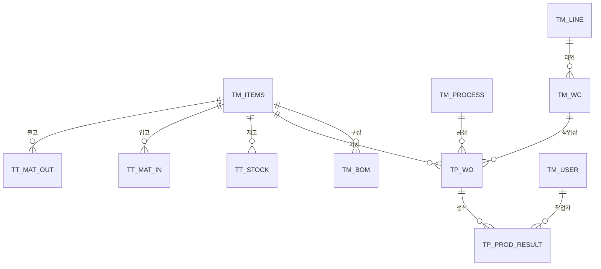
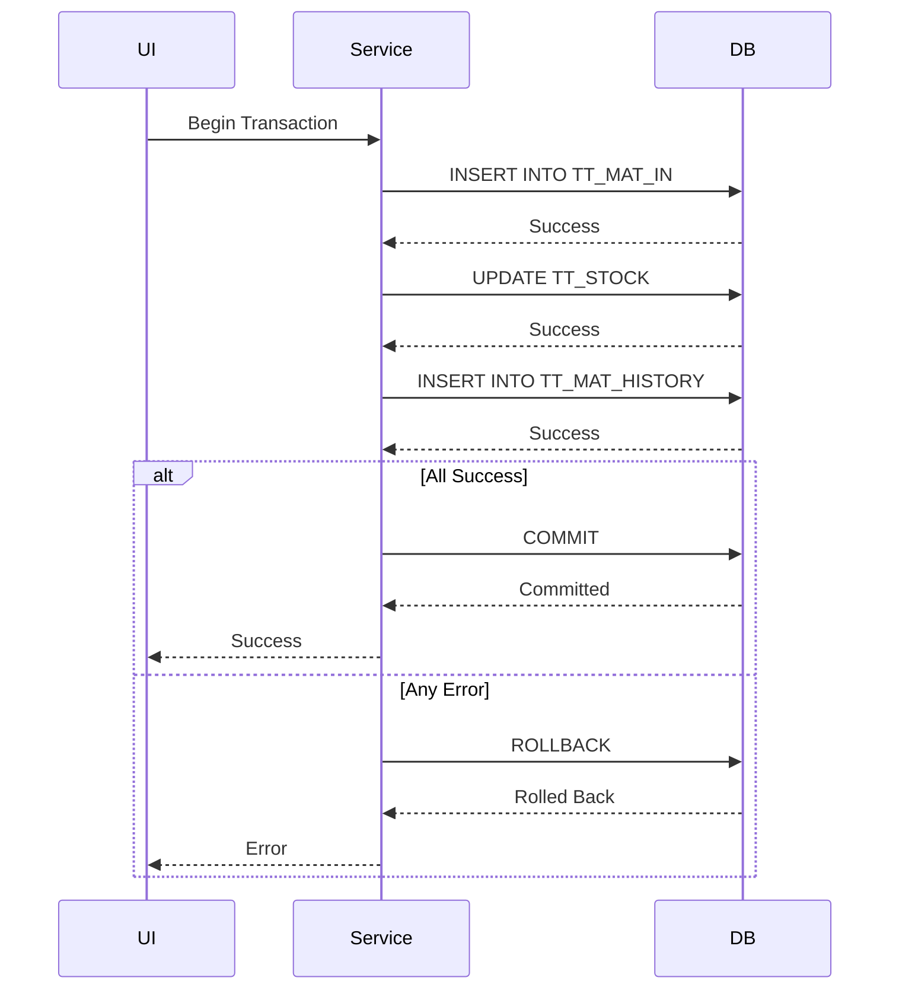

# 데이터베이스 개요

이 문서는 HNSMES UI 시스템의 Oracle 데이터베이스 구조와 주요 구성 요소를 설명합니다.

## 데이터베이스 정보



### 연결 정보

| 항목 | 값 |
|------|-----|
| **호스트** | 10.x.x.7 |
| **포트** | 1522 |
| **SID/Service** | CDBHNSMES |
| **스키마** | MESUSER |
| **버전** | Oracle 11g/19c |

### 접속 문자열

```csharp
// TNS 방식
Data Source=(DESCRIPTION=(ADDRESS=(PROTOCOL=TCP)(HOST=10.x.x.7)(PORT=1522))
  (CONNECT_DATA=(SERVICE_NAME=CDBHNSMES)));User Id=MESUSER;Password=********;

// EZ Connect 방식  
// MESUSER/********@10.x.x.7:1522/CDBHNSMES
```

## 테이블 구조

### 테이블 분류



### 주요 테이블 목록

#### 1. 시스템 관리 테이블

| 테이블명 | 설명 | 레코드 수 |
|----------|------|-----------|
| **TM_USER** | 사용자 정보 | ~500 |
| **TM_MENU** | 메뉴 정보 | ~200 |
| **TM_USER_MENU** | 사용자별 메뉴 권한 | ~5,000 |
| **TM_CODE** | 공통 코드 | ~2,000 |
| **TM_COMPANY** | 회사 정보 | ~10 |
| **TM_PLANT** | 공장 정보 | ~5 |

#### 2. 기준정보 테이블

| 테이블명 | 설명 | 주요 컬럼 |
|----------|------|-----------|
| **TM_ITEMS** | 품목 마스터 | ITEM_CODE, ITEM_NAME, ITEM_TYPE, UNIT |
| **TM_BOM** | BOM 정보 | PARENT_ITEM, CHILD_ITEM, QTY |
| **TM_PROCESS** | 공정 정보 | PROC_CODE, PROC_NAME, PROC_TYPE |
| **TM_LINE** | 라인 정보 | LINE_CODE, LINE_NAME, PLANT_CODE |
| **TM_EQUIPMENT** | 설비 정보 | EQUIP_CODE, EQUIP_NAME, PROC_CODE |
| **TM_WC** | 작업장 정보 | WC_CODE, WC_NAME, LINE_CODE |

#### 3. 생산관리 테이블

| 테이블명 | 설명 | 주요 컬럼 |
|----------|------|-----------|
| **TP_WO** | 작업지시 | WO_NO, ITEM_CODE, WO_QTY, PLAN_DATE |
| **TP_PROD_RESULT** | 생산실적 | WO_NO, PROD_DATE, PROD_QTY, GOOD_QTY |
| **TP_WORK_ASSIGN** | 작업배정 | WO_NO, WORKER_ID, ASSIGN_DATE |
| **TT_PROD_PROGRESS** | 생산진행 | WO_NO, PROC_CODE, IN_QTY, OUT_QTY |

#### 4. 자재관리 테이블

| 테이블명 | 설명 | 주요 컬럼 |
|----------|------|-----------|
| **TT_MAT_IN** | 자재입고 | IN_NO, ITEM_CODE, IN_QTY, IN_DATE |
| **TT_MAT_OUT** | 자재출고 | OUT_NO, ITEM_CODE, OUT_QTY, OUT_DATE |
| **TT_STOCK** | 재고현황 | ITEM_CODE, WAREHOUSE, STOCK_QTY |
| **TT_MAT_MOVE** | 자재이동 | MOVE_NO, FROM_WH, TO_WH, ITEM_CODE |

#### 5. 품질관리 테이블

| 테이블명 | 설명 | 주요 컬럼 |
|----------|------|-----------|
| **TM_QC_STANDARD** | 검사기준 | ITEM_CODE, QC_ITEM, QC_SPEC |
| **TT_QC_RESULT** | 검사결과 | QC_NO, ITEM_CODE, QC_DATE, RESULT |
| **TT_DEFECT** | 불량내역 | DEFECT_NO, DEFECT_CODE, DEFECT_QTY |
| **TT_QC_HISTORY** | 품질이력 | HISTORY_NO, ITEM_CODE, EVENT_TYPE |

## 패키지 구조

### 패키지 분류



### 주요 패키지 설명

#### PKGCOM_COMMON - 공통 패키지

```sql
-- 주요 프로시저
PROCEDURE GET_NEXT_SEQ(      -- 시퀀스 생성
    P_TABLE_NAME  IN  VARCHAR2,
    P_SEQ         OUT NUMBER
);

PROCEDURE GET_DATE(          -- 현재일자/시간
    P_DATE_TYPE   IN  VARCHAR2,  -- 'DATE', 'TIME', 'DATETIME'
    P_RESULT      OUT VARCHAR2
);

PROCEDURE SELECT_CODE(       -- 공통코드 조회
    A_CODE_TYPE   IN  VARCHAR2,
    O_CUR         OUT SYS_REFCURSOR
);
```

#### PKGPRD_PROD - 생산실적 패키지

```sql
-- 주요 프로시저
PROCEDURE SELECT_PROD_LIST(  -- 생산실적 조회
    A_CLIENT      IN  VARCHAR2,
    A_WORK_DATE   IN  VARCHAR2,
    A_LINE_CODE   IN  VARCHAR2,
    O_CUR         OUT SYS_REFCURSOR
);

PROCEDURE SAVE_PROD_RESULT(  -- 생산실적 저장
    A_CLIENT      IN  VARCHAR2,
    A_WO_NO       IN  VARCHAR2,
    A_PROD_DATE   IN  VARCHAR2,
    A_PROD_QTY    IN  NUMBER,
    A_USER_ID     IN  VARCHAR2,
    O_RESULT      OUT NUMBER,
    O_MSG         OUT VARCHAR2
);
```

#### PKGMAT_INOUT - 자재입출고 패키지

```sql
-- 주요 프로시저
PROCEDURE SELECT_STOCK(      -- 재고 조회
    A_CLIENT      IN  VARCHAR2,
    A_ITEM_CODE   IN  VARCHAR2,
    A_WAREHOUSE   IN  VARCHAR2,
    O_CUR         OUT SYS_REFCURSOR
);

PROCEDURE MAT_IN_SAVE(       -- 입고 저장
    A_CLIENT      IN  VARCHAR2,
    A_IN_NO       IN  VARCHAR2,
    A_ITEM_CODE   IN  VARCHAR2,
    A_IN_QTY      IN  NUMBER,
    A_USER_ID     IN  VARCHAR2,
    O_RESULT      OUT NUMBER
);
```

## ERD 개요

### 핵심 엔티티 관계



### 주요 엔티티 상세

#### TM_ITEMS (품목)

```
┌─────────────────────────────────────┐
│           TM_ITEMS                  │
├─────────────────────────────────────┤
│ PK │ CLIENT                         │
│ PK │ COMPANY                        │
│ PK │ ITEM_CODE                      │
│    │ ITEM_NAME                      │
│    │ ITEM_TYPE                      │
│    │ ITEM_SPEC                      │
│    │ UNIT                           │
│ FK │ SUPPLIER_CODE                  │
│    │ USE_YN                         │
└─────────────────────────────────────┘
```

#### TP_WO (작업지시)

```
┌─────────────────────────────────────┐
│            TP_WO                    │
├─────────────────────────────────────┤
│ PK │ CLIENT                         │
│ PK │ COMPANY                        │
│ PK │ WO_NO                          │
│ FK │ ITEM_CODE                      │
│    │ WO_QTY                         │
│    │ PLAN_START_DATE                │
│    │ PLAN_END_DATE                  │
│ FK │ PROC_CODE                      │
│ FK │ LINE_CODE                      │
│    │ WO_STATUS                      │
└─────────────────────────────────────┘
```

## 인덱스 전략

### 주요 인덱스 목록

| 테이블 | 인덱스명 | 컬럼 | 용도 |
|--------|----------|------|------|
| TP_WO | IDX_WO_DATE | PLAN_START_DATE | 작업지시일 조회 |
| TP_WO | IDX_WO_ITEM | ITEM_CODE | 품목별 조회 |
| TP_PROD_RESULT | IDX_PROD_DATE | PROD_DATE | 생산일 조회 |
| TT_MAT_IN | IDX_IN_DATE | IN_DATE | 입고일 조회 |
| TT_STOCK | IDX_STOCK_ITEM | ITEM_CODE | 재고 조회 |

## 트랜잭션 관리

### 트랜잭션 패턴



### 저장 프로시저 내 트랜잭션

```sql
CREATE OR REPLACE PROCEDURE PKGMAT_INOUT.MAT_IN_SAVE (
    -- 파라미터 선언
)
IS
BEGIN
    -- 트랜잭션 시작
    SAVEPOINT SP_MAT_IN;
    
    -- 1. 입고 내역 저장
    INSERT INTO TT_MAT_IN (...);
    
    -- 2. 재고 업데이트
    UPDATE TT_STOCK 
    SET STOCK_QTY = STOCK_QTY + P_IN_QTY
    WHERE ITEM_CODE = P_ITEM_CODE;
    
    -- 3. 이력 기록
    INSERT INTO TT_MAT_HISTORY (...);
    
    -- 결과 설정
    O_RESULT := 0;
    O_MSG := '저장되었습니다.';
    
    COMMIT;
    
EXCEPTION
    WHEN OTHERS THEN
        ROLLBACK TO SP_MAT_IN;
        O_RESULT := -1;
        O_MSG := SQLERRM;
END;
```

## 데이터 접근 패턴

### 조회 패턴

```csharp
// 1. 파라미터 구성
Dictionary<string, object> param = new Dictionary<string, object>
{
    { "A_CLIENT", Global_Variable.CLIENT },
    { "A_COMPANY", Global_Variable.COMPANY },
    { "A_WORK_DATE", dtpWorkDate.DateTime.ToString("yyyyMMdd") },
    { "A_LINE_CODE", cboLine.EditValue.ToString() }
};

// 2. 프로시저 실행
WSResults result = m_db.Execute_Proc("PKGPRD_PROD.SELECT_PROD_LIST", param);

// 3. 결과 처리
if (result.pResultInt == 0)
{
    gridControl1.DataSource = result.pResultData.Tables[0];
}
else
{
    MessageBox.Show(result.pResultMsg);
}
```

### 저장 패턴

```csharp
// 1. 데이터 변경사항 수집
DataTable changedRows = ((DataTable)gridControl1.DataSource).GetChanges();

// 2. 각 행별 처리
foreach (DataRow row in changedRows.Rows)
{
    Dictionary<string, object> param = new Dictionary<string, object>
    {
        { "A_CLIENT", Global_Variable.CLIENT },
        { "A_ROWSTATE", row.RowState.ToString() },  // Added, Modified, Deleted
        { "A_WO_NO", row["WO_NO"] },
        { "A_PROD_QTY", row["PROD_QTY"] }
    };
    
    WSResults result = m_db.Execute_Proc("PKGPRD_PROD.SAVE_PROD", param);
    
    if (result.pResultInt != 0)
    {
        // 오류 처리
        break;
    }
}
```

---

## 다음 단계

- [→ 프로시저 명세](procedures-complete.md)에서 패키지/프로시저 상세를 확인하세요.
- [→ ERD 다이어그램](erd-complete.md)에서 전체 엔티티 관계 및 테이블 정의를 확인하세요.
