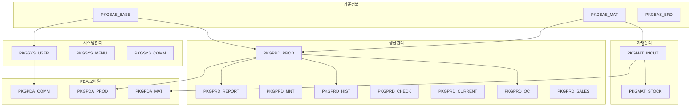

# 완전한 프로시저 명세서 (전체 31개 패키지)

HNSMES 시스템의 **모든 31개 패키지**와 약 **200+ 개 프로시저**를 상세히 기술합니다.

---

## 패키지 분류

| 분류 | 개수 | 설명 |
|------|------|------|
| **기준정보** | 3개 | 품목, BOM, 거래처, 공통코드 |
| **자재관리** | 2개 | 입출고, 재고, IQC/OQC |
| **생산관리** | 8개 | 작업지시, 실적, 검사, 보전, 이력 |
| **시스템관리** | 5개 | 사용자, 메뉴, 권한, 공통 |
| **트랜잭션** | 2개 | 재고관리, MODBUS |
| **PDA/모바일** | 4개 | PDA 자재, 생산, 공통, 영업 |
| **인터페이스** | 2개 | ERP, ECC 연동 |
| **리포트** | 2개 | 생산리포트, 행성리포트 |
| **기타** | 3개 | 통계, 개발자용, 글로벌 |

---

## 1. 기준정보 패키지 (3개)

### 1.1 PKGBAS_BASE - 기준정보 기본

```sql
-- ============================================
-- PACKAGE: PKGBAS_BASE
-- DESCRIPTION: 기준정보의 기본 CRUD 제공
-- TABLES: TM_COMPANY, TM_PLANT, TM_DEPT, TM_LINE, TM_WC, TM_EQP, etc.
-- ============================================
```

| 프로시저명 | 입/출력 | 설명 |
|------------|---------|------|
| **GET_COMPANY** | A_CLIENT, O_CUR | 회사 목록 조회 |
| **PUT_COMPANY** | A_CLIENT, A_COMPANY_CODE, A_COMPANY_NAME, ... | 회사 등록/수정 |
| **DEL_COMPANY** | A_CLIENT, A_COMPANY_CODE, O_RESULT | 회사 삭제 |
| **GET_PLANT** | A_CLIENT, O_CUR | 공장 목록 조회 |
| **PUT_PLANT** | A_CLIENT, A_PLANT_CODE, A_PLANT_NAME, ... | 공장 등록/수정 |
| **DEL_PLANT** | A_CLIENT, A_PLANT_CODE, O_RESULT | 공장 삭제 |
| **GET_DEPT** | A_CLIENT, A_PLANT_CODE, O_CUR | 부서 목록 조회 |
| **PUT_DEPT** | A_CLIENT, A_DEPT_CODE, A_DEPT_NAME, ... | 부서 등록/수정 |
| **DEL_DEPT** | A_CLIENT, A_DEPT_CODE, O_RESULT | 부서 삭제 |
| **GET_LINE** | A_CLIENT, A_PLANT_CODE, O_CUR | 라인 목록 조회 |
| **PUT_LINE** | A_CLIENT, A_LINE_CODE, A_LINE_NAME, ... | 라인 등록/수정 |
| **DEL_LINE** | A_CLIENT, A_LINE_CODE, O_RESULT | 라인 삭제 |
| **GET_WC** | A_CLIENT, A_LINE_CODE, O_CUR | 작업장 목록 조회 |
| **PUT_WC** | A_CLIENT, A_WC_CODE, A_WC_NAME, ... | 작업장 등록/수정 |
| **DEL_WC** | A_CLIENT, A_WC_CODE, O_RESULT | 작업장 삭제 |
| **GET_EQP** | A_CLIENT, A_WC_CODE, O_CUR | 설비 목록 조회 |
| **PUT_EQP** | A_CLIENT, A_EQP_CODE, A_EQP_NAME, ... | 설비 등록/수정 |
| **DEL_EQP** | A_CLIENT, A_EQP_CODE, O_RESULT | 설비 삭제 |
| **GET_VENDOR** | A_CLIENT, A_VENDOR_TYPE, O_CUR | 거래처 목록 조회 |
| **PUT_VENDOR** | A_CLIENT, A_VENDOR_CODE, A_VENDOR_NAME, ... | 거래처 등록/수정 |
| **DEL_VENDOR** | A_CLIENT, A_VENDOR_CODE, O_RESULT | 거래처 삭제 |
| **GET_OPER** | A_CLIENT, O_CUR | 공정 목록 조회 |
| **PUT_OPER** | A_CLIENT, A_OPER_CODE, A_OPER_NAME, ... | 공정 등록/수정 |
| **DEL_OPER** | A_CLIENT, A_OPER_CODE, O_RESULT | 공정 삭제 |
| **GET_REASONCODE** | A_CLIENT, A_REASON_TYPE, O_CUR | 사유코드 조회 |
| **PUT_REASONCODE** | A_CLIENT, A_REASON_CODE, A_REASON_NAME, ... | 사유코드 등록/수정 |
| **DEL_REASONCODE** | A_CLIENT, A_REASON_CODE, O_RESULT | 사유코드 삭제 |
| **GET_DEFECT** | A_CLIENT, O_CUR | 불량코드 목록 조회 |
| **PUT_DEFECT** | A_CLIENT, A_DEFECT_CODE, A_DEFECT_NAME, ... | 불량코드 등록/수정 |
| **DEL_DEFECT** | A_CLIENT, A_DEFECT_CODE, O_RESULT | 불량코드 삭제 |
| **GET_LOCATION** | A_CLIENT, A_WH_CODE, O_CUR | 로케이션 조회 |
| **PUT_LOCATION** | A_CLIENT, A_LOC_CODE, A_LOC_NAME, ... | 로케이션 등록/수정 |
| **DEL_LOCATION** | A_CLIENT, A_LOC_CODE, O_RESULT | 로케이션 삭제 |
| **GET_WORKTIME** | A_CLIENT, O_CUR | 근무시간 조회 |
| **PUT_WORKTIME** | A_CLIENT, A_WORKTIME_CODE, ... | 근무시간 등록/수정 |
| **GET_CLOSINGBASE** | A_CLIENT, A_PLANT_CODE, O_CUR | 마감기준 조회 |
| **PUT_CLOSINGBASE** | A_CLIENT, A_PLANT_CODE, A_CLOSE_TYPE, ... | 마감기준 등록/수정 |
| **GET_CRIMPINGBASE** | A_CLIENT, A_ITEM_CODE, O_CUR | 크림핑기준 조회 |
| **PUT_CRIMPINGBASE** | A_CLIENT, A_ITEM_CODE, A_CRIMP_SPEC, ... | 크림핑기준 등록/수정 |
| **GET_APPLICATOR** | A_CLIENT, O_CUR | 애플리케이터 조회 |
| **PUT_APPLICATOR** | A_CLIENT, A_APP_CODE, A_APP_NAME, ... | 애플리케이터 등록/수정 |
| **DEL_APPLICATOR** | A_CLIENT, A_APP_CODE, O_RESULT | 애플리케이터 삭제 |
| **GET_JIGPIN** | A_CLIENT, A_EQP_CODE, O_CUR | 지그/PIN 조회 |
| **PUT_JIGPIN** | A_CLIENT, A_JIG_CODE, A_JIG_NAME, ... | 지그/PIN 등록/수정 |
| **DEL_JIGPIN** | A_CLIENT, A_JIG_CODE, O_RESULT | 지그/PIN 삭제 |

### 1.2 PKGBAS_MAT - 자재 기준정보

```sql
-- ============================================
-- PACKAGE: PKGBAS_MAT
-- DESCRIPTION: 품목, BOM, 라우팅 관리
-- TABLES: TM_ITEMS, TM_BOM, TM_ROUTING, TM_ITEMSPEC, TM_ITEMIMAGE
-- ============================================
```

| 프로시저명 | 입/출력 | 설명 |
|------------|---------|------|
| **GET_ITEM** | A_CLIENT, A_ITEM_CODE, A_ITEM_NAME, O_CUR | 품목 조회 |
| **GET_ITEM_LIST** | A_CLIENT, A_ITEM_TYPE, A_USE_YN, O_CUR | 품목 목록 조회 |
| **PUT_ITEM** | A_CLIENT, A_ITEM_CODE, A_ITEM_NAME, A_ITEM_TYPE, ... | 품목 등록/수정 |
| **DEL_ITEM** | A_CLIENT, A_ITEM_CODE, O_RESULT | 품목 삭제 |
| **GET_ITEMSPEC** | A_CLIENT, A_ITEM_CODE, O_CUR | 품목사양 조회 |
| **PUT_ITEMSPEC** | A_CLIENT, A_ITEM_CODE, A_SPEC_ITEM, A_SPEC_VALUE, ... | 품목사양 등록/수정 |
| **DEL_ITEMSPEC** | A_CLIENT, A_ITEM_CODE, A_SPEC_ITEM, O_RESULT | 품목사양 삭제 |
| **GET_ITEMIMAGE** | A_CLIENT, A_ITEM_CODE, O_BLOB | 품목이미지 조회 |
| **PUT_ITEMIMAGE** | A_CLIENT, A_ITEM_CODE, A_IMAGE_DATA, ... | 품목이미지 저장 |
| **DEL_ITEMIMAGE** | A_CLIENT, A_ITEM_CODE, O_RESULT | 품목이미지 삭제 |
| **GET_BOM** | A_CLIENT, A_ITEM_CODE, O_CUR | BOM 조회 (단계별) |
| **GET_BOM_LIST** | A_CLIENT, A_PARENT_ITEM, O_CUR | BOM 목록 조회 |
| **PUT_BOM** | A_CLIENT, A_PARENT_ITEM, A_CHILD_ITEM, A_BOM_QTY, ... | BOM 등록/수정 |
| **DEL_BOM** | A_CLIENT, A_PARENT_ITEM, A_CHILD_ITEM, O_RESULT | BOM 삭제 |
| **GET_BOMGRP** | A_CLIENT, A_GRP_CODE, O_CUR | BOM그룹 조회 |
| **PUT_BOMGRP** | A_CLIENT, A_GRP_CODE, A_GRP_NAME, ... | BOM그룹 등록/수정 |
| **GET_ROUTING** | A_CLIENT, A_ITEM_CODE, O_CUR | 라우팅 조회 |
| **PUT_ROUTING** | A_CLIENT, A_ITEM_CODE, A_SEQ, A_OPER_CODE, ... | 라우팅 등록/수정 |
| **DEL_ROUTING** | A_CLIENT, A_ITEM_CODE, A_SEQ, O_RESULT | 라우팅 삭제 |
| **GET_MODELBOM** | A_CLIENT, A_MODEL_CODE, O_CUR | 모델BOM 조회 |
| **PUT_MODELBOM** | A_CLIENT, A_MODEL_CODE, A_MODEL_NAME, A_ITEM_CODE, ... | 모델BOM 등록/수정 |
| **DEL_MODELBOM** | A_CLIENT, A_MODEL_CODE, O_RESULT | 모델BOM 삭제 |
| **GET_SUBMAT** | A_CLIENT, A_ITEM_CODE, O_CUR | 대체자재 조회 |
| **PUT_SUBMAT** | A_CLIENT, A_ITEM_CODE, A_SUB_ITEM_CODE, ... | 대체자재 등록/수정 |
| **DEL_SUBMAT** | A_CLIENT, A_ITEM_CODE, A_SUB_ITEM_CODE, O_RESULT | 대체자재 삭제 |
| **GET_UNIT** | A_CLIENT, O_CUR | 단위 조회 |
| **PUT_UNIT** | A_CLIENT, A_UNIT_CODE, A_UNIT_NAME, ... | 단위 등록/수정 |
| **CHK_ITEM_CODE** | A_CLIENT, A_ITEM_CODE, O_EXISTS | 품목코드 중복체크 |
| **GET_RECEIVE_LIST** | A_CLIENT, A_START_DATE, A_END_DATE, O_CUR | 입고현황 조회 |
| **GET_RECEIVE_RELEASE_LIST** | A_CLIENT, A_ITEM_CODE, A_WH_CODE, O_CUR | 입출고현황 조회 |
| **GET_MATERIAL_STOCK** | A_CLIENT, A_ITEM_CODE, A_WH_CODE, O_CUR | 자재재고 조회 |
| **GET_MATERIAL_STOCK_INCOMPANY_A** | A_CLIENT, A_COMPANY_CODE, O_CUR | 회사별 재고조회 |
| **GET_MATERIAL_ACTUAL** | A_CLIENT, A_START_DATE, A_END_DATE, O_CUR | 자재실적현황 |
| **GET_LABEL_LIST** | A_CLIENT, A_START_DATE, A_END_DATE, O_CUR | 라벨목록 조회 |
| **GET_BAD_MAT_LIST** | A_CLIENT, A_START_DATE, A_END_DATE, O_CUR | 불량자재 조회 |
| **SET_CANCEL_MATERIAL_IN_OUT_XML** | A_CLIENT, A_XML_DATA, O_RESULT | 입출고 취소 |

### 1.3 PKGBAS_BRD - 불량/검사 기준

```sql
-- ============================================
-- PACKAGE: PKGBAS_BRD
-- DESCRIPTION: 불량판정 및 검사 기준 관리
-- TABLES: TM_DEFECT, TM_QCSTANDARD, TM_OQC_STANDARD, TM_BRD
-- ============================================
```

| 프로시저명 | 입/출력 | 설명 |
|------------|---------|------|
| **GET_DEFECT** | A_CLIENT, A_DEFECT_TYPE, O_CUR | 불량코드 조회 |
| **GET_DEFECT_HISTORY** | A_CLIENT, A_START_DATE, A_END_DATE, O_CUR | 불량이력 조회 |
| **GET_DEFECT_HISTORY2** | A_CLIENT, A_SERIAL_NO, O_CUR | 시리얼별 불량이력 |
| **GET_DEFECT_HISTORY3** | A_CLIENT, A_START_DATE, A_END_DATE, O_CUR | 반품이력 조회 |
| **PUT_BADREG_JUDGE** | A_CLIENT, A_SERIAL_NO, A_DEFECT_CODE, A_JUDGE_RESULT, ... | 불량판정 등록 |
| **GET_QCSTANDARD** | A_CLIENT, A_ITEM_CODE, O_CUR | 검사기준 조회 |
| **PUT_QCSTANDARD** | A_CLIENT, A_ITEM_CODE, A_QC_ITEM, ... | 검사기준 등록/수정 |
| **GET_OQC_STANDARD** | A_CLIENT, A_ITEM_CODE, O_CUR | OQC기준 조회 |
| **PUT_OQC_STANDARD** | A_CLIENT, A_ITEM_CODE, A_OQC_ITEM, ... | OQC기준 등록/수정 |
| **GET_BRD** | A_CLIENT, A_BRD_TYPE, O_CUR | 판정기준 조회 |
| **PUT_BRD** | A_CLIENT, A_BRD_ID, A_BRD_NAME, ... | 판정기준 등록/수정 |
| **GET_DEFECT_SUMMARY** | A_CLIENT, A_START_DATE, A_END_DATE, O_CUR | 불량집계 조회 |
| **GET_DEFECT_TREND** | A_CLIENT, A_START_DATE, A_END_DATE, O_CUR | 불량추이 분석 |

---

## 2. 자재관리 패키지 (2개)

### 2.1 PKGMAT_INOUT - 자재 입출고

```sql
-- ============================================
-- PACKAGE: PKGMAT_INOUT
-- DESCRIPTION: 자재 입출고 및 IQC/OQC 관리
-- TABLES: TW_IN, TW_OUT, TW_MOVE, TW_IQC, TW_OQC
-- ============================================
```

| 프로시저명 | 입/출력 | 설명 |
|------------|---------|------|
| **GET_RECEIVE** | A_CLIENT, A_IN_NO, O_CUR | 입고 조회 |
| **SET_RECEIVE** | A_CLIENT, A_IN_NO, A_ITEM_CODE, A_IN_QTY, ... | 입고 등록 |
| **GET_RELEASE** | A_CLIENT, A_OUT_NO, O_CUR | 출고 조회 |
| **SET_RELEASE** | A_CLIENT, A_OUT_NO, A_ITEM_CODE, A_OUT_QTY, ... | 출고 등록 |
| **GET_MOVE** | A_CLIENT, A_MOVE_NO, O_CUR | 이동 조회 |
| **SET_MOVE** | A_CLIENT, A_ITEM_CODE, A_FROM_WH, A_TO_WH, ... | 이동 등록 |
| **GET_IQC_LIST** | A_CLIENT, A_START_DATE, A_END_DATE, O_CUR | IQC 목록 조회 |
| **GET_IQC_SERIAL** | A_CLIENT, A_SERIAL_NO, O_CUR | 시리얼 IQC 조회 |
| **SET_IQC_JUDGE** | A_CLIENT, A_SERIAL_NO, A_IQC_RESULT, ... | IQC 판정 |
| **GET_OQC_LIST** | A_CLIENT, A_START_DATE, A_END_DATE, O_CUR | OQC 목록 조회 |
| **SET_OQC_JUDGE** | A_CLIENT, A_SERIAL_NO, A_OQC_RESULT, ... | OQC 판정 |
| **GET_STOCK** | A_CLIENT, A_ITEM_CODE, A_WH_CODE, O_CUR | 재고 조회 |
| **GET_STOCK_SERIAL** | A_CLIENT, A_SERIAL_NO, O_CUR | 시리얼별 재고 |
| **GET_PRODMATERIALREQUEST** | A_CLIENT, A_WO_NO, O_CUR | 생산자재요청 조회 |
| **GET_LABEL_ORDER** | A_CLIENT, A_ITEM_CODE, A_REQ_QTY, O_CUR | 라벨발행 주문 |
| **SET_REELSPLIT** | A_CLIENT, A_PARENT_SERIAL, A_SPLIT_QTY, ... | 릴 분할 |
| **GET_REQUESTPRINT** | A_CLIENT, A_REQUEST_NO, O_CUR | 요청서 출력 |
| **CHK_STOCK_AVAIL** | A_CLIENT, A_ITEM_CODE, A_REQ_QTY, O_AVAILABLE | 재고가용량 체크 |
| **GET_MAT_LEDGER** | A_CLIENT, A_ITEM_CODE, A_START_DATE, O_CUR | 자재원장 조회 |

### 2.2 PKGMAT_STOCK - 자재 재고

```sql
-- ============================================
-- PACKAGE: PKGMAT_STOCK (PKGTXN_STOCK)
-- DESCRIPTION: 재고 관리 및 실사
-- TABLES: TH_STOCK, TH_STOCKSERIAL, TW_ACTUAL
-- ============================================
```

| 프로시저명 | 입/출력 | 설명 |
|------------|---------|------|
| **GET_STOCK_DAILY** | A_CLIENT, A_BASE_DATE, O_CUR | 일별재고 조회 |
| **GET_STOCK_MONTHLY** | A_CLIENT, A_BASE_YYYYMM, O_CUR | 월별재고 조회 |
| **PUT_ACTUAL_UPLOAD** | A_CLIENT, A_UPLOAD_DATA, O_RESULT | 실사데이터 업로드 |
| **GET_ACTUAL_DIFF** | A_CLIENT, A_ACTUAL_DATE, O_CUR | 실사차이 조회 |
| **SET_ACTUAL_CONFIRM** | A_CLIENT, A_ACTUAL_DATE, O_RESULT | 실사확정 |
| **GET_SUBUL** | A_CLIENT, A_START_DATE, A_END_DATE, A_ITEM_CODE, O_CUR | 수불부 조회 |
| **GET_LONGSTOCK_LIST** | A_CLIENT, A_DAYS, O_CUR | 장기재고 조회 |
| **GET_STOCK_AGING** | A_CLIENT, A_ITEM_CODE, O_CUR | 재고 Aging 조회 |
| **SET_STOCK_ADJUST** | A_CLIENT, A_ITEM_CODE, A_ADJ_QTY, A_REASON, ... | 재고조정 |
| **GET_STOCK_VALUATION** | A_CLIENT, A_BASE_DATE, O_CUR | 재고평가 조회 |

---

## 3. 생산관리 패키지 (8개)

### 3.1 PKGPRD_PROD - 생산관리 기본

```sql
-- ============================================
-- PACKAGE: PKGPRD_PROD
-- DESCRIPTION: 작업지시 및 생산실적 관리
-- TABLES: TW_WORKORD, TW_PRODHIST, TW_PRODHIST_USE
-- ============================================
```

| 프로시저명 | 입/출력 | 설명 |
|------------|---------|------|
| **GET_WORKORD** | A_CLIENT, A_WO_NO, O_CUR | 작업지시 조회 |
| **GET_WORKORD_LIST** | A_CLIENT, A_START_DATE, A_END_DATE, O_CUR | 작업지시 목록 |
| **PUT_WORKORD** | A_CLIENT, A_WO_NO, A_ITEM_CODE, A_PLAN_QTY, ... | 작업지시 등록/수정 |
| **DEL_WORKORD** | A_CLIENT, A_WO_NO, O_RESULT | 작업지시 삭제 |
| **SET_WORKORD_START** | A_CLIENT, A_WO_NO, O_RESULT | 작업시작 |
| **SET_WORKORD_COMPLETE** | A_CLIENT, A_WO_NO, A_COMP_QTY, O_RESULT | 작업완료 |
| **SET_WORKORD_CLOSE** | A_CLIENT, A_WO_NO, O_RESULT | 작업마감 |
| **GET_PRODHIST** | A_CLIENT, A_SERIAL_NO, O_CUR | 생산이력 조회 |
| **PUT_PRODHIST** | A_CLIENT, A_SERIAL_NO, A_WO_NO, A_OPER_CODE, ... | 생산이력 등록 |
| **GET_PRODHIST_USE** | A_CLIENT, A_SERIAL_NO, O_CUR | 생산사용내역 조회 |
| **PUT_PRODHIST_USE** | A_CLIENT, A_SERIAL_NO, A_COMP_SERIAL_NO, ... | 생산사용내역 등록 |
| **GET_PROD_PROGRESS** | A_CLIENT, A_WO_NO, O_CUR | 생산진행현황 |
| **GET_PROD_RESULT** | A_CLIENT, A_START_DATE, A_END_DATE, O_CUR | 생산실적 조회 |
| **GET_WO_STATUS** | A_CLIENT, O_CUR | 작업지시 상태현황 |
| **CHK_WO_AVAIL** | A_CLIENT, A_ITEM_CODE, A_PLAN_DATE, O_AVAIL | 작업지시 가능체크 |

### 3.2 PKGPRD_QC - 품질관리

```sql
-- ============================================
-- PACKAGE: PKGPRD_QC
-- DESCRIPTION: 공정검사 및 품질데이터 관리
-- TABLES: TW_IPQC, TM_QCSTANDARD
-- ============================================
```

| 프로시저명 | 입/출력 | 설명 |
|------------|---------|------|
| **GET_IPQC_LIST** | A_CLIENT, A_START_DATE, A_END_DATE, O_CUR | IPQC 목록 조회 |
| **GET_IPQC_DETAIL** | A_CLIENT, A_IPQC_SEQ, O_CUR | IPQC 상세 조회 |
| **PUT_IPQC** | A_CLIENT, A_WO_NO, A_SERIAL_NO, A_QC_ITEM, ... | IPQC 등록 |
| **GET_QC_RESULT** | A_CLIENT, A_START_DATE, A_END_DATE, O_CUR | 검사결과 조회 |
| **GET_QC_DEFECT_RATE** | A_CLIENT, A_START_DATE, A_END_DATE, O_CUR | 불량률 조회 |
| **GET_QC_TREND** | A_CLIENT, A_ITEM_CODE, A_QC_ITEM, O_CUR | 품질추이 조회 |
| **GET_QC_SPC** | A_CLIENT, A_ITEM_CODE, A_QC_ITEM, O_CUR | SPC 데이터 조회 |
| **SET_QC_JUDGE** | A_CLIENT, A_IPQC_SEQ, A_JUDGE_RESULT, ... | 검사판정 |

### 3.3 PKGPRD_MNT - 보전관리

```sql
-- ============================================
-- PACKAGE: PKGPRD_MNT
-- DESCRIPTION: 설비보전 및 모니터링
-- TABLES: TM_EQP, TT_EQUIP_PM, TT_EQUIP_BREAKDOWN
-- ============================================
```

| 프로시저명 | 입/출력 | 설명 |
|------------|---------|------|
| **GET_DAILY_PROD_MONITERING** | A_CLIENT, A_WORK_DATE, O_CUR | 일별생산모니터링 |
| **GET_CRIMP_MONITORING** | A_CLIENT, A_WORK_DATE, O_CUR | 크림핑모니터링 |
| **GET_EQP_STATUS** | A_CLIENT, A_EQP_CODE, O_CUR | 설비상태 조회 |
| **GET_EQP_PM_LIST** | A_CLIENT, A_EQP_CODE, O_CUR | 점검계획 조회 |
| **PUT_EQP_PM** | A_CLIENT, A_PM_NO, A_EQP_CODE, A_PM_DATE, ... | 점검등록 |
| **GET_EQP_BREAKDOWN_LIST** | A_CLIENT, A_EQP_CODE, O_CUR | 고장이력 조회 |
| **PUT_EQP_BREAKDOWN** | A_CLIENT, A_BREAKDOWN_NO, ... | 고장등록 |
| **SET_EQP_REPAIR** | A_CLIENT, A_BREAKDOWN_NO, ... | 수리완료 등록 |
| **GET_EQP_OEE** | A_CLIENT, A_EQP_CODE, A_START_DATE, O_CUR | OEE 조회 |
| **GET_EQP_MTBF** | A_CLIENT, A_EQP_CODE, O_CUR | MTBF 조회 |
| **GET_EQP_MTTR** | A_CLIENT, A_EQP_CODE, O_CUR | MTTR 조회 |

### 3.4 PKGPRD_HIST - 생산이력

```sql
-- ============================================
-- PACKAGE: PKGPRD_HIST
-- DESCRIPTION: 상세 생산이력 및 추적
-- TABLES: TW_PRODHIST, TW_MOUNT, TW_PRODHIST_USE
-- ============================================
```

| 프로시저명 | 입/출력 | 설명 |
|------------|---------|------|
| **GET_HIST_BY_SERIAL** | A_CLIENT, A_SERIAL_NO, O_CUR | 시리얼별 이력 |
| **GET_HIST_BY_WO** | A_CLIENT, A_WO_NO, O_CUR | 작업지시별 이력 |
| **GET_HIST_BY_ITEM** | A_CLIENT, A_ITEM_CODE, A_START_DATE, O_CUR | 품목별 이력 |
| **GET_MOUNT_BY_SERIAL** | A_CLIENT, A_SERIAL_NO, O_CUR | 장착이력 조회 |
| **GET_USE_BY_SERIAL** | A_CLIENT, A_SERIAL_NO, O_CUR | 사용내역 조회 |
| **GET_TRACE_UP** | A_CLIENT, A_SERIAL_NO, O_CUR | 상위추적 (완제품←자재) |
| **GET_TRACE_DOWN** | A_CLIENT, A_SERIAL_NO, O_CUR | 하위추적 (자재→완제품) |
| **GET_HIST_SUMMARY** | A_CLIENT, A_START_DATE, A_END_DATE, O_CUR | 이력요약 |

### 3.5 PKGPRD_CHECK - 검사관리

```sql
-- ============================================
-- PACKAGE: PKGPRD_CHECK
-- DESCRIPTION: 검사공정 및 검사데이터 관리
-- ============================================
```

| 프로시저명 | 입/출력 | 설명 |
|------------|---------|------|
| **GET_CHECK_LIST** | A_CLIENT, A_OPER_CODE, O_CUR | 검사항목 조회 |
| **PUT_CHECK_DATA** | A_CLIENT, A_SERIAL_NO, A_CHECK_ITEM, ... | 검사데이터 등록 |
| **GET_CHECK_RESULT** | A_CLIENT, A_SERIAL_NO, O_CUR | 검사결과 조회 |
| **GET_CHECK_DEFECT** | A_CLIENT, A_START_DATE, A_END_DATE, O_CUR | 검사불량 조회 |
| **GET_FIRST_ARTICLE** | A_CLIENT, A_WO_NO, O_CUR | 초품검사 조회 |
| **PUT_FIRST_ARTICLE** | A_CLIENT, A_WO_NO, A_JUDGE_RESULT, ... | 초품검사 등록 |

### 3.6 PKGPRD_CURRENT - 현황조회

```sql
-- ============================================
-- PACKAGE: PKGPRD_CURRENT
-- DESCRIPTION: 실시간 생산현황 조회
-- ============================================
```

| 프로시저명 | 입/출력 | 설명 |
|------------|---------|------|
| **GET_CURRENT_STATUS** | A_CLIENT, O_CUR | 전체생산현황 |
| **GET_LINE_STATUS** | A_CLIENT, A_LINE_CODE, O_CUR | 라인별 현황 |
| **GET_WC_STATUS** | A_CLIENT, A_WC_CODE, O_CUR | 작업장별 현황 |
| **GET_EQP_STATUS_CURRENT** | A_CLIENT, O_CUR | 설비실시간 현황 |
| **GET_WORKER_STATUS** | A_CLIENT, O_CUR | 작업자 현황 |
| **GET_DEFECT_CURRENT** | A_CLIENT, O_CUR | 실시간 불량현황 |
| **GET_ACHIEVE_RATE** | A_CLIENT, A_WORK_DATE, O_CUR | 달성률 조회 |
| **GET_PROGRESS_RATE** | A_CLIENT, A_WO_NO, O_CUR | 진행률 조회 |

### 3.7 PKGPRD_REPORT - 생산리포트

```sql
-- ============================================
-- PACKAGE: PKGPRD_REPORT
-- DESCRIPTION: 생산관련 리포트 및 집계
-- ============================================
```

| 프로시저명 | 입/출력 | 설명 |
|------------|---------|------|
| **GET_DAILY_REPORT** | A_CLIENT, A_WORK_DATE, O_CUR | 일일생산보고 |
| **GET_MONTHLY_REPORT** | A_CLIENT, A_YYYYMM, O_CUR | 월간생산보고 |
| **GET_DEFECT_REPORT** | A_CLIENT, A_START_DATE, A_END_DATE, O_CUR | 불량분석보고 |
| **GET_EFFICIENCY_REPORT** | A_CLIENT, A_START_DATE, A_END_DATE, O_CUR | 효율분석보고 |
| **GET_OEE_REPORT** | A_CLIENT, A_START_DATE, A_END_DATE, O_CUR | OEE보고 |
| **GET_MANHOUR_REPORT** | A_CLIENT, A_START_DATE, A_END_DATE, O_CUR | 공수분석보고 |
| **GET_YIELD_REPORT** | A_CLIENT, A_START_DATE, A_END_DATE, O_CUR | 수율분석보고 |
| **GET_DOWNTIME_REPORT** | A_CLIENT, A_START_DATE, A_END_DATE, O_CUR | 비가동보고 |

### 3.8 PKGPRD_SALES - 영업관련

```sql
-- ============================================
-- PACKAGE: PKGPRD_SALES
-- DESCRIPTION: 출하 및 영업 연동
-- TABLES: TW_OUT (출하)
-- ============================================
```

| 프로시저명 | 입/출력 | 설명 |
|------------|---------|------|
| **GET_SHIP_LIST** | A_CLIENT, A_START_DATE, A_END_DATE, O_CUR | 출하목록 조회 |
| **SET_SHIP_CONFIRM** | A_CLIENT, A_OUT_NO, O_RESULT | 출하확정 |
| **GET_SHIP_PLAN** | A_CLIENT, A_PLAN_DATE, O_CUR | 출하계획 조회 |
| **GET_CUSTOMER_STOCK** | A_CLIENT, A_CUSTOMER_CODE, O_CUR | 고객사 재고 |
| **GET_DELIVERY_STATUS** | A_CLIENT, A_START_DATE, O_CUR | 납품현황 |

### 3.9 PKGPRD_ECC - ECC 연동

```sql
-- ============================================
-- PACKAGE: PKGPRD_ECC
-- DESCRIPTION: SAP ECC 연동 인터페이스
-- ============================================
```

| 프로시저명 | 입/출력 | 설명 |
|------------|---------|------|
| **GET_ECC_WORKORD** | A_CLIENT, O_CUR | ECC 작업지시 수신 |
| **SET_ECC_CONFIRM** | A_CLIENT, A_WO_NO, O_RESULT | ECC 확정 전송 |
| **GET_ECC_GOODSMVT** | A_CLIENT, O_CUR | ECC 자재이동 수신 |
| **SET_ECC_GR** | A_CLIENT, A_WO_NO, A_GR_QTY, ... | ECC 입고 전송 |
| **SET_ECC_GI** | A_CLIENT, A_WO_NO, A_GI_QTY, ... | ECC 출고 전송 |
| **GET_ECC_STOCK** | A_CLIENT, O_CUR | ECC 재고 동기화 |

---

## 4. 시스템관리 패키지 (5개)

### 4.1 PKGSYS_USER - 사용자관리

```sql
-- ============================================
-- PACKAGE: PKGSYS_USER
-- DESCRIPTION: 사용자, 부서, 직급 관리
-- TABLES: TM_USER, TM_DEPT, TM_POST
-- ============================================
```

| 프로시저명 | 입/출력 | 설명 |
|------------|---------|------|
| **GET_USER** | A_CLIENT, A_USER_ID, O_CUR | 사용자 조회 |
| **GET_USER_LIST** | A_CLIENT, A_DEPT_CODE, O_CUR | 사용자 목록 |
| **PUT_USER** | A_CLIENT, A_USER_ID, A_USER_NAME, ... | 사용자 등록/수정 |
| **DEL_USER** | A_CLIENT, A_USER_ID, O_RESULT | 사용자 삭제 |
| **SET_PASSWORD** | A_CLIENT, A_USER_ID, A_NEW_PASSWORD, O_RESULT | 비밀번호 변경 |
| **CHK_LOGIN** | A_CLIENT, A_USER_ID, A_PASSWORD, O_RESULT, O_USER_NAME | 로그인 체크 |
| **GET_DEPT** | A_CLIENT, O_CUR | 부서 조회 |
| **PUT_DEPT** | A_CLIENT, A_DEPT_CODE, A_DEPT_NAME, ... | 부서 등록/수정 |
| **GET_POST** | A_CLIENT, O_CUR | 직급 조회 |
| **PUT_POST** | A_CLIENT, A_POST_CODE, A_POST_NAME, ... | 직급 등록/수정 |
| **GET_EHR** | A_CLIENT, O_CUR | 사원정보 조회 |
| **PUT_EHR** | A_CLIENT, A_EMP_NO, A_EMP_NAME, ... | 사원정보 등록/수정 |
| **GET_ROLE** | A_CLIENT, O_CUR | 권한그룹 조회 |
| **PUT_ROLE** | A_CLIENT, A_ROLE_CODE, A_ROLE_NAME, ... | 권한그룹 등록/수정 |

### 4.2 PKGSYS_MENU - 메뉴관리

```sql
-- ============================================
-- PACKAGE: PKGSYS_MENU
-- DESCRIPTION: 메뉴 및 화면 관리
-- TABLES: TM_MENU, TM_MENUROLE, TM_FORMMST
-- ============================================
```

| 프로시저명 | 입/출력 | 설명 |
|------------|---------|------|
| **GET_MENU** | A_CLIENT, A_USER_ID, O_CUR | 사용자별 메뉴 |
| **GET_MENU_ALL** | A_CLIENT, O_CUR | 전체메뉴 조회 |
| **PUT_MENU** | A_CLIENT, A_MENU_ID, A_MENU_NAME, ... | 메뉴 등록/수정 |
| **DEL_MENU** | A_CLIENT, A_MENU_ID, O_RESULT | 메뉴 삭제 |
| **GET_FORMMST** | A_CLIENT, O_CUR | 화면목록 조회 |
| **PUT_FORMMST** | A_CLIENT, A_FORM_ID, A_FORM_NAME, ... | 화면 등록/수정 |
| **GET_MENUROLE** | A_CLIENT, A_ROLE_CODE, O_CUR | 권한별 메뉴 |
| **PUT_MENUROLE** | A_CLIENT, A_ROLE_CODE, A_MENU_ID, ... | 메뉴권한 등록 |
| **SET_MENUROLE_AUTH** | A_CLIENT, A_ROLE_CODE, A_MENU_ID, ... | 권한설정 |

### 4.3 PKGSYS_COMM - 공통코드

```sql
-- ============================================
-- PACKAGE: PKGSYS_COMM
-- DESCRIPTION: 공통코드 및 시스템 설정
-- TABLES: TM_CODE, TM_NOTICE, TM_GLOSSARY
-- ============================================
```

| 프로시저명 | 입/출력 | 설명 |
|------------|---------|------|
| **GET_COMM** | A_CLIENT, A_CODE_TYPE, O_CUR | 공통코드 조회 |
| **PUT_COMM** | A_CLIENT, A_CODE_TYPE, A_CODE, A_CODE_NAME, ... | 공통코드 등록/수정 |
| **DEL_COMM** | A_CLIENT, A_CODE_TYPE, A_CODE, O_RESULT | 공통코드 삭제 |
| **GET_NOTICE** | A_CLIENT, O_CUR | 공지사항 조회 |
| **PUT_NOTICE** | A_CLIENT, A_NOTICE_ID, A_TITLE, ... | 공지사항 등록/수정 |
| **DEL_NOTICE** | A_CLIENT, A_NOTICE_ID, O_RESULT | 공지사항 삭제 |
| **GET_GLOSSARY** | A_CLIENT, O_CUR | 용어사전 조회 |
| **PUT_GLOSSARY** | A_CLIENT, A_TERM_ID, A_TERM, ... | 용어 등록/수정 |
| **GET_TRANSACTION** | A_CLIENT, O_CUR | 트랜잭션 조회 |
| **PUT_TRANSACTION** | A_CLIENT, A_TRANS_ID, A_TRANS_NAME, ... | 트랜잭션 등록 |
| **GET_ERROR_LOG** | A_CLIENT, A_START_DATE, A_END_DATE, O_CUR | 에러로그 조회 |
| **PUT_ERROR_LOG** | A_CLIENT, A_ERROR_TYPE, A_ERROR_MSG, ... | 에러로그 기록 |

### 4.4 PKGSYS_DBA - DBA 관리

```sql
-- ============================================
-- PACKAGE: PKGSYS_DBA
-- DESCRIPTION: DBA용 시스템 관리
-- ============================================
```

| 프로시저명 | 입/출력 | 설명 |
|------------|---------|------|
| **GET_TABLESPACE_USAGE** | O_CUR | 테이블스페이스 사용량 |
| **GET_TABLE_SIZE** | A_TABLE_NAME, O_SIZE | 테이블 크기 조회 |
| **GET_INDEX_LIST** | A_TABLE_NAME, O_CUR | 인덱스 목록 |
| **GET_SESSION_LIST** | O_CUR | 세션 목록 |
| **KILL_SESSION** | A_SID, A_SERIAL, O_RESULT | 세션 강제종료 |
| **GET_LOCK_LIST** | O_CUR | Lock 목록 |
| **GET_WAIT_EVENT** | O_CUR | 대기이벤트 조회 |
| **GET_SQL_TOP** | O_CUR | TOP SQL 조회 |
| **GATHER_STATS** | A_TABLE_NAME, O_RESULT | 통계정보 수집 |
| **REBUILD_INDEX** | A_INDEX_NAME, O_RESULT | 인덱스 재구성 |

### 4.5 GPKGBAS_BASE - 글로벌 기준정보

```sql
-- ============================================
-- PACKAGE: GPKGBAS_BASE (Global)
-- DESCRIPTION: 글로벌 기준정보 (회사 간 공유)
-- ============================================
```

| 프로시저명 | 입/출력 | 설명 |
|------------|---------|------|
| **GET_GLOBAL_ITEM** | A_ITEM_CODE, O_CUR | 글로벌 품목 조회 |
| **PUT_GLOBAL_ITEM** | A_ITEM_CODE, A_ITEM_NAME, ... | 글로벌 품목 등록 |
| **GET_GLOBAL_BOM** | A_MODEL_CODE, O_CUR | 글로벌 BOM 조회 |
| **PUT_MODELBOM** | A_MODEL_CODE, A_MODEL_NAME, ... | 모델BOM 등록 |
| **GET_GLOBAL_VENDOR** | O_CUR | 글로벌 거래처 조회 |

---

## 5. 트랜잭션 패키지 (2개)

### 5.1 PKGTXN_MODBUS - MODBUS 연동

```sql
-- ============================================
-- PACKAGE: PKGTXN_MODBUS
-- DESCRIPTION: 설비 MODBUS 통신 데이터
-- ============================================
```

| 프로시저명 | 입/출력 | 설명 |
|------------|---------|------|
| **GET_MODBUS_DATA** | A_EQP_CODE, A_START_TIME, O_CUR | MODBUS 데이터 조회 |
| **PUT_MODBUS_DATA** | A_EQP_CODE, A_TAG_NAME, A_TAG_VALUE, ... | MODBUS 데이터 저장 |
| **GET_MODBUS_TAG** | A_EQP_CODE, O_CUR | 태그목록 조회 |
| **PUT_MODBUS_TAG** | A_EQP_CODE, A_TAG_NAME, ... | 태그 등록 |
| **GET_EQP_DATA_REALTIME** | A_EQP_CODE, O_CUR | 실시간 설비데이터 |

### 5.2 PKGTXN_GATHERING - 데이터수집

```sql
-- ============================================
-- PACKAGE: PKGTXN_GATHERING
-- DESCRIPTION: 생산데이터 수집 (INVALID 상태)
-- ============================================
```

| 프로시저명 | 입/출력 | 설명 |
|------------|---------|------|
| **GET_GATHERING_DATA** | A_START_DATE, A_END_DATE, O_CUR | 수집데이터 조회 |
| **PUT_GATHERING_DATA** | A_DATA_TYPE, A_DATA_VALUE, ... | 수집데이터 저장 |

---

## 6. PDA/모바일 패키지 (4개)

### 6.1 PKGPDA_COMM - PDA 공통

```sql
-- ============================================
-- PACKAGE: PKGPDA_COMM
-- DESCRIPTION: PDA 공통 기능
-- ============================================
```

| 프로시저명 | 입/출력 | 설명 |
|------------|---------|------|
| **PDA_LOGIN** | A_USER_ID, A_PASSWORD, O_RESULT, O_TOKEN | PDA 로그인 |
| **PDA_LOGOUT** | A_TOKEN, O_RESULT | PDA 로그아웃 |
| **PDA_GET_MENU** | A_USER_ID, O_CUR | PDA 메뉴 조회 |
| **PDA_CHK_VERSION** | A_APP_VERSION, O_RESULT, O_UPDATE_URL | 버전체크 |
| **PDA_GET_SERVER_TIME** | O_SERVER_TIME | 서버시간 조회 |
| **PDA_UPLOAD_LOG** | A_LOG_DATA, O_RESULT | 로그 업로드 |

### 6.2 PKGPDA_MAT - PDA 자재

```sql
-- ============================================
-- PACKAGE: PKGPDA_MAT
-- DESCRIPTION: PDA 자재관리
-- ============================================
```

| 프로시저명 | 입/출력 | 설명 |
|------------|---------|------|
| **PDA_GET_RECEIVE** | A_BARCODE, O_CUR | PDA 입고조회 |
| **PDA_SET_RECEIVE** | A_BARCODE, A_WH_CODE, A_USER_ID, O_RESULT | PDA 입고등록 |
| **PDA_GET_RELEASE** | A_WO_NO, O_CUR | PDA 출고대상 조회 |
| **PDA_SET_RELEASE** | A_WO_NO, A_BARCODE, A_USER_ID, O_RESULT | PDA 출고등록 |
| **PDA_SET_STOCKCORRECT** | A_BARCODE, A_ADJ_QTY, A_REASON, ... | PDA 재고조정 |
| **PDA_GET_STOCK** | A_BARCODE, O_CUR | PDA 재고조회 |
| **PDA_SET_MOVE** | A_BARCODE, A_FROM_WH, A_TO_WH, ... | PDA 이동등록 |
| **PDA_SET_IQCRECEIVE** | A_BARCODE, A_JUDGE_RESULT, ... | PDA IQC입고 |
| **PDA_GET_REPLACEITEM** | A_ITEM_CODE, O_CUR | PDA 대체품 조회 |
| **PDA_SET_REPLACEITEM** | A_WO_NO, A_ORG_ITEM, A_REP_ITEM, ... | PDA 대체품 등록 |

### 6.3 PKGPDA_PROD - PDA 생산

```sql
-- ============================================
-- PACKAGE: PKGPDA_PROD
-- DESCRIPTION: PDA 생산관리
-- ============================================
```

| 프로시저명 | 입/출력 | 설명 |
|------------|---------|------|
| **PDA_GET_WORKORD** | A_USER_ID, O_CUR | PDA 작업지시 조회 |
| **PDA_SET_WORK_START** | A_WO_NO, A_USER_ID, O_RESULT | PDA 작업시작 |
| **PDA_SET_WORK_END** | A_WO_NO, A_RESULT_QTY, A_USER_ID, ... | PDA 작업종료 |
| **PDA_GET_PRODHIST** | A_SERIAL_NO, O_CUR | PDA 생산이력 조회 |
| **PDA_SET_PRODHIST** | A_SERIAL_NO, A_WO_NO, A_OPER_CODE, ... | PDA 생산이력 등록 |
| **PDA_GET_MOUNT** | A_SERIAL_NO, O_CUR | PDA 장착이력 조회 |
| **PDA_SET_MOUNT** | A_SERIAL_NO, A_PART_SERIAL, ... | PDA 장착등록 |
| **PDA_GET_WO_STATUS** | A_WO_NO, O_CUR | PDA 작업상태 조회 |
| **PDA_SET_DEFECT** | A_SERIAL_NO, A_DEFECT_CODE, ... | PDA 불량등록 |
| **PDA_GET_LABEL_PRINT** | A_WO_NO, O_CUR | PDA 라벨발행 |

### 6.4 PKGPDA_SALES - PDA 영업

```sql
-- ============================================
-- PACKAGE: PKGPDA_SALES
-- DESCRIPTION: PDA 출하/영업
-- ============================================
```

| 프로시저명 | 입/출력 | 설명 |
|------------|---------|------|
| **PDA_GET_SHIP_ORDER** | A_SHIP_DATE, O_CUR | PDA 출하지시 조회 |
| **PDA_SET_SHIP_CONFIRM** | A_OUT_NO, A_BARCODE, ... | PDA 출하확정 |
| **PDA_GET_SHIP_STATUS** | A_OUT_NO, O_CUR | PDA 출하현황 |
| **PDA_GET_CUSTOMER_INFO** | A_CUSTOMER_CODE, O_CUR | PDA 고객정보 |

---

## 7. 인터페이스 패키지 (2개)

### 7.1 PKGIF_ERP - ERP 인터페이스

```sql
-- ============================================
-- PACKAGE: PKGIF_ERP
-- DESCRIPTION: ERP 시스템 연동 (INVALID 상태)
-- ============================================
```

| 프로시저명 | 입/출력 | 설명 |
|------------|---------|------|
| **IF_GET_WORKORD** | O_XML_DATA | ERP 작업지시 수신 |
| **IF_SET_WORKORD_CONFIRM** | A_WO_NO, O_RESULT | 작업지시 확인 전송 |
| **IF_GET_PURCHASE_ORDER** | O_XML_DATA | ERP 발주수신 |
| **IF_SET_GR** | A_GR_DATA, O_RESULT | 입고전송 |
| **IF_SET_GI** | A_GI_DATA, O_RESULT | 출고전송 |
| **IF_GET_STOCK_SYNC** | O_XML_DATA | 재고동기화 |
| **IF_SET_INVOICE** | A_INVOICE_DATA, O_RESULT | 세금계산서 전송 |

### 7.2 PKGHNS_REPORT - 행성 리포트

```sql
-- ============================================
-- PACKAGE: PKGHNS_REPORT
-- DESCRIPTION: HAENGSUNG 커스텀 리포트
-- ============================================
```

| 프로시저명 | 입/출력 | 설명 |
|------------|---------|------|
| **GET_ACTUALSTOCK** | A_CLIENT, A_BASE_DATE, O_CUR | 실사재고 리포트 |
| **GET_LONGSTOCK_LIST** | A_CLIENT, A_DAYS, O_CUR | 장기재고 리포트 |
| **GET_DAILY_PROD_REPORT** | A_CLIENT, A_WORK_DATE, O_CUR | 일일생산 리포트 |
| **GET_DEFECT_ANALYSIS** | A_CLIENT, A_START_DATE, A_END_DATE, O_CUR | 불량분석 리포트 |
| **GET_EQUIP_EFFICIENCY** | A_CLIENT, A_START_DATE, A_END_DATE, O_CUR | 설비효율 리포트 |
| **GET_MATERIAL_STATUS** | A_CLIENT, A_ITEM_CODE, O_CUR | 자재현황 리포트 |
| **GET_CUSTOMER_DELIVERY** | A_CLIENT, A_CUSTOMER_CODE, O_CUR | 고객납품 리포트 |

---

## 8. 기타 패키지 (3개)

### 8.1 PCK_GET_NORMDIST - 통계함수

```sql
-- ============================================
-- PACKAGE: PCK_GET_NORMDIST
-- DESCRIPTION: 통계 분석 함수
-- ============================================
```

| 프로시저명/함수 | 입/출력 | 설명 |
|----------------|---------|------|
| **GET_NORMDIST** | A_X, A_MEAN, A_STD, RETURN NUMBER | 정규분포 값 |
| **GET_NORMALRAND** | A_MEAN, A_STD, RETURN NUMBER | 정규분포 난수 |
| **GET_CONFIDENCE** | A_ALPHA, A_STD, A_SIZE, RETURN NUMBER | 신뢰구간 |
| **GET_SPC_UCL** | A_DATA_ARRAY, RETURN NUMBER | 상한관리한계 |
| **GET_SPC_LCL** | A_DATA_ARRAY, RETURN NUMBER | 하한관리한계 |
| **GET_SPC_CP** | A_DATA_ARRAY, A_USL, A_LSL, RETURN NUMBER | 공정능력지수 |
| **GET_SPC_CPK** | A_DATA_ARRAY, A_USL, A_LSL, RETURN NUMBER | 공정능력지수(Cpk) |

### 8.2 PKGDEV_KBS_TEMP - 개발자 임시

```sql
-- ============================================
-- PACKAGE: PKGDEV_KBS_TEMP
-- DESCRIPTION: 개발자 임시/테스트용
-- ============================================
```

| 프로시저명 | 입/출력 | 설명 |
|------------|---------|------|
| **TEMP_GET_DATA** | A_PARAM, O_CUR | 임시조회 |
| **TEMP_SET_DATA** | A_PARAM, O_RESULT | 임시저장 |
| **TEMP_CLEANUP** | O_RESULT | 임시데이터 정리 |
| **TEST_PROC** | A_TEST_PARAM, O_RESULT | 테스트용 |

### 8.3 GPKGPRD_PROD - 글로벌 생산

```sql
-- ============================================
-- PACKAGE: GPKGPRD_PROD (Global)
-- DESCRIPTION: 글로벌 생산관리
-- ============================================
```

| 프로시저명 | 입/출력 | 설명 |
|------------|---------|------|
| **GET_GLOBAL_PROD_SUM** | A_START_DATE, A_END_DATE, O_CUR | 글로벌생산집계 |
| **GET_GLOBAL_WO_STATUS** | O_CUR | 글로벌작업지시현황 |
| **GET_PLANT_COMPARISON** | A_START_DATE, A_END_DATE, O_CUR | 공장간비교 |

---

## 9. 패키지 의존관계



---

## 10. 호출 빈도 분석

### TOP 20 프로시저 (추정)

| 순위 | 프로시저 | 패키지 | 호출빈도 | 용도 |
|------|----------|--------|----------|------|
| 1 | GET_ITEM | PKGBAS_MAT | ★★★★★ | 품목조회 |
| 2 | GET_STOCK | PKGMAT_INOUT | ★★★★★ | 재고조회 |
| 3 | GET_WORKORD | PKGPRD_PROD | ★★★★★ | 작업지시조회 |
| 4 | GET_PRODHIST | PKGPRD_PROD | ★★★★★ | 생산이력조회 |
| 5 | GET_USER | PKGSYS_USER | ★★★★☆ | 사용자조회 |
| 6 | GET_COMM | PKGSYS_COMM | ★★★★☆ | 공통코드조회 |
| 7 | GET_MENU | PKGSYS_MENU | ★★★★☆ | 메뉴조회 |
| 8 | GET_BOM | PKGBAS_MAT | ★★★★☆ | BOM조회 |
| 9 | GET_RECEIVE_LIST | PKGBAS_MAT | ★★★☆☆ | 입고현황 |
| 10 | GET_SERIAL | PKGBAS_MAT | ★★★☆☆ | 시리얼조회 |
| 11 | SET_PRODHIST | PKGPRD_PROD | ★★★★★ | 생산이력저장 |
| 12 | SET_RECEIVE | PKGMAT_INOUT | ★★★★☆ | 입고저장 |
| 13 | SET_RELEASE | PKGMAT_INOUT | ★★★★☆ | 출고저장 |
| 14 | CHK_LOGIN | PKGSYS_USER | ★★★★☆ | 로그인체크 |
| 15 | GET_DEFECT | PKGBAS_BRD | ★★★☆☆ | 불량코드조회 |
| 16 | GET_LINE | PKGBAS_BASE | ★★★☆☆ | 라인조회 |
| 17 | GET_WC | PKGBAS_BASE | ★★★☆☆ | 작업장조회 |
| 18 | GET_EQP | PKGBAS_BASE | ★★★☆☆ | 설비조회 |
| 19 | GET_ROUTING | PKGBAS_MAT | ★★★☆☆ | 라우팅조회 |
| 20 | GET_QCSTANDARD | PKGBAS_BRD | ★★★☆☆ | 검사기준조회 |

---

## 11. 프로시저 명명규칙

```
PKG<모듈>_<엔티티>.<동작>_<대상>

모듈:
- BAS : 기준정보
- MAT : 자재
- PRD : 생산
- SYS : 시스템
- TXN : 트랜잭션
- PDA : PDA/모바일
- IF  : 인터페이스
- HNS : 행성커스텀

동작:
- GET_ : 조회
- PUT_ : 등록/수정 (Merge)
- SET_ : 저장/처리
- DEL_ : 삭제
- CHK_ : 체크/검증
- PDA_ : PDA용
- IF_  : 인터페이스용

예시:
- PKGBAS_MAT.GET_ITEM_LIST : 품목목록조회
- PKGPRD_PROD.SET_WORKORD_COMPLETE : 작업지시완료처리
- PKGPDA_MAT.PDA_SET_RECEIVE : PDA입고등록
```

---

!!! note "총계"
    - **31개 패키지**
    - **약 200+ 개 프로시저**
    - **9개 분류**로 구성
