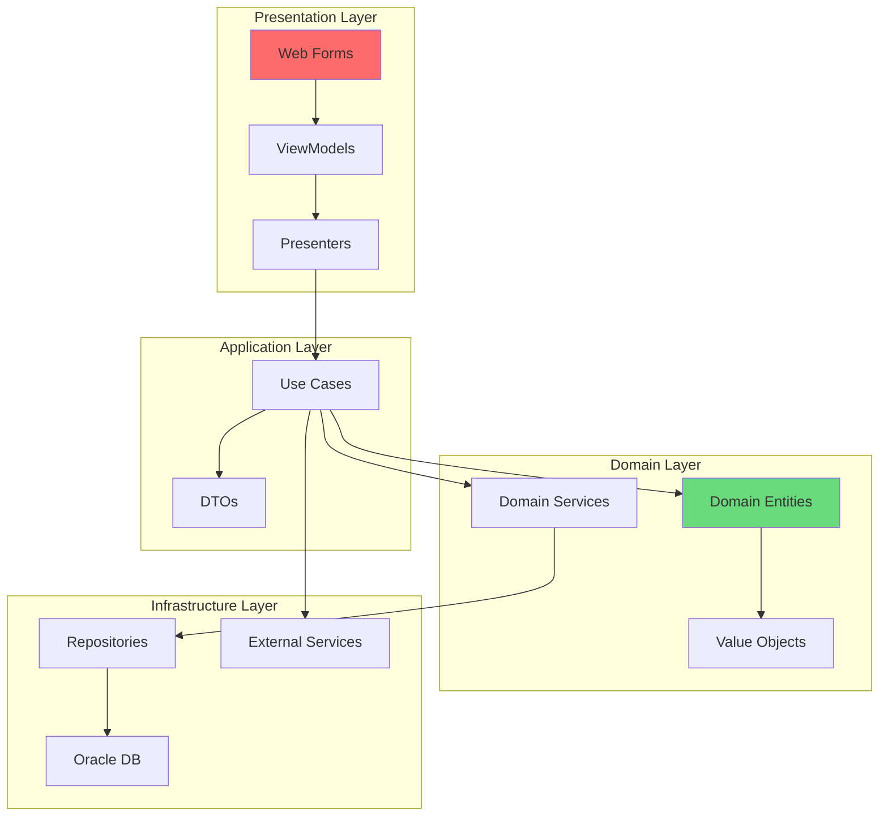
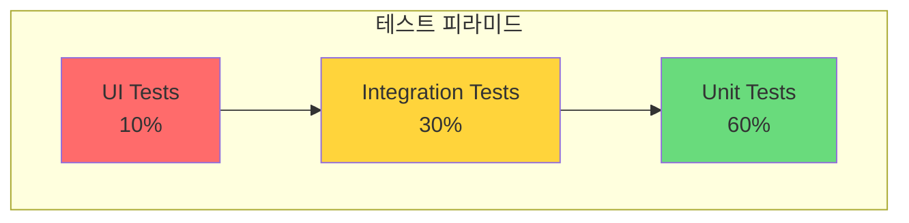

# 코드 리팩토링 가이드

## 개요

HNSMES 시스템의 레거시 코드를 현대적인 아키텍처로 개선하기 위한 종합 가이드입니다.


---

## 아키텍처 개선

### 현재 아키텍처 문제점

!!! warning "레거시 아키텍처 이슈"
    | 문제점 | 영향 | 우선순위 |
    |--------|------|----------|
    | 3-Layer Architecture (UI-BL-DAL) 강한 결합 | 단위 테스트 어려움 | High |
    | 비즈니스 로직이 코드비하인드에 분산 | 유지보수성 저하 | High |
    | 데이터 접근 로직 중복 | 일관성 없는 에러 처리 | Medium |
    | 거대한 God 클래스 존재 | 단일 책임 원칙 위반 | High |

### 목표 아키텍처: Clean Architecture



### 레이어별 책임 정의

| 레이어 | 책임 | 의존성 방향 |
|--------|------|-------------|
| **Presentation** | UI 렌더링, 사용자 입력 처리 | → Application |
| **Application** | 유스케이스 조정, 트랜잭션 관리 | → Domain |
| **Domain** | 비즈니스 규칙, 엔티티 정의 | None (순수) |
| **Infrastructure** | 데이터 접근, 외부 서비스 연동 | → Domain |

---

## 레거시 코드 현대화

### 1. 코드비하인드 분리 - MVP 패턴 적용

#### ❌ 변경 전 (ASPX 코드비하인드)

```csharp
// Pages/Production/WorkOrder.aspx.cs
public partial class WorkOrderPage : System.Web.UI.Page
{
    protected void Page_Load(object sender, EventArgs e)
    {
        if (!IsPostBack)
        {
            // 비즈니스 로직이 UI 코드에 섞임
            var conn = new OracleConnection(ConfigurationManager.ConnectionStrings["OracleDB"].ConnectionString);
            var cmd = new OracleCommand("SELECT * FROM WORK_ORDERS WHERE STATUS = :status", conn);
            cmd.Parameters.Add("status", ddlStatus.SelectedValue);
            
            var adapter = new OracleDataAdapter(cmd);
            var dt = new DataTable();
            adapter.Fill(dt);
            
            gvWorkOrders.DataSource = dt;
            gvWorkOrders.DataBind();
            
            // 직접 계산 로직
            lblTotalCount.Text = dt.Rows.Count.ToString();
            lblTotalQty.Text = dt.AsEnumerable().Sum(r => r.Field<decimal>("QUANTITY")).ToString("N0");
        }
    }
    
    protected void btnSave_Click(object sender, EventArgs e)
    {
        // 저장 로직도 UI에 직접 구현
        var conn = new OracleConnection(ConfigurationManager.ConnectionStrings["OracleDB"].ConnectionString);
        conn.Open();
        var transaction = conn.BeginTransaction();
        
        try
        {
            // ... 100+ 라인의 저장 로직 ...
            transaction.Commit();
        }
        catch (Exception ex)
        {
            transaction.Rollback();
            lblError.Text = ex.Message;
        }
    }
}
```

#### ✅ 변경 후 (MVP 패턴 적용)

```csharp
// Presenters/WorkOrderPresenter.cs
public class WorkOrderPresenter
{
    private readonly IWorkOrderView _view;
    private readonly IWorkOrderService _service;
    private readonly IMapper _mapper;
    
    public WorkOrderPresenter(IWorkOrderView view, IWorkOrderService service, IMapper mapper)
    {
        _view = view;
        _service = service;
        _mapper = mapper;
    }
    
    public async Task LoadWorkOrdersAsync(WorkOrderSearchCriteria criteria)
    {
        try
        {
            _view.ShowLoading(true);
            
            var result = await _service.SearchAsync(criteria);
            var viewModels = _mapper.Map<List<WorkOrderViewModel>>(result.Items);
            
            _view.DisplayWorkOrders(viewModels);
            _view.DisplaySummary(new WorkOrderSummaryViewModel
            {
                TotalCount = result.TotalCount,
                TotalQuantity = result.Items.Sum(x => x.Quantity)
            });
        }
        catch (Exception ex)
        {
            _view.ShowError($"작업지시 조회 중 오류 발생: {ex.Message}");
        }
        finally
        {
            _view.ShowLoading(false);
        }
    }
    
    public async Task SaveWorkOrderAsync(WorkOrderViewModel viewModel)
    {
        var validator = new WorkOrderValidator();
        var validationResult = await validator.ValidateAsync(viewModel);
        
        if (!validationResult.IsValid)
        {
            _view.ShowValidationErrors(validationResult.Errors);
            return;
        }
        
        try
        {
            var dto = _mapper.Map<CreateWorkOrderDto>(viewModel);
            await _service.CreateAsync(dto);
            _view.ShowSuccess("작업지시가 저장되었습니다.");
            _view.ClearForm();
        }
        catch (BusinessException ex)
        {
            _view.ShowError(ex.Message);
        }
    }
}

// Views/IWorkOrderView.cs
public interface IWorkOrderView
{
    void DisplayWorkOrders(List<WorkOrderViewModel> workOrders);
    void DisplaySummary(WorkOrderSummaryViewModel summary);
    void ShowLoading(bool isLoading);
    void ShowError(string message);
    void ShowSuccess(string message);
    void ShowValidationErrors(List<ValidationError> errors);
    void ClearForm();
}

// Pages/Production/WorkOrder.aspx.cs - 간소화됨
public partial class WorkOrderPage : System.Web.UI.Page, IWorkOrderView
{
    private WorkOrderPresenter _presenter;
    
    protected void Page_Init(object sender, EventArgs e)
    {
        // DI Container에서 Presenter 해결
        _presenter = DependencyResolver.Current.GetService<WorkOrderPresenter>();
        _presenter.SetView(this);
    }
    
    protected async void btnSearch_Click(object sender, EventArgs e)
    {
        var criteria = new WorkOrderSearchCriteria
        {
            Status = ddlStatus.SelectedValue,
            StartDate = txtStartDate.SelectedDate,
            EndDate = txtEndDate.SelectedDate
        };
        
        await _presenter.LoadWorkOrdersAsync(criteria);
    }
    
    // IWorkOrderView 구현
    public void DisplayWorkOrders(List<WorkOrderViewModel> workOrders)
    {
        gvWorkOrders.DataSource = workOrders;
        gvWorkOrders.DataBind();
    }
    
    public void ShowError(string message)
    {
        ScriptManager.RegisterStartupScript(this, GetType(), "error", 
            $"showError('{message.Replace("'", "\\'")}');", true);
    }
    
    // ... 나머지 View 메서드 구현
}
```

!!! tip "점진적 마이그레이션 팁"
    한 번에 모든 페이지를 리팩토링하지 마세요. 우선 순위가 높은 핵심 업무 페이지부터 시작하세요.

### 2. 저장 프로시저 기반 데이터 접근 개선

#### ❌ 변경 전 (AD-HOC 쿼리)

```csharp
public DataTable GetProductionData(string lineCode, DateTime startDate, DateTime endDate)
{
    var query = @"
        SELECT p.*, l.LINE_NAME, m.MODEL_NAME
        FROM PRODUCTION_DATA p
        JOIN PRODUCTION_LINES l ON p.LINE_CODE = l.LINE_CODE
        LEFT JOIN MODELS m ON p.MODEL_CODE = m.MODEL_CODE
        WHERE p.LINE_CODE = :lineCode
        AND p.PROD_DATE BETWEEN :startDate AND :endDate
        ORDER BY p.PROD_DATE DESC";
    
    using (var cmd = new OracleCommand(query, _connection))
    {
        cmd.Parameters.AddWithValue("lineCode", lineCode);
        cmd.Parameters.AddWithValue("startDate", startDate);
        cmd.Parameters.AddWithValue("endDate", endDate);
        
        var adapter = new OracleDataAdapter(cmd);
        var dt = new DataTable();
        adapter.Fill(dt);
        return dt;
    }
}
```

#### ✅ 변경 후 (Repository 패턴 + 저장 프로시저)

```csharp
// Domain/Repositories/IProductionRepository.cs
public interface IProductionRepository
{
    Task<PagedResult<ProductionData>> SearchAsync(ProductionSearchCriteria criteria);
    Task<ProductionData> GetByIdAsync(string productionId);
    Task<string> CreateAsync(CreateProductionDto dto);
    Task UpdateAsync(UpdateProductionDto dto);
    Task DeleteAsync(string productionId);
}

// Infrastructure/Repositories/ProductionRepository.cs
public class ProductionRepository : IProductionRepository
{
    private readonly IDbConnectionFactory _connectionFactory;
    private readonly ILogger<ProductionRepository> _logger;
    
    public async Task<PagedResult<ProductionData>> SearchAsync(ProductionSearchCriteria criteria)
    {
        using var connection = _connectionFactory.CreateConnection();
        
        var parameters = new DynamicParameters();
        parameters.Add("p_line_code", criteria.LineCode, DbType.String);
        parameters.Add("p_start_date", criteria.StartDate, DbType.Date);
        parameters.Add("p_end_date", criteria.EndDate, DbType.Date);
        parameters.Add("p_page_no", criteria.PageNumber, DbType.Int32);
        parameters.Add("p_page_size", criteria.PageSize, DbType.Int32);
        parameters.Add("p_total_count", dbType: DbType.Int32, direction: ParameterDirection.Output);
        
        // 저장 프로시저 사용
        var results = await connection.QueryAsync<ProductionData, ProductionLine, Model, ProductionData>(
            "PKG_PRODUCTION.SP_SEARCH_PRODUCTION",
            (prod, line, model) =>
            {
                prod.ProductionLine = line;
                prod.Model = model;
                return prod;
            },
            parameters,
            commandType: CommandType.StoredProcedure,
            splitOn: "LINE_NAME,MODEL_NAME"
        );
        
        var totalCount = parameters.Get<int>("p_total_count");
        
        return new PagedResult<ProductionData>
        {
            Items = results.ToList(),
            TotalCount = totalCount,
            PageNumber = criteria.PageNumber,
            PageSize = criteria.PageSize
        };
    }
    
    public async Task<string> CreateAsync(CreateProductionDto dto)
    {
        using var connection = _connectionFactory.CreateConnection();
        
        var parameters = new DynamicParameters();
        parameters.Add("p_line_code", dto.LineCode);
        parameters.Add("p_model_code", dto.ModelCode);
        parameters.Add("p_quantity", dto.Quantity);
        parameters.Add("p_prod_date", dto.ProductionDate);
        parameters.Add("p_created_by", dto.CreatedBy);
        parameters.Add("p_production_id", dbType: DbType.String, 
            direction: ParameterDirection.Output, size: 20);
        
        await connection.ExecuteAsync(
            "PKG_PRODUCTION.SP_CREATE_PRODUCTION",
            parameters,
            commandType: CommandType.StoredProcedure
        );
        
        return parameters.Get<string>("p_production_id");
    }
}
```

---

## 의존성 주입(DI) 도입

### Unity Container 설정

```csharp
// App_Start/UnityConfig.cs
public static class UnityConfig
{
    private static readonly Lazy<IUnityContainer> Container = 
        new Lazy<IUnityContainer>(() =>
    {
        var container = new UnityContainer();
        RegisterTypes(container);
        return container;
    });
    
    public static IUnityContainer GetContainer() => Container.Value;
    
    public static void RegisterTypes(IUnityContainer container)
    {
        // Register DbContext/Connection
        container.RegisterType<IDbConnectionFactory, OracleConnectionFactory>(
            new HierarchicalLifetimeManager());
        
        // Register Repositories
        container.RegisterType<IWorkOrderRepository, WorkOrderRepository>();
        container.RegisterType<IProductionRepository, ProductionRepository>();
        container.RegisterType<IQualityRepository, QualityRepository>();
        
        // Register Services
        container.RegisterType<IWorkOrderService, WorkOrderService>();
        container.RegisterType<IProductionService, ProductionService>();
        container.RegisterType<IQualityService, QualityService>();
        
        // Register Unit of Work
        container.RegisterType<IUnitOfWork, UnitOfWork>(new PerRequestLifetimeManager());
        
        // Register Presenters
        container.RegisterType<WorkOrderPresenter>();
        container.RegisterType<ProductionPresenter>();
        
        // Register Utilities
        container.RegisterType<ILoggerFactory, LoggerFactory>();
        container.RegisterInstance<IMapper>(AutoMapperConfig.CreateMapper());
        
        // Decorators (Cross-cutting concerns)
        container.RegisterType<IWorkOrderService, 
            LoggingWorkOrderServiceDecorator>(
            new InjectionConstructor(
                new ResolvedParameter<WorkOrderService>(),
                new ResolvedParameter<ILogger<WorkOrderService>>()
            ));
    }
}

// Decorator 예시 - 로깅
public class LoggingWorkOrderServiceDecorator : IWorkOrderService
{
    private readonly IWorkOrderService _inner;
    private readonly ILogger<IWorkOrderService> _logger;
    
    public async Task<WorkOrderDto> GetByIdAsync(string id)
    {
        _logger.LogDebug("작업지시 조회 시작: {Id}", id);
        var stopwatch = Stopwatch.StartNew();
        
        try
        {
            var result = await _inner.GetByIdAsync(id);
            _logger.LogInformation("작업지시 조회 완료: {Id}, 소요시간: {ElapsedMs}ms", 
                id, stopwatch.ElapsedMilliseconds);
            return result;
        }
        catch (Exception ex)
        {
            _logger.LogError(ex, "작업지시 조회 실패: {Id}", id);
            throw;
        }
    }
    
    // ... 다른 메서드도 유사하게 구현
}
```

---

## 단위 테스트 전략

### 테스트 피라미드



### 단위 테스트 예시

```csharp
// Tests/Domain/Services/WorkOrderServiceTests.cs
[TestClass]
public class WorkOrderServiceTests
{
    private Mock<IWorkOrderRepository> _mockRepository;
    private Mock<IUnitOfWork> _mockUnitOfWork;
    private Mock<ICurrentUserService> _mockUserService;
    private Mock<IEventDispatcher> _mockEventDispatcher;
    private WorkOrderService _service;
    
    [TestInitialize]
    public void Setup()
    {
        _mockRepository = new Mock<IWorkOrderRepository>();
        _mockUnitOfWork = new Mock<IUnitOfWork>();
        _mockUserService = new Mock<ICurrentUserService>();
        _mockEventDispatcher = new Mock<IEventDispatcher>();
        
        _service = new WorkOrderService(
            _mockRepository.Object,
            _mockUnitOfWork.Object,
            _mockUserService.Object,
            _mockEventDispatcher.Object
        );
    }
    
    [TestMethod]
    public async Task CreateAsync_WithValidDto_CreatesWorkOrder()
    {
        // Arrange
        var dto = new CreateWorkOrderDto
        {
            ProductCode = "PROD001",
            Quantity = 100,
            PlannedStartDate = DateTime.Today.AddDays(1)
        };
        
        _mockUserService.Setup(x => x.UserId).Returns("TEST_USER");
        _mockRepository.Setup(x => x.CreateAsync(It.IsAny<WorkOrder>()))
            .ReturnsAsync("WO2024001");
        
        // Act
        var result = await _service.CreateAsync(dto);
        
        // Assert
        Assert.IsNotNull(result);
        Assert.AreEqual("WO2024001", result.WorkOrderNo);
        _mockRepository.Verify(x => x.CreateAsync(It.Is<WorkOrder>(
            w => w.ProductCode == dto.ProductCode)), Times.Once);
        _mockUnitOfWork.Verify(x => x.SaveChangesAsync(), Times.Once);
    }
    
    [TestMethod]
    [ExpectedException(typeof(ValidationException))]
    public async Task CreateAsync_WithZeroQuantity_ThrowsValidationException()
    {
        // Arrange
        var dto = new CreateWorkOrderDto
        {
            ProductCode = "PROD001",
            Quantity = 0 // 유효하지 않은 값
        };
        
        // Act
        await _service.CreateAsync(dto);
        
        // Assert - ExpectedException으로 처리
    }
    
    [TestMethod]
    public async Task ApproveAsync_WhenStatusIsPending_UpdatesStatus()
    {
        // Arrange
        var workOrder = new WorkOrder
        {
            WorkOrderNo = "WO001",
            Status = WorkOrderStatus.Pending
        };
        
        _mockRepository.Setup(x => x.GetByIdAsync("WO001"))
            .ReturnsAsync(workOrder);
        _mockUserService.Setup(x => x.UserId).Returns("APPROVER");
        
        // Act
        await _service.ApproveAsync("WO001", "승인합니다");
        
        // Assert
        Assert.AreEqual(WorkOrderStatus.Approved, workOrder.Status);
        Assert.AreEqual("APPROVER", workOrder.ApprovedBy);
        _mockEventDispatcher.Verify(x => x.Dispatch(
            It.Is<WorkOrderApprovedEvent>(e => e.WorkOrderNo == "WO001")), 
            Times.Once);
    }
}
```

### 통합 테스트 예시

```csharp
// Tests/Integration/ProductionRepositoryTests.cs
[TestClass]
public class ProductionRepositoryTests : IDisposable
{
    private readonly TestDatabase _testDb;
    private readonly IProductionRepository _repository;
    
    public ProductionRepositoryTests()
    {
        _testDb = new TestDatabase();
        _testDb.InitializeAsync().Wait();
        
        var connectionFactory = new TestConnectionFactory(_testDb.ConnectionString);
        _repository = new ProductionRepository(connectionFactory);
    }
    
    [TestMethod]
    public async Task SearchAsync_WithDateRange_ReturnsFilteredResults()
    {
        // Arrange
        await _testDb.SeedDataAsync(new[]
        {
            new ProductionData { ProdDate = new DateTime(2024, 1, 15), Quantity = 100 },
            new ProductionData { ProdDate = new DateTime(2024, 2, 15), Quantity = 200 },
            new ProductionData { ProdDate = new DateTime(2024, 3, 15), Quantity = 300 }
        });
        
        var criteria = new ProductionSearchCriteria
        {
            StartDate = new DateTime(2024, 1, 1),
            EndDate = new DateTime(2024, 2, 28)
        };
        
        // Act
        var result = await _repository.SearchAsync(criteria);
        
        // Assert
        Assert.AreEqual(2, result.Items.Count);
        Assert.IsTrue(result.Items.All(x => x.ProdDate >= criteria.StartDate 
            && x.ProdDate <= criteria.EndDate));
    }
    
    public void Dispose()
    {
        _testDb.Dispose();
    }
}
```

---

## 성능 최적화

### 1. 데이터베이스 쿼리 최적화

```csharp
// ❌ 비효율적: N+1 문제
public async Task<List<OrderDto>> GetOrdersWithDetailsAsync()
{
    var orders = await _orderRepository.GetAllAsync();
    
    foreach (var order in orders)
    {
        // N번의 추가 쿼리 발생
        order.Customer = await _customerRepository.GetByIdAsync(order.CustomerId);
        order.Items = await _orderItemRepository.GetByOrderIdAsync(order.Id);
    }
    
    return orders;
}

// ✅ 효율적: 한 번에 조회
public async Task<List<OrderDto>> GetOrdersWithDetailsOptimizedAsync()
{
    const string query = @"
        SELECT o.*, c.*, i.*
        FROM ORDERS o
        JOIN CUSTOMERS c ON o.CUSTOMER_ID = c.ID
        LEFT JOIN ORDER_ITEMS i ON o.ID = i.ORDER_ID
        WHERE o.CREATED_DATE >= :startDate";
    
    using var connection = _connectionFactory.CreateConnection();
    
    var orderDictionary = new Dictionary<string, OrderDto>();
    
    var result = await connection.QueryAsync<OrderDto, CustomerDto, OrderItemDto, OrderDto>(
        query,
        (order, customer, item) =>
        {
            if (!orderDictionary.TryGetValue(order.Id, out var existingOrder))
            {
                existingOrder = order;
                existingOrder.Customer = customer;
                existingOrder.Items = new List<OrderItemDto>();
                orderDictionary.Add(order.Id, existingOrder);
            }
            
            if (item != null)
                existingOrder.Items.Add(item);
            
            return existingOrder;
        },
        splitOn: "ID,CUSTOMER_ID,ID"
    );
    
    return orderDictionary.Values.ToList();
}
```

### 2. 캐싱 전략

```csharp
// Services/Caching/CachedWorkOrderService.cs
public class CachedWorkOrderService : IWorkOrderService
{
    private readonly IWorkOrderService _inner;
    private readonly IDistributedCache _cache;
    private readonly ILogger<CachedWorkOrderService> _logger;
    
    public async Task<WorkOrderDto> GetByIdAsync(string id)
    {
        var cacheKey = $"wo:{id}";
        
        // 캐시에서 조회
        var cached = await _cache.GetStringAsync(cacheKey);
        if (!string.IsNullOrEmpty(cached))
        {
            _logger.LogDebug("캐시 히트: {CacheKey}", cacheKey);
            return JsonSerializer.Deserialize<WorkOrderDto>(cached);
        }
        
        // DB에서 조회
        var result = await _inner.GetByIdAsync(id);
        
        if (result != null)
        {
            // 캐시 저장 (5분)
            var options = new DistributedCacheEntryOptions
            {
                AbsoluteExpirationRelativeToNow = TimeSpan.FromMinutes(5),
                SlidingExpiration = TimeSpan.FromMinutes(2)
            };
            
            await _cache.SetStringAsync(
                cacheKey, 
                JsonSerializer.Serialize(result), 
                options);
        }
        
        return result;
    }
    
    public async Task InvalidateCacheAsync(string id)
    {
        await _cache.RemoveAsync($"wo:{id}");
        await _cache.RemoveAsync("wo:search:*");
    }
}
```

### 3. 비동기 처리

```csharp
// ❌ 동기 블로킹
public void ProcessBulkOrders(List<OrderDto> orders)
{
    foreach (var order in orders)
    {
        ProcessOrder(order); // 순차 처리
    }
}

// ✅ 비동기 병렬 처리
public async Task ProcessBulkOrdersAsync(List<OrderDto> orders, 
    IProgress<ProgressReport> progress)
{
    var semaphore = new SemaphoreSlim(10); // 동시 실행 제한
    var processed = 0;
    
    var tasks = orders.Select(async order =>
    {
        await semaphore.WaitAsync();
        try
        {
            await ProcessOrderAsync(order);
            var current = Interlocked.Increment(ref processed);
            progress?.Report(new ProgressReport
            {
                Processed = current,
                Total = orders.Count,
                Percentage = (double)current / orders.Count * 100
            });
        }
        finally
        {
            semaphore.Release();
        }
    });
    
    await Task.WhenAll(tasks);
}
```

---

## 리팩토링 체크리스트

### 코드 품질 체크리스트

- [ ] 모든 public 메서드에 XML 주석이 있는가?
- [ ] 메서드는 20줄 이하인가?
- [ ] 클래스는 300줄 이하인가?
- [ ] Cyclomatic Complexity는 10 이하인가?
- [ ] 중복 코드가 제거되었는가?
- [ ] Magic number가 상수로 대체되었는가?

### 아키텍처 체크리스트

- [ ] Domain 레이어가 Infrastructure에 의존하지 않는가?
- [ ] 모든 의존성이 추상화(인터페이스)에 대한가?
- [ ] 테스트 가능한 구조인가?
- [ ] 적절한 디자인 패턴이 적용되었는가?

!!! note "리팩토링 진행 시 주의사항"
    - 기존 기능을 유지하면서 점진적으로 개선하세요
    - 각 리팩토링 단계마다 충분한 테스트를 수행하세요
    - 코드 리뷰를 필수로 진행하세요
    - 성능 벤치마크를 측정하여 개선 효과를 확인하세요
