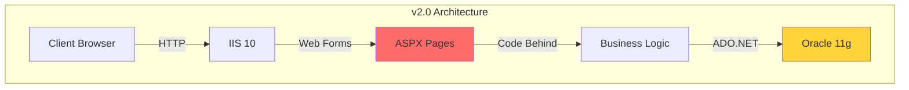
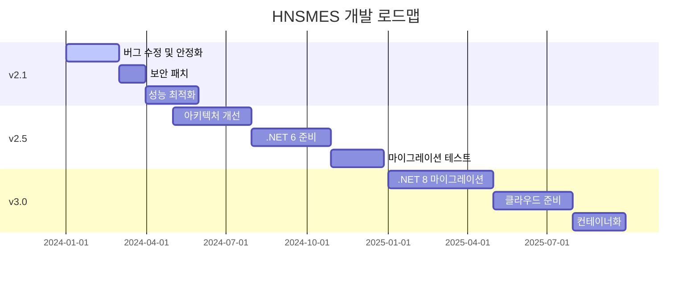
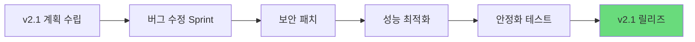
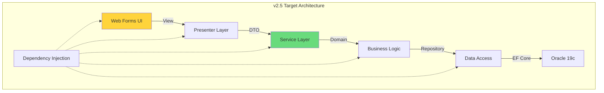
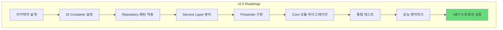
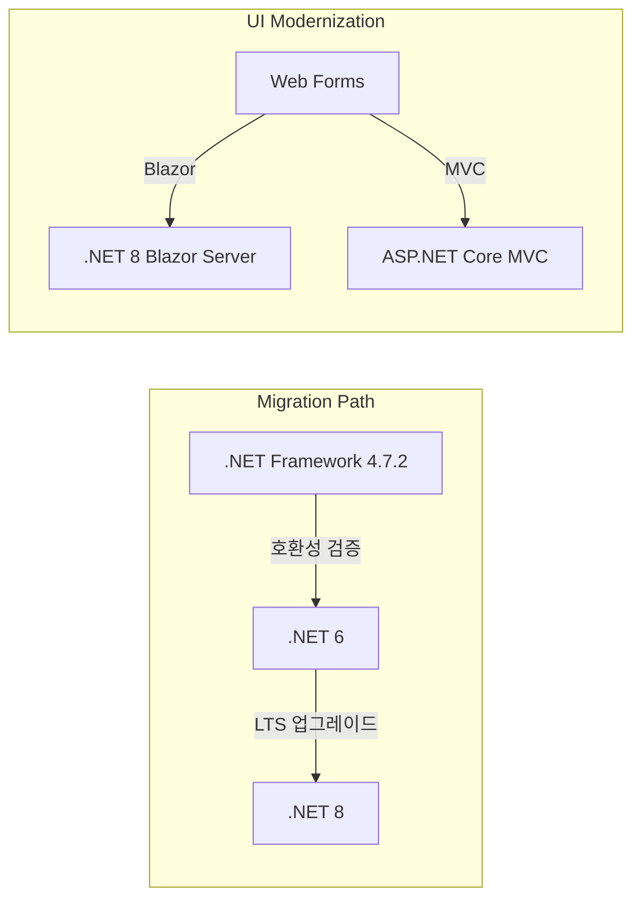
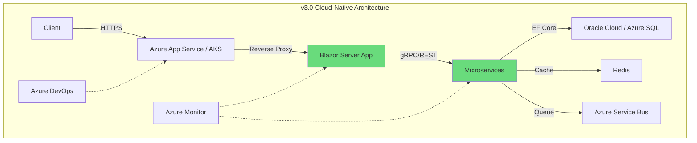
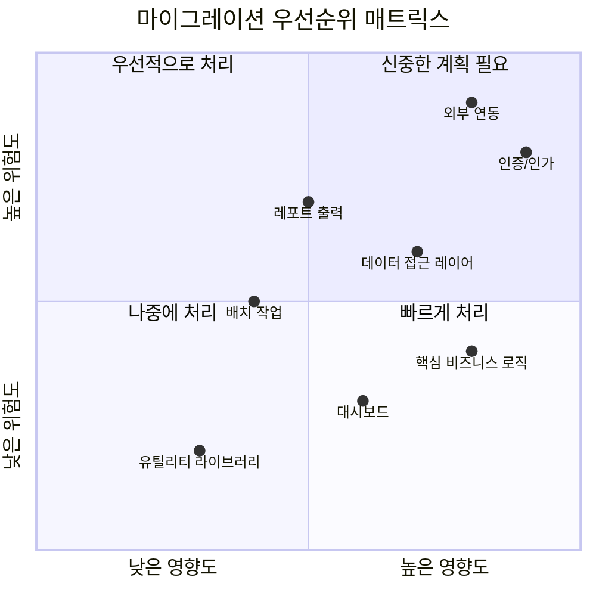
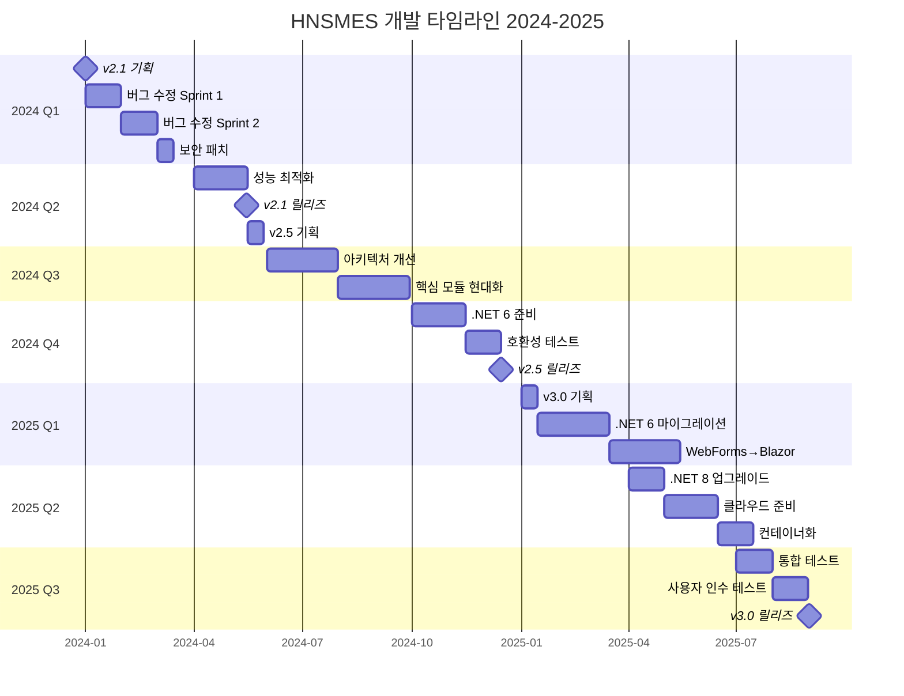
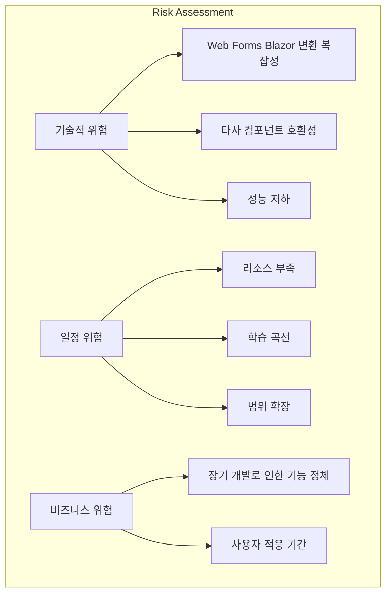

# 개발 로드맵

## 개요

HNSMES 시스템의 중장기 개발 계획 및 마일스톤을 제시합니다.

---

## 현재 상태 (v2.0)

### 기술 스택 현황

| 구분 | 현재 버전 | 지원 상태 | 비고 |
|------|-----------|-----------|------|
| .NET Framework | 4.7.2 | 지원 중 | 2024년 지원 종료 예정 |
| ASP.NET Web Forms | 4.7.2 | 레거시 | 현대화 필요 |
| Oracle Database | 11g R2 | 확장 지원 중 | 19c/21c 업그레이드 권장 |
| DevExpress | 20.1 | 유효 | 정기 업데이트 필요 |
| IIS | 10.0 | 지원 중 | - |

### 현재 아키텍처

### 알려진 이슈

!!! warning "v2.0 주요 이슈"
    - **보안**: 하드코딩된 연결 문자열, SQL Injection 취약점
    - **성능**: 동기 I/O 블로킹, 메모리 누수
    - **유지보수**: 중복 코드, 테스트 부재
    - **기술 부채**: .NET Framework 4.7.2 수명 종료 임박

---

## 개발 일정 개요

---

## v2.1 목표 (2024년 Q1-Q2)

### 주요 목표: 안정화 및 기술 부채 해소

!!! tip "v2.1 우선순위"
    기존 기능의 안정성 확보와 즉각적인 보안/성능 이슈 해결에 집중합니다.

### 세부 계획

| 우선순위 | 작업 항목 | 담당자 | 예상 기간 | 완료 조건 |
|----------|-----------|--------|-----------|-----------|
| P0 | 치명적 버그 수정 | 개발팀 | 4주 | 이슈 0건 |
| P0 | SQL Injection 취약점 패치 | 보안팀 | 2주 | 보안 스캔 통과 |
| P1 | 메모리 누수 수정 | 개발팀 | 3주 | 메모리 사용량 안정화 |
| P1 | 연결 문자열 암호화 | 보안팀 | 1주 | 설정 파일 암호화 완료 |
| P2 | 로깅 시스템 개선 | 개발팀 | 2주 | 구조화된 로그 적용 |
| P2 | 예외 처리 일관성 | 개발팀 | 3주 | 전역 예외 핸들러 구현 |

### v2.1 기능 개선 목록

- [x] 작업지시서 조회 속도 개선 (인덱스 최적화)
- [x] 대시보드 실시간 데이터 갱신 문제 수정
- [ ] 레포트 출력 시 메모리 사용량 최적화
- [ ] 다중 사용자 동시 접속 시 세션 충돌 해결
- [ ] 데이터 백업/복구 프로세스 자동화

### v2.1 마일스톤

---

## v2.5 목표 (2024년 Q3-Q4)

### 주요 목표: 현대화 준비 및 아키텍처 개선

!!! note "v2.5 전략"
    .NET 6/8 마이그레이션을 위한 사전 준비 단계입니다. 
    기존 Web Forms를 점진적으로 현대화합니다.

### 세부 계획

| 단계 | 기간 | 주요 작업 | 산출물 |
|------|------|-----------|--------|
| **Phase 1** | 2개월 | 레이어 분리 및 DI 도입 | 분리된 아키텍처 |
| **Phase 2** | 2개월 | 핵심 모듈 현대화 | MVP 패턴 적용 |
| **Phase 3** | 1개월 | .NET 6 호환성 테스트 | 호환성 리포트 |
| **Phase 4** | 1개월 | 마이그레이션 계획 수립 | 상세 마이그레이션 가이드 |

### 아키텍처 개선 계획

### 핵심 모듈 현대화 대상

| 모듈 | 현재 상태 | 목표 상태 | 예상 기간 |
|------|-----------|-----------|-----------|
| 작업지시 관리 | 코드비하인드 | MVP 패턴 | 3주 |
| 생산 실적 | 코드비하인드 | MVP 패턴 | 3주 |
| 품질 관리 | 코드비하인드 | MVP 패턴 | 2주 |
| 설비 관리 | 코드비하인드 | MVP 패턴 | 2주 |
| 재고 관리 | 코드비하인드 | MVP 패턴 | 3주 |

### v2.5 기술 스택 업그레이드

| 구분 | 현재 | v2.5 목표 | 변경 사항 |
|------|------|-----------|-----------|
| ORM | ADO.NET | Dapper | 생산성 및 성능 향상 |
| DI | 없음 | Unity/Autofac | 테스트 가능한 구조 |
| Logging | log4net | Serilog | 구조화된 로깅 |
| Mapping | 수동 | AutoMapper | 생산성 향상 |
| Validation | 수동 | FluentValidation | 일관된 검증 |

### v2.5 마일스톤

---

## v3.0 목표 (2025년)

### 주요 목표: .NET 8 마이그레이션 및 클라우드 네이티브 전환

!!! warning "v3.0 중요도"
    .NET Framework 지원 종료에 대비한 필수 마이그레이션입니다.
    사전 준비 없이 진행 시 큰 위험이 따릅니다.

### .NET 8 마이그레이션 계획

### v3.0 세부 계획

| 단계 | 기간 | 주요 작업 | 위험도 |
|------|------|-----------|--------|
| **Phase 1** | 2개월 | .NET 6 마이그레이션 | Medium |
| **Phase 2** | 2개월 | Web Forms → Blazor 변환 | High |
| **Phase 3** | 1개월 | .NET 8 업그레이드 | Low |
| **Phase 4** | 2개월 | 클라우드 네이티브 준비 | Medium |
| **Phase 5** | 1개월 | 컨테이너화 및 CI/CD | Medium |

### UI 기술 선택

| 기술 | 적합도 | 학습 곡선 | 마이그레이션 난이도 | 권장도 |
|------|--------|-----------|---------------------|--------|
| **Blazor Server** | 높음 | 중간 | 중간 | ⭐⭐⭐⭐⭐ |
| Blazor WASM | 중간 | 중간 | 높음 | ⭐⭐⭐ |
| ASP.NET Core MVC | 높음 | 낮음 | 높음 | ⭐⭐⭐⭐ |
| Razor Pages | 중간 | 낮음 | 중간 | ⭐⭐⭐⭐ |

!!! tip "Blazor Server 선택 권장 이유"
    - Web Forms와 유사한 이벤트 기반 프로그래밍 모델
    - C#으로 풀스택 개발 가능
    - DevExpress Blazor 컴포넌트 활용 가능
    - 점진적 마이그레이션 가능 (Hybrid 방식)

### v3.0 타겟 아키텍처

### v3.0 기술 스택

| 구분 | v2.x | v3.0 | 변화 |
|------|------|------|------|
| **Framework** | .NET Framework 4.7.2 | .NET 8 LTS | 현대화 |
| **UI** | Web Forms | Blazor Server | 현대화 |
| **Database** | Oracle 11g | Oracle 19c/21c | 업그레이드 |
| **ORM** | ADO.NET | EF Core 8 | 표준화 |
| **DI** | Unity | Built-in | 표준화 |
| **Hosting** | On-Premises IIS | Azure/Containers | 클라우드 |
| **DevOps** | 수동 배포 | CI/CD 자동화 | 자동화 |

### 마이그레이션 위험도 평가

---

## 타임라인 및 마일스톤

### 전체 일정

### 주요 마일스톤

| 버전 | 예정일 | 주요 특징 | 상태 |
|------|--------|-----------|------|
| v2.1.0 | 2024-05-15 | 안정화 및 버그 수정 | 🟡 계획중 |
| v2.1.5 | 2024-07-31 | 성능 최적화 완료 | ⚪ 예정 |
| v2.5.0 | 2024-12-15 | 아키텍처 현대화 | ⚪ 예정 |
| v3.0.0-beta | 2025-06-30 | .NET 8 마이그레이션 | ⚪ 예정 |
| v3.0.0 | 2025-08-31 | 클라우드 네이티브 | ⚪ 예정 |

### 리소스 계획

| 역할 | v2.1 | v2.5 | v3.0 | 비고 |
|------|------|------|------|------|
| 백엔드 개발 | 2명 | 3명 | 4명 | .NET 전문가 필요 |
| 프론트엔드 개발 | 1명 | 2명 | 3명 | Blazor 경험자 |
| DBA | 0.5명 | 1명 | 1명 | Oracle 전문가 |
| DevOps | 0.5명 | 1명 | 2명 | Azure 경험자 |
| QA | 1명 | 2명 | 3명 | 자동화 테스트 |

---

## 위험 관리

### 주요 위험 요소

### 위험 완화 전략

| 위험 | 영향도 | 가능성 | 완화 전략 |
|------|--------|--------|-----------|
| Web Forms 변환 실패 | 높음 | 중간 | PoC 선행, 점진적 마이그레이션 |
| 타사 컴포넌트 미지원 | 중간 | 높음 | DevExpress Blazor 검증, 대안 수립 |
| 리소스 부족 | 높음 | 높음 | 외부 전문가 고용, 교육 계획 |
| 일정 지연 | 중간 | 중간 | 버퍼 기간 확보, MVP 우선순위 |
| 성능 저하 | 중간 | 낮음 | 지속적 성능 테스트, 최적화 Sprint |

---

## 의사결정 기록 (ADR)

### ADR-001: UI 프레임워크 선택

| 항목 | 내용 |
|------|------|
| **상태** | 수락됨 |
| **컨텍스트** | Web Forms의 단점(테스트 어려움, 성능, 현대화 어려움) 해결 필요 |
| **결정** | Blazor Server 채택 |
| **이유** | Web Forms 개발자 학습 곡선 완만, DevExpress 지원, 이벤트 기반 모델 유사 |
| **대안** | MVC, Razor Pages, Angular |
| **영향** | v2.5부터 점진적 변환 시작, v3.0에서 완료 |

### ADR-002: 데이터베이스 전략

| 항목 | 내용 |
|------|------|
| **상태** | 수락됨 |
| **컨텍스트** | Oracle 11g 지원 종료 임박 |
| **결정** | Oracle 19c 업그레이드, 클라우드 전환 검토 |
| **이유** | 기존 투자 보호, 호환성 유지, 성능 향상 |
| **대안** | SQL Server, PostgreSQL 마이그레이션 |
| **영향** | v2.5에서 DB 업그레이드, v3.0에서 클라우드 옵션 검토 |

---

## 결론

!!! success "핵심 성공 요인"
    1. **점진적 접근**: 한 번에 모든 것을 바꾸지 않습니다
    2. **충분한 테스트**: 각 단계마다 철저한 검증
    3. **사용자 참여**: 지속적인 피드백 수집
    4. **전문가 활용**: 필요시 외부 전문가 고용
    5. **문서화**: 모든 결정과 변경 사항 기록

### 다음 단계

1. [ ] v2.1 상세 일정 수립 및 팀 배정
2. [ ] PoC 프로젝트 시작 (Blazor 변환 검증)
3. [ ] 교육 계획 수립 (.NET Core/Blazor)
4. [ ] 외부 컨설팅 업체 선정 (v3.0 지원)
5. [ ] 예산 승인 및 리소스 확보

---

*문서 버전: 1.0*  
*최종 수정일: 2024-01-01*  
*작성자: 개발팀*  
*검토자: IT 아키텍트*
