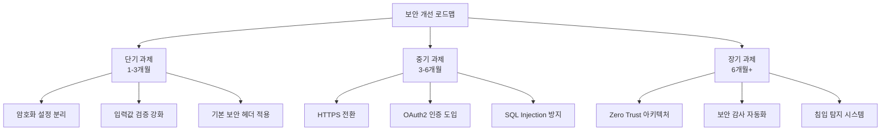
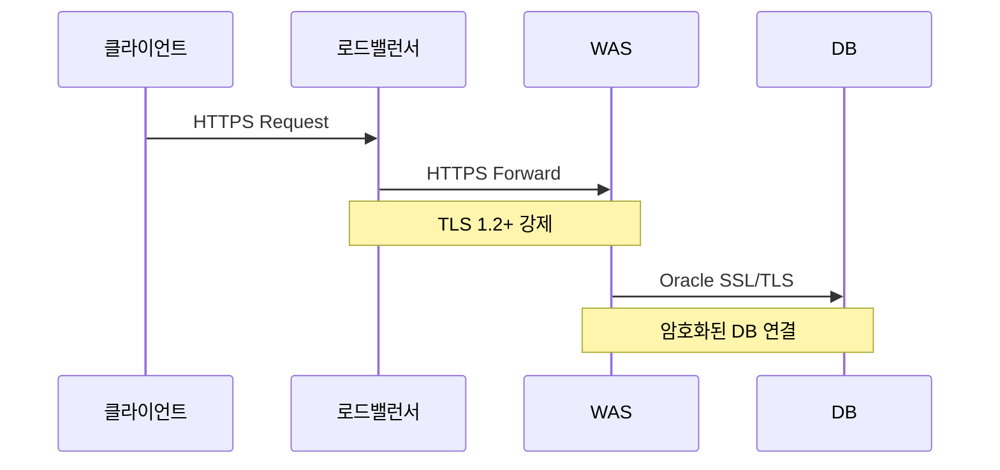
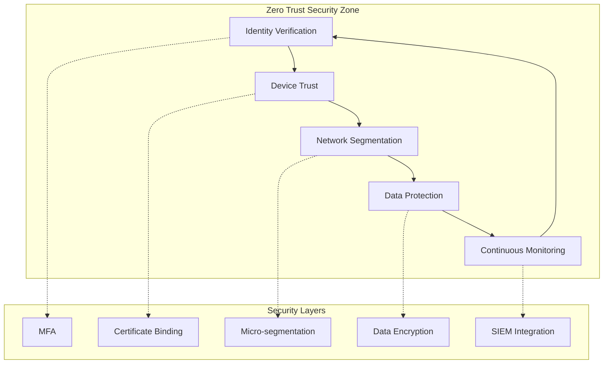

# 보안 개선 가이드

## 개요

본 문서는 HNSMES 시스템의 보안 취약점을 분석하고 단계별 개선 방안을 제시합니다.



---

## 현재 발견된 보안 이슈

### 🔴 심각도: 높음

| 이슈 유형 | 위치 | 설명 | 위험도 |
|-----------|------|------|--------|
| 하드코딩된 비밀번호 | `DAL/DatabaseConfig.cs` | 연결 문자열에 비밀번호 하드코딩 | 🔴 Critical |
| SQL Injection 취약점 | `*.aspx.cs` 파일 다수 | 문자열 연결 방식의 쿼리 작성 | 🔴 Critical |
| HTTP 통신 | Web.config, 전체 | 암호화되지 않은 통신 채널 | 🟠 High |
| 세션 관리 취약점 | `SessionManager.cs` | 세션 타임아웃 미설정 | 🟠 High |

### 🟡 심각도: 중간

| 이슈 유형 | 위치 | 설명 | 위험도 |
|-----------|------|------|--------|
| 취약한 암호화 알고리즘 | `CryptoHelper.cs` | MD5/SHA1 사용 | 🟡 Medium |
| 로그 민감정보 노출 | `Logger.cs` | 에러 로그에 비밀번호 포함 | 🟡 Medium |
| CORS 설정 미흡 | `Web.config` | 와일드카드(*) 허용 | 🟡 Medium |

---

## 단기 개선 과제 (1-3개월)

!!! warning "우선순위: 즉시 조치 필요"
    하드코딩된 비밀번호와 SQL Injection 취약점은 시스템 침해의 주요 경로입니다. 가장 먼저 해결해야 합니다.

### 1. 연결 문자열 암호화 및 외부화

#### ❌ 변경 전 (문제 코드)

```csharp
// DAL/DatabaseConfig.cs - 하드코딩된 비밀번호
public class DatabaseConfig
{
    // 위험: 소스 코드에 비밀번호 노출
    public const string ConnectionString = 
        "Data Source=ORACLE_SERVER;User Id=DB_ADMIN;Password=********;";
    
    public static OracleConnection GetConnection()
    {
        return new OracleConnection(ConnectionString);
    }
}
```

#### ✅ 변경 후 (개선 코드)

```csharp
// DAL/DatabaseConfig.cs - 암호화된 설정 사용
public class DatabaseConfig
{
    private readonly IConfiguration _configuration;
    private readonly ICryptoService _cryptoService;
    
    public DatabaseConfig(IConfiguration configuration, ICryptoService cryptoService)
    {
        _configuration = configuration;
        _cryptoService = cryptoService;
    }
    
    public string GetConnectionString()
    {
        // 암호화된 연결 문자열 복호화
        var encryptedConnectionString = _configuration
            .GetConnectionString("OracleEncrypted");
        return _cryptoService.Decrypt(encryptedConnectionString);
    }
    
    public OracleConnection GetSecureConnection()
    {
        var connection = new OracleConnection(GetConnectionString());
        // 연결 문자열에서 비밀번호 마스킹
        var maskedCs = connection.ConnectionString
            .Replace(GetPassword(), "********");
        Logger.LogInformation($"데이터베이스 연결 생성: {maskedCs}");
        return connection;
    }
    
    private string GetPassword()
    {
        // 연결 문자열에서 비밀번호 추출 (로깅 용도)
        var builder = new OracleConnectionStringBuilder(GetConnectionString());
        return builder.Password;
    }
}
```

!!! tip "설정 파일 암호화 방법"
    ```powershell
    # ASP.NET IIS 등록 도구를 사용하여 연결 문자열 암호화
    aspnet_regiis.exe -pe "connectionStrings" -app "/HNSMES"
    
    # 또는 Azure Key Vault / AWS Secrets Manager 사용 권장
    ```

### 2. SQL Injection 방지 - 파라미터화된 쿼리 적용

#### ❌ 변경 전 (문제 코드)

```csharp
// Pages/Production/WorkOrder.aspx.cs
protected void SearchWorkOrder(string workOrderNo, string productCode)
{
    // 위험: 사용자 입력을 직접 문자열 연결
    var query = $@"SELECT * FROM WORK_ORDERS 
                   WHERE WORK_ORDER_NO = '{workOrderNo}' 
                   AND PRODUCT_CODE = '{productCode}'";
    
    // 공격 예시: workOrderNo = "'; DROP TABLE WORK_ORDERS; --"
    using (var cmd = new OracleCommand(query, connection))
    {
        var result = cmd.ExecuteReader();
        // ...
    }
}
```

#### ✅ 변경 후 (개선 코드)

```csharp
// Pages/Production/WorkOrder.aspx.cs
public class WorkOrderRepository
{
    private readonly IDatabaseConnectionFactory _connectionFactory;
    
    public WorkOrderRepository(IDatabaseConnectionFactory connectionFactory)
    {
        _connectionFactory = connectionFactory;
    }
    
    public async Task<List<WorkOrder>> SearchWorkOrdersAsync(
        string workOrderNo, 
        string productCode)
    {
        // ✅ 파라미터화된 쿼리 사용
        const string query = @"
            SELECT WORK_ORDER_NO, PRODUCT_CODE, QUANTITY, STATUS 
            FROM WORK_ORDERS 
            WHERE WORK_ORDER_NO = :workOrderNo 
            AND PRODUCT_CODE = :productCode
            AND ROWNUM <= 1000"; // 결과 제한 추가
        
        using (var connection = _connectionFactory.CreateConnection())
        using (var command = new OracleCommand(query, connection))
        {
            // ✅ 명시적 파라미터 타입 지정
            command.Parameters.Add(new OracleParameter("workOrderNo", 
                OracleDbType.Varchar2, 20, workOrderNo, ParameterDirection.Input));
            command.Parameters.Add(new OracleParameter("productCode", 
                OracleDbType.Varchar2, 50, productCode, ParameterDirection.Input));
            
            // ✅ 실행 계획 캐싱을 위한 Prepare
            command.Prepare();
            
            var results = new List<WorkOrder>();
            using (var reader = await command.ExecuteReaderAsync())
            {
                while (await reader.ReadAsync())
                {
                    results.Add(MapToWorkOrder(reader));
                }
            }
            return results;
        }
    }
}
```

!!! note "추가 권장사항: ORM 도입 고려"
    Dapper 또는 Entity Framework Core 도입을 검토하세요:
    ```csharp
    // Dapper 사용 예시
    public async Task<WorkOrder> GetByIdAsync(string workOrderNo)
    {
        using var connection = _connectionFactory.CreateConnection();
        return await connection.QueryFirstOrDefaultAsync<WorkOrder>(@
            "SELECT * FROM WORK_ORDERS WHERE WORK_ORDER_NO = @workOrderNo",
            new { workOrderNo });
    }
    ```

### 3. 기본 보안 헤더 적용

```xml
<!-- Web.config -->
<system.webServer>
    <httpProtocol>
        <customHeaders>
            <!-- XSS 방지 -->
            <add name="X-Content-Type-Options" value="nosniff" />
            <add name="X-Frame-Options" value="DENY" />
            <add name="X-XSS-Protection" value="1; mode=block" />
            <add name="Referrer-Policy" value="strict-origin-when-cross-origin" />
            <!-- CSP 정책 -->
            <add name="Content-Security-Policy" 
                 value="default-src 'self'; script-src 'self' 'unsafe-inline'; style-src 'self' 'unsafe-inline'" />
        </customHeaders>
    </httpProtocol>
</system.webServer>
```

---

## 중기 개선 과제 (3-6개월)

### 1. HTTPS 전환 및 TLS 강화



!!! tip "TLS 설정 체크리스트"
    - [ ] TLS 1.2 이상만 허용
    - [ ] 취약한 암호화 스위트 비활성화
    - [ ] HSTS(HTTP Strict Transport Security) 적용
    - [ ] 인증서 자동 갱신 설정

### 2. OAuth2/OIDC 기반 인증 시스템 도입

```csharp
// Services/Authentication/OAuth2Service.cs
public class OAuth2AuthenticationService : IAuthenticationService
{
    private readonly IHttpClientFactory _httpClientFactory;
    private readonly ITokenCache _tokenCache;
    
    public async Task<AuthResult> AuthenticateAsync(string code, string redirectUri)
    {
        var client = _httpClientFactory.CreateClient("OAuth2");
        
        // PKCE 검증
        var pkceVerifier = await _tokenCache.GetAsync($"pkce:{code}");
        
        var tokenRequest = new TokenRequest
        {
            GrantType = "authorization_code",
            Code = code,
            RedirectUri = redirectUri,
            CodeVerifier = pkceVerifier,
            ClientId = _configuration["OAuth2:ClientId"],
            ClientSecret = await GetClientSecretAsync() // Key Vault에서 조회
        };
        
        var response = await client.PostAsJsonAsync("/oauth/token", tokenRequest);
        var tokenResult = await response.Content.ReadFromJsonAsync<TokenResponse>();
        
        // JWT 토큰 검증
        var principal = ValidateToken(tokenResult.AccessToken);
        
        return new AuthResult
        {
            IsSuccess = true,
            User = MapToUser(principal),
            AccessToken = tokenResult.AccessToken,
            RefreshToken = await EncryptRefreshTokenAsync(tokenResult.RefreshToken)
        };
    }
}
```

### 3. 감사 로깅(Audit Logging) 시스템 구축

```csharp
// Services/Auditing/AuditLogger.cs
public class AuditLogger : IAuditLogger
{
    private readonly ILogger<AuditLogger> _logger;
    private readonly IAuditLogRepository _repository;
    
    public async Task LogActionAsync(AuditEvent auditEvent)
    {
        var entry = new AuditLogEntry
        {
            Timestamp = DateTime.UtcNow,
            UserId = _currentUserService.UserId,
            UserName = _currentUserService.UserName,
            IpAddress = _httpContextAccessor.HttpContext?.Connection?.RemoteIpAddress?.ToString(),
            Action = auditEvent.Action,
            EntityType = auditEvent.EntityType,
            EntityId = auditEvent.EntityId,
            OldValues = SerializeSensitiveData(auditEvent.OldValues),
            NewValues = SerializeSensitiveData(auditEvent.NewValues),
            CorrelationId = Activity.Current?.Id ?? Guid.NewGuid().ToString()
        };
        
        // 민감정보 마스킹
        entry.OldValues = MaskSensitiveFields(entry.OldValues);
        entry.NewValues = MaskSensitiveFields(entry.NewValues);
        
        await _repository.InsertAsync(entry);
        
        // 중요 작업은 별도 보안 로그에 기록
        if (auditEvent.IsSecuritySensitive)
        {
            _logger.LogSecurity($"보안 이벤트: {auditEvent.Action} by {entry.UserName}");
        }
    }
    
    private string MaskSensitiveFields(string json)
    {
        var sensitiveFields = new[] { "password", "ssn", "creditcard", "phone" };
        // JSON에서 민감 필드 마스킹 로직
        return _dataMasker.Mask(json, sensitiveFields);
    }
}
```

---

## 장기 개선 로드맵 (6개월 이상)

### Zero Trust 보안 아키텍처



### 보안 개선 일정

| 단계 | 기간 | 주요 작업 | 완료 기준 |
|------|------|-----------|-----------|
| Phase 1 | 1-3개월 | 취약점 긴급 패치 | 보안 스캔 통과 |
| Phase 2 | 3-6개월 | 인증/암호화 강화 | 침투 테스트 통과 |
| Phase 3 | 6-12개월 | Zero Trust 구축 | ISO 27001 인증 |

---

## 보안 체크리스트

### 코드 리뷰 시 확인사항

- [ ] 모든 DB 쿼리가 파라미터화되었는가?
- [ ] 비밀번호가 코드에 하드코딩되지 않았는가?
- [ ] 사용자 입력에 대해 적절한 검증이 이루어졌는가?
- [ ] 에러 메시지에 민감정보가 포함되지 않았는가?
- [ ] 세션 관리가 안전하게 이루어지는가?

### 배포 전 확인사항

- [ ] 보안 헤더가 올바르게 설정되었는가?
- [ ] HTTPS가 강제되고 있는가?
- [ ] 로그에 민감정보가 마스킹되었는가?
- [ ] CSP 정책이 적용되었는가?

!!! warning "보안 문의"
    보안 취약점 발견 시 즉시 보안팀(security@haengsung.com)에 신고해 주세요.
    민감정보는 암호화된 채널을 통해 전송하세요.
