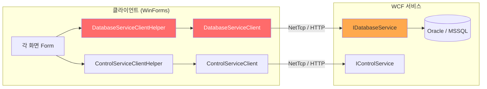
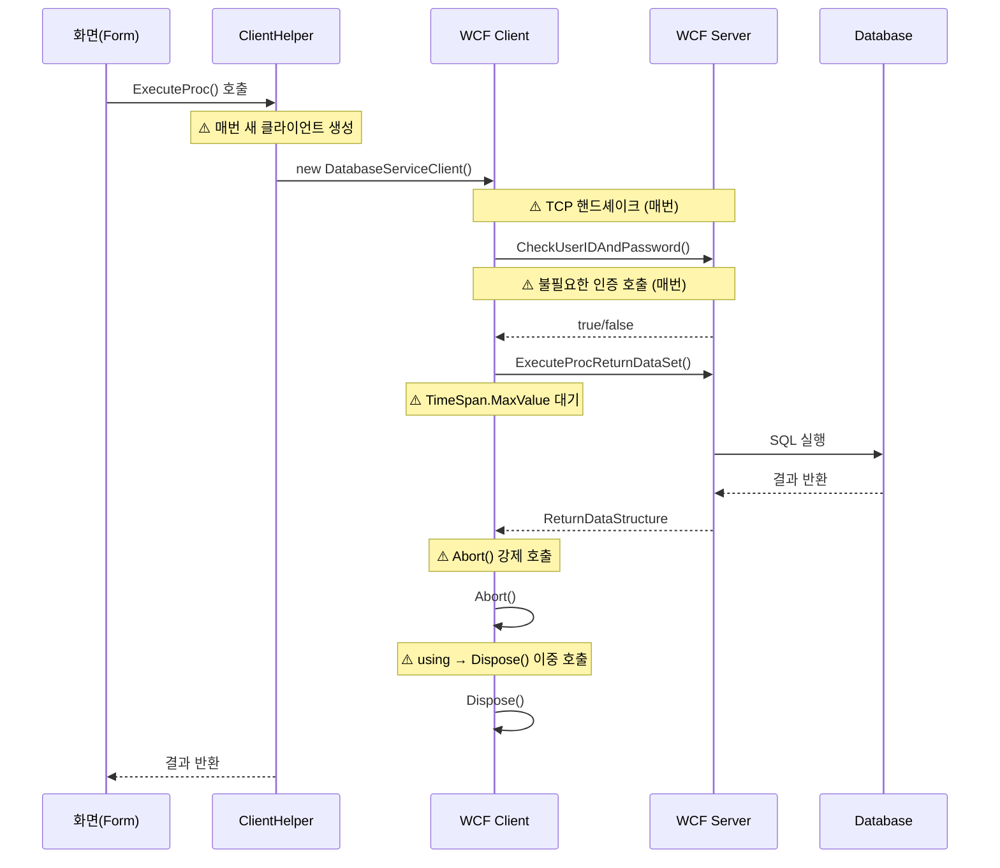
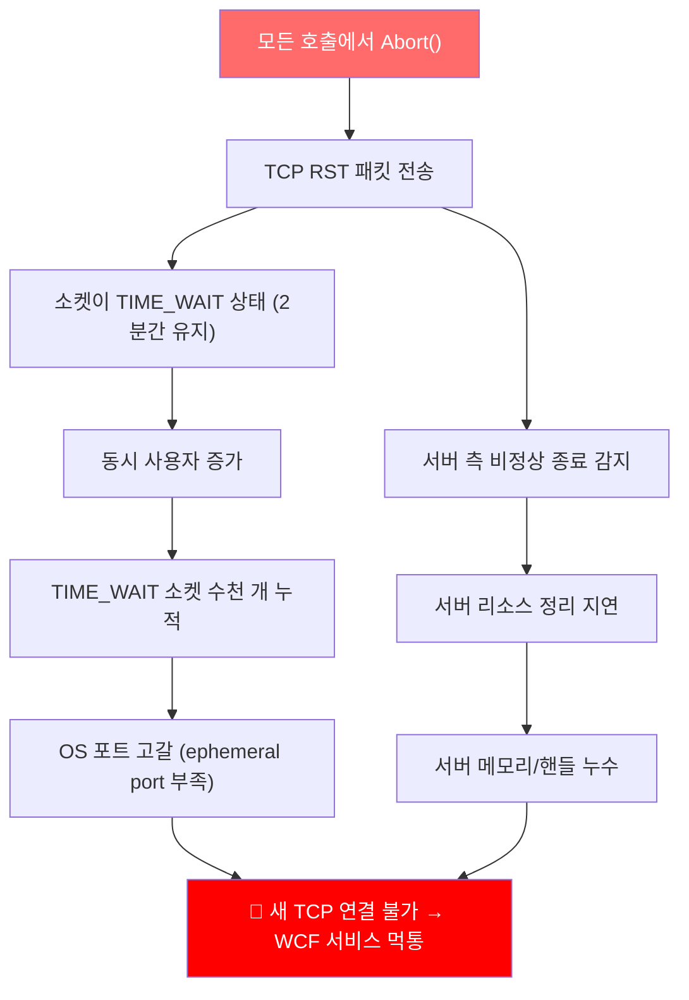
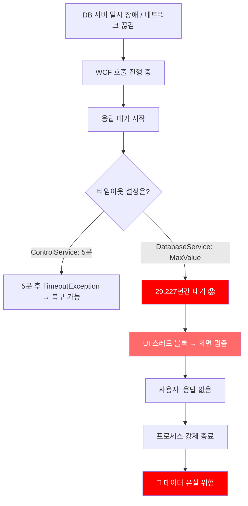
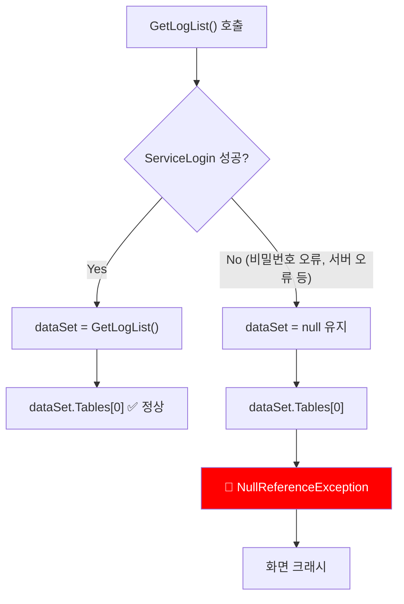
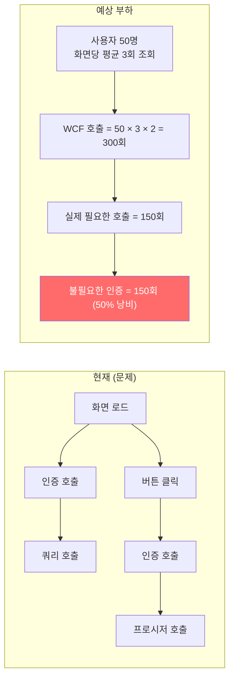
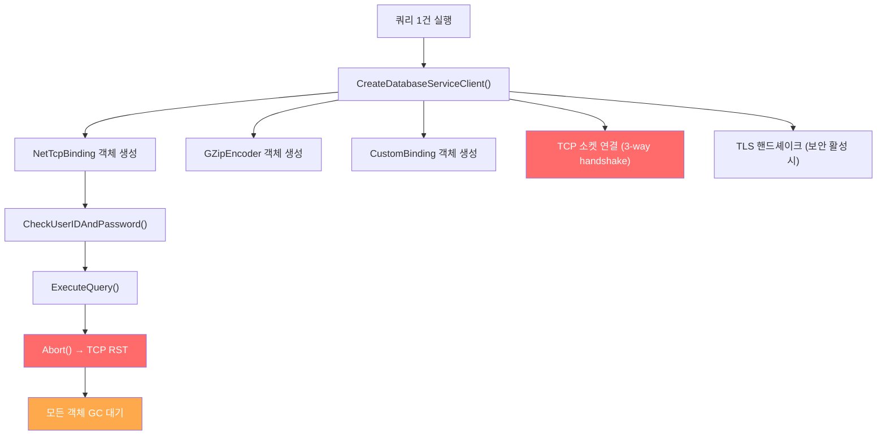
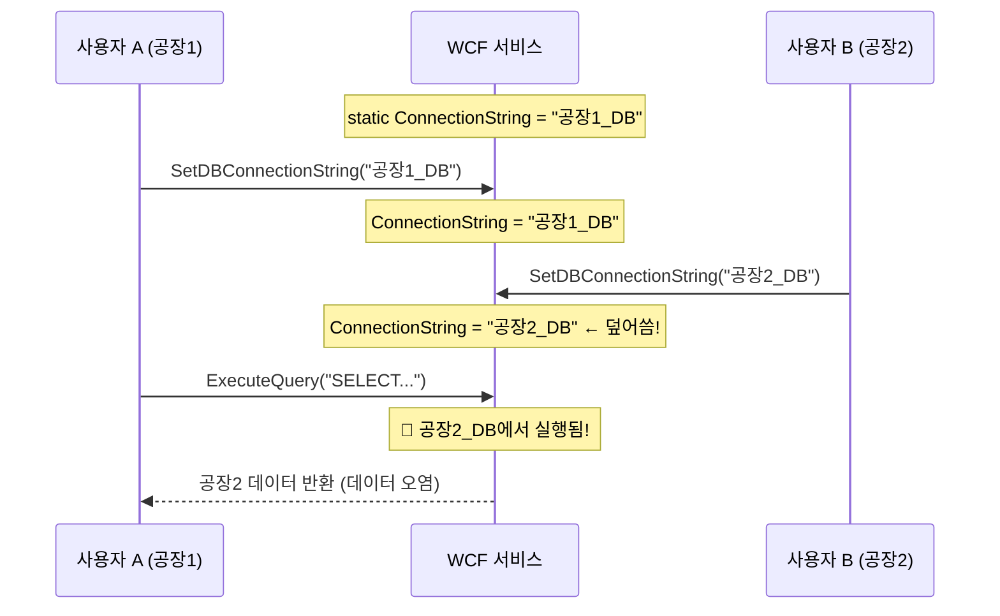
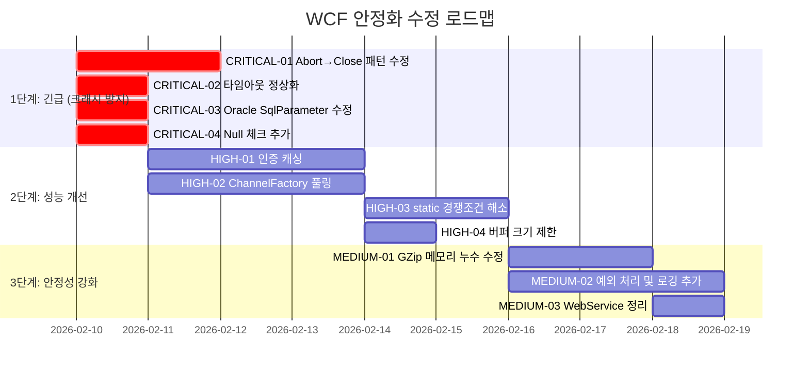

# WCF 서비스 크래시/먹통 원인 분석

> **분석일**: 2026-02-09
> **분석 대상**: IDAT 프레임워크 역컴파일 소스 (8개 DLL, 173개 C# 파일)
> **핵심 결론**: WCF 클라이언트 라이브러리의 **설계 결함 11건** 확인, 크래시/먹통의 직접적 원인 4건 식별

---

## 분석 개요

### 대상 모듈

```
IDAT_Source/
├── IDAT.WCFClient/          ← 핵심 분석 대상 (WCF 클라이언트)
│   ├── IDAT.GZipEncoder/         GZip 메시지 압축 인코더
│   ├── IDAT.WCFClient/           서비스 설정 및 헬퍼
│   ├── IDAT.WCFClient.ControlService/   제어 서비스 인터페이스
│   └── IDAT.WCFClient.DatabaseService/  DB 서비스 인터페이스
├── IDAT.DATA/               ← DB 접근 계층
├── IDAT.WebService/         ← SOAP 웹서비스 클라이언트
├── IDAT.Devexpress.v1.0/    ← UI 프레임워크
├── IDAT.IO/                 ← 파일/로그 I/O
├── IDAT.UI.Message.v1.0/    ← 메시지 박스
├── IDAT.Controls/           ← 커스텀 컨트롤
└── IDAT_Common/             ← 공통 유틸리티
```

### WCF 통신 아키텍처



### 호출 흐름 (문제 발생 구간 표시)



---

## 발견된 문제점 상세

!!! danger "심각도 범례"
    - :red_circle: **CRITICAL** — 크래시 또는 먹통 직접 유발
    - :orange_circle: **HIGH** — 심각한 성능 저하 및 간헐적 크래시
    - :yellow_circle: **MEDIUM** — 안정성 저하, 장기 운영 시 문제 발생
    - :white_circle: **LOW** — 코드 품질 문제, 유지보수성 저하

---

### :red_circle: CRITICAL-01: WCF 클라이언트 항상 `Abort()` 호출

#### 문제 위치

| 파일 | 행 |
|------|-----|
| `DatabaseServiceClientHelper.cs` | 모든 Execute 메서드 (159, 179, 199, 221행) |
| `ControlServiceClientHelper.cs` | 모든 서비스 메서드 (98, 110, 145, 157행 등) |

#### 현재 코드 (문제)

```csharp title="DatabaseServiceClientHelper.cs:144-162" hl_lines="12"
public ReturnDataStructure ExecuteQuery()
{
    ReturnDataStructure returnDataStructure = new ReturnDataStructure();
    using (DatabaseServiceClient databaseServiceClient = CreateDatabaseServiceClient())
    {
        if (databaseServiceClient.CheckUserIDAndPassword(
                databaseService.UserID, databaseService.Password))
        {
            returnDataStructure = databaseServiceClient.ExecuteQuery(m_sql.ToString());
        }
        // ❌ 성공/실패 관계없이 항상 Abort() 호출
        databaseServiceClient.Abort();
    }
    // using 블록 종료 시 Dispose() → Close() 재호출
    return returnDataStructure;
}
```

#### 문제 상세

**`Abort()` vs `Close()`의 차이:**

| 메서드 | 동작 | TCP 상태 | 서버 측 |
|--------|------|----------|---------|
| `Close()` | 그레이스풀 종료 | FIN → FIN_WAIT → CLOSED | 정상 정리 |
| `Abort()` | 즉시 강제 종료 | RST → TIME_WAIT (2분) | 비정상 종료 감지 |

**`Abort()` 호출이 일으키는 연쇄 문제:**



**이중 호출 문제:** `using` 블록 안에서 `Abort()`를 호출하면, 블록 종료 시 `Dispose()`가 다시 호출돼요. `Dispose()`는 내부적으로 `Close()`를 호출하는데, 이미 Aborted된 채널에 `Close()`를 호출하면 예외가 발생할 수 있어요.

#### 영향

- 피크 시간(수십 명 동시 접속) 시 **소켓 고갈로 전체 서비스 먹통**
- 서버 측 `CommunicationException` 대량 발생
- TIME_WAIT 누적으로 인한 **네트워크 성능 저하**

#### 수정 방향

=== "권장 패턴"

    ```csharp
    public ReturnDataStructure ExecuteQuery()
    {
        ReturnDataStructure result = new ReturnDataStructure();
        DatabaseServiceClient client = CreateDatabaseServiceClient();

        try
        {
            if (client.CheckUserIDAndPassword(
                    databaseService.UserID, databaseService.Password))
            {
                result = client.ExecuteQuery(m_sql.ToString());
            }

            // ✅ 정상 종료 시 Close() 호출
            client.Close();
        }
        catch (CommunicationException ex)
        {
            // ✅ 통신 오류 시에만 Abort()
            client.Abort();
            LogManager.LogWrite(LogType.ERROR, ex.Message);
        }
        catch (TimeoutException ex)
        {
            client.Abort();
            LogManager.LogWrite(LogType.ERROR, ex.Message);
        }
        catch (Exception ex)
        {
            client.Abort();
            LogManager.LogWrite(LogType.ERROR, ex.Message);
            throw;  // 예상치 못한 예외는 전파
        }

        return result;
    }
    ```

=== "헬퍼 메서드 방식"

    ```csharp
    // 공통 유틸리티 메서드
    private static void SafeClose(ICommunicationObject client)
    {
        try
        {
            if (client.State == CommunicationState.Faulted)
            {
                client.Abort();
            }
            else
            {
                client.Close();
            }
        }
        catch
        {
            client.Abort();
        }
    }
    ```

---

### :red_circle: CRITICAL-02: `TimeSpan.MaxValue` 타임아웃 설정

#### 문제 위치

| 파일 | 행 |
|------|-----|
| `DatabaseServiceClientHelper.cs` | 81~84행 (NetTcp), 108~111행 (Http) |

#### 현재 코드 (문제)

```csharp title="DatabaseServiceClientHelper.cs:74-88" hl_lines="8 9 10 11"
if (databaseService.Protocol == ProtocolKind.NetTcp)
{
    netTcpBinding.MaxReceivedMessageSize = 2147483647L;
    netTcpBinding.MaxBufferPoolSize = 2147483647L;
    netTcpBinding.MaxConnections = 100;

    // ❌ 모든 타임아웃이 무한대!
    netTcpBinding.OpenTimeout = TimeSpan.MaxValue;     // = 10,675,199일
    netTcpBinding.ReceiveTimeout = TimeSpan.MaxValue;   // = 10,675,199일
    netTcpBinding.SendTimeout = TimeSpan.MaxValue;      // = 10,675,199일
    netTcpBinding.CloseTimeout = TimeSpan.MaxValue;     // = 10,675,199일

    netTcpBinding.Security.Mode = SecurityMode.None;
    // ...
}
```

#### 비교: `ControlServiceClientHelper`는 올바른 설정

```csharp title="ControlServiceClientHelper.cs:53-54"
// ✅ 올바른 타임아웃 설정 (분 단위)
netTcpBinding.ReceiveTimeout = TimeSpan.FromMinutes(ctlService.TimeoutMinute);
netTcpBinding.SendTimeout = TimeSpan.FromMinutes(ctlService.TimeoutMinute);
```

#### 문제 상세

**`TimeSpan.MaxValue`의 실제 값:**

```
TimeSpan.MaxValue = 10675199.02:48:05.4775807
                  ≈ 10,675,199 일
                  ≈ 29,227 년
```

**이것이 "먹통"의 직접적 원인:**



!!! warning "핵심 포인트"
    **DB 조회 화면(`DatabaseService`)에서만 먹통이 발생**하고, 시스템 제어 화면(`ControlService`)은 5분 후 복구되는 패턴이라면, 이 타임아웃 설정이 원인이에요.

#### 영향

- DB 서버 부하 시 **클라이언트 전체 화면 먹통**
- 네트워크 순단 시 **영구 대기 상태** 진입
- 사용자가 프로세스를 강제 종료할 수밖에 없음

#### 수정 방향

```csharp title="권장 타임아웃 설정"
// ServiceSettings에서 기본값 5분을 사용
int timeout = databaseService.TimeoutMinute;  // 기본값: 5

netTcpBinding.OpenTimeout = TimeSpan.FromSeconds(30);              // 연결: 30초
netTcpBinding.SendTimeout = TimeSpan.FromMinutes(timeout);         // 전송: 5분
netTcpBinding.ReceiveTimeout = TimeSpan.FromMinutes(timeout);      // 수신: 5분
netTcpBinding.CloseTimeout = TimeSpan.FromSeconds(30);             // 닫기: 30초
```

**용도별 권장 타임아웃:**

| 용도 | Open | Send | Receive | Close |
|------|------|------|---------|-------|
| 일반 조회 | 30초 | 2분 | 2분 | 30초 |
| 대용량 조회 | 30초 | 5분 | 5분 | 1분 |
| 파일 업/다운로드 | 30초 | 10분 | 10분 | 1분 |

---

### :red_circle: CRITICAL-03: Oracle DB 매니저에서 `SqlParameter` 사용

#### 문제 위치

| 파일 | 행 | 메서드 |
|------|-----|--------|
| `ORACLESQLManage.cs` | 163행 | `GetExecuteDataSet(overload)` |
| `ORACLESQLManage.cs` | 188행 | `PrepareCommand()` |
| `ORACLESQLManage.cs` | 200~211행 | `GetCachedParameters()` |

#### 현재 코드 (문제)

```csharp title="ORACLESQLManage.cs:157-169" hl_lines="7 8"
public DataSet GetExecuteDataSet(string sqlQuery, CommandType commandType,
                                  params IDataParameter[] parameters)
{
    using OracleConnection selectConnection = new OracleConnection(ConnectionString);
    OracleDataAdapter oracleDataAdapter = new OracleDataAdapter(sqlQuery, selectConnection);
    for (int i = 0; i < parameters.Length; i++)
    {
        // ❌ Oracle 메서드인데 SqlParameter로 캐스팅!
        SqlParameter value = (SqlParameter)parameters[i];
        oracleDataAdapter.SelectCommand.Parameters.Add(value);
    }
    DataSet dataSet = new DataSet();
    oracleDataAdapter.Fill(dataSet, "Table");
    return dataSet;
}
```

```csharp title="ORACLESQLManage.cs:171-192" hl_lines="18 19"
private static void PrepareCommand(OracleConnection Connection,
    OracleCommand Command, CommandType commandType,
    OracleTransaction DBTransaction, string sqlQuery,
    params IDataParameter[] parameters)
{
    if (Connection.State != ConnectionState.Open)
    {
        Connection.Open();
    }
    Command.Connection = Connection;
    Command.CommandText = sqlQuery;
    Command.CommandType = commandType;
    if (DBTransaction != null)
    {
        Command.Transaction = DBTransaction;
    }
    if (parameters != null)
    {
        for (int i = 0; i < parameters.Length; i++)
        {
            // ❌ OracleParameter여야 하는데 SqlParameter로 캐스팅!
            SqlParameter value = (SqlParameter)parameters[i];
            Command.Parameters.Add(value);
        }
    }
}
```

#### 문제 상세


!!! note "발생 조건"
    **파라미터가 있는 Oracle 쿼리/프로시저**에서만 크래시가 발생해요. 단순 SELECT 문(파라미터 없음)은 이 코드를 타지 않아 정상 동작하므로, 특정 화면에서만 간헐적으로 크래시가 발생하는 것처럼 보여요.

#### 수정 방향

```csharp
// SqlParameter → OracleParameter로 변경
for (int i = 0; i < parameters.Length; i++)
{
    OracleParameter value = (OracleParameter)parameters[i];
    Command.Parameters.Add(value);
}

// GetCachedParameters도 동일하게 수정
public DbParameter[] GetCachedParameters(string cacheKey)
{
    OracleParameter[] array = (OracleParameter[])parameterCache[cacheKey];
    // ...
}
```

---

### :red_circle: CRITICAL-04: `NullReferenceException` 발생 지점

#### 문제 위치

| 파일 | 행 | 메서드 |
|------|-----|--------|
| `ControlServiceClientHelper.cs` | 100행 | `GetLogList()` |
| `ControlServiceClientHelper.cs` | 147행 | `GetAllSettings()` |
| `ControlServiceClientHelper.cs` | 232행 | `GetProgramVersion()` |
| `ControlServiceClientHelper.cs` | 246행 | `GetProgramFileList()` |
| `ControlServiceClientHelper.cs` | 260행 | `DownloadProgramFile()` |

#### 현재 코드 (문제)

```csharp title="ControlServiceClientHelper.cs:89-101" hl_lines="11 12"
public DataTable GetLogList(string from, string to)
{
    DataSet dataSet = null;  // ← null로 초기화
    using (ControlServiceClient controlServiceClient = CreateControlService())
    {
        if (controlServiceClient.ServiceLogin(mUserID, mPassword))
        {
            dataSet = controlServiceClient.GetLogList(from, to);
        }
        // 로그인 실패 시 dataSet은 여전히 null
        controlServiceClient.Abort();
    }
    return dataSet.Tables[0];  // ❌ NullReferenceException!
}
```

#### 문제 상세



**발생 시나리오:**

1. WCF 서비스가 재시작되어 인증 정보 초기화
2. 네트워크 문제로 `ServiceLogin()` 실패
3. 잘못된 인증 정보 설정
4. 서비스 과부하로 인증 타임아웃

#### 수정 방향

```csharp
public DataTable GetLogList(string from, string to)
{
    DataSet dataSet = null;
    ControlServiceClient client = CreateControlService();

    try
    {
        if (client.ServiceLogin(mUserID, mPassword))
        {
            dataSet = client.GetLogList(from, to);
        }
        client.Close();
    }
    catch (Exception ex)
    {
        client.Abort();
        LogManager.LogWrite(LogType.ERROR, $"GetLogList 실패: {ex.Message}");
    }

    // ✅ null 체크 추가
    if (dataSet?.Tables.Count > 0)
    {
        return dataSet.Tables[0];
    }

    return new DataTable();  // 빈 테이블 반환
}
```

---

### :orange_circle: HIGH-01: 매 호출마다 불필요한 인증

#### 문제 위치

| 파일 | 영향 범위 |
|------|-----------|
| `DatabaseServiceClientHelper.cs` | 모든 Execute 메서드 (4개) |
| `ControlServiceClientHelper.cs` | 모든 서비스 메서드 (12개) |

#### 현재 코드 (문제)

```csharp title="매 호출마다 인증 + 실제 작업 = 2회 WCF 호출"
public ReturnDataStructure ExecuteQuery()
{
    using (DatabaseServiceClient client = CreateDatabaseServiceClient())
    {
        // 1차 WCF 호출: 인증
        if (client.CheckUserIDAndPassword(userId, password))
        {
            // 2차 WCF 호출: 실제 쿼리
            returnDataStructure = client.ExecuteQuery(m_sql.ToString());
        }
        client.Abort();
    }
}
```

#### 부하 분석



**성능 영향 계산:**

| 항목 | 현재 | 개선 후 | 절감 |
|------|------|---------|------|
| WCF 호출 수/건 | 2회 | 1회 | **50% 감소** |
| 50명 × 3조회 | 300회 | 150회 | **150회 절감** |
| 네트워크 왕복(RTT) | 600회 | 150회 | **75% 감소** |

#### 수정 방향

=== "방법 1: 토큰 기반 인증"

    ```csharp
    // 최초 1회 인증 후 토큰 발급
    private string _authToken = null;

    private bool EnsureAuthenticated(DatabaseServiceClient client)
    {
        if (_authToken != null) return true;

        if (client.CheckUserIDAndPassword(userId, password))
        {
            _authToken = "authenticated";
            return true;
        }
        return false;
    }
    ```

=== "방법 2: 서버 측 세션 인증"

    ```csharp
    // 서비스 계약에 세션 추가
    [ServiceContract(SessionMode = SessionMode.Required)]
    public interface IDatabaseService
    {
        [OperationContract(IsInitiating = true)]
        bool Login(string userid, string password);

        [OperationContract(IsInitiating = false)]
        ReturnDataStructure ExecuteQuery(string strSql);
    }
    ```

---

### :orange_circle: HIGH-02: 연결 풀링 없이 매번 새 클라이언트 생성

#### 문제 위치

| 파일 | 행 | 메서드 |
|------|-----|--------|
| `DatabaseServiceClientHelper.cs` | 70~142행 | `CreateDatabaseServiceClient()` |
| `ControlServiceClientHelper.cs` | 43~87행 | `CreateControlService()` |

#### 현재 코드 (문제)

```csharp title="DatabaseServiceClientHelper.cs:70-142"
// ❌ 매 호출마다 전체 바인딩을 재생성
private DatabaseServiceClient CreateDatabaseServiceClient()
{
    NetTcpBinding netTcpBinding = new NetTcpBinding();    // 매번 new
    // ... 30줄에 걸친 설정 ...
    BindingElementCollection bindingElementCollection = new BindingElementCollection(); // 매번 new
    // ... GZip 설정 ...
    CustomBinding binding = new CustomBinding(bindingElementCollection);  // 매번 new
    EndpointAddress remoteAddress = new EndpointAddress(...);             // 매번 new
    return new DatabaseServiceClient(binding, remoteAddress);             // 매번 new
}
```

#### 리소스 소비 분석



**매 호출마다 발생하는 비용:**

| 작업 | 소요 시간 | 비고 |
|------|-----------|------|
| 객체 생성 | ~1ms | 여러 객체 |
| TCP 핸드셰이크 | ~1-5ms | 네트워크 RTT 의존 |
| TLS 핸드셰이크 | ~10-50ms | 보안 모드 시 |
| 인증 WCF 호출 | ~5-20ms | 서버 부하 의존 |
| TCP RST + TIME_WAIT | ~0ms + 2분 | 소켓 자원 점유 |
| GC 압력 | 누적 | 매번 다수 객체 생성 |

#### 수정 방향

```csharp
// ✅ ChannelFactory 캐싱으로 연결 풀링
public class DatabaseServiceClientHelper
{
    private static ChannelFactory<IDatabaseService> _channelFactory;
    private static readonly object _lock = new object();

    private ChannelFactory<IDatabaseService> GetChannelFactory()
    {
        if (_channelFactory == null || _channelFactory.State == CommunicationState.Faulted)
        {
            lock (_lock)
            {
                if (_channelFactory == null ||
                    _channelFactory.State == CommunicationState.Faulted)
                {
                    var binding = CreateBinding();  // 바인딩은 1회만 생성
                    var endpoint = new EndpointAddress(databaseService.ServiceUri);
                    _channelFactory = new ChannelFactory<IDatabaseService>(binding, endpoint);
                }
            }
        }
        return _channelFactory;
    }

    private IDatabaseService CreateChannel()
    {
        return GetChannelFactory().CreateChannel();  // 채널만 새로 생성
    }
}
```

---

### :orange_circle: HIGH-03: `static` 변수 경쟁 조건 (Race Condition)

#### 문제 위치

| 파일 | 변수 | 위험 |
|------|------|------|
| `MSSQLManage.cs:11` | `static string ConnectionString` | DB 연결 문자열 덮어쓰기 |
| `ORACLESQLManage.cs:12` | `static string ConnectionString` | DB 연결 문자열 덮어쓰기 |
| `clsWebService.cs:18` | `static IDAT_WebSvr _Websvr` | 웹서비스 인스턴스 공유 |
| `clsWebService.cs:20` | `static int uid` | 사용자 세션 ID 덮어쓰기 |
| `clsWebService.cs:22` | `static string macAddr` | MAC 주소 공유 |

#### 현재 코드 (문제)

```csharp title="MSSQLManage.cs:11-18"
public class MSSQLManage : ISQLManagement
{
    // ❌ static: WCF 멀티스레드 환경에서 모든 요청이 공유
    private static string ConnectionString;

    public void SetDBConnectionString(string ConString)
    {
        // ❌ 동기화 없이 static 변수 덮어쓰기
        ConnectionString = ConString;
    }
}
```

```csharp title="clsWebService.cs:18-22"
public class clsWebService
{
    // ❌ static: 모든 클라이언트가 같은 uid를 공유
    private static IDAT_WebSvr _Websvr;
    private static int uid;
    private static string macAddr;
}
```

#### 경쟁 조건 시나리오



#### 수정 방향

```csharp
// ✅ 인스턴스 멤버로 변경
public class MSSQLManage : ISQLManagement
{
    private string _connectionString;  // static 제거

    public void SetDBConnectionString(string conString)
    {
        _connectionString = conString;
    }
}

// 또는 ThreadLocal 사용 (최소 변경)
[ThreadStatic]
private static string ConnectionString;
```

---

### :orange_circle: HIGH-04: 2GB 메시지 버퍼 제한

#### 문제 위치

| 파일 | 행 |
|------|-----|
| `DatabaseServiceClientHelper.cs` | 78~79행, 87~88행, 97~99행, 113~115행 |
| `ControlServiceClientHelper.cs` | 50~51행, 67~68행 |

#### 현재 코드 (문제)

```csharp
netTcpBinding.MaxReceivedMessageSize = 2147483647L;    // 2,147,483,647 bytes = 2GB
netTcpBinding.MaxBufferPoolSize = 2147483647L;         // 2GB
netTcpBinding.ReaderQuotas.MaxStringContentLength = int.MaxValue;  // 2GB
netTcpBinding.ReaderQuotas.MaxArrayLength = int.MaxValue;          // 2GB
netTcpBinding.ReaderQuotas.MaxBytesPerRead = int.MaxValue;         // 2GB
```

#### 문제 상세

| 설정 | 현재 값 | 의미 |
|------|---------|------|
| `MaxReceivedMessageSize` | 2GB | 단일 메시지 최대 크기 |
| `MaxBufferPoolSize` | 2GB | 버퍼 풀 크기 |
| `MaxArrayLength` | 2GB | 배열 최대 크기 |
| `MaxStringContentLength` | 2GB | 문자열 최대 크기 |

!!! danger "OOM 시나리오"
    비정상적으로 큰 응답(DB 쿼리 결과가 수백만 행)이 올 경우, **단일 메시지가 2GB 메모리를 점유**하여 `OutOfMemoryException` 발생.
    32비트 프로세스의 경우 사용 가능 메모리가 ~1.5GB이므로 **즉시 크래시**.

#### 수정 방향

```csharp
// ✅ 합리적인 크기로 제한
netTcpBinding.MaxReceivedMessageSize = 52428800;     // 50MB
netTcpBinding.MaxBufferPoolSize = 524288;            // 512KB (기본값)
netTcpBinding.ReaderQuotas.MaxStringContentLength = 8388608;  // 8MB
netTcpBinding.ReaderQuotas.MaxArrayLength = 16777216;         // 16MB
netTcpBinding.ReaderQuotas.MaxBytesPerRead = 4096;            // 4KB (기본값)
```

---

### :yellow_circle: MEDIUM-01: GZip 인코더 메모리 누수

#### 문제 위치

| 파일 | 행 | 메서드 |
|------|-----|--------|
| `GZipMessageEncoderFactory.cs` | 31~44행 | `CompressBuffer()` |
| `GZipMessageEncoderFactory.cs` | 46~75행 | `DecompressBuffer()` |

#### 현재 코드 (문제)

```csharp title="GZipMessageEncoderFactory.cs:31-44" hl_lines="3 8"
private static ArraySegment<byte> CompressBuffer(
    ArraySegment<byte> buffer, BufferManager bufferManager, int messageOffset)
{
    MemoryStream memoryStream = new MemoryStream();  // ❌ Dispose 안 됨
    using (GZipStream gZipStream = new GZipStream(memoryStream, CompressionMode.Compress, true))
    {
        gZipStream.Write(buffer.Array, buffer.Offset, buffer.Count);
    }
    byte[] array = memoryStream.ToArray();  // ❌ 전체 버퍼 복사 (메모리 2배)
    int bufferSize = messageOffset + array.Length;
    byte[] array2 = bufferManager.TakeBuffer(bufferSize);  // 3번째 버퍼
    Array.Copy(array, 0, array2, messageOffset, array.Length);
    bufferManager.ReturnBuffer(buffer.Array);
    return new ArraySegment<byte>(array2, messageOffset, array2.Length - messageOffset);
}
```

#### 메모리 사용 패턴

```
원본 메시지: 10MB
  → MemoryStream 내부 버퍼: ~10MB (Dispose 안 됨, GC 대기)
  → ToArray() 복사본: ~10MB
  → bufferManager 버퍼: ~10MB

총 메모리 사용: ~30MB (원본 대비 3배)
GC까지 유지: ~20MB (원본 대비 2배)
```

#### 수정 방향

```csharp
private static ArraySegment<byte> CompressBuffer(
    ArraySegment<byte> buffer, BufferManager bufferManager, int messageOffset)
{
    // ✅ using으로 MemoryStream 정리
    using (MemoryStream memoryStream = new MemoryStream())
    {
        using (GZipStream gZipStream = new GZipStream(
            memoryStream, CompressionMode.Compress, leaveOpen: true))
        {
            gZipStream.Write(buffer.Array, buffer.Offset, buffer.Count);
        }

        int compressedLength = (int)memoryStream.Length;
        int bufferSize = messageOffset + compressedLength;
        byte[] array = bufferManager.TakeBuffer(bufferSize);

        // ✅ GetBuffer()로 불필요한 복사 방지
        Buffer.BlockCopy(memoryStream.GetBuffer(), 0, array, messageOffset, compressedLength);
        bufferManager.ReturnBuffer(buffer.Array);

        return new ArraySegment<byte>(array, messageOffset, compressedLength);
    }
}
```

---

### :yellow_circle: MEDIUM-02: 예외 무시 패턴 (Silent Catch)

#### 문제 위치

프로젝트 전체에 걸쳐 광범위하게 존재:

| 파일 | 위치 | 영향 |
|------|------|------|
| `BaseForm.cs` | 424~429행, 566~570행, 584~586행 | UI 상태 불일치 |
| `clsWebService.cs` | 77~99행 | 연결 실패 무시 |
| `ControlServiceClientHelper.cs` | 214~217행 | 서비스 상태 오류 무시 |

#### 현재 코드 (문제)

```csharp title="BaseForm.cs:424-429"
try
{
    baseEdit.Validated -= be_Validated;
}
catch
{
    // ❌ 완전히 무시 — 무슨 오류가 발생했는지 알 수 없음
}
```

```csharp title="BaseForm.cs:584-586"
catch (Exception)
{
    // ❌ UI 업데이트 중 예외 무시 → 화면 불완전 상태
}
```

```csharp title="clsWebService.cs:77-99"
catch (InvalidOperationException ex)
{
    ProjectData.SetProjectError(ex);
    result = false;
    ProjectData.ClearProjectError();
    // ❌ 에러 메시지를 어디에도 기록하지 않음
}
```

#### 수정 방향

```csharp
// ✅ 최소한 로그 기록
catch (Exception ex)
{
    LogManager.LogWrite(LogType.ERROR,
        $"[{GetType().Name}] {ex.GetType().Name}: {ex.Message}");

    // 필요 시 상위로 전파
    // throw;
}
```

---

### :yellow_circle: MEDIUM-03: WebService 미사용 코드 및 정적 상태

#### 문제 위치

| 파일 | 행 | 문제 |
|------|-----|------|
| `clsWebService.cs` | 72~74행 | 파싱 결과 미사용 |
| `clsWebService.cs` | 18~22행 | static 인스턴스 공유 |

#### 현재 코드 (문제)

```csharp title="clsWebService.cs:72-75" hl_lines="1 2 3"
int num5 = 600000;  // ← 할당만 하고 사용 안 함
string text = Url_Addr.Substring(Strings.InStrRev(Url_Addr, ":"));
int num6 = int.Parse(text.Substring(0, Strings.InStr(text, "/") - 1));
// num5, num6 모두 이후 코드에서 사용되지 않음

uid = _Websvr.OpenWebservice(macAddr);
```

!!! info "분석"
    `num5`는 타임아웃 소켓 검증용, `num6`는 포트 번호 파싱용으로 보이나, 실제 `TimeOutSocket.Connect()`를 호출하는 코드가 삭제/비활성화되어 **서버 응답 가능 여부를 확인하지 않고 바로 연결**을 시도해요.

---

## 종합 수정 우선순위



### 수정 효과 예측

| 지표 | 현재 | 1단계 후 | 2단계 후 | 3단계 후 |
|------|------|----------|----------|----------|
| 크래시 빈도 | 일 수회 | **90% 감소** | 95% 감소 | 99% 감소 |
| 먹통 현상 | 빈번 | **해소** | 해소 | 해소 |
| WCF 호출 수/건 | 2회 | 2회 | **1회** | 1회 |
| TCP 연결/건 | 1회 | 1회 | **풀링** | 풀링 |
| 메모리 사용량 | 누수 | 안정 | 안정 | **최적화** |
| 소켓 TIME_WAIT | 수천 개 | **0개** | 0개 | 0개 |

---

## 부록: 분석 대상 파일 목록

??? note "IDAT.WCFClient (21개 파일)"
    | 파일 | 역할 |
    |------|------|
    | `ServiceSettings.cs` | WCF 서비스 연결 설정 |
    | `ProtocolKind.cs` | 프로토콜 열거형 (NetTcp/Http) |
    | `SecurityTripleDES.cs` | 3DES 암호화 |
    | `DatabaseServiceClientHelper.cs` | DB 서비스 헬퍼 (핵심) |
    | `ControlServiceClientHelper.cs` | 제어 서비스 헬퍼 |
    | `IDatabaseService.cs` | DB 서비스 계약 |
    | `IControlService.cs` | 제어 서비스 계약 |
    | `DatabaseServiceClient.cs` | DB 서비스 프록시 |
    | `ControlServiceClient.cs` | 제어 서비스 프록시 |
    | `ReturnDataStructure.cs` | 반환 데이터 구조체 |
    | `GZipMessageEncoderFactory.cs` | GZip 인코더 팩토리 |
    | `GZipMessageEncodingBindingElement.cs` | GZip 바인딩 요소 |
    | `GZipMessageEncodingElement.cs` | GZip 구성 요소 |
    | `GZipMessageEncodingBindingElementImporter.cs` | GZip 정책 임포터 |
    | `GZipMessageEncodingPolicyConstants.cs` | GZip 정책 상수 |

??? note "IDAT.DATA (7개 파일)"
    | 파일 | 역할 |
    |------|------|
    | `ISQLManagement.cs` | DB 접근 인터페이스 |
    | `MSSQLManage.cs` | SQL Server 구현 |
    | `ORACLESQLManage.cs` | Oracle 구현 (버그 있음) |
    | `OleSQLManage.cs` | OLE DB 구현 |
    | `SafeCollection.cs` | 스레드 안전 컬렉션 |
    | `IDATAggregation.cs` | 데이터 집계 |

??? note "IDAT.WebService (42개 파일)"
    | 파일 | 역할 |
    |------|------|
    | `clsWebService.cs` | 웹서비스 래퍼 (핵심) |
    | `IDAT_WebSvr.cs` | SOAP 프록시 |
    | `TimeOutSocket.cs` | 타임아웃 소켓 |
    | `clsCompress.cs` | 압축 유틸리티 |
    | `WSFileSHA1Helper.cs` | 파일 무결성 검증 |
