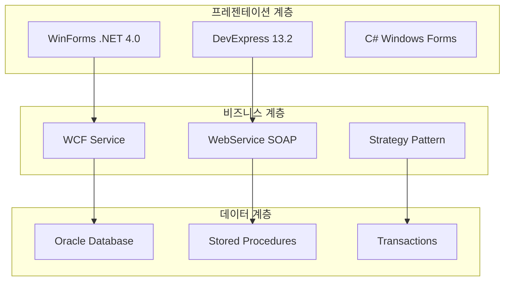

# HNSMES UI 개발자 문서 중앙 저장소

<p align="center">
  
</p>

<p align="center">
  <a href="https://dotnet.microsoft.com/download/dotnet-framework/net40">
    
  </a>
  <a href="https://www.devexpress.com/">
    
  </a>
  <a href="https://www.oracle.com/database/">
    
  </a>
  
</p>

---

## 🎯 시작하기

HAENGSUNG HNSMES UI 시스템의 개발자를 위한 종합 문서 중앙 저장소입니다. 이 문서는 시스템 아키텍처부터 상세 구현까지 모든 정보를 제공합니다.

<div class="grid cards" markdown>

-   :material-rocket-launch:{ .lg .middle } __빠른 시작__

    ---

    5분 안에 개발 환경을 설정하고 첫 번째 화면을 실행하세요.

    [:octicons-arrow-right-24: 시작하기](start/quickstart.md)

-   :material-book-open-variant:{ .lg .middle } __개발 가이드__

    ---

    코딩 표준, 아키텍처 패턴, 베스트 프랙티스를 확인하세요.

    [:octicons-arrow-right-24: 가이드 보기](guide/project-structure.md)

-   :material-database:{ .lg .middle } __데이터베이스__

    ---

    125개 테이블, 31개 패키지의 상세 명세서를 확인하세요.

    [:octicons-arrow-right-24: DB 문서](database/overview.md)

-   :material-monitor-dashboard:{ .lg .middle } __화면 명세__

    ---

    189개 화면의 상세 기능 명세서를 확인하세요.

    [:octicons-arrow-right-24: 화면 보기](screens/overview.md)

</div>

---

## 🏗️ 시스템 개요

### 기술 스택



### 주요 특징

| 특징 | 설명 |
|------|------|
| **3계층 아키텍처** | Presentation → Business → Data Access 계층 분리 |
| **전략 패턴** | WCF/WebService 전환 가능한 유연한 통신 구조 |
| **ORM 없음** | 순수 SQL + Stored Procedure 기반 데이터 접근 |
| **MPL 라이선스** | DevExpress 13.2 + Oracle 11g 기반 |
| **레거시 지원** | 기존 WebService와의 하위호환성 유지 |

---

## 📊 프로젝트 통계

<div class="grid" markdown>

=== "코드 통계"

    | 항목 | 수량 |
    |------|------|
    | 총 파일 수 | 448개 |
    | C# 파일 | 312개 |
    | Designer 파일 | 136개 |
    | 화면 수 | 189개 |
    | 코드 라인 수 | 150,000+ |

=== "데이터베이스"

    | 항목 | 수량 |
    |------|------|
    | 테이블 | 125개 |
    | 패키지 | 31개 |
    | 프로시저 | 200+ 개 |
    | 뷰 | 45개 |

=== "모듈 구성"

    | 모듈 | 화면 수 |
    |------|---------|
    | 기준정보 | 42개 |
    | 생산관리 | 38개 |
    | 자재관리 | 31개 |
    | 품질관리 | 28개 |
    | 설비관리 | 22개 |

</div>

---

## 🧭 문서 구조

```
📁 docs/
├── 📄 시작하기
│   ├── 시스템 소개
│   ├── 빠른 시작 가이드
│   └── 개발 환경 설정
│
├── 📄 개발 가이드
│   ├── 프로젝트 구조
│   ├── 코딩 표준
│   ├── 데이터베이스 접근
│   └── UI 컴포넌트 사용법
│
├── 📄 데이터베이스
│   ├── 개요
│   ├── 테이블 명세
│   ├── 프로시저 명세
│   └── ERD 다이어그램
│
├── 📄 화면 명세
│   ├── 시스템 관리
│   ├── 기본정보
│   ├── 마스터 관리
│   ├── 생산계획
│   ├── 생산실적
│   ├── 자재관리
│   ├── 품질관리
│   ├── 설비관리
│   └── 모니터링
│
├── 📄 API 문서
│   ├── WCF 서비스
│   ├── WebService
│   └── 공통 함수
│
└── 📄 운영/개선
    ├── 배포 가이드
    ├── 문제 해결
    └── 개선 로드맵
```

---

## 💡 최근 업데이트

### v2.0.0 (2025-02-07)

- ✨ **새로운 기능**: 189개 화면 명세서 추가
- 📚 **문서화**: 전체 개발자 가이드 작성
- 🔧 **개선사항**: 코드 품질 경고 수정 (IDE0044, IDE0059, IDE0060 등)
- 🐛 **버그 수정**: CS1501 메서드 오버로드 오류 수정
- 🔒 **보안**: CS0618 obsolete 속성 업데이트

---

## 🤝 기여하기

이 문서에 기여하려면:

1. Fork the repository
2. Create a feature branch
3. Make your changes
4. Submit a pull request

---

## 📞 지원

문제가 있으시면 아래 채널을 통해 문의해 주세요:

- 📧 이메일: dev@haengsung.co.kr
- 💬 나이스: 개발팀
- 📞 전화: 031-XXX-XXXX

---

<p align="center">
  <small>Copyright &copy; 2025 HAENGSUNG. All rights reserved.</small>
</p>
