# 백업 및 복구

HNSMES 시스템의 데이터 백업 및 복구 절차를 안내합니다.

## 백업 정책

### 백업 유형

| 유형 | 주기 | 보관기간 | 설명 |
|------|------|----------|------|
| Full Backup | 매일 02:00 | 30일 | 전체 데이터베이스 백업 |
| Incremental | 4시간마다 | 7일 | 변경분 백업 |
| Archive Log | 실시간 | 14일 | 로그 백업 |
| Config Backup | 주 1회 | 90일 | 설정 파일 백업 |

### 백업 스케줄

```mermaid
gantt
    title 백업 스케줄
    dateFormat HH:mm
    axisFormat %H:%M
    
    section 일간백업
    Full Backup    :02:00, 30m
    
    section 증분백업
    Inc 1    :06:00, 10m
    Inc 2    :10:00, 10m
    Inc 3    :14:00, 10m
    Inc 4    :18:00, 10m
    Inc 5    :22:00, 10m
```



---

## 백업 절차

### 자동 백업 설정

Oracle RMAN을 이용한 자동 백업 스크립트:

```bash
#!/bin/bash
# backup_full.sh

export ORACLE_SID=HNSMES
export NLS_LANG=KOREAN_KOREA.AL32UTF8

rman target / << EOF
RUN {
    ALLOCATE CHANNEL ch1 DEVICE TYPE DISK;
    BACKUP DATABASE FORMAT '/backup/full/%U';
    BACKUP CURRENT CONTROLFILE;
    BACKUP SPFILE;
    RELEASE CHANNEL ch1;
}
DELETE NOPROMPT OBSOLETE RECOVERY WINDOW OF 30 DAYS;
EXIT;
EOF
```

### 수동 백업 실행

1. **DBA 계정으로 접속**
   ```sql
   sqlplus / as sysdba
   ```

2. **RMAN 실행**
   ```bash
   rman target /
   ```

3. **Full 백업 실행**
   ```sql
   RMAN> BACKUP DATABASE FORMAT '/backup/manual/full_%U';
   RMAN> BACKUP CURRENT CONTROLFILE;
   RMAN> BACKUP SPFILE;
   ```

4. **백업 확인**
   ```sql
   RMAN> LIST BACKUP;
   ```

---

## 백업 검증

### 백업 파일 검증

```sql
RMAN> VALIDATE BACKUPSET <백업셋번호>;
RMAN> RESTORE DATABASE VALIDATE;
RMAN> RESTORE DATABASE PREVIEW;
```

### 주기적 복구 테스트

| 주기 | 테스트 항목 | 담당자 |
|------|-------------|--------|
| 매주 | 백업 파일 존재 확인 | DBA |
| 매월 | 테스트 서버 복구 | DBA |
| 반기 | DR 시뮬레이션 | DR팀 |

---

## 복구 절차

### 복구 시나리오


### 전체 데이터베이스 복구

#### 1. 복구 준비

```bash
# 1. Oracle 인스턴스 중지
sqlplus / as sysdba
SQL> SHUTDOWN IMMEDIATE;

# 2. 백업 파일 확인
ls -la /backup/full/

# 3. RMAN 접속
rman target /
```

#### 2. 복구 실행

```sql
-- 데이터베이스 복구
RMAN> STARTUP MOUNT;
RMAN> RESTORE DATABASE;
RMAN> RECOVER DATABASE;
RMAN> ALTER DATABASE OPEN;
```

#### 3. 복구 확인

```sql
-- 데이터베이스 상태 확인
SQL> SELECT STATUS FROM V$INSTANCE;

-- 주요 테이블 확인
SQL> SELECT COUNT(*) FROM TM_USER;
SQL> SELECT COUNT(*) FROM TM_ITEMS;
```

---

### 특정 테이블 복구

#### Flashback 사용 (24시간 이내)

```sql
-- 테이블을 특정 시점으로 복구
FLASHBACK TABLE TM_USER TO TIMESTAMP 
    TO_TIMESTAMP('2024-01-15 10:00:00', 'YYYY-MM-DD HH24:MI:SS');
```

#### RMAN을 이용한 복구

```sql
-- 보조 인스턴스에서 복구 후 덤프/임포트
RMAN> RUN {
    SET NEWNAME FOR TABLESPACE USERS TO '/data/users01.dbf';
    RESTORE TABLESPACE USERS;
    RECOVER TABLESPACE USERS;
}
```

---

### Point-in-Time 복구

특정 시점으로 데이터베이스 복구:

```sql
-- 1. Mount 상태로 시작
RMAN> STARTUP MOUNT;

-- 2. 특정 시점으로 복구
RMAN> RUN {
    SET UNTIL TIME "TO_DATE('2024-01-15 10:00:00','YYYY-MM-DD HH24:MI:SS')";
    RESTORE DATABASE;
    RECOVER DATABASE;
    ALTER DATABASE OPEN RESETLOGS;
}
```

---

## 재해 복구 (DR)

### DR 사이트 구성

| 항목 | 주사이트 | DR사이트 |
|------|----------|----------|
| 위치 | 본사 | 재해복구센터 |
| DB | Primary | Standby |
| 동기화 | - | Data Guard |
| RTO | - | 4시간 |
| RPO | - | 1시간 |

### Data Guard 구성 확인

```sql
-- Primary DB 상태 확인
SELECT PROTECTION_MODE, PROTECTION_LEVEL, DATABASE_ROLE 
FROM V$DATABASE;

-- Standby 적용 상태 확인
SELECT SEQUENCE#, APPLIED 
FROM V$ARCHIVED_LOG 
ORDER BY SEQUENCE#;
```

### DR 전환 절차

```sql
-- 1. Failover 실행 (Primary 사용 불가 시)
SQL> ALTER DATABASE FAILOVER TO 'DR_STANDBY';

-- 2. Standby를 Primary로 전환
SQL> ALTER DATABASE COMMIT TO SWITCHOVER TO PRIMARY;

-- 3. 새 Primary 오픈
SQL> ALTER DATABASE OPEN;
```

---

## 백업 모니터링

### 일일 점검 항목

| 시간 | 점검항목 | 방법 |
|------|----------|------|
| 09:00 | 전일 백업 성공 여부 | RMAN LIST |
| 09:30 | 백업 파일 크기 확인 | OS 명령어 |
| 10:00 | 백업 로그 오류 확인 | 로그 파일 검토 |

### 모니터링 스크립트

```sql
-- 최근 백업 상태 확인
SELECT 
    START_TIME,
    END_TIME,
    STATUS,
    INPUT_BYTES/1024/1024/1024 AS INPUT_GB,
    OUTPUT_BYTES/1024/1024/1024 AS OUTPUT_GB
FROM V$RMAN_BACKUP_JOB_DETAILS
WHERE START_TIME > SYSDATE - 7
ORDER BY START_TIME DESC;
```

---

## 백업 보관 관리

### 보관 정책

| 백업유형 | 보관기간 | 삭제주기 |
|----------|----------|----------|
| 일일 Full | 30일 | 매일 |
| 주간 Full | 12주 | 매주 월요일 |
| 월간 Full | 12개월 | 매월 1일 |
| 연간 Full | 7년 | 매년 1월 1일 |

### 오래된 백업 삭제

```sql
-- 30일 이상 된 백업 삭제
RMAN> DELETE NOPROMPT OBSOLETE RECOVERY WINDOW OF 30 DAYS;

-- 특정 날짜 이전 백업 삭제
RMAN> DELETE BACKUP COMPLETED BEFORE 'SYSDATE-30';
```

---

## 복구 체크리스트

### 복구 전 확인사항

- [ ] 복구 필요 범위 확인 (전체/부분)
- [ ] 복구 목표 시점 확인
- [ ] 사용할 백업셋 확인
- [ ] 복구 공간 확인
- [ ] 사용자 알림 (서비스 중단)

### 복구 후 확인사항

- [ ] DB 오픈 상태 확인
- [ ] 주요 테이블 데이터 확인
- [ ] 어플리케이션 연결 테스트
- [ ] 로그 파일 오류 확인
- [ ] 사용자 접속 허용

!!! danger "주의"
    복구 작업은 반드시 DBA와 
    시스템 담당자가 함께 수행해야 합니다.
    복구 전 현재 상태를 백업해 두세요.
