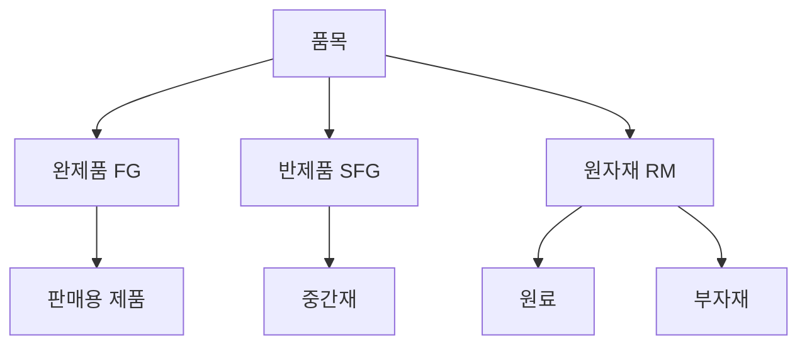
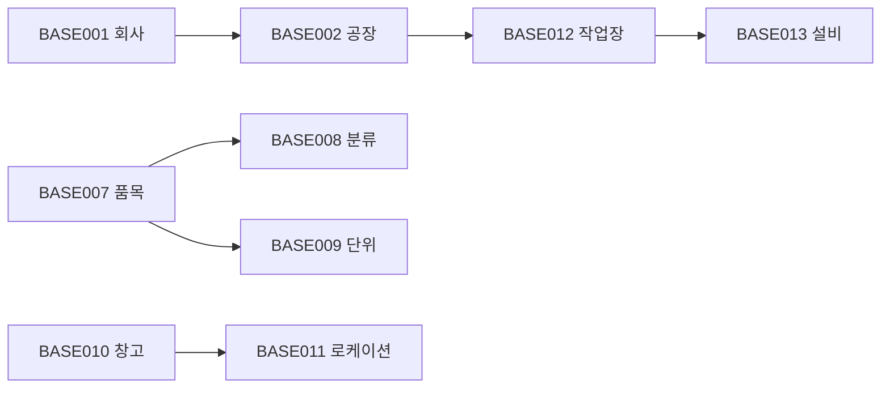

# 기준정보 관리 (BASE Module)

기준정보 관리 모듈의 화면 목록과 기능 설명입니다.

## 모듈 개요

기준정보 관리 모듈은 MES 시스템 운영에 필요한 기초 마스터 데이터를 관리하는 기능을 제공합니다.

| 항목 | 내용 |
|------|------|
| 모듈코드 | BASE |
| 화면수 | 18개 |
| 주요기능 | 공장, 품목, 공정 등 기초정보 관리 |

---

## 화면 목록

| 화면ID | 화면명 | 설명 |
|--------|--------|------|
| BASE001 | 회사정보관리 | 회사 기본 정보 등록 및 수정 |
| BASE002 | 공장정보관리 | 공장(Plant) 정보 관리 |
| BASE003 | 부서정보관리 | 부서/조직 정보 관리 |
| BASE004 | 사용자관리 | 시스템 사용자 계정 관리 |
| BASE005 | 권한관리 | 메뉴 및 기능 권한 설정 |
| BASE006 | 공통코드관리 | 시스템 공통 코드 관리 |
| BASE007 | 품목정보관리 | 제품/자재 마스터 관리 |
| BASE008 | 품목분류관리 | 품목 분류 체계 관리 |
| BASE009 | 단위환산관리 | 품목별 단위 변환 관리 |
| BASE010 | 창고정보관리 | 창고/보관장소 관리 |
| BASE011 | 로케이션관리 | 세부 보관 위치 관리 |
| BASE012 | 작업장관리 | 생산 작업장 정보 관리 |
| BASE013 | 설비정보관리 | 생산 설비 마스터 관리 |
| BASE014 | 공정정보관리 | 생산 공정 정보 관리 |
| BASE015 | 설비점검기준 | 설비 점검 기준 설정 |
| BASE016 | 불량코드관리 | 불량 유형 코드 관리 |
| BASE017 | 비가동코드관리 | 설비 비가동 사유 관리 |
| BASE018 | 거래처관리 | 거래처/협력사 정보 관리 |

---

## 주요 화면 상세

### BASE001 - 회사정보관리

회사의 기본 정보를 등록하고 관리합니다.

#### 주요 기능

- 회사 기본 정보 등록/수정/조회
- 사업자등록증 정보 관리
- 회사 로고/도장 이미지 관리

#### 입력 항목

| 항목 | 필수 | 설명 |
|------|------|------|
| 회사코드 | Y | 시스템 고유 코드 |
| 회사명 | Y | 사업자등록증 상 회사명 |
| 사업자번호 | Y | 10자리 사업자등록번호 |
| 대표자명 | Y | 법인 대표자 성명 |
| 주소 | Y | 본사 주소 |
| 전화번호 | N | 대표 전화번호 |
| FAX | N | 대표 FAX 번호 |

---

### BASE004 - 사용자관리

시스템 이용자 계정을 관리합니다.

#### 주요 기능

- 사용자 계정 등록/수정/삭제
- 비밀번호 초기화
- 계정 잠금/해제
- 사용자별 공장 권한 설정

#### 입력 항목

| 항목 | 필수 | 설명 |
|------|------|------|
| 사용자ID | Y | 로그인 ID (영문/숫자) |
| 사용자명 | Y | 실제 사용자 이름 |
| 비밀번호 | Y | 초기 비밀번호 |
| 소속공장 | Y | 기본 접속 공장 |
| 소속부서 | N | 조직 부서 |
| 이메일 | N | 비밀번호 발송용 |
| 전화번호 | N | 연락처 |
| 사용여부 | Y | Y/N |

---

### BASE007 - 품목정보관리

생산 및 구매 대상이 되는 모든 품목을 관리합니다.

#### 품목 구분

#### 입력 항목

| 항목 | 필수 | 설명 |
|------|------|------|
| 품목코드 | Y | 고유 품목 식별자 |
| 품목명 | Y | 품목의 명칭 |
| 품목구분 | Y | FG/SFG/RM |
| 규격 | N | 제품 규격 |
| 단위 | Y | 기본 단위 (EA, KG, M 등) |
| LOT관리 | Y | LOT 추적 여부 |
| 시리얼관리 | Y | 개별 번호 관리 여부 |
| 안전재고 | N | 최소 보관 수량 |
| 비고 | N | 추가 설명 |

---

### BASE012 - 작업장관리

생산 활동이 이루어지는 작업장 정보를 관리합니다.

#### 입력 항목

| 항목 | 필수 | 설명 |
|------|------|------|
| 작업장코드 | Y | 고유 코드 |
| 작업장명 | Y | 작업장 명칭 |
| 소속공장 | Y | 상위 공장 |
| 작업장유형 | Y | 가공/조립/검사 등 |
| 사용여부 | Y | 사용/미사용 |

#### 작업장 유형

| 코드 | 설명 |
|------|------|
| MACHINING | 가공 |
| ASSEMBLY | 조립 |
| INSPECTION | 검사 |
| PACKING | 포장 |
| WAREHOUSE | 창고 |

---

### BASE013 - 설비정보관리

생산에 사용되는 설비 정보를 관리합니다.

#### 입력 항목

| 항목 | 필수 | 설명 |
|------|------|------|
| 설비번호 | Y | 고유 설비 번호 |
| 설비명 | Y | 설비 명칭 |
| 모델명 | N | 기기 모델 |
| 제조사 | N | 제조 회사 |
| 설치일 | N | 공장 설치 일자 |
| 소속작업장 | Y | 설치된 작업장 |
| 상태 | Y | 가동/비가동/대기 |

---

## 화면 사용 권한

| 화면ID | 조회 | 등록 | 수정 | 삭제 | 출력 |
|--------|------|------|------|------|------|
| BASE001 | 전체 | 시스템관리자 | 시스템관리자 | - | 전체 |
| BASE002 | 전체 | 시스템관리자 | 시스템관리자 | - | 전체 |
| BASE003 | 전체 | 시스템관리자 | 시스템관리자 | - | 전체 |
| BASE004 | 전체 | 시스템관리자 | 시스템관리자 | 시스템관리자 | 전체 |
| BASE005 | 시스템관리자 | 시스템관리자 | 시스템관리자 | - | - |
| BASE006 | 전체 | 시스템관리자 | 시스템관리자 | - | 전체 |
| BASE007 | 전체 | 기준정보관리자 | 기준정보관리자 | 기준정보관리자 | 전체 |
| BASE008 | 전체 | 기준정보관리자 | 기준정보관리자 | 기준정보관리자 | 전체 |
| BASE009 | 전체 | 기준정보관리자 | 기준정보관리자 | 기준정보관리자 | 전체 |
| BASE010 | 전체 | 기준정보관리자 | 기준정보관리자 | 기준정보관리자 | 전체 |
| BASE011 | 전체 | 기준정보관리자 | 기준정보관리자 | 기준정보관리자 | 전체 |
| BASE012 | 전체 | 기준정보관리자 | 기준정보관리자 | 기준정보관리자 | 전체 |
| BASE013 | 전체 | 기준정보관리자 | 기준정보관리자 | 기준정보관리자 | 전체 |
| BASE014 | 전체 | 기준정보관리자 | 기준정보관리자 | 기준정보관리자 | 전체 |
| BASE015 | 전체 | 기준정보관리자 | 기준정보관리자 | 기준정보관리자 | 전체 |
| BASE016 | 전체 | 기준정보관리자 | 기준정보관리자 | 기준정보관리자 | 전체 |
| BASE017 | 전체 | 기준정보관리자 | 기준정보관리자 | 기준정보관리자 | 전체 |
| BASE018 | 전체 | 기준정보관리자 | 기준정보관리자 | 기준정보관리자 | 전체 |

---

## 관련 화면 흐름

