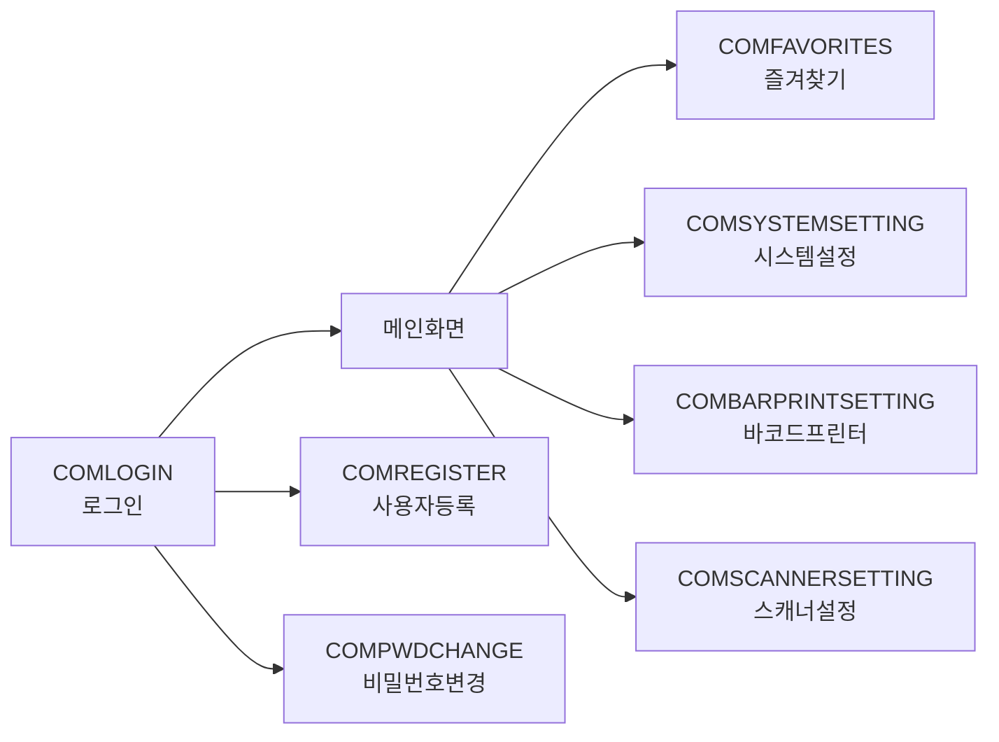
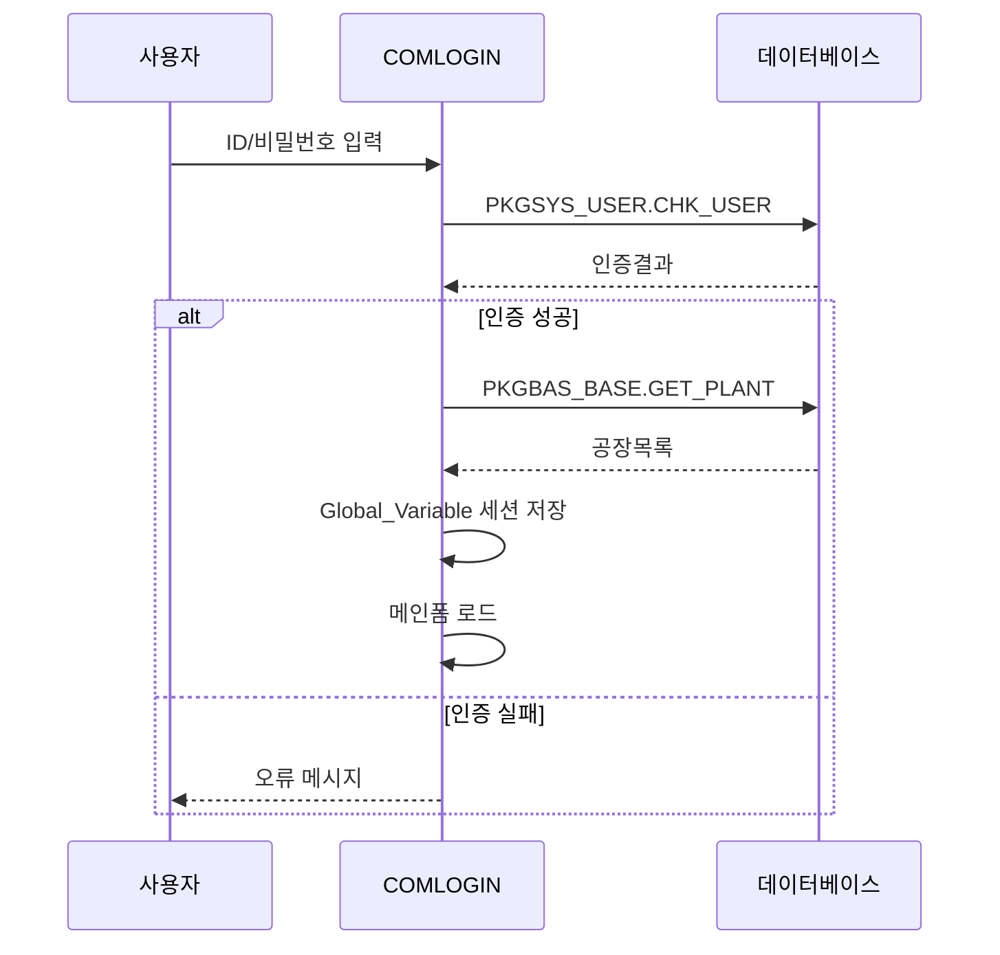

# 공통 (COM) 모듈

## 개요

| 항목 | 내용 |
|:---|:---|
| **모듈코드** | COM |
| **구현 화면** | 18개 |
| **주요 역할** | 로그인, 사용자등록, 시스템설정, UI 유틸리티 |
| **주요 패키지** | PKGSYS_USER, PKGSYS_MENU, PKGSYS_COMM, PKGBAS_BASE |

COM 모듈은 시스템 전반에서 공통으로 사용되는 인증, 설정, UI 유틸리티 화면을 제공합니다.

## 업무 흐름도

## 구현 화면 목록

### 인증/사용자 관리

| 화면ID | 화면명 | 유형 | 설명 | 상태 |
|:---|:---|:---:|:---|:---:|
| COMLOGIN | 로그인 | 처리 | 사용자 인증 및 시스템 접속 | ✅ |
| COMREGISTER | 사용자등록 | 처리 | 신규 사용자 등록 및 비밀번호 설정 | ✅ |
| COMREGISTER_NEW | 사용자등록(신규) | 처리 | 행성전용 사용자 등록 프로세스 | ✅ |
| COMPWDCHANGE | 비밀번호변경 | 처리 | 사용자 비밀번호 변경 | ✅ |
| Password | 비밀번호입력 | 처리 | 민감작업 시 비밀번호 재확인 팝업 | ✅ |

### 시스템 설정/관리

| 화면ID | 화면명 | 유형 | 설명 | 상태 |
|:---|:---|:---:|:---|:---:|
| COMSYSTEMSETTING | 시스템설정 | 관리 | 서버/프린터/기본값 설정 | ✅ |
| COMSYSTEMHISTORY | 시스템사용이력 | 조회 | 사용자별 시스템 사용 이력 조회 | ✅ |
| COMCLOSING | 마감관리 | 처리 | 월별/일별 마감 처리 | ✅ |
| COMFAVORITES | 즐겨찾기 | 관리 | 자주 사용하는 메뉴 등록 | ✅ |

### 하드웨어 설정

| 화면ID | 화면명 | 유형 | 설명 | 상태 |
|:---|:---|:---:|:---|:---:|
| COMBARPRINTSETTING | 바코드프린터설정 | 관리 | COM포트, 라벨포맷 설정 | ✅ |
| COMSCANNERSETTING | 스캐너설정 | 관리 | 바코드 스캐너 포트/프리픽스 설정 | ✅ |
| COMGRIDDEGINE | 그리드설정 | 관리 | 그리드 컬럼 및 표시 설정 | ✅ |

### UI 유틸리티

| 화면ID | 화면명 | 유형 | 설명 | 상태 |
|:---|:---|:---:|:---|:---:|
| COMPREVIEW | 미리보기 | 유틸 | 리포트 미리보기 공통 폼 | ✅ |
| COMPROGRESS | 진행상태 | 유틸 | 장시간 작업 진행상태 표시 | ✅ |
| COMPROGRESS_v2 | 진행상태(개선) | 유틸 | 진행상태 표시 개선 버전 | ✅ |
| COMSPLASHSCREEN | 스플래시 | 유틸 | 프로그램 시작 시 로딩 화면 | ✅ |
| COMWAITFORM | 대기화면 | 유틸 | 처리 대기 중 표시 | ✅ |
| COMHELP | 도움말 | 유틸 | 도움말 표시 | ✅ |

## 주요 화면 상세

### COMLOGIN - 로그인

시스템 접속의 진입점으로, 사용자 인증과 세션 관리를 담당합니다.

| 항목 | 내용 |
|:---|:---|
| **입력항목** | 사용자ID(txtId), 비밀번호(txtPassword), 공장(grdLookPlant) |
| **호출 프로시저** | PKGSYS_USER.CHK_USER, PKGBAS_BASE.GET_PLANT, PKG_USER.GET_USERMASTER |

### COMCLOSING - 마감관리

월별/일별 마감을 처리하여 데이터 무결성을 보장합니다.

| 항목 | 내용 |
|:---|:---|
| **호출 프로시저** | PKGSYS_COMM.GET_CLOSING, PKGSYS_COMM.PUT_CLOSING |
| **비즈니스 로직** | 마감일자 이전 데이터 수정 방지 |

## 연계 모듈

COM 모듈은 모든 업무 모듈의 기반이 됩니다:

- **SYS**: 사용자 인증 후 메뉴/권한 로딩
- **PRD/MAT**: 바코드 프린터/스캐너 설정 활용
- **RPT**: COMPREVIEW를 통한 리포트 미리보기
- **전체**: COMPROGRESS, COMWAITFORM 등 UI 유틸리티 공유
