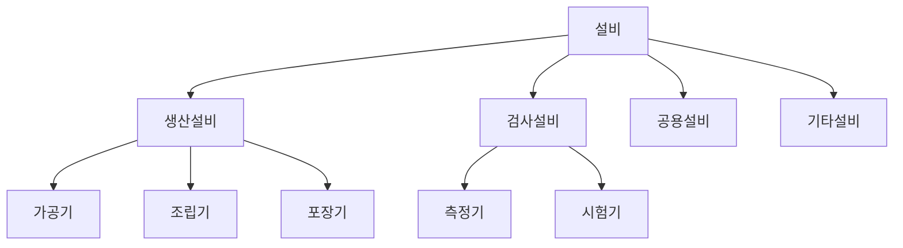
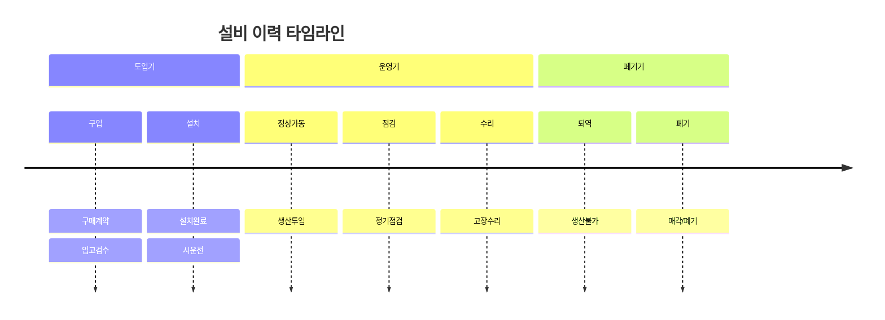
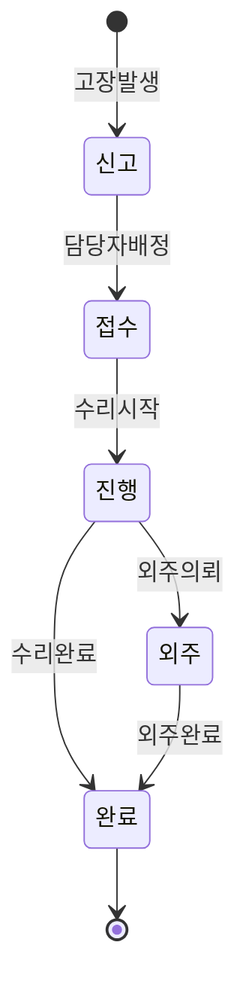
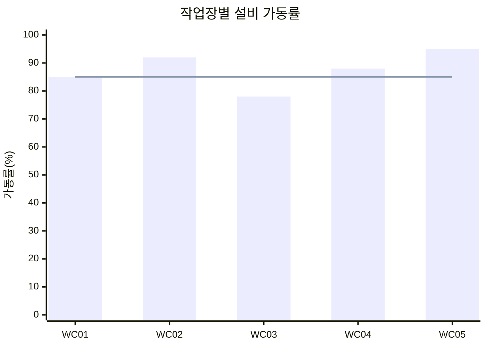
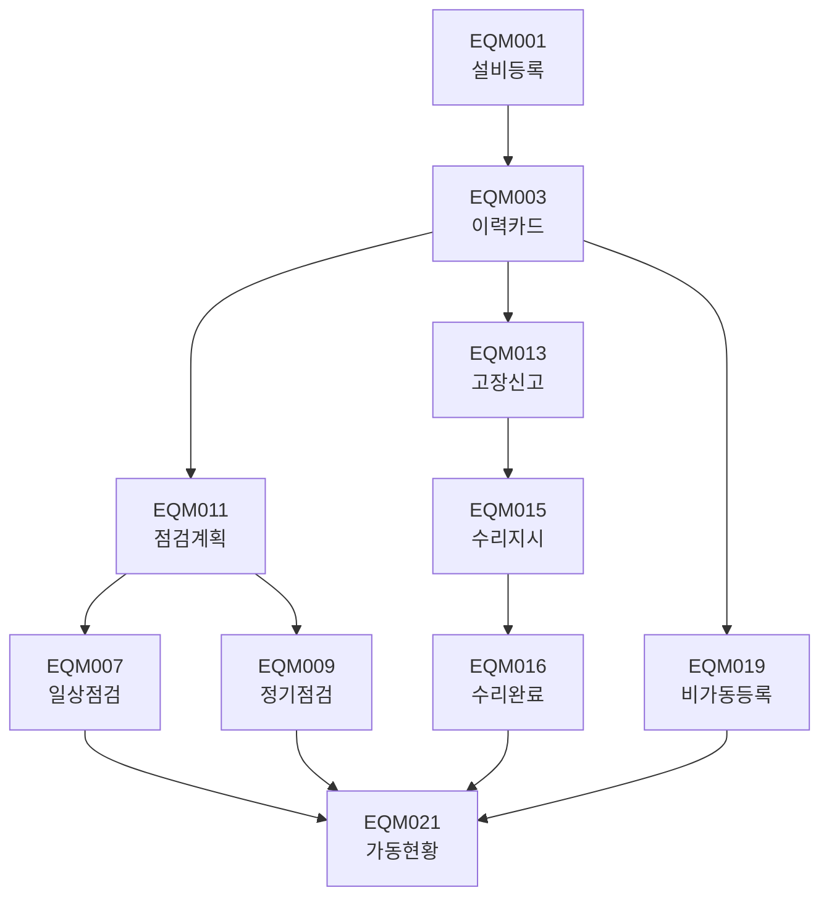

# 설비관리 (EQM Module)

설비 정보 및 유지보수 관리 화면입니다.

## 모듈 개요

| 항목 | 내용 |
|------|------|
| 모듈코드 | EQM |
| 화면수 | 22개 |
| 주요기능 | 설비관리, 점검관리, 수리관리 |

---

## 화면 목록

### 설비기준정보

| 화면ID | 화면명 | 설명 |
|--------|--------|------|
| EQM001 | 설비등록 | 설비 기본 정보 등록 |
| EQM002 | 설비조회 | 설비 정보 조회 |
| EQM003 | 설비이력카드 | 설비 이력 카드 관리 |
| EQM004 | 설비분류관리 | 설비 분류 체계 관리 |
| EQM005 | 예비품관리 | 예비 부품 관리 |
| EQM006 | 설비도면관리 | 설비 관련 도면 관리 |

### 설비점검관리

| 화면ID | 화면명 | 설명 |
|--------|--------|------|
| EQM007 | 일상점검등록 | 일상 점검 결과 등록 |
| EQM008 | 일상점검조회 | 일상 점검 이력 조회 |
| EQM009 | 정기점검등록 | 정기 점검 결과 등록 |
| EQM010 | 정기점검조회 | 정기 점검 이력 조회 |
| EQM011 | 점검계획관리 | 점검 계획 수립 |
| EQM012 | 점검기준관리 | 점검 항목 및 기준 관리 |

### 설비수리관리

| 화면ID | 화면명 | 설명 |
|--------|--------|------|
| EQM013 | 고장신고 | 설비 고장 신고 등록 |
| EQM014 | 고장이력조회 | 고장 이력 조회 |
| EQM015 | 수리작업지시 | 수리 작업 지시 관리 |
| EQM016 | 수리완료등록 | 수리 결과 등록 |
| EQM017 | 수리이력조회 | 수리 이력 조회 |
| EQM018 | 외주수의뢰 | 외주 수리 의뢰 관리 |

### 설비가동관리

| 화면ID | 화면명 | 설명 |
|--------|--------|------|
| EQM019 | 비가동등록 | 설비 비가동 등록 |
| EQM020 | 비가동조회 | 비가동 이력 조회 |
| EQM021 | 설비가동현황 | 설비 가동률 현황 |
| EQM022 | 설비종합보고서 | 설비 관리 종합 보고 |

---

## 설비기준정보

### EQM001 - 설비등록

설비의 기본 정보를 등록합니다.

#### 설비 분류



#### 입력 항목

| 항목 | 필수 | 설명 |
|------|------|------|
| 설비번호 | Y | 고유 설비 식별번호 |
| 설비명 | Y | 설비 명칭 |
| 설비분류 | Y | 설비 분류 코드 |
| 모델명 | N | 기기 모델명 |
| 제조사 | N | 제조 회사명 |
| 제조번호 | N | 제조사 일련번호 |
| 구입일자 | N | 구매 일자 |
| 설치일자 | N | 공장 설치 일자 |
| 소속작업장 | Y | 설치된 작업장 |
| 소유구분 | Y | 자사/임대/리스 |
| 구입가격 | N | 구매 금액 |
| 사용여부 | Y | 사용/미사용 |

---

### EQM003 - 설비이력카드

설비의 전 생애주기 이력을 관리합니다.

#### 이력 구성



---

## 설비점검관리

### EQM007 - 일상점검등록

작업자가 수행하는 일상 점검 결과를 등록합니다.

#### 입력 항목

| 항목 | 필수 | 설명 |
|------|------|------|
| 점검일자 | Y | 점검 실시일 |
| 설비번호 | Y | 점검 대상 설비 |
| 점검항목 | Y | 점검 항목 |
| 점검결과 | Y | 양호/불량 |
| 점검자 | Y | 점검 담당자 |
| 조치내용 | N | 이상 시 조치 내용 |
| 비고 | N | 특이사항 |

#### 일상점검 체크리스트 예시

| 항목 | 점검내용 | 주기 |
|------|----------|------|
| 01 | 전원 및 케이블 상태 | 매일 |
| 02 | 안전장치 작동 | 매일 |
| 03 | 윤활유량 | 매일 |
| 04 | 소음 및 진동 | 매일 |
| 05 | 청결상태 | 매일 |

---

### EQM009 - 정기점검등록

전문가가 수행하는 정기 점검 결과를 등록합니다.

#### 점검 유형

| 유형 | 주기 | 담당자 |
|------|------|--------|
| 1차점검 | 주간 | 작업자 |
| 2차점검 | 월간 | 반장 |
| 3차점검 | 분기 | 설비팀 |
| 4차점검 | 연간 | 외부업체 |

---

## 설비수리관리

### EQM013 - 고장신고

설비 고장 발생 시 신고를 등록합니다.

#### 고장 유형

| 코드 | 설명 |
|------|------|
| F01 | 전기계통 고장 |
| F02 | 기계계통 고장 |
| F03 | 제어계통 고장 |
| F04 | 유압/공압 고장 |
| F05 | 마모/손상 |
| F99 | 기타 |

#### 입력 항목

| 항목 | 필수 | 설명 |
|------|------|------|
| 신고일시 | Y | 고장 발견 일시 |
| 설비번호 | Y | 고장 설비 |
| 고장유형 | Y | 고장 분류 |
| 고장내용 | Y | 증상 및 내용 |
| 발견자 | Y | 고장 발견자 |
| 긴급도 | Y | 긴급/보통/경미 |
| 조치희망일 | N | 수리 희망 일자 |

#### 고장 처리 흐름



---

### EQM015 - 수리작업지시

고장 설비에 대한 수리 작업을 지시합니다.

#### 입력 항목

| 항목 | 필수 | 설명 |
|------|------|------|
| 지시번호 | Y | 자동 채번 |
| 고장신고번호 | Y | 관련 고장신고 |
| 설비번호 | Y | 수리 대상 설비 |
| 지시일자 | Y | 지시 생성일 |
| 수리내용 | Y | 요청 수리 내용 |
| 담당자 | Y | 수리 담당자 |
| 희망완료일 | N | 완료 희망일 |

---

## 설비가동관리

### EQM019 - 비가동등록

설비의 비가동 상태를 등록합니다.

#### 비가동 유형

| 대분류 | 소분류 | 설명 |
|--------|--------|------|
| 계획정지 | 계획보수 | 정기 점검/수리 |
| 계획정지 | 휴식 | 휴식/식사 시간 |
| 비계획정지 | 고장 | 설비 고장 |
| 비계획정지 | 재료부족 | 자재 부족 |
| 비계획정지 | 작업대기 | 대기/셋업 |
| 비계획정지 | 품질이상 | 품질 문제 |

#### 입력 항목

| 항목 | 필수 | 설명 |
|------|------|------|
| 비가동일자 | Y | 발생 일자 |
| 설비번호 | Y | 대상 설비 |
| 시작시간 | Y | 비가동 시작 |
| 종료시간 | N | 비가동 종료 |
| 비가동유형 | Y | 비가동 분류 |
| 비가동사유 | Y | 상세 사유 |
| 조치자 | N | 조치 담당자 |

---

### EQM021 - 설비가동현황

설비 가동률을 분석합니다.

#### 가동률 계산

```
가동률(%) = (가동시간 / 총시간) × 100
성능가동률 = (실제생산량 / 이론생산량) × 100
종합효율(OEE) = 가동률 × 성능가동률 × 양품률
```

#### 가동현황 차트



---

## 관련 화면 흐름


