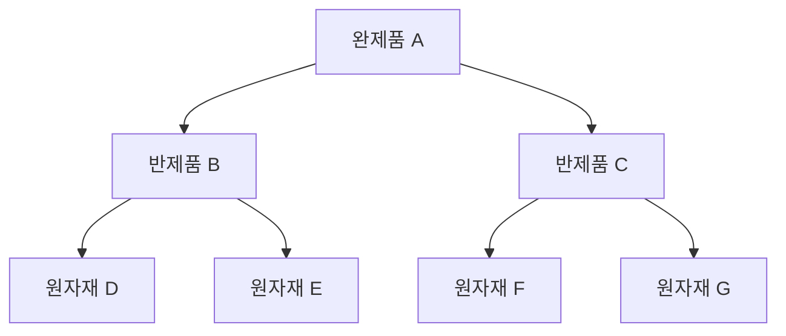
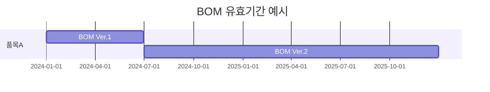
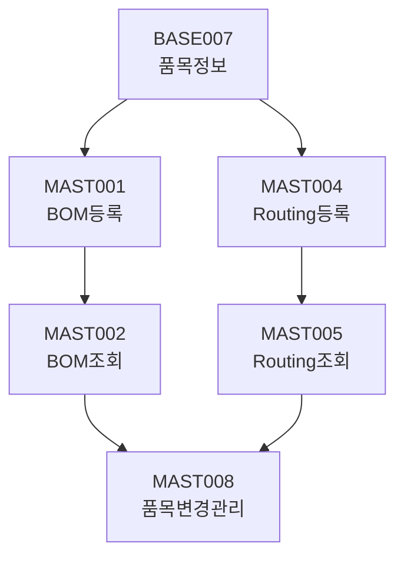

# 마스터 관리

BOM 및 Routing 등 생산 마스터 데이터를 관리하는 화면입니다.

## 모듈 개요

| 항목 | 내용 |
|------|------|
| 모듈코드 | MAST |
| 화면수 | 10개 |
| 주요기능 | BOM 관리, Routing 관리, 품목변경관리 |

---

## 화면 목록

| 화면ID | 화면명 | 설명 |
|--------|--------|------|
| MAST001 | BOM등록 | 제품 구성 정보 등록 |
| MAST002 | BOM조회/변경 | BOM 정보 조회 및 변경 |
| MAST003 | BOM대비조회 | 계획 vs 실적 대비 조회 |
| MAST004 | Routing등록 | 공정 경로 정보 등록 |
| MAST005 | Routing조회 | Routing 정보 조회 |
| MAST006 | 작업표준서등록 | 표준 작업 지침서 관리 |
| MAST007 | 첨부문서관리 | 품목 관련 문서 관리 |
| MAST008 | 품목변경관리 | ECO/ECN 변경 관리 |
| MAST009 | 대체품관리 | 대체 자재 정보 관리 |
| MAST010 | 품목이력조회 | 품목 변경 이력 조회 |

---

## BOM 관리

### MAST001 - BOM등록

제품을 구성하는 자재 정보를 등록합니다.

#### BOM 구조 예시

#### 입력 항목

| 항목 | 필수 | 설명 |
|------|------|------|
| 상위품목 | Y | 완제품/반제품 코드 |
| 하위품목 | Y | 투입되는 자재 코드 |
| 소요수량 | Y | 1개 기준 필요 수량 |
| LOSS율 | N | 공정 손실율 (%) |
| 유효시작일 | Y | BOM 적용 시작일 |
| 유효종료일 | N | BOM 적용 종료일 |
| 필수여부 | Y | 필수/선택 투입 구분 |

#### 유효기간 관리

---

### MAST002 - BOM조회/변경

등록된 BOM 정보를 조회하고 변경합니다.

#### 주요 기능

- 품목별 BOM 조회 (정전개/역전개)
- BOM 버전 관리
- BOM 변경 이력 조회
- BOM 비교 (버전 간 차이)

#### 조회 모드

| 모드 | 설명 |
|------|------|
| 정전개 | 완제품 → 원자재 방향 조회 |
| 역전개 | 원자재 → 사용처(완제품) 조회 |

---

## Routing 관리

### MAST004 - Routing등록

품목별 생산 공정 순서를 정의합니다.

#### Routing 예시

#### 입력 항목

| 항목 | 필수 | 설명 |
|------|------|------|
| 품목코드 | Y | Routing 적용 품목 |
| 공정순서 | Y | 진행 순번 (10, 20, 30...) |
| 작업장 | Y | 해당 공정 작업장 |
| 공정명 | Y | 공정 명칭 |
| 표준시간 | N | 공정별 표준 작업시간(분) |
| 검사여부 | Y | 공정 검사 필요 여부 |
| 자동실적 | Y | 자동/수동 실적 처리 |
| 이동시간 | N | 전 공정에서 이동 시간 |
| 대기시간 | N | 공정 대기 시간 |

#### Routing 유형

| 유형 | 설명 |
|------|------|
| SERIAL | 순차 진행 (일반) |
| PARALLEL | 병렬 진행 |
| SELECTIVE | 선택적 진행 |

---

## 품목변경관리 (ECO/ECN)

### MAST008 - 품목변경관리

Engineering Change Order/Notice를 관리합니다.

#### ECO 프로세스

#### 입력 항목

| 항목 | 필수 | 설명 |
|------|------|------|
| ECO번호 | Y | 변경관리 번호 |
| 변경유형 | Y | BOM/Routing/도면 등 |
| 대상품목 | Y | 변경 대상 품목 |
| 변경사유 | Y | 변경 필요 이유 |
| 변경전내용 | Y | 변경 전 값 |
| 변경후내용 | Y | 변경 후 값 |
| 적용일자 | Y | 변경 적용일 |
| 승인상태 | Y | 요청/검토/승인/반려 |

#### 변경 유형

| 코드 | 설명 |
|------|------|
| BOM_ADD | BOM 구성품 추가 |
| BOM_DEL | BOM 구성품 삭제 |
| BOM_CHG | BOM 수량 변경 |
| ROUT_ADD | Routing 공정 추가 |
| ROUT_DEL | Routing 공정 삭제 |
| ROUT_CHG | Routing 순서 변경 |
| DRAW_CHG | 도면 변경 |

---

## 대체품 관리

### MAST009 - 대체품관리

자재 부족 시 사용 가능한 대체 자재를 관리합니다.

#### 입력 항목

| 항목 | 필수 | 설명 |
|------|------|------|
| 원품목 | Y | 정규 품목코드 |
| 대체품목 | Y | 대체 가능 품목 |
| 대체우선순위 | Y | 1, 2, 3... |
| 대체조건 | N | 대체 사용 조건 |
| 사용여부 | Y | Y/N |

---

## 관련 화면 흐름

