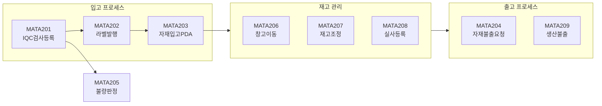
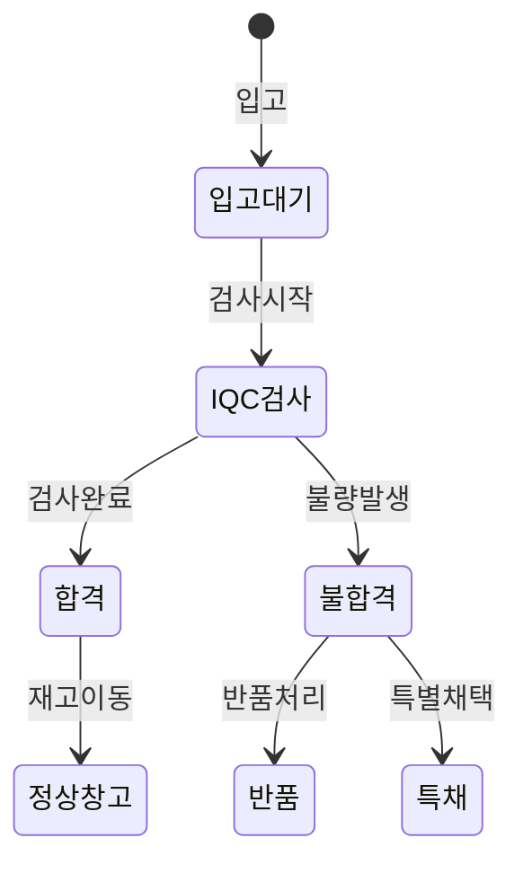
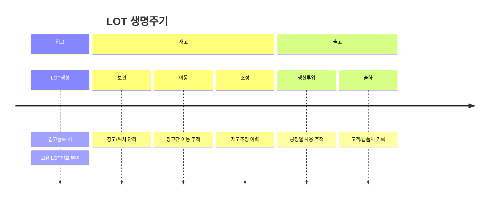
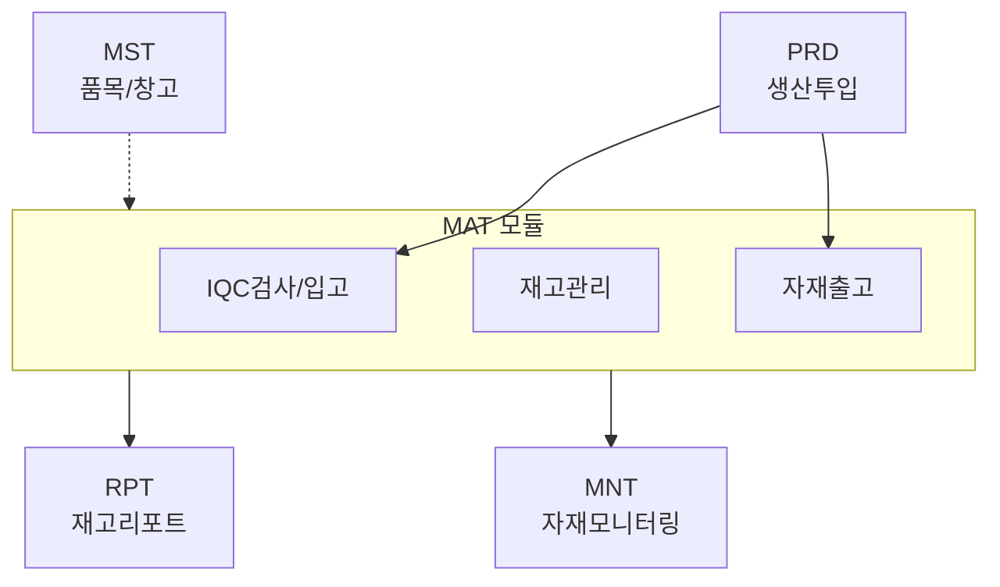

# 자재관리 (MAT) 모듈

## 개요

| 항목 | 내용 |
|:---|:---|
| **모듈코드** | MAT |
| **구현 화면** | 24개 (+ 팝업 2개) |
| **주요 역할** | IQC검사, 라벨발행, 입출고, 재고관리, 실사 |
| **주요 패키지** | PKGMAT_INOUT, PKGBAS_MAT, PKGPDA_MAT, PKGTXN_STOCK |

MAT 모듈은 자재의 입고(IQC)부터 출고, 재고관리, 실사까지 자재 전 생애주기를 관리합니다.

## 업무 흐름도

## 구현 화면 목록

### 등록/처리 화면 (A)

| 화면ID | 화면명 | 유형 | 설명 | 호출 프로시저 | 상태 |
|:---|:---|:---:|:---|:---|:---:|
| MATA201 | IQC검사등록 | 처리 | 수입검사 등록 및 판정 | PKGMAT_INOUT.GET_IQC_* | ✅ |
| MATA202 | 라벨발행 | 처리 | 입고 품목 시리얼 라벨 발행 | PKGMAT_INOUT.SET_NEW_CREATESN | ✅ |
| MATA203 | 자재입고(PDA) | 처리 | PDA 연동 자재 입고 | PKGPDA_MAT.SET_RECEIVE | ✅ |
| MATA204 | 자재불출요청 | 처리 | 생산투입용 자재 불출 요청 | PKGMAT_INOUT.SET_MATREQUESTNO | ✅ |
| MATA205 | 불량판정 | 처리 | 재고 불량등록/판정 | PKGBAS_BRD.SET_BADREG_JUDGE | ✅ |
| MATA206 | 창고이동 | 처리 | 창고 간 재고 이동 | PKGPDA_MAT.SET_RELEASE | ✅ |
| MATA207 | 재고조정 | 처리 | 재고수량 조정 | PKGPDA_MAT.SET_STOCKCORRECT | ✅ |
| MATA208 | 실사등록 | 처리 | 재고 실사 등록/적용 | PKGTXN_STOCK.SET_ACTUAL_APPLY | ✅ |
| MATA209 | 생산불출 | 처리 | 작업지시 기반 자재 불출 | PKGPDA_MAT.SET_RELEASE | ✅ |
| MATA210 | 대체품등록 | 처리 | 원품목/대체품목 설정 | PKGPDA_MAT.SET_REPLACEITEM | ✅ |

### 조회/리포트 화면 (B)

| 화면ID | 화면명 | 유형 | 설명 | 상태 |
|:---|:---|:---:|:---|:---:|
| MATB201 | 입고현황 | 조회 | 일별/월별 입고 조회 | ✅ |
| MATB202 | 입출고현황 | 조회 | 입출고 통합 조회 | ✅ |
| MATB203 | 재고현황 | 조회 | 현재고 조회 | ✅ |
| MATB204 | 입출고취소 | 처리 | 입출고 취소 처리 | ✅ |
| MATB205 | 라벨재발행 | 처리 | 라벨 재발행 | ✅ |
| MATB206 | 재고조회(회사별) | 조회 | 회사별 재고현황 | ✅ |
| MATB207 | 자재수불부 | 조회 | 수불부 조회 | ✅ |
| MATB208 | 불량자재조회 | 조회 | 불량 재고 조회 | ✅ |
| MATB209 | OQC검사 | 처리 | 출하검사 | ✅ |
| MATB210 | 자재실적현황 | 조회 | 자재별 입출고 실적 | ✅ |
| MATB211 | 재고실사현황 | 조회 | 실사결과 조회 | ✅ |
| MATB212 | 반품이력조회 | 조회 | 반품이력 | ✅ |
| MATB213 | 장기재고현황 | 조회 | 장기 미입고 재고 | ✅ |
| MATB214 | 요청서출력 | 출력 | 자재 요청서 출력 | ✅ |

### 팝업 화면

| 화면ID | 화면명 | 설명 |
|:---|:---|:---|
| POP_MAT01 | 자재팝업 | 품목선택 팝업 |
| POP_MAT02 | 재고팝업 | 재고조회 팝업 |

## 주요 화면 상세

### MATA201 - IQC검사등록

수입검사(Incoming Quality Control) 결과를 등록하고 합격/불합격을 판정합니다.

| 항목 | 내용 |
|:---|:---|
| **입력항목** | LOT번호, 품목코드, 검사수량, 합격수량, 불량수량, 불량코드, 판정 |
| **비즈니스 로직** | 입고대상 조회(TW_IN) → IQC결과 저장(TW_IQC) → 합격시 정상창고 이동 / 불합격시 품질보류창고 이동 |

### MATA208 - 실사등록

재고 실사 프로세스를 관리합니다.

| 단계 | 작업 내용 |
|:---:|:---|
| 1 | 실사대상 추출 (재고 기준) |
| 2 | 실사수량 입력 (엑셀업로드/수동) |
| 3 | 차이분석 (시스템재고 - 실사수량) |
| 4 | 실사적용 (재고조정) |

## LOT 추적

## 권한 설정

| 권한 코드 | 권한명 | 접근 가능 화면 |
|:---:|:---|:---|
| MAT_ADMIN | 자재관리자 | 모든 화면 |
| MAT_IN | 입고담당자 | 입고 + 조회 화면 |
| MAT_OUT | 출고담당자 | 출고 + 조회 화면 |
| MAT_STOCK | 재고관리자 | 재고 + 실사 관련 |
| MAT_VIEWER | 자재조회자 | 조회 화면만 |

## 연계 모듈

