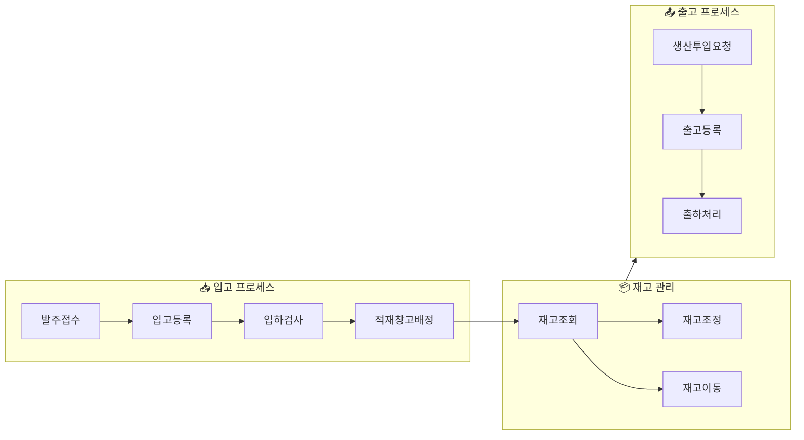
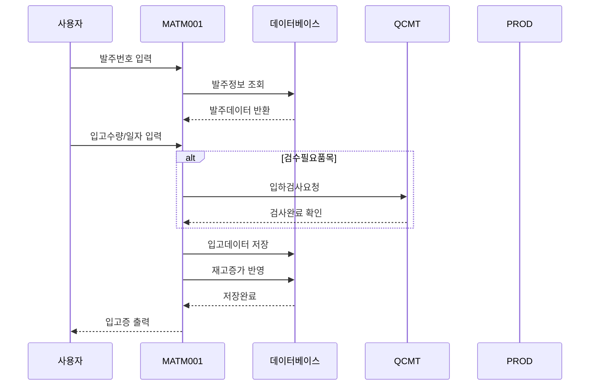
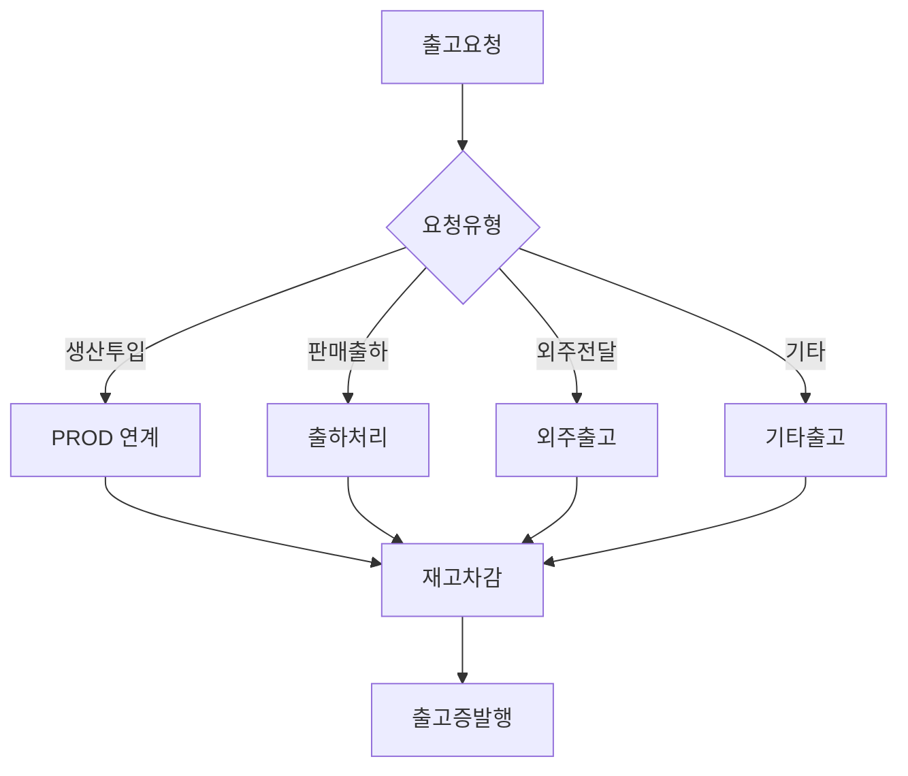
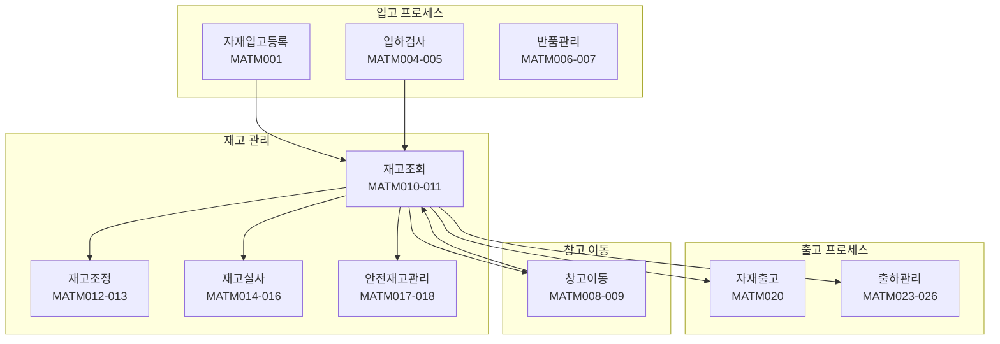
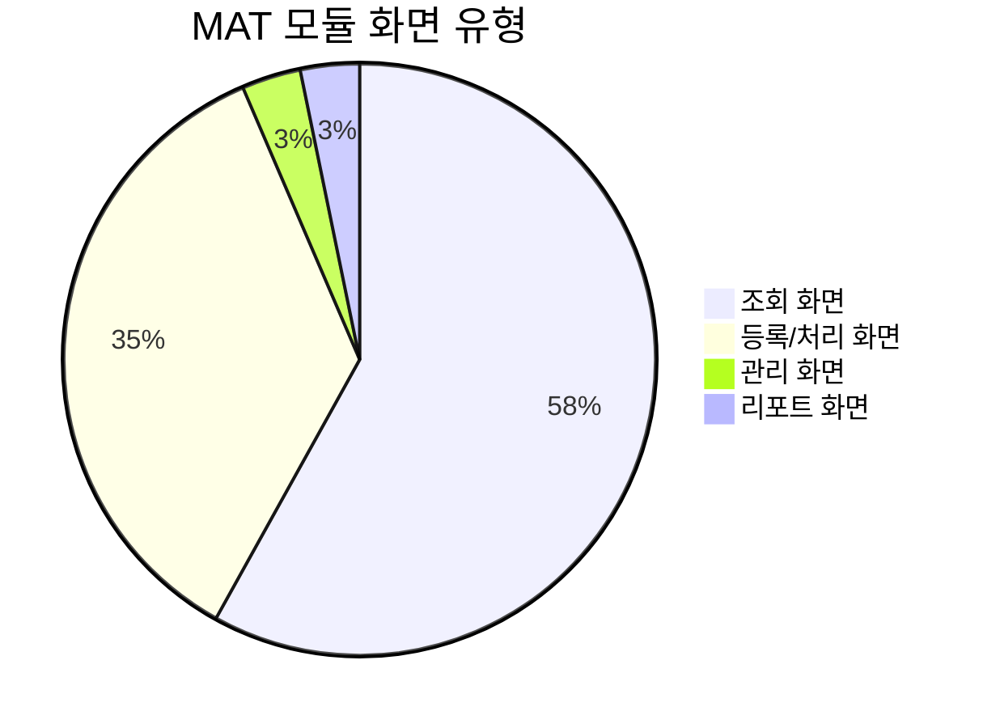
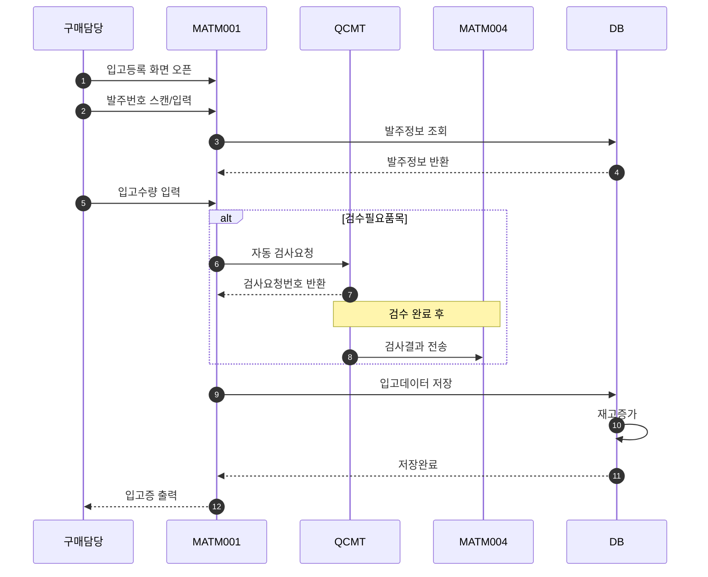
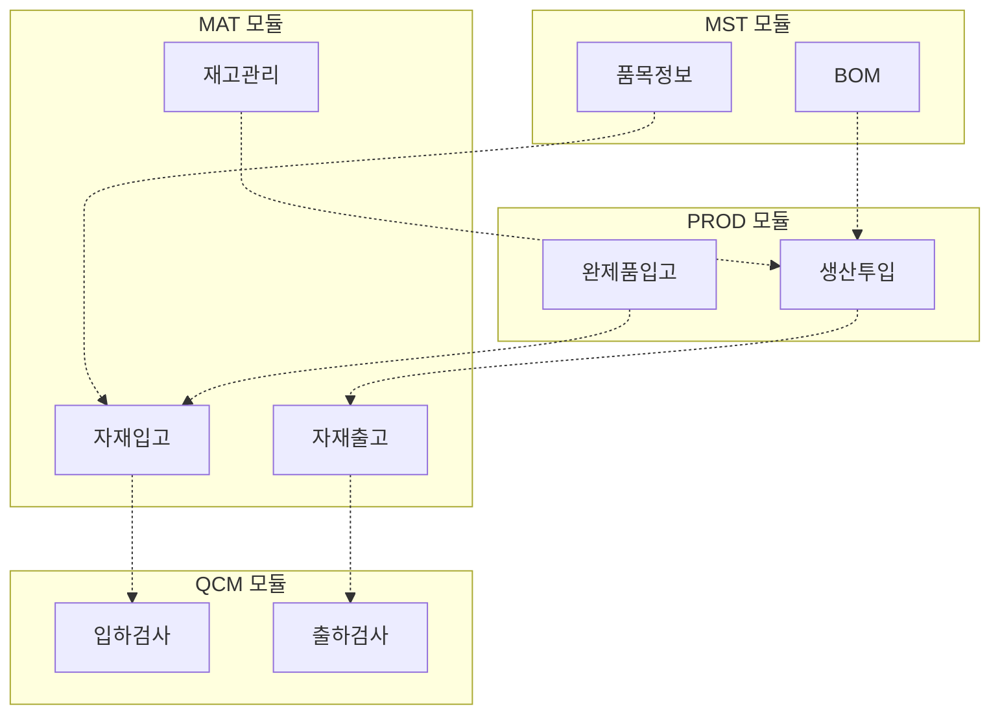
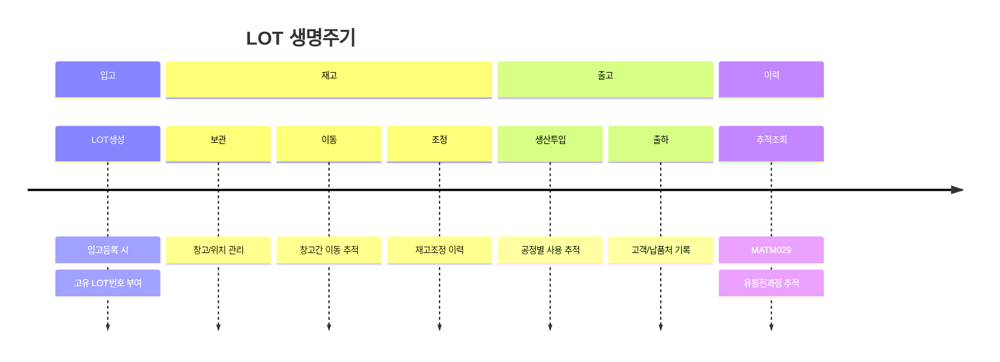

# 자재 관리 (MAT) 화면

MAT 모듈은 자재의 입출고, 재고관리, 창고 운영을 위한 **31개**의 화면으로 구성되어 있습니다.

## 개요

## 주요 화면

### MATM001 - 자재입고등록

<iframe src="/assets/screen-visualizations/MATA201.Designer.html" width="100%" height="550" style="border:1px solid #ccc; border-radius:8px;"></iframe>

[전체 화면 보기](/assets/screen-visualizations/MATA201.Designer.html){ .md-button .md-button--primary }

!!! note "화면 설명"
    자재 입고 시 입고 정보를 등록하고 검수 결과를 기록하는 핵심 화면입니다.

| 항목 | 내용 |
|:---|:---|
| **화면 ID** | MATM001 |
| **화면 유형** | 등록/처리 |
| **주요 기능** | 입고등록, LOT 생성, 검수결과 입력 |
| **입력 항목** | 발주번호, 입고일, 품목, 수량, 창고, 위치 |

### MATM010 - 재고조회

!!! tip "조회 기능"
    실시간 재고 현황을 다양한 조건으로 조회할 수 있습니다.

| 조회 조건 | 설명 |
|:---|:---|
| 창고별 | 특정 창고의 재고 조회 |
| 위치별 | 창고 내 특정 위치 조회 |
| 품목별 | 특정 품목의 전 창고 재고 |
| LOT별 | LOT 단위 재고 추적 |
| 기간별 | 기간별 재고 변동 이력 |

### MATM020 - 자재출고

## 전체 화면 목록

| 화면 ID | 화면명 | 유형 | 설명 |
|:---:|:---|:---:|:---|
| **MATM001** | **자재입고등록** | 처리 | 자재 입고 데이터 등록 |
| MATM002 | 자재입고조회 | 조회 | 입고 이력 조회 |
| MATM003 | 자재입고취소 | 처리 | 입고 취소 처리 |
| MATM004 | 입하검사요청 | 처리 | 입하 검사 요청 |
| MATM005 | 입하검사결과 | 조회 | 입하 검사 결과 확인 |
| MATM006 | 반품등록 | 처리 | 불량 자재 반품 등록 |
| MATM007 | 반품조회 | 조회 | 반품 이력 조회 |
| MATM008 | 창고이동등록 | 처리 | 창고 간 재고 이동 |
| MATM009 | 창고이동조회 | 조회 | 창고 이동 이력 |
| **MATM010** | **재고조회** | 조회 | 현재고 현황 조회 |
| MATM011 | 재고상세조회 | 조회 | LOT별 재고 상세 |
| MATM012 | 재고조정등록 | 처리 | 재고 조정 처리 |
| MATM013 | 재고조정조회 | 조회 | 재고 조정 이력 |
| MATM014 | 재고실사등록 | 처리 | 재고 실사 데이터 등록 |
| MATM015 | 재고실사조회 | 조회 | 재고 실사 이력 |
| MATM016 | 재고실사차이조회 | 조회 | 실사 차이 내역 |
| MATM017 | 안전재고조회 | 조회 | 안전재고 기준 대비 현황 |
| MATM018 | 재고경고현황 | 조회 | 재고 부족/과다 경고 |
| MATM019 | 재고수불부 | 조회 | 기간별 수불 현황 |
| **MATM020** | **자재출고** | 처리 | 자재 출고 등록 |
| MATM021 | 자재출고조회 | 조회 | 출고 이력 조회 |
| MATM022 | 자재출고취소 | 처리 | 출고 취소 |
| MATM023 | 출하등록 | 처리 | 제품 출하 등록 |
| MATM024 | 출하조회 | 조회 | 출하 이력 조회 |
| MATM025 | 출하반품등록 | 처리 | 출하 반품 처리 |
| MATM026 | 출하반품조회 | 조회 | 출하 반품 이력 |
| MATM027 | 창고관리 | 관리 | 창고/위치 정보 관리 |
| MATM028 | 재고이력조회 | 조회 | 재고 변동 이력 추적 |
| MATM029 | LOT추적조회 | 조회 | LOT별 유통 이력 |
| MATM030 | 자재현황리포트 | 리포트 | 자재 현황 보고서 |
| MATM031 | 재고분석리포트 | 리포트 | 재고 분석 보고서 |

## 재고 흐름도

## 화면 유형별 분포

## 주요 기능 상세

### 입고 처리 프로세스

### 재고 실사 프로세스

| 단계 | 화면 | 작업 내용 |
|:---:|:---|:---|
| 1 | MATM014 | 실사계획 등록 및 전표 생성 |
| 2 | MATM014 | 실사데이터 입력 (스캔/수기) |
| 3 | MATM016 | 실사결과 vs 시스템재고 비교 |
| 4 | MATM012 | 차이분 재고조정 |
| 5 | MATM015 | 실사 마감 처리 |

!!! warning "재고조정 주의사항"
    재고조정은 반드시 사유를 입력해야 하며, 승인 절차를 거쳐야만 최종 반영됩니다.

## 권한 설정

| 권한 코드 | 권한명 | 접근 가능 화면 |
|:---:|:---|:---|
| MAT_ADMIN | 자재관리자 | 모든 화면 |
| MAT_IN | 입고담당자 | 입고 + 조회 화면 |
| MAT_OUT | 출고담당자 | 출고 + 조회 화면 |
| MAT_STOCK | 재고관리자 | 재고 + 실사 관련 화면 |
| MAT_VIEWER | 자재조회자 | 조회 화면만 |

## 연계 모듈

## LOT 추적

