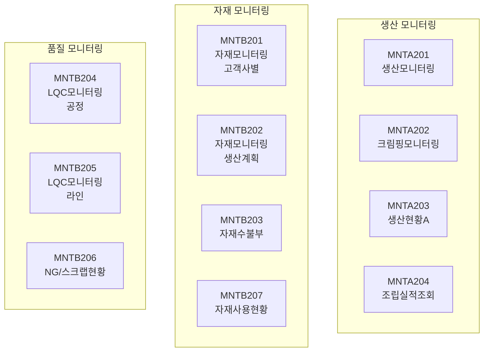
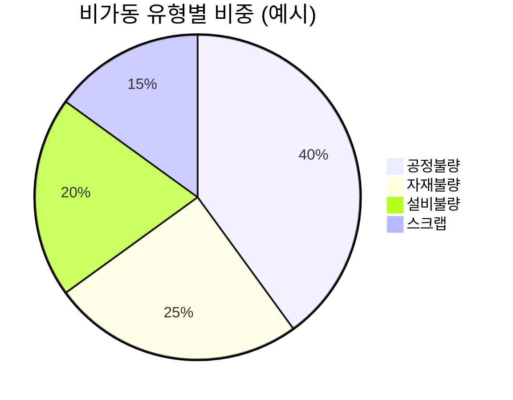

# 보전관리 (MNT) 모듈

## 개요

| 항목 | 내용 |
|:---|:---|
| **모듈코드** | MNT |
| **구현 화면** | 11개 (+ 팝업 2개) |
| **주요 역할** | 생산/자재 모니터링, LQC, NG/스크랩 현황 |
| **주요 패키지** | PKGPRD_MNT, PKGHNS_REPORT, PKGPRD_REPORT |

MNT 모듈은 생산 및 자재 현황을 종합적으로 모니터링하고, 품질 데이터(LQC)와 NG/스크랩 현황을 분석합니다.

## 업무 흐름도

## 구현 화면 목록

### 생산 모니터링 (A)

| 화면ID | 화면명 | 유형 | 설명 | 호출 프로시저 | 상태 |
|:---|:---|:---:|:---|:---|:---:|
| MNTA201 | 생산모니터링 | 모니터링 | 일별 생산현황 | PKGPRD_MNT.GET_DAILY_PROD_MONITERING | ✅ |
| MNTA202 | 크림핑모니터링 | 모니터링 | 크림핑공정 현황 | PKGPRD_MNT.GET_CRIMP_MONITORING | ✅ |
| MNTA203 | 생산현황(A) | 모니터링 | 라인별 생산현황 | PKGHNS_REPORT.GET_SALE_MONITOR1 | ✅ |
| MNTA204 | 조립실적조회 | 조회 | 조립공정 실적 | PKGPRD_MNT.GET_ASSEMBLY_RESULT_* | ✅ |

### 자재/품질 모니터링 (B)

| 화면ID | 화면명 | 유형 | 설명 | 호출 프로시저 | 상태 |
|:---|:---|:---:|:---|:---|:---:|
| MNTB201 | 자재모니터링(고객사별) | 모니터링 | 고객사별 자재현황 | PKGHNS_REPORT.GET_MAT_MONITOR | ✅ |
| MNTB202 | 자재모니터링(생산계획) | 모니터링 | 생산계획 기준 자재 | PKGHNS_REPORT.GET_MAT_MONITOR_PRODPLAN | ✅ |
| MNTB203 | 자재수불부 | 조회 | 자재 수불현황 | PKGHNS_REPORT.GET_MAT_BALANCE | ✅ |
| MNTB204 | LQC모니터링(공정) | 모니터링 | 공정별 LQC | PKGHNS_REPORT.GET_LQC_MONITOR1-5 | ✅ |
| MNTB205 | LQC모니터링(라인) | 모니터링 | 라인별 LQC | PKGHNS_REPORT.GET_LQC_MONITOR1-5 | ✅ |
| MNTB206 | NG/스크랩현황 | 조회 | 불량/스크랩 현황 | PKGHNS_REPORT.GET_NG_SCRAP | ✅ |
| MNTB207 | 자재사용현황 | 조회 | 생산별 자재사용 | PKGPRD_REPORT.GET_ACTUALMATERIALSTOCK | ✅ |

### 팝업 화면

| 화면ID | 화면명 | 설명 |
|:---|:---|:---|
| MNTB201_POPUP | 고객사계획조회 | 고객사 계획 상세 팝업 |
| MNTB202_POPUP | 생산계획조회 | 생산계획 상세 팝업 |

## 주요 화면 상세

### MNTA201 - 생산모니터링

일별 생산현황을 실시간으로 모니터링합니다.

| 항목 | 내용 |
|:---|:---|
| **주요기능** | 라인별/공정별 생산실적 실시간 조회, 달성률 분석 |
| **호출 프로시저** | PKGPRD_MNT.GET_DAILY_PROD_MONITERING |

### MNTB204/B205 - LQC모니터링

공정별/라인별 Last Quality Check(LQC) 결과를 모니터링합니다.

| 항목 | 내용 |
|:---|:---|
| **주요기능** | 공정/라인별 최종 품질 검사 결과 실시간 조회 |
| **호출 프로시저** | PKGHNS_REPORT.GET_LQC_MONITOR1~5 |

### MNTB206 - NG/스크랩현황

## 미구현 화면 (계획)

!!! warning "미구현(계획)"
    아래 기능들은 향후 개발 예정입니다. 상세 내용은 [미구현 기능](./planned-features.md)을 참조하세요.

| 기능 | 설명 |
|:---|:---|
| 설비이력카드 | 설비 전 생애주기 이력 관리 |
| 예방보전 계획 | 정기점검/수리 계획 및 실행 |
| 설비 고장처리 | 고장신고 → 수리지시 → 수리완료 |
| 설비 가동률 분석 | OEE(종합설비효율) 분석 |

## 연계 모듈

- **PRD**: 생산실적 데이터 기반 모니터링
- **MAT**: 자재 입출고/재고 데이터 기반 자재 모니터링
- **MST**: 설비/라인/공정 마스터 참조
- **RPT**: 분석 결과 리포트 연동
