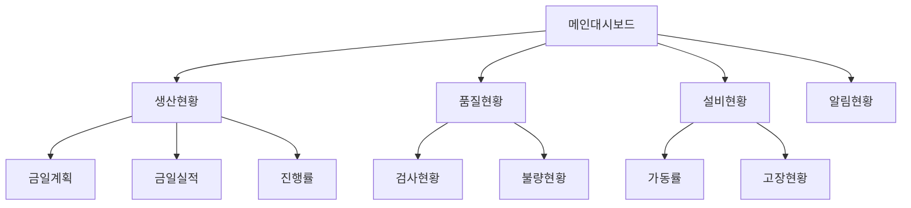
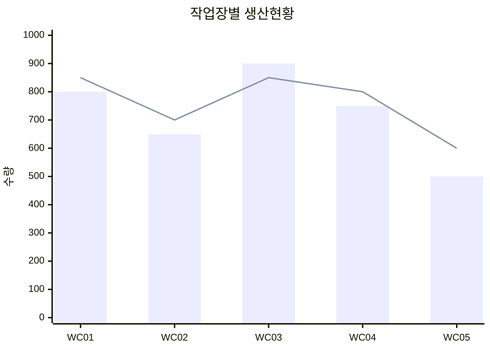
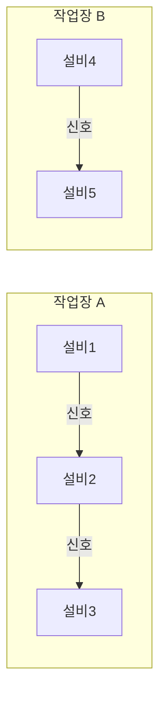
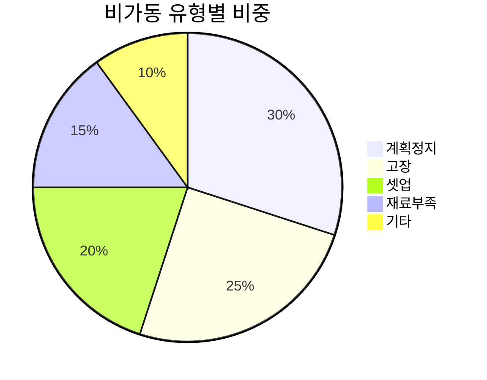
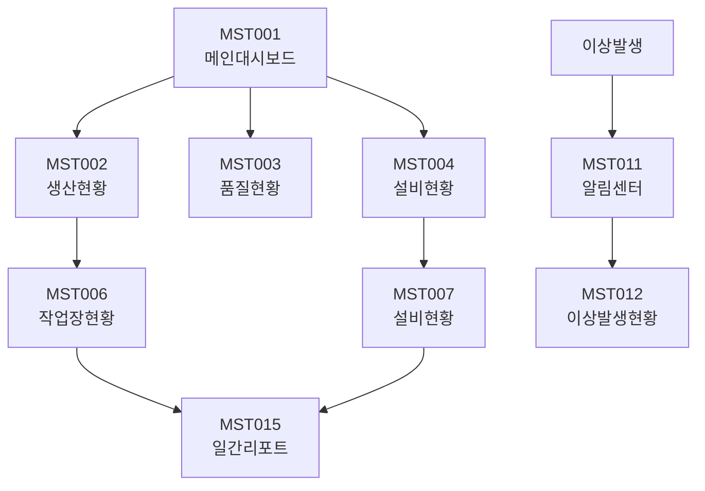

# 모니터링 (MST Module)

실시간 현황 모니터링 및 대시보드 화면입니다.

## 모듈 개요

| 항목 | 내용 |
|------|------|
| 모듈코드 | MST |
| 화면수 | 25개 |
| 주요기능 | 대시보드, 실시간현황, 알림관리 |

---

## 화면 목록

### 대시보드

| 화면ID | 화면명 | 설명 |
|--------|--------|------|
| MST001 | 메인대시보드 | 종합 현황 대시보드 |
| MST002 | 생산현황대시보드 | 생산 실적 현황 |
| MST003 | 품질현황대시보드 | 품질 지표 현황 |
| MST004 | 설비현황대시보드 | 설비 가동 현황 |
| MST005 | 재고현황대시보드 | 재고 수준 현황 |

### 생산모니터링

| 화면ID | 화면명 | 설명 |
|--------|--------|------|
| MST006 | 작업장실시간현황 | 작업장별 실시간 현황 |
| MST007 | 설비실시간현황 | 설비별 실시간 현황 |
| MST008 | 작업진행현황 | 작업지시 진행 현황 |
| MST009 | 작업자실적현황 | 작업자별 실적 현황 |
| MST010 | LOT추적현황 | LOT 이력 추적 |

### 알림/경고

| 화면ID | 화면명 | 설현 |
|--------|--------|------|
| MST011 | 알림센터 | 시스템 알림 목록 |
| MST012 | 이상발생현황 | 이상 발생 현황 |
| MST013 | 경고설정관리 | 알림 기준 설정 |
| MST014 | 알림이력조회 | 알림 발송 이력 |

### 분석/리포트

| 화면ID | 화면명 | 설명 |
|--------|--------|------|
| MST015 | 일간생산리포트 | 일간 생산 보고서 |
| MST016 | 주간생산리포트 | 주간 생산 보고서 |
| MST017 | 월간생산리포트 | 월간 생산 보고서 |
| MST018 | 비가동분석리포트 | 비가동 분석 보고 |
| MST019 | 불량분석리포트 | 불량 분석 보고 |
| MST020 | 재고분석리포트 | 재고 분석 보고 |

### 기타

| 화면ID | 화면명 | 설명 |
|--------|--------|------|
| MST021 | 공지사항관리 | 시스템 공지사항 |
| MST022 | 쪽지관리 | 사용자 쪽지 |
| MST023 | 온라인사용자현황 | 접속 사용자 현황 |
| MST024 | 시스템모니터링 | 서버 상태 모니터링 |
| MST025 | 로그조회 | 시스템 로그 조회 |

---

## 대시보드

### MST001 - 메인대시보드

시스템의 핵심 지표를 한눈에 보여줍니다.

#### 대시보드 구성

#### 주요 위젯

| 위젯 | 설명 | 갱신주기 |
|------|------|----------|
| 생산진행률 | 작업지시별 진행 상황 | 5분 |
| 설비가동률 | 작업장별 가동 현황 | 5분 |
| 불량발생 | 금일 불량 발생 현황 | 실시간 |
| 알림목록 | 미확인 알림 목록 | 실시간 |
| 재고부족 | 안전재고 미만 품목 | 1시간 |

---

### MST002 - 생산현황대시보드

생산 실적 관련 지표를 종합적으로 보여줍니다.

#### 화면 구성

#### 주요 지표

| 지표 | 설명 |
|------|------|
| 금일계획 | 당일 총 생산 계획 수량 |
| 금일실적 | 당일 완료된 생산 실적 |
| 달성률 | (실적/계획) × 100 |
| 진행중 | 현재 생산 중인 수량 |
| 잔여계획 | 완료 필요 잔여 수량 |

---

## 실시간 모니터링

### MST006 - 작업장실시간현황

각 작업장의 실시간 생산 현황을 보여줍니다.

#### 화면 구성

| 영역 | 내용 |
|------|------|
| 작업장목록 | 모든 작업장 상태 표시 |
| 상세정보 | 선택 작업장 상세 현황 |
| 실적현황 | 실시간 실적 그래프 |
| 알림영역 | 이상 발생 알림 |

#### 상태 표시

| 상태 | 색상 | 설명 |
|------|------|------|
| 가동 | 초록 | 정상 생산 중 |
| 비가동 | 빨강 | 작업 중지 상태 |
| 대기 | 노랑 | 대기/셋업 중 |
| 완료 | 파랑 | 작업 완료 |

---

### MST007 - 설비실시간현황

설비별 실시간 상태를 모니터링합니다.

#### 설비 상태 다이어그램

#### 표시 정보

| 항목 | 설명 |
|------|------|
| 설비번호 | 설비 식별번호 |
| 설비명 | 설비 명칭 |
| 현재상태 | 가동/비가동/대기 |
| 가동시간 | 당일 누적 가동시간 |
| 현재작업 | 진행 중 작업지시 |
| 진행률 | 현재 작업 진행률 |

---

## 알림 관리

### MST011 - 알림센터

시스템에서 발생하는 알림을 관리합니다.

#### 알림 유형

| 유형 | 설명 | 아이콘 |
|------|------|--------|
| INFO | 일반 정보 | ℹ️ |
| WARNING | 주의 사항 | ⚠️ |
| ERROR | 오류 발생 | ❌ |
| SUCCESS | 완료 알림 | ✅ |
| URGENT | 긴급 알림 | 🚨 |

#### 알림 발생 조건

| 조건 | 알림내용 | 수신자 |
|------|----------|--------|
| 생산완료 | 작업지시 완료 | 작업자, 관리자 |
| 불량발생 | 불량 발생 | 품질담당자 |
| 고장발생 | 설비 고장 | 설비담당자 |
| 재고부족 | 안전재고 미만 | 자재담당자 |
| 납기임박 | 납기일 3일 전 | 계획담당자 |

---

## 리포트

### MST015 - 일간생산리포트

일일 생산 결과를 보고합니다.

#### 보고 항목

| 항목 | 설명 |
|------|------|
| 생산계획 | 당일 총 계획 수량 |
| 생산실적 | 당일 총 실적 수량 |
| 달성률 | 계획 대비 달성률 |
| 불량현황 | 불량 발생 내역 |
| 비가동현황 | 비가동 시간 내역 |
| 주요이슈 | 당일 주요 사항 |

---

### MST018 - 비가동분석리포트

설비 비가동을 분석합니다.

#### 분석 차트

---

## 관련 화면 흐름

