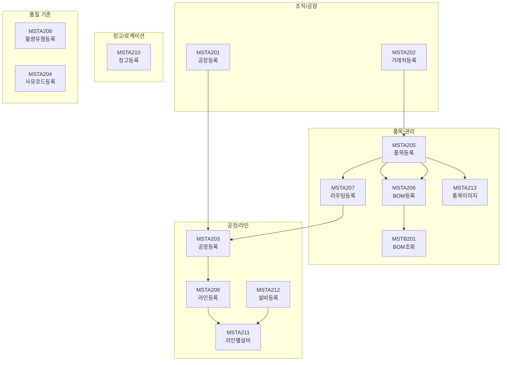
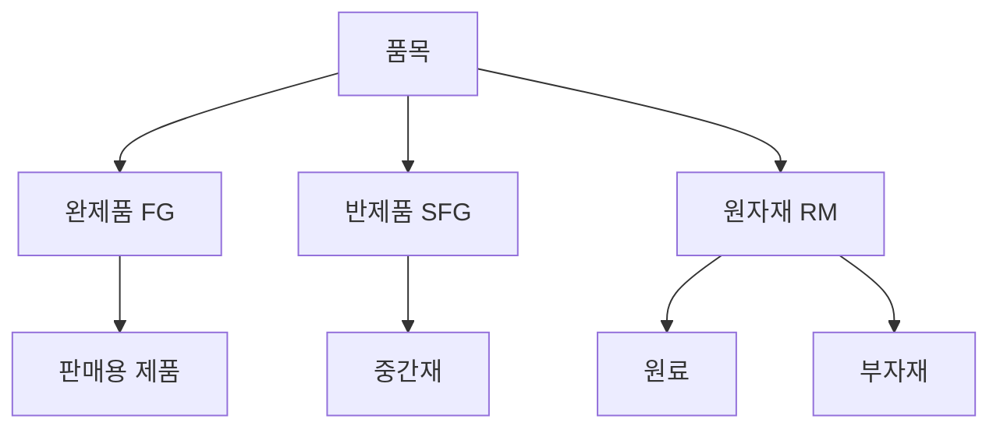
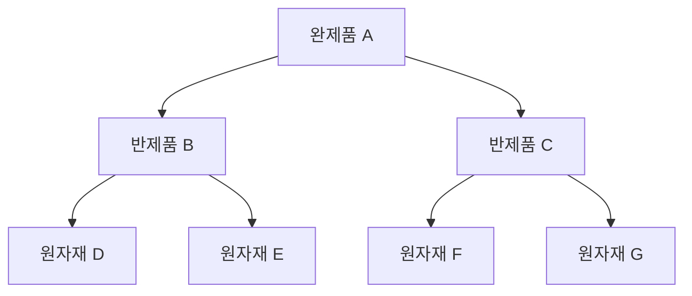
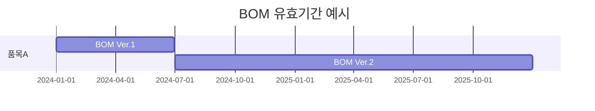
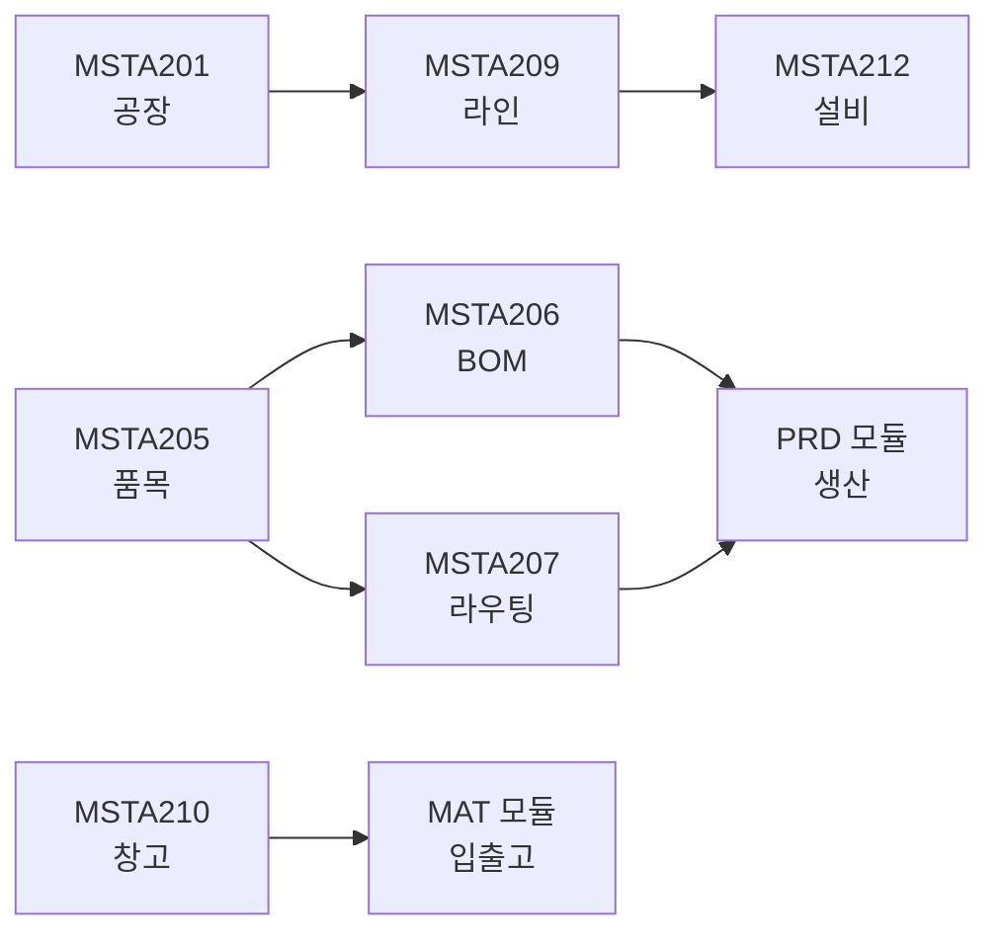

# 기준정보 (MST) 모듈

## 개요

| 항목 | 내용 |
|:---|:---|
| **모듈코드** | MST |
| **구현 화면** | 21개 (+ 팝업 3개) |
| **주요 역할** | 공장, 거래처, 품목, BOM, 라우팅, 창고, 설비 마스터 관리 |
| **주요 패키지** | PKGBAS_BASE, GPKGBAS_BASE |

MST 모듈은 MES 시스템 운영에 필요한 모든 기초 마스터 데이터를 관리합니다.

## 업무 흐름도

## 구현 화면 목록

### 조직/공장

| 화면ID | 화면명 | 유형 | 설명 | 호출 프로시저 | 상태 |
|:---|:---|:---:|:---|:---|:---:|
| MSTA201 | 공장등록 | 관리 | 공장(Plant) 기준정보 | PKGBAS_BASE.GET_PLANT, PUT_PLANT | ✅ |
| MSTA202 | 거래처등록 | 관리 | 거래처(협력사/고객사) | PKGBAS_BASE.PUT_VENDOR, GET_VENDOR | ✅ |

### 품목 관리

| 화면ID | 화면명 | 유형 | 설명 | 호출 프로시저 | 상태 |
|:---|:---|:---:|:---|:---|:---:|
| MSTA205 | 품목등록 | 관리 | 원자재/반제품/완제품 마스터 | PKGBAS_BASE.PUT_ITEM, GET_ITEM | ✅ |
| MSTA206 | BOM등록 | 관리 | Bill of Material 관리 | PKGBAS_BASE.PUT_BOM, GET_BOM | ✅ |
| MSTA207 | 라우팅등록 | 관리 | 품목별 공정순서 관리 | PKGBAS_BASE.GET_ROUTING, PUT_ROUTING | ✅ |
| MSTA213 | 품목이미지등록 | 관리 | 품목 이미지 관리 | PKGBAS_BASE.GET_ITEMIMAGE, SET_ITEMIMAGE | ✅ |
| MSTA219 | 모델BOM등록 | 관리 | 모델별 BOM 관리 | GPKGBAS_BASE.GET_MODELBOM, PUT_MODELBOM | ✅ |
| MSTB201 | BOM조회 | 조회 | BOM 정전개/역전개 조회 | PKGBAS_BASE.GET_BOM_LIST | ✅ |

### 공정/라인/설비

| 화면ID | 화면명 | 유형 | 설명 | 호출 프로시저 | 상태 |
|:---|:---|:---:|:---|:---|:---:|
| MSTA203 | 공정등록 | 관리 | 생산공정 기준정보 | PKGBAS_BASE.GET_OPER, PUT_OPER | ✅ |
| MSTA209 | 라인등록 | 관리 | 생산라인 관리 | PKGBAS_BASE.GET_LINE, PUT_LINE | ✅ |
| MSTA211 | 라인별설비등록 | 관리 | 라인-설비 매핑 | PKGBAS_BASE.GET_PRODLINE_UNIT | ✅ |
| MSTA212 | 설비등록 | 관리 | 설비 마스터 | PKGBAS_BASE.GET_EQP, PUT_EQP | ✅ |

### 창고/로케이션

| 화면ID | 화면명 | 유형 | 설명 | 호출 프로시저 | 상태 |
|:---|:---|:---:|:---|:---|:---:|
| MSTA210 | 창고/로케이션등록 | 관리 | 창고 및 랙/선반 관리 | PKGBAS_BASE.GET_LOCATION, PUT_LOCATION | ✅ |

### 품질/코드 기준

| 화면ID | 화면명 | 유형 | 설명 | 호출 프로시저 | 상태 |
|:---|:---|:---:|:---|:---|:---:|
| MSTA204 | 사유코드등록 | 관리 | 사유코드 관리 | PKGBAS_BASE.GET_REASONCODE | ✅ |
| MSTA208 | 불량유형등록 | 관리 | 불량코드/이미지 관리 | PKGBAS_BASE.GET_DEFECT, PUT_DEFECT | ✅ |

### 생산 기준

| 화면ID | 화면명 | 유형 | 설명 | 호출 프로시저 | 상태 |
|:---|:---|:---:|:---|:---|:---:|
| MSTA216 | 마감기준등록 | 관리 | 마감 기준일 관리 | PKGBAS_BASE.GET_CLOSINGBASE | ✅ |
| MSTA217 | 크림핑기준등록 | 관리 | 크림핑 공정 기준 | PKGBAS_BASE.GET_CRIMPINGBASE | ✅ |
| MSTA218 | 근무시간등록 | 관리 | 근무 시간 관리 | PKGBAS_BASE.GET_WORKTIME | ✅ |
| MSTA220 | 애플리케이터등록 | 관리 | 애플리케이터 기준 | PKGBAS_BASE.GET_APPLICATOR | ✅ |
| MSTA221 | 지그/PIN등록 | 관리 | 지그/PIN 기준 관리 | PKGBAS_BASE.GET_JIGPIN | ✅ |

### 팝업 화면

| 화면ID | 화면명 | 설명 |
|:---|:---|:---|
| MSTA206_PopUp | BOM품목선택 | BOM등록용 품목선택 팝업 |
| MSTA206_PopUp2 | 서브품목등록 | 서브품목 관리 팝업 |
| MSTA210_PopUp | 창고선택 | 창고/로케이션 선택 팝업 |

## 주요 화면 상세

### MSTA205 - 품목등록

생산 및 구매 대상이 되는 모든 품목의 마스터 데이터를 관리합니다.

| 항목 | 내용 |
|:---|:---|
| **입력항목** | 품목코드, 품목명, 규격, 모델, 단위, 품목유형, ABC분류, 안전재고, 라벨유형 |
| **호출 프로시저** | PKGBAS_BASE.PUT_ITEM, PKGBAS_BASE.GET_ITEM |
| **비즈니스 로직** | 품목코드 채번규칙 적용, 품목유형별 필수항목 체크, 이미지 파일 업로드 |

### MSTA206 - BOM등록

제품을 구성하는 자재 정보(Bill of Material)를 관리합니다.

#### BOM 구조 예시

| 항목 | 내용 |
|:---|:---|
| **입력항목** | 모델코드, 품목코드, 구성품목, 수량, Loss율, 시작일, 종료일 |
| **주요기능** | BOM그룹 관리, BOM등록/수정, BOM복사, BOM전개, BOM Release |
| **호출 프로시저** | PKGBAS_BASE.PUT_BOM, GET_BOM, PUT_BOM_RELEASE |

#### BOM 유효기간 관리

### MSTA207 - 라우팅등록

품목별 생산 공정 순서(Routing)를 정의합니다.

| 항목 | 내용 |
|:---|:---|
| **입력항목** | 라우팅그룹코드, 품목코드, 공정코드, 순번, 표준공수, 설비코드 |
| **호출 프로시저** | PKGBAS_BASE.GET_ROUTING, PUT_ROUTING, GET_ROUTINGGRP |

### MSTA210 - 창고/로케이션등록

창고 및 세부 보관위치(랙/선반)를 관리합니다.

| 항목 | 내용 |
|:---|:---|
| **입력항목** | 창고코드, 창고명, 창고유형(정상/불량/품질보류), 로케이션코드 |
| **호출 프로시저** | PKGBAS_BASE.GET_LOCATION, PUT_LOCATION |

## 관련 화면 흐름

## 연계 모듈

- **SYS**: 공통코드, 단위코드 참조
- **PRD**: BOM/라우팅 기반 작업지시 생성, 설비/라인 할당
- **MAT**: 창고/로케이션 기반 재고관리, 품목정보 참조
- **SAL**: 품목마스터 기반 수주/출하 처리
- **MNT**: 설비 마스터 기반 모니터링
