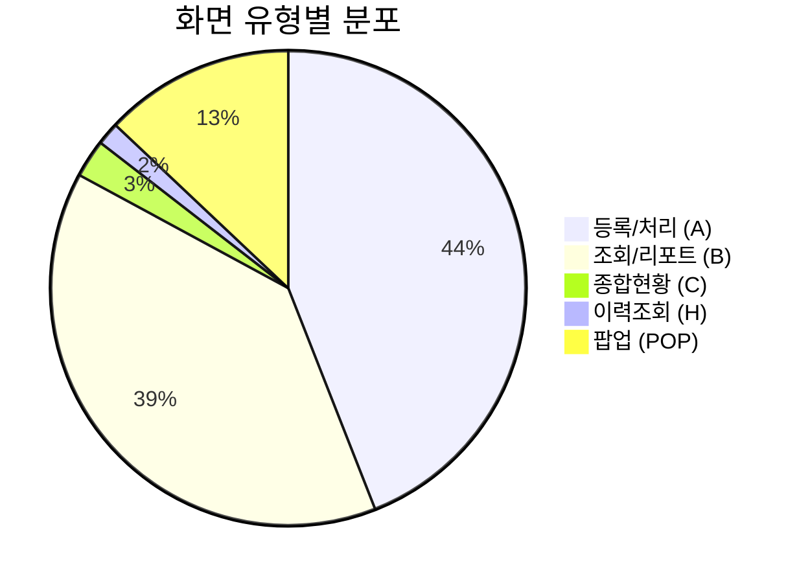
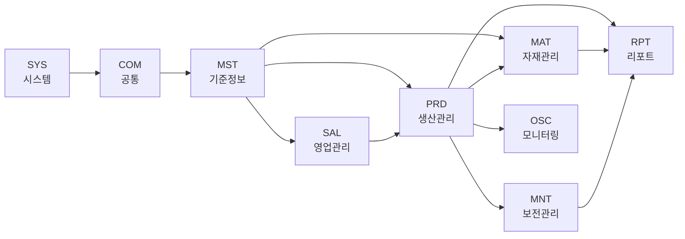

# 화면 명세 개요

HNSMES 시스템은 **9개 모듈**, **189개 화면**으로 구성된 제조실행시스템(MES)입니다.

!!! example "Interactive Form Viewer"
    Designer.cs를 자동 파싱하여 실제 폼 레이아웃을 인터랙티브하게 시각화합니다.
    모듈별 폼 선택, 줌/팬, 컨트롤 툴팁 등을 지원합니다.

    [:material-eye: **화면 시각화 열기**](./form-viewer.md){ .md-button .md-button--primary }

## 모듈 구성

<div class="grid cards" markdown>

-   :material-cog:{ .lg .middle } __공통 (COM)__

    ---

    **18개 화면** | 로그인, 시스템설정, 바코드/스캐너

    [:octicons-arrow-right-24: 상세보기](./com.md)

-   :material-shield-lock:{ .lg .middle } __시스템 (SYS)__

    ---

    **18개 화면** | 코드관리, 메뉴/권한, 조직관리

    [:octicons-arrow-right-24: 상세보기](./sys.md)

-   :material-database:{ .lg .middle } __기준정보 (MST)__

    ---

    **23개 화면** | 품목, BOM, 라우팅, 창고, 설비

    [:octicons-arrow-right-24: 상세보기](./mst.md)

-   :material-factory:{ .lg .middle } __생산관리 (PRD)__

    ---

    **46개 화면** | 작업지시, 생산실적, 공정이동

    [:octicons-arrow-right-24: 상세보기](./prd.md)

-   :material-package-variant:{ .lg .middle } __자재관리 (MAT)__

    ---

    **26개 화면** | IQC, 입출고, 재고, 라벨발행

    [:octicons-arrow-right-24: 상세보기](./mat.md)

-   :material-handshake:{ .lg .middle } __영업관리 (SAL)__

    ---

    **9개 화면** | 수주, 출하, 영업현황

    [:octicons-arrow-right-24: 상세보기](./sal.md)

-   :material-chart-box:{ .lg .middle } __리포트 (RPT)__

    ---

    **22개 화면** | 생산일보/월보, KPI분석

    [:octicons-arrow-right-24: 상세보기](./rpt.md)

-   :material-wrench-cog:{ .lg .middle } __보전관리 (MNT)__

    ---

    **13개 화면** | 생산/자재 모니터링, LQC

    [:octicons-arrow-right-24: 상세보기](./mnt.md)

-   :material-monitor-dashboard:{ .lg .middle } __모니터링 (OSC)__

    ---

    **5개 화면** | 대형화면 모니터링, 외주현황

    [:octicons-arrow-right-24: 상세보기](./osc.md)

</div>

## 화면 ID 체계

```
[모듈코드 3자리][타입 1자리][번호 3자리]

예시:
├─ PRDA201: PRD(생산) + A(등록/처리) + 201
├─ MATB203: MAT(자재) + B(조회/리포트) + 203
├─ PRDC201: PRD(생산) + C(종합현황) + 201
└─ POP_PRD01: 팝업 화면
```

| 타입코드 | 의미 | 설명 |
|:---:|:---:|:---|
| A | 등록/처리 | 데이터 입력, 수정, 삭제 화면 |
| B | 조회/리포트 | 데이터 조회 및 리포트 화면 |
| C | 종합현황 | 대시보드형 종합 현황 |
| H | 이력조회 | 이력 추적 화면 |
| POP_ | 팝업 | 모달 팝업 화면 |

## 구현 현황 요약

| 모듈 | 코드 | 구현 화면 | 팝업 포함 | 주요 패키지 |
|:---|:---:|:---:|:---:|:---|
| 공통 | COM | 18 | - | PKGSYS_USER, PKGSYS_MENU |
| 시스템 | SYS | 15 | 3 | PKGSYS_COMM, PKGSYS_DBA |
| 기준정보 | MST | 21 | 3 | PKGBAS_BASE, GPKGBAS_BASE |
| 생산관리 | PRD | 33 | 13 | PKGPRD_PROD, PKGPRD_REPORT |
| 자재관리 | MAT | 24 | 2 | PKGMAT_INOUT, PKGBAS_MAT |
| 영업관리 | SAL | 7 | 2 | PKGPRD_SALES |
| 리포트 | RPT | 22 | - | PKGHNS_REPORT |
| 보전관리 | MNT | 11 | 2 | PKGHNS_REPORT, PKGPRD_MNT |
| 모니터링 | OSC | 5 | - | PKGPRD_MNT, PKGPRD_PROD |
| **합계** | | **156** | **25** | |

!!! note "총 화면 수"
    구현 화면 156개 + 팝업 25개 + 샘플 5개 + 데이터셋 3개 = **189개** 화면

## 화면 유형 분포



## 모듈 간 연계



## 모듈별 상세 문서

| 문서 | 설명 |
|:---|:---|
| [공통 (COM)](./com.md) | 로그인, 사용자등록, 시스템설정, 바코드/스캐너 설정 |
| [시스템 (SYS)](./sys.md) | 용어사전, 공통코드, 메뉴/권한, 조직관리, 에러로그 |
| [기준정보 (MST)](./mst.md) | 공장, 거래처, 품목, BOM, 라우팅, 창고, 설비 마스터 |
| [생산관리 (PRD)](./prd.md) | 작업지시, 생산실적, 공정이동, 생산현황, 외주관리 |
| [자재관리 (MAT)](./mat.md) | IQC검사, 라벨발행, 입출고, 재고관리, 실사 |
| [영업관리 (SAL)](./sal.md) | 수주등록, 출하관리, 영업현황 리포트 |
| [리포트 (RPT)](./rpt.md) | 생산일보/월보, 불량현황, KPI 분석 |
| [보전관리 (MNT)](./mnt.md) | 생산/자재 모니터링, LQC, NG/스크랩 현황 |
| [모니터링 (OSC)](./osc.md) | 대형화면 모니터링, 자재요청, 외주현황 |
| [전체 화면 명세](./complete-specs.md) | 189개 전체 화면의 상세 명세서 (Source of Truth) |
| [미구현 기능](./planned-features.md) | 향후 개발 예정 기능 총괄 |

## 화면 개발 가이드

### 신규 화면 ID 부여 규칙

1. **모듈 확인**: 화면이 속할 모듈을 확인 (COM, SYS, MST, PRD, MAT, SAL, RPT, MNT, OSC)
2. **타입 결정**: A(등록/처리), B(조회/리포트), C(종합현황)
3. **번호 확인**: 해당 모듈+타입의 마지막 번호 확인
4. **ID 생성**: `[모듈3자리][타입1자리][번호3자리]` 형식으로 생성

!!! warning "중요"
    화면 ID는 한번 부여되면 변경할 수 없으므로 신중하게 결정해야 합니다.

### 화면 명명 규칙

| 유형 | 명명 규칙 | 예시 |
|:---:|:---|:---|
| 등록 | [대상] + 등록 | 작업실적등록, IQC검사등록 |
| 조회 | [대상] + 조회/현황 | 입고현황, 재고조회 |
| 관리 | [대상] + 관리 | 작업지시관리, 권한그룹관리 |
| 모니터링 | [대상] + 모니터링 | 생산모니터링, 설비모니터링 |

!!! tip "화면 검색"
    특정 화면을 빠르게 찾으려면 [전체 화면 명세서](./complete-specs.md)에서 브라우저 검색(Ctrl+F)을 사용하세요.
