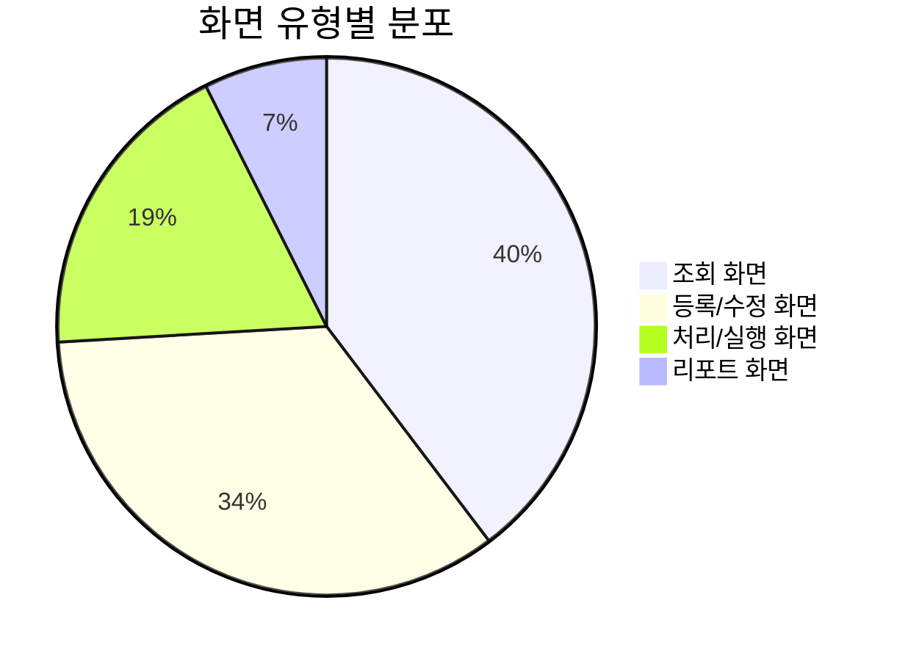

# 화면 목록 개요

HNSMES 시스템은 총 **189개**의 화면으로 구성되어 있으며, 8개의 주요 모듈로 분류됩니다.

## 모듈별 화면 현황

<div class="grid cards" markdown>

-   :material-monitor-dashboard:{ .lg .middle } __SYSTEM__

    ---

    **12개 화면**
    
    시스템 기본 설정 및 관리 기능

-   :material-database:{ .lg .middle } __BASE__

    ---

    **18개 화면**
    
    기준정보 관리

-   :material-calendar-clock:{ .lg .middle } __PLAN__

    ---

    **15개 화면**
    
    생산계획 관리

-   :material-factory:{ .lg .middle } __PROD__

    ---

    **38개 화면**
    
    생산실적 및 공정관리

-   :material-package-variant:{ .lg .middle } __MAT__

    ---

    **31개 화면**
    
    자재 및 재고관리

-   :material-quality-high:{ .lg .middle } __QCM__

    ---

    **28개 화면**
    
    품질관리

-   :material-wrench-cog:{ .lg .middle } __EQM__

    ---

    **22개 화면**
    
    설비관리

-   :material-chart-box:{ .lg .middle } __MST__

    ---

    **25개 화면**
    
    마스터 데이터 관리

</div>

## 모듈별 상세 정보

| 모듈 | 화면 ID 범위 | 화면 수 | 주요 기능 |
|:---:|:---:|:---:|:---|
| SYSTEM | SYST001 ~ SYST012 | 12 | 사용자/메뉴/권한 관리, 시스템 설정 |
| BASE | BASE001 ~ BASE018 | 18 | 공장/라인/품목 기준정보 관리 |
| PLAN | PLANT001 ~ PLANT015 | 15 | 생산계획 수립 및 조정 |
| PROD | PRODT001 ~ PRODT038 | 38 | 작업지시, 생산실적, 공정관리 |
| MAT | MATM001 ~ MATM031 | 31 | 자재입출고, 재고관리, 창고관리 |
| QCM | QCMT001 ~ QCMT028 | 28 | 품질검사, 불량관리, 품질이력 |
| EQM | EQMT001 ~ EQMT022 | 22 | 설비정보, 보전관리, 정기점검 |
| MST | MSTM001 ~ MSTM025 | 25 | 거래처, BOM, 라우팅 마스터 |

!!! note "총 화면 수"
    전체 시스템은 **189개**의 화면으로 구성되어 있으며, 각 모듈은 독립적인 권한 관리가 가능합니다.

## 화면 ID 체계

```
[모듈코드][T/M][일련번호]

예시:
├─ SYST001: 시스템 모듈 (SYST) + 일련번호 001
├─ PRODT010: 생산 모듈 (PRODT) + 일련번호 010
└─ MATM005: 자재 모듈 (MATM) + 일련번호 005
```

| 접미사 | 의미 | 사용 모듈 |
|:---:|:---:|:---|
| T | Transaction (거래/실적) | PRODT, QCMT, EQMT |
| M | Master (마스터/기준) | MATM, MSTM |
| - | 기타 | SYST, BASE, PLANT |

## 화면 유형 분포



## 모듈별 세부 문서

각 모듈의 상세 화면 정보는 다음 문서에서 확인하실 수 있습니다:

- [시스템 관리](./system-management.md) - SYSTEM 모듈 (12개 화면)
- [생산 관리](./production.md) - PROD 모듈 (38개 화면)
- [자재 관리](./material.md) - MAT 모듈 (31개 화면)

!!! tip "화면 검색"
    특정 화면을 빠르게 찾으려면 브라우저의 검색 기능(Ctrl+F)을 사용하여 화면 ID 또는 이름을 검색하세요.

## 화면 개발 가이드

### 신규 화면 ID 부여 규칙

1. **모듈 확인**: 화면이 속할 모듈을 확인
2. **일련번호 확인**: 해당 모듈의 마지막 일련번호 확인
3. **ID 생성**: `[모듈코드] + [일련번호+1]` 형식으로 생성

!!! warning "중요"
    화면 ID는 한번 부여되면 변경할 수 없으므로 신중하게 결정해야 합니다.

### 화면 명명 규칙

| 유형 | 명명 규칙 | 예시 |
|:---:|:---|:---|
| 조회 | [대상] + 조회 | 작업지시조회, 재고조회 |
| 등록 | [대상] + 등록 | 생산실적등록, 자재입고등록 |
| 관리 | [대상] + 관리 | 사용자관리, 품목관리 |
| 현황 | [대상] + 현황 | 생산진행현황, 품질현황 |
