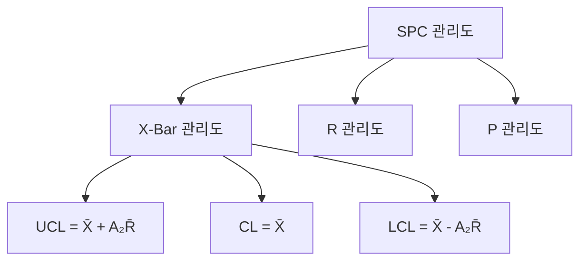
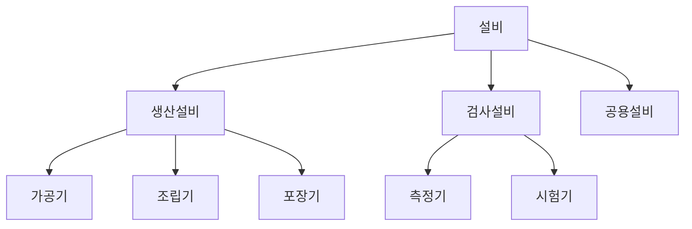
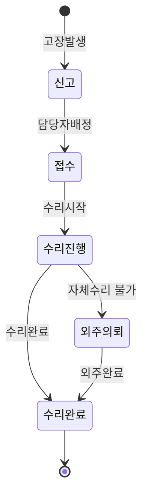
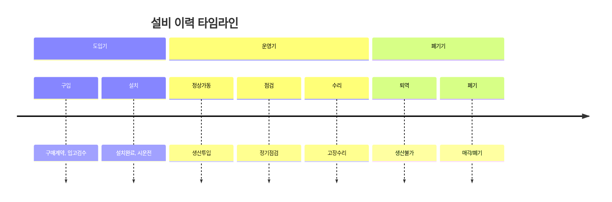
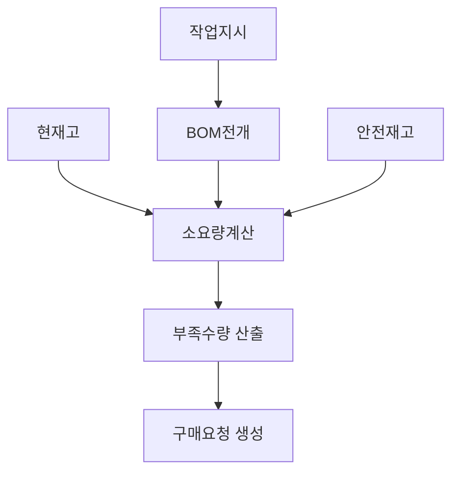

# 미구현 기능 (향후 개발 예정)

이 문서는 HNSMES 시스템에서 현재 구현되지 않았으나, 향후 개발이 예정된 기능을 총괄합니다.

!!! info "문서 기준"
    기존 문서에서 참조되었던 가상 모듈(QCM, EQM, PLAN, BASE)의 미구현 기능을 정리한 것입니다.
    구현 완료된 화면은 각 모듈 문서를 참조하세요.

---

## 1. 품질관리 (QCM) 계열

현재 IQC검사(MATA201)와 공정검사(PRDA220), OQC검사(MATB209)는 구현되어 있으나, 독립적인 품질관리 모듈은 미구현입니다.

### 구현 현황

| 기능 | 구현여부 | 현재 위치 |
|:---|:---:|:---|
| 수입검사(IQC) | ✅ | [MAT > MATA201](./mat.md) |
| 공정검사 | ✅ | [PRD > PRDA220](./prd.md) |
| 출하검사(OQC) | ✅ | [MAT > MATB209](./mat.md) |
| 불량판정 | ✅ | [MAT > MATA205](./mat.md) |
| 불량유형등록 | ✅ | [MST > MSTA208](./mst.md) |

### 미구현 기능

| 기능 | 설명 | 우선순위 |
|:---|:---|:---:|
| SPC 관리도 | X-Bar, R, P 관리도 분석 | 중 |
| 공정능력분석 | Cp, Cpk, Pp, Ppk 계산 및 분석 | 중 |
| 검사기준관리 | 품목별 검사기준/항목 마스터 | 중 |
| AQL기준관리 | 샘플링 검사 기준 관리 | 하 |
| 불량분석(Pareto) | 불량 유형별 Pareto 분석 | 중 |
| 시정조치관리 | 부적합 시정조치(CAPA) 관리 | 하 |
| 클레임관리 | 고객 품질 클레임 관리 | 하 |
| 품질심사관리 | 내부/외부 심사 관리 | 하 |
| 검사장비관리 | 검사 장비 마스터/교정 관리 | 하 |

#### SPC 관리도 참고



#### 공정능력지수

| 지수 | 설명 | 판정기준 |
|:---|:---|:---|
| Cp | 공정능력지수 | Cp >= 1.33 양호 |
| Cpk | 공정능력지수(치우침 고려) | Cpk >= 1.33 양호 |

```
Cp = (USL - LSL) / 6σ
Cpk = min[(USL - μ)/3σ, (μ - LSL)/3σ]
```

---

## 2. 설비보전 (EQM) 고도화

현재 설비등록(MSTA212)과 라인별설비(MSTA211)는 MST 모듈에 구현되어 있으나, 보전관리 전용 기능은 미구현입니다.

### 구현 현황

| 기능 | 구현여부 | 현재 위치 |
|:---|:---:|:---|
| 설비등록 | ✅ | [MST > MSTA212](./mst.md) |
| 라인별설비등록 | ✅ | [MST > MSTA211](./mst.md) |
| 설비가동율 리포트 | ✅ | [RPT > RPTA215](./rpt.md) |
| 설비모니터링 | ✅ | [OSC > OSCA203](./osc.md) |

### 미구현 기능

| 기능 | 설명 | 우선순위 |
|:---|:---|:---:|
| 설비이력카드 | 설비 전 생애주기 이력 관리 | 중 |
| 일상점검등록 | 작업자 일상 점검 결과 기록 | 상 |
| 정기점검등록 | 전문가 정기점검 결과 기록 | 상 |
| 점검계획관리 | 점검 일정 수립 및 관리 | 중 |
| 고장신고 | 설비 고장 발생 시 신고 등록 | 상 |
| 수리작업지시 | 고장 설비 수리 작업 지시 | 중 |
| 수리완료등록 | 수리 결과 등록 | 중 |
| 비가동등록 | 설비 비가동 상태 등록 | 중 |
| 예비품관리 | 예비 부품 재고 관리 | 하 |

#### 설비 분류 체계



#### 고장 처리 흐름 (계획)



#### 설비 이력 타임라인 (계획)



#### 가동률 계산 (계획)

```
가동률(%) = (가동시간 / 총시간) × 100
성능가동률 = (실제생산량 / 이론생산량) × 100
종합효율(OEE) = 가동률 × 성능가동률 × 양품률
```

---

## 3. 생산계획 (PLAN) 고도화

현재 작업지시관리(PRDA202)와 생산계획대비실적(PRDA209)은 구현되어 있으나, 고급 계획 기능은 미구현입니다.

### 구현 현황

| 기능 | 구현여부 | 현재 위치 |
|:---|:---:|:---|
| 작업지시관리 | ✅ | [PRD > PRDA202](./prd.md) |
| 작업지시현황 | ✅ | [PRD > PRDA214](./prd.md) |
| 생산계획대비실적 | ✅ | [PRD > PRDA209](./prd.md) |

### 미구현 기능

| 기능 | 설명 | 우선순위 |
|:---|:---|:---:|
| 생산계획등록 | 월/주 생산계획 수립 | 상 |
| MRP (자재소요계획) | BOM 기반 자재소요량 자동 계산 | 상 |
| CRP (생산능력계획) | 작업장별 능력 분석 | 중 |
| 작업일정관리 | Gantt 차트 기반 일정 시각화 | 중 |
| 생산계획 시뮬레이션 | What-if 분석 | 하 |

#### MRP 프로세스 (계획)



#### CRP 분석 (계획)

| 항목 | 설명 |
|:---|:---|
| 가용시간 | 작업장 가용 작업시간 |
| 부하시간 | 작업지시별 필요 시간 합 |
| 가동률 | (부하/가용) x 100 |
| 잔여능력 | 가용 - 부하 |

---

## 4. 대시보드 확장

### 미구현 기능

| 기능 | 설명 | 우선순위 |
|:---|:---|:---:|
| 메인 대시보드 | 생산/품질/설비/재고 종합 현황 | 중 |
| 품질현황 대시보드 | 불량률, 검사현황 시각화 | 중 |
| 설비현황 대시보드 | 설비 가동현황 시각화 | 중 |
| 재고현황 대시보드 | 재고 수준 시각화 | 하 |
| 알림센터 | 이상발생 알림 관리 | 중 |

---

## 5. 기타 미구현 기능

| 기능 | 설명 | 관련 모듈 | 우선순위 |
|:---|:---|:---:|:---:|
| ECO/ECN 관리 | Engineering Change Order 관리 | MST | 하 |
| 작업표준서관리 | 표준 작업 지침서 관리 | MST | 하 |
| 안전재고관리 | 안전재고 기준 설정/경고 | MAT | 중 |
| LOT 추적 고도화 | Forward/Backward 추적 강화 | MAT | 중 |
| 온라인사용자현황 | 접속 중 사용자 모니터링 | SYS | 하 |

---

## 개발 로드맵 제안

```mermaid
gantt
    title 미구현 기능 개발 로드맵
    dateFormat YYYY-Q
    axisFormat %Y-Q%q

    section 1단계 (우선)
    생산계획등록          :2026-Q2, 90d
    일상/정기점검         :2026-Q2, 90d
    고장신고/수리         :2026-Q3, 90d

    section 2단계 (중기)
    MRP/CRP              :2026-Q3, 120d
    SPC 관리도            :2026-Q4, 90d
    대시보드 확장         :2026-Q4, 90d

    section 3단계 (장기)
    품질 고도화           :2027-Q1, 120d
    시뮬레이션            :2027-Q2, 90d
```
