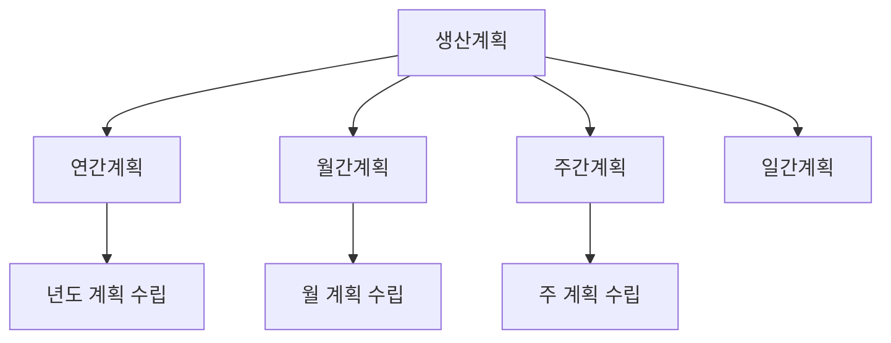
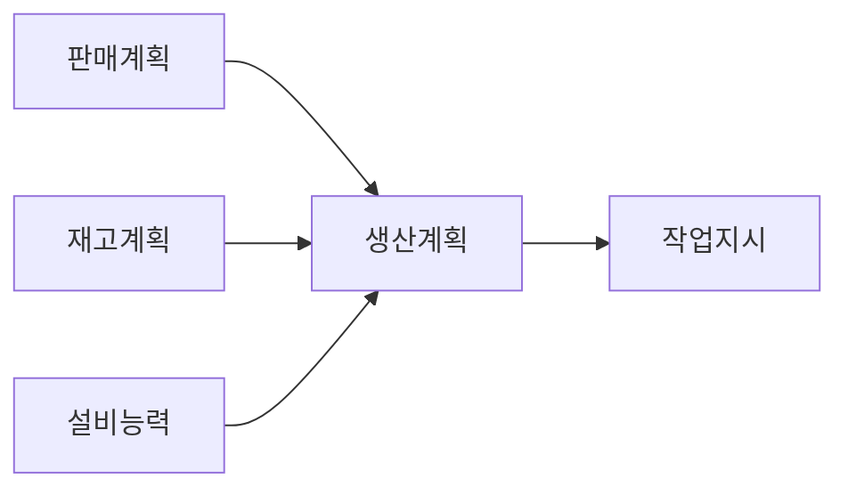
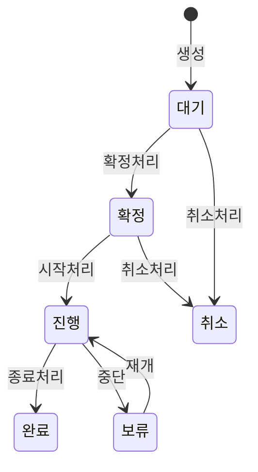
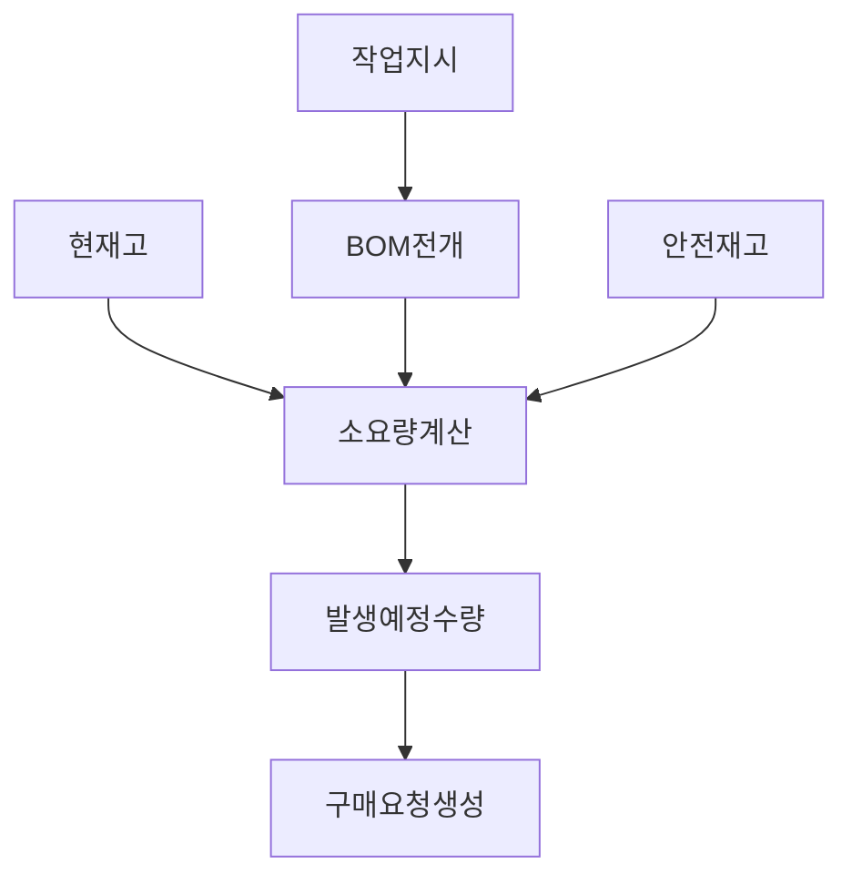
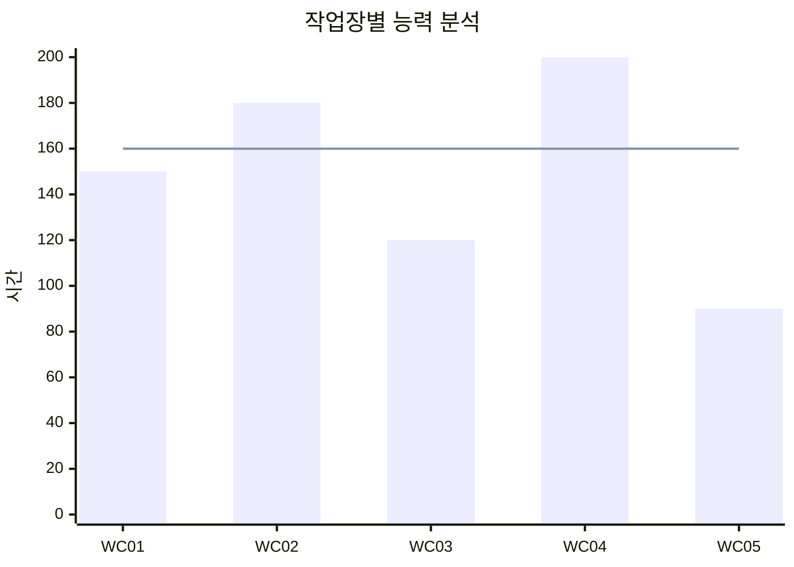
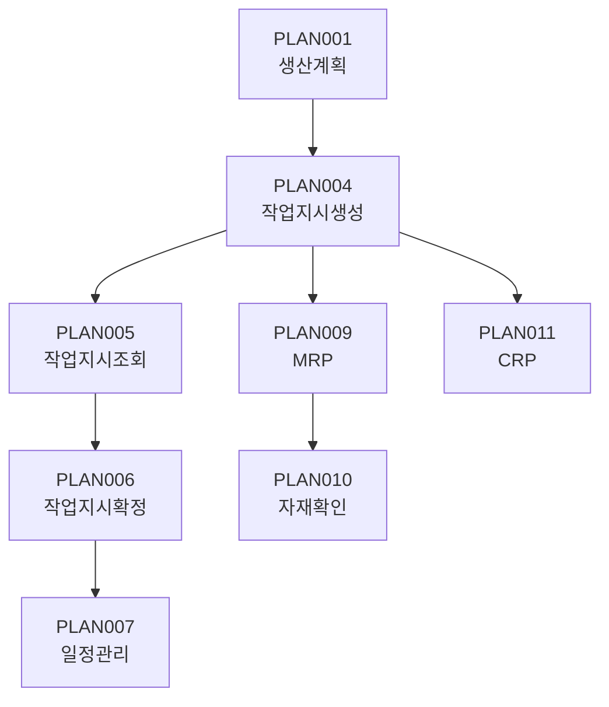

# 생산계획 관리 (PLAN Module)

생산 계획 수립 및 작업지시 관리 화면입니다.

## 모듈 개요

| 항목 | 내용 |
|------|------|
| 모듈코드 | PLAN |
| 화면수 | 15개 |
| 주요기능 | 생산계획, 작업지시, 일정관리 |

---

## 화면 목록

| 화면ID | 화면명 | 설명 |
|--------|--------|------|
| PLAN001 | 생산계획등록 | 월/주 생산계획 등록 |
| PLAN002 | 생산계획조회 | 생산계획 현황 조회 |
| PLAN003 | 생산계획대비실적 | 계획 대비 실적 분석 |
| PLAN004 | 작업지시생성 | 작업지시 자동/수동 생성 |
| PLAN005 | 작업지시조회 | 작업지시 현황 조회 |
| PLAN006 | 작업지시확정 | 작업지시 확정/취소 |
| PLAN007 | 작업일정관리 | 작업장별 일정 관리 |
| PLAN008 | 일정변경관리 | 작업일정 변경 처리 |
| PLAN009 | 자재소요계획 | MRP 실행 및 조회 |
| PLAN010 | 자재가용성확인 | 자재 재고 확인 |
| PLAN011 | 생산능력계획 | CRP 실행 및 분석 |
| PLAN012 | 작업배분관리 | 작업자 배분 관리 |
| PLAN013 | 긴급작업지시 | 긴급/특수 작업지시 |
| PLAN014 | 외주작업지시 | 외주 생산 지시 관리 |
| PLAN015 | 생산계획시뮬레이션 | 계획 시뮬레이션 |

---

## 생산계획 관리

### PLAN001 - 생산계획등록

월별/주별 생산 계획을 등록합니다.

#### 계획 유형

#### 입력 항목

| 항목 | 필수 | 설명 |
|------|------|------|
| 계획구분 | Y | 연/월/주/일 |
| 계획기간 | Y | 계획 대상 기간 |
| 품목코드 | Y | 생산 대상 품목 |
| 계획수량 | Y | 생산 예정 수량 |
| 공장 | Y | 생산 공장 |
| 작업장 | N | 생산 작업장 |
| 납기일 | N | 출하/납기 예정일 |
| 비고 | N | 특이사항 |

#### 계획 수립 프로세스

---

### PLAN003 - 생산계획대비실적

계획 대비 실적을 분석합니다.

#### 분석 항목

| 항목 | 설명 |
|------|------|
| 계획수량 | 원 계획 수량 |
| 확정수량 | 확정된 작업지시 수량 합 |
| 실적수량 | 완료된 생산실적 수량 |
| 달성률 | (실적/계획) × 100 |
| 차이수량 | 계획 - 실적 |

---

## 작업지시 관리

### PLAN004 - 작업지시생성

생산계획을 기반으로 작업지시를 생성합니다.

#### 생성 방식

| 방식 | 설명 |
|------|------|
| 자동생성 | MRP 실행 결과 자동 생성 |
| 수동생성 | 사용자가 직접 입력 생성 |
| 복사생성 | 기존 지시 복사 후 수정 |

#### 입력 항목

| 항목 | 필수 | 설명 |
|------|------|------|
| 작업지시번호 | Y | 자동 채번 |
| 지시일자 | Y | 지시 생성 일자 |
| 품목코드 | Y | 생산 품목 |
| 지시수량 | Y | 생산 지시 수량 |
| 시작예정일 | Y | 작업 시작 예정일 |
| 완료예정일 | Y | 작업 완료 예정일 |
| 작업장 | Y | 생산 작업장 |
| 우선순위 | N | 긴급/보통/여유 |
| 지시상태 | Y | 대기/확정/진행 |

#### 작업지시 상태 흐름

---

### PLAN007 - 작업일정관리

작업장별 작업 일정을 시각화하여 관리합니다.

#### 화면 구성

- **Gantt 차트**: 작업장별 작업 일정 시각화
- **달력 뷰**: 일자별 작업 현황
- **목록 뷰**: 상세 작업 목록

#### 기능

| 기능 | 설명 |
|------|------|
| 드래그앤드롭 | 일정 직접 조정 |
| 충돌검사 | 작업장 중복 할당 체크 |
| 능력체크 | 설비/인원 능력 초과 경고 |

---

## 자재소요계획 (MRP)

### PLAN009 - 자재소요계획

BOM을 기반으로 자재 소요량을 계산합니다.

#### MRP 실행 프로세스

#### 계산 항목

| 항목 | 설명 |
|------|------|
| 총소요량 | 작업지시 수량 × BOM 수량 |
| 현재고 | 가용한 현재 재고 |
| 가용재고 | 현재고 + 입고예정 |
| 부족수량 | 총소요량 - 가용재고 |
| 조달일 | 필요일 - 조달LT |

---

## 생산능력계획 (CRP)

### PLAN011 - 생산능력계획

작업장별 생산 능력을 계획하고 분석합니다.

#### 능력 산정 항목

| 항목 | 설명 |
|------|------|
| 가용시간 | 작업장 가용 작업시간 |
| 부하시간 | 작업지시별 필요 시간 합 |
| 가동률 | (부하/가용) × 100 |
| 잔여능력 | 가용 - 부하 |

#### 능력 분석 차트

---

## 관련 화면 흐름

