# 생산관리 (PRD) 모듈

## 개요

| 항목 | 내용 |
|:---|:---|
| **모듈코드** | PRD |
| **구현 화면** | 33개 (+ 팝업 13개) |
| **주요 역할** | 작업지시, 생산실적, 공정이동, 생산현황, 외주관리 |
| **주요 패키지** | PKGPRD_PROD, PKGPRD_CURRENT, PKGPRD_REPORT, PKGPRD_HIST |

PRD 모듈은 HNSMES 시스템에서 가장 큰 모듈로, 생산 활동의 전 과정을 관리합니다.

## 업무 흐름도

```mermaid
flowchart TB
    subgraph INPUT["생산 준비"]
        A[PRDA202<br/>작업지시관리] --> B[PRDA214<br/>작업지시현황]
    end

    subgraph PROCESS["생산 공정"]
        B --> C[PRDA201<br/>작업실적등록]
        C --> D[PRDA220<br/>공정검사등록]
        D --> E[PRDA219<br/>실적라벨발행]
    end

    subgraph OUTPUT["생산 완료"]
        E --> F[PRDA221<br/>생산실적마감]
        F --> G[PRDC201<br/>생산종합현황]
    end

    subgraph REPORT["현황/리포트"]
        H[PRDA203<br/>생산현황일별]
        I[PRDB201~208<br/>생산리포트]
        J[PRDH001<br/>생산이력조회]
    end

    C --> H
    F --> I
    C --> J
```

## 구현 화면 목록

### 작업지시 관리

| 화면ID | 화면명 | 유형 | 설명 | 상태 |
|:---|:---|:---:|:---|:---:|
| PRDA202 | 작업지시관리 | 처리 | 작업지시 생성/조회/상태관리/마감 | ✅ |
| PRDA214 | 작업지시현황 | 조회 | 작업지시 진행현황 조회 | ✅ |

#### 작업지시 상태 흐름

### 생산실적 등록/관리

| 화면ID | 화면명 | 유형 | 설명 | 상태 |
|:---|:---|:---:|:---|:---:|
| PRDA201 | 작업실적등록 | 처리 | 공정별 생산실적 등록 (메인 화면) | ✅ |
| PRDA205 | 작업실적조회 | 조회 | 작업실적 상세조회 | ✅ |
| PRDA210 | 재작업관리 | 처리 | 재작업 지시 관리 | ✅ |
| PRDA219 | 작업실적라벨발행 | 처리 | 실적 라벨 발행 | ✅ |
| PRDA220 | 공정검사등록 | 처리 | 공정중 검사 등록 | ✅ |
| PRDA221 | 생산실적마감 | 처리 | 실적 마감 처리 | ✅ |
| PRDA221N | 생산실적마감(신규) | 처리 | 실적 마감 개선 버전 | ✅ |
| PRDA222 | 바코드재발행 | 처리 | 라벨 재발행 | ✅ |

### 생산현황 조회

| 화면ID | 화면명 | 유형 | 설명 | 상태 |
|:---|:---|:---:|:---|:---:|
| PRDA203 | 생산현황(일별) | 조회 | 일별 생산현황 | ✅ |
| PRDA204 | 생산현황(품목별) | 조회 | 품목별 생산현황 | ✅ |
| PRDA206 | 공정이동조회 | 조회 | 공정별 이력 조회 | ✅ |
| PRDA207 | 생산실적집계 | 조회 | 월별 실적 집계 | ✅ |
| PRDA208 | 라인별생산현황 | 조회 | 라인별 실적 현황 | ✅ |
| PRDA209 | 생산계획대비실적 | 조회 | 계획 대비 달성률 | ✅ |
| PRDA211 | 생산투입현황 | 조회 | 자재 투입 현황 | ✅ |
| PRDA213 | 생산LOSS현황 | 조회 | LOSS 분석 | ✅ |
| PRDA215 | 공정별실적현황 | 조회 | 공정별 실적 집계 | ✅ |
| PRDA216 | 생산일보 | 리포트 | 일별 생산 보고 | ✅ |
| PRDA217 | 생산월보 | 리포트 | 월별 생산 보고 | ✅ |
| PRDA218 | 품목별생산현황 | 조회 | 품목별 집계 | ✅ |

### 외주 관리

| 화면ID | 화면명 | 유형 | 설명 | 상태 |
|:---|:---|:---:|:---|:---:|
| PRDA212 | 외주생산관리 | 처리 | 외주 가공 관리 | ✅ |

### 생산리포트

| 화면ID | 화면명 | 유형 | 설명 | 상태 |
|:---|:---|:---:|:---|:---:|
| PRDB201 | 생산현황리포트 | 리포트 | 종합 생산현황 | ✅ |
| PRDB202 | 생산실적리포트 | 리포트 | 상세 실적 보고 | ✅ |
| PRDB203 | 공정별생산리포트 | 리포트 | 공정별 분석 | ✅ |
| PRDB204 | 라인별생산리포트 | 리포트 | 라인별 분석 | ✅ |
| PRDB205 | 품목별생산리포트 | 리포트 | 품목별 분석 | ✅ |
| PRDB206 | 재작업리포트 | 리포트 | 재작업 분석 | ✅ |
| PRDB207 | 생산LOSS리포트 | 리포트 | LOSS 상세 보고 | ✅ |
| PRDB208 | 외주생산리포트 | 리포트 | 외주 현황 | ✅ |

### 종합현황/이력

| 화면ID | 화면명 | 유형 | 설명 | 상태 |
|:---|:---|:---:|:---|:---:|
| PRDC201 | 생산종합현황 | 대시보드 | 대시보드형 생산종합현황 | ✅ |
| PRDH001 | 생산이력조회 | 이력 | 시리얼별 생산이력 추적 | ✅ |

### 팝업 화면

| 화면ID | 화면명 | 설명 |
|:---|:---|:---|
| POP_PRD01 | 작업지시선택 | 작업지시 팝업 |
| POP_PRD02 | 품목선택 | 품목검색 팝업 |
| POP_PRD03 | 공정선택 | 공정검색 팝업 |
| POP_PRD04 | 불량등록 | 불량입력 팝업 |
| POP_PRD05 | 자재투입 | 자재불출 팝업 |
| POP_PRD06 | 재작업지시 | 재작업등록 팝업 |
| POP_PRD07 | 바코드발행 | 라벨발행 팝업 |
| POP_PRD08 | 작업자선택 | 작업자지정 팝업 |
| POP_PRDA201 | 작업실적상세 | 실적상세조회 팝업 |
| POP_PRD201 | 투입자재조회 | 자재투입이력 팝업 |
| POP_PRD204_01 | 시리얼분할 | 시리얼 분할 팝업 |
| POP_PRD204_02 | 시리얼병합 | 시리얼 병합 팝업 |
| POP_PRD204_03 | 시리얼관리 | 시리얼 관리 팝업 |

## 주요 화면 상세

### PRDA201 - 작업실적등록

<iframe src="../assets/screen-visualizations/PRDA201.Designer.html" width="100%" height="600" style="border:1px solid #ccc; border-radius:8px;"></iframe>

[전체 화면 보기](../assets/screen-visualizations/PRDA201.Designer.html){ .md-button .md-button--primary }

생산 공정에서 발생한 실적 데이터를 등록하는 **메인 생산 입력 화면**입니다.

| 항목 | 내용 |
|:---|:---|
| **입력항목** | 작업지시번호, 바코드, 공정코드, 양품수량, 불량수량, 불량코드, 작업자 |
| **호출 프로시저** | PKGPRD_PROD.GET_WORKORDER, CHK_BARCODE, SET_WORK_RESULT |

### PRDA202 - 작업지시관리

| 항목 | 내용 |
|:---|:---|
| **주요기능** | 작업지시 생성/조회/상태관리/마감 |
| **호출 프로시저** | PKGPRD_PROD.GET_WORKORDER, SET_WORKORDER, PUT_WORKORDER |

### PRDH001 - 생산이력조회

시리얼 번호를 기준으로 생산 전 과정의 이력을 추적합니다.

| 항목 | 내용 |
|:---|:---|
| **주요기능** | 시리얼검색, 생산이력, 자재사용이력, 공정이력 조회 |
| **호출 프로시저** | PKGPRD_HIST.* |

## 생산 프로세스 흐름

!!! warning "주의사항"
    생산실적 등록 시 반드시 작업지시가 확정된 상태여야 하며, 이미 마감된 작업지시에는 실적을 등록할 수 없습니다.

## 미구현 화면 (계획)

!!! warning "미구현(계획)"
    아래 화면들은 향후 개발 예정입니다. 상세 내용은 [미구현 기능](./planned-features.md)을 참조하세요.

| 기능 | 설명 | 관련 화면 |
|:---|:---|:---|
| MRP (자재소요계획) | BOM 기반 자재 소요량 자동 계산 | planned-features.md |
| CRP (생산능력계획) | 작업장별 능력 분석 | planned-features.md |
| 생산계획 시뮬레이션 | 계획 시뮬레이션 | planned-features.md |
| 비가동등록 | 설비 비가동 등록 | planned-features.md |

## 권한 설정

| 권한 코드 | 권한명 | 접근 가능 화면 |
|:---:|:---|:---|
| PROD_ADMIN | 생산관리자 | 모든 화면 |
| PROD_USER | 생산사용자 | 조회 + 실적등록 |
| PROD_VIEWER | 생산조회자 | 조회 화면만 |

## 연계 모듈

