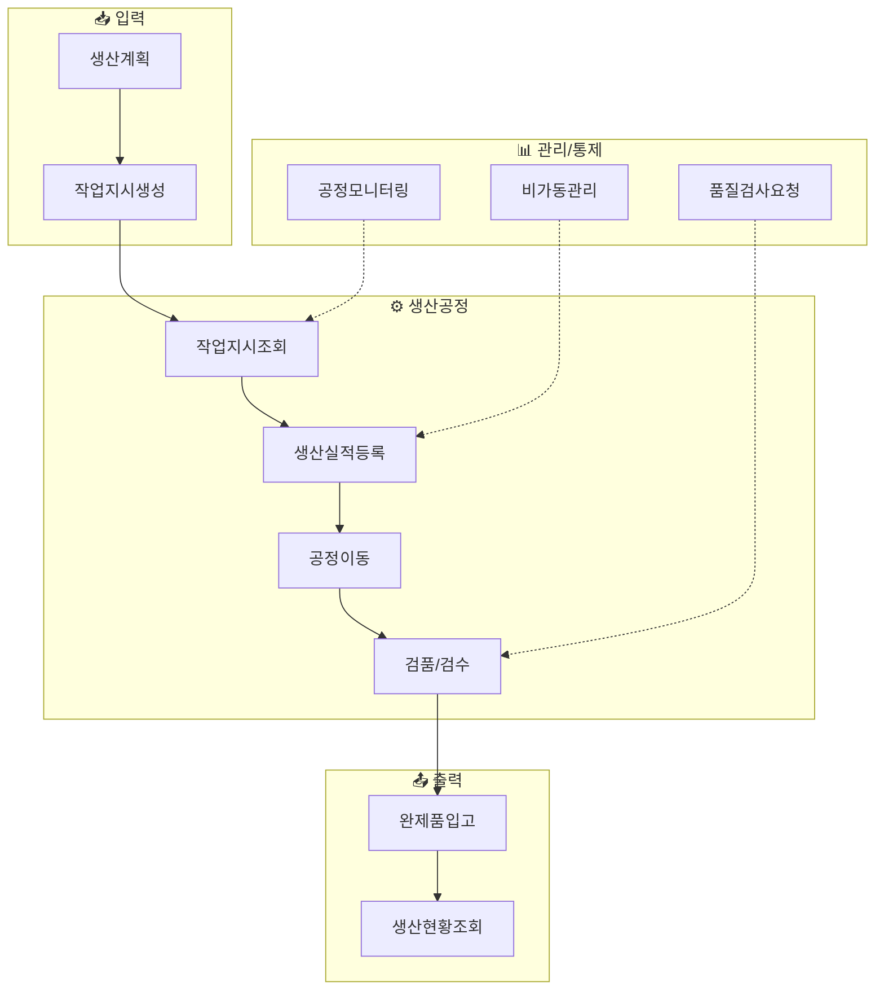
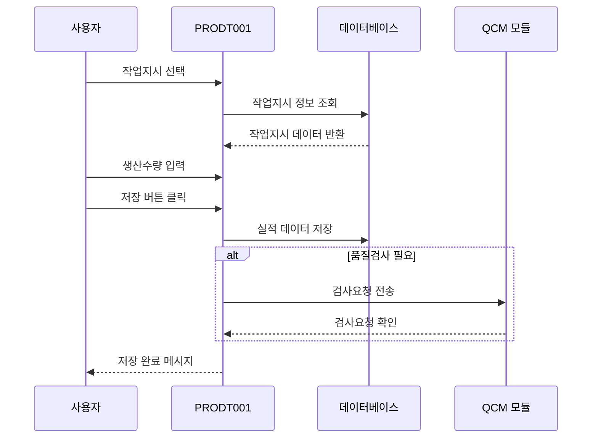
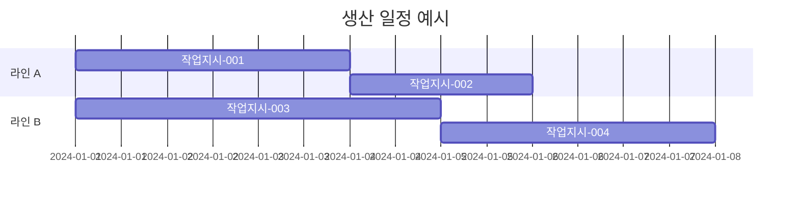
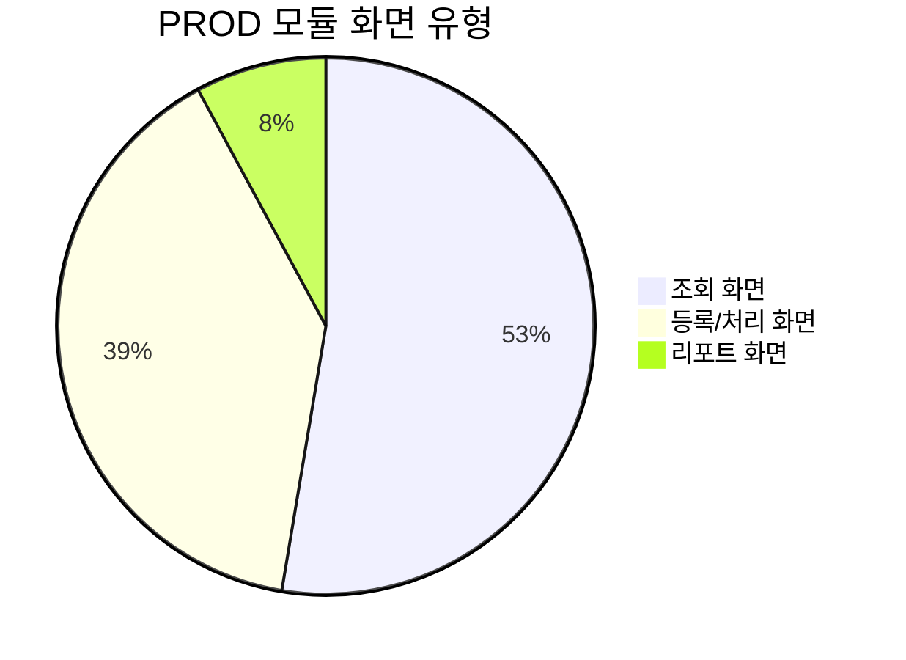
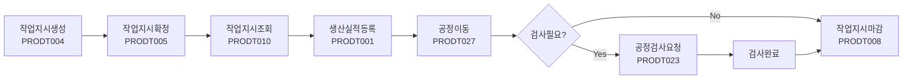
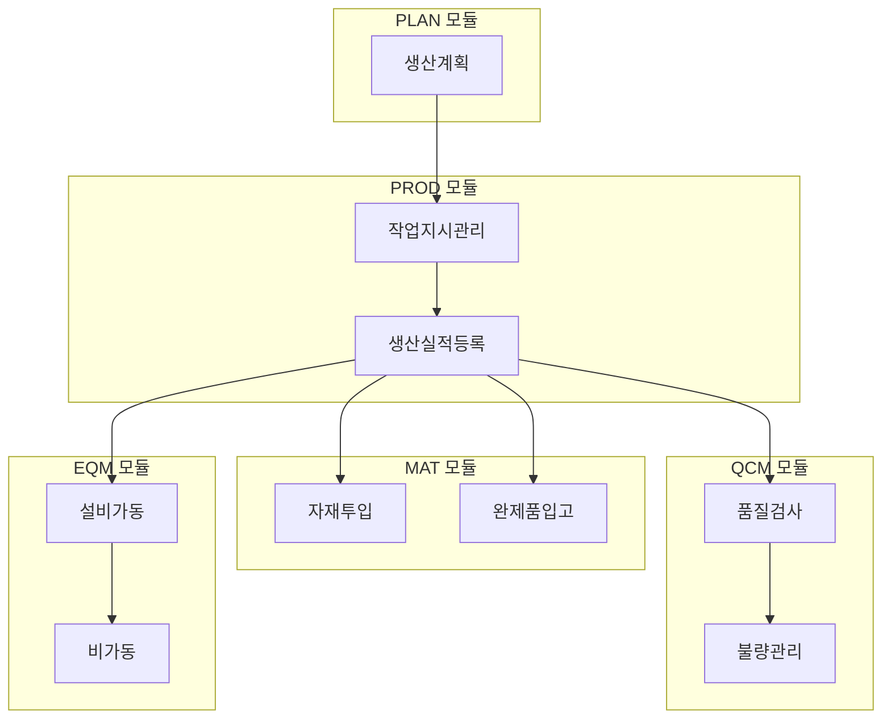

# 생산 관리 (PROD) 화면

PROD 모듈은 생산 활동의 전 과정을 관리하는 **38개**의 화면으로 구성되어 있습니다.

## 개요

## 주요 화면

### PRODT001 - 생산실적등록

<iframe src="/assets/screen-visualizations/PRDA201.Designer.html" width="100%" height="600" style="border:1px solid #ccc; border-radius:8px;"></iframe>

[전체 화면 보기](/assets/screen-visualizations/PRDA201.Designer.html){ .md-button .md-button--primary }

!!! note "화면 설명"
    생산 공정에서 발생한 실적 데이터를 등록하는 핵심 화면입니다.

| 항목 | 내용 |
|:---|:---|
| **화면 ID** | PRODT001 |
| **화면 유형** | 등록/처리 |
| **주요 기능** | 작업시작/완료, 생산수량 입력, 불량처리 |
| **연계 화면** | PRODT002 (실적조회), QCMT001 (품질검사) |

### PRODT010 - 작업지시조회

!!! tip "사용 팁"
    다양한 조회 조건을 조합하여 필요한 작업지시를 빠르게 검색할 수 있습니다.

| 조회 조건 | 설명 |
|:---|:---|
| 기간 | 작업지시 생성일 기준 조회 |
| 공정 | 특정 공정의 작업지시 조회 |
| 상태 | 대기/진행/완료/마감 상태별 조회 |
| 품목 | 특정 품목의 작업지시 조회 |

### PRODT020 - 생산진행현황

## 전체 화면 목록

| 화면 ID | 화면명 | 유형 | 설명 |
|:---:|:---|:---:|:---|
| PRODT001 | 생산실적등록 | 처리 | 생산 공정 실적 입력 |
| PRODT002 | 생산실적조회 | 조회 | 생산 실적 데이터 조회 |
| PRODT003 | 생산실적취소 | 처리 | 잘못된 실적 취소 |
| PRODT004 | 작업지시생성 | 처리 | 신규 작업지시 생성 |
| PRODT005 | 작업지시확정 | 처리 | 작업지시 확정 처리 |
| PRODT006 | 작업지시분할 | 처리 | 작업지시 분할 처리 |
| PRODT007 | 작업지시병합 | 처리 | 작업지시 병합 처리 |
| PRODT008 | 작업지시마감 | 처리 | 작업지시 마감 처리 |
| PRODT009 | 작업지시취소 | 처리 | 작업지시 취소 |
| **PRODT010** | **작업지시조회** | 조회 | 작업지시 목록 조회 |
| PRODT011 | 공정작업일보 | 조회 | 공정별 작업 일보 |
| PRODT012 | 작업자별실적조회 | 조회 | 작업자별 실적 조회 |
| PRODT013 | 설비별실적조회 | 조회 | 설비별 생산 실적 |
| PRODT014 | 품목별실적조회 | 조회 | 품목별 생산 실적 |
| PRODT015 | 일별생성현황 | 조회 | 일일 생산 현황 |
| PRODT016 | 월별생산현황 | 조회 | 월간 생산 현황 |
| PRODT017 | 공정별생산현황 | 조회 | 공정별 생산 현황 |
| **PRODT020** | **생산진행현황** | 조회 | 실시간 생산 진행 상황 |
| PRODT021 | 생산계획대비실적 | 조회 | 계획 대비 실적 비교 |
| PRODT022 | 작업표준서조회 | 조회 | 작업 표준서 확인 |
| PRODT023 | 공정검사요청 | 처리 | 공정 검사 요청 |
| PRODT024 | 공정검사결과조회 | 조회 | 공정 검사 결과 확인 |
| PRODT025 | 비가동등록 | 처리 | 설비 비가동 등록 |
| PRODT026 | 비가동조회 | 조회 | 비가동 이력 조회 |
| PRODT027 | 공정이동등록 | 처리 | 공정 간 이동 등록 |
| PRODT028 | 공정이동조회 | 조회 | 공정 이동 이력 조회 |
| PRODT029 | 외주발주등록 | 처리 | 외주 발주 등록 |
| PRODT030 | 외주발주조회 | 조회 | 외주 발주 조회 |
| PRODT031 | 외주입고등록 | 처리 | 외주 입고 등록 |
| PRODT032 | 외주입고조회 | 조회 | 외주 입고 조회 |
| PRODT033 | 외주반품등록 | 처리 | 외주 반품 등록 |
| PRODT034 | 외주비용등록 | 처리 | 외주 비용 등록 |
| PRODT035 | 생산투입등록 | 처리 | 자재 투입 등록 |
| PRODT036 | 생산투입조회 | 조회 | 자재 투입 이력 |
| PRODT037 | 공정모니터링 | 조회 | 실시간 공정 모니터링 |
| PRODT038 | 생산리포트 | 리포트 | 생산 관련 리포트 출력 |

## 화면 유형별 분포

## 업무 흐름도

!!! warning "주의사항"
    생산실적 등록 시 반드시 작업지시가 확정된 상태여야 하며, 이미 마감된 작업지시에는 실적을 등록할 수 없습니다.

## 권한 설정

| 권한 코드 | 권한명 | 접근 가능 화면 |
|:---:|:---|:---|
| PROD_ADMIN | 생산관리자 | 모든 화면 |
| PROD_USER | 생산사용자 | 조회 + 실적등록 |
| PROD_VIEWER | 생산조회자 | 조회 화면만 |
| PROD_PLAN | 생산계획자 | 계획/지시 관련 화면 |

## 연계 모듈

