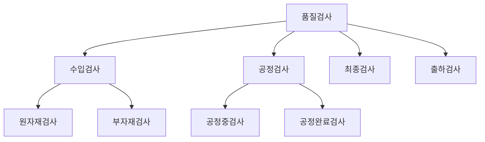
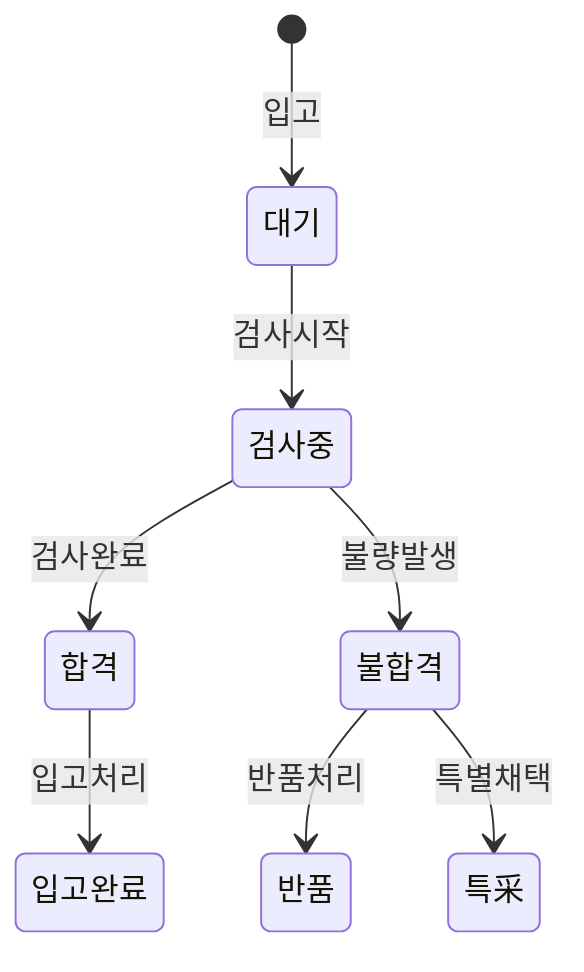
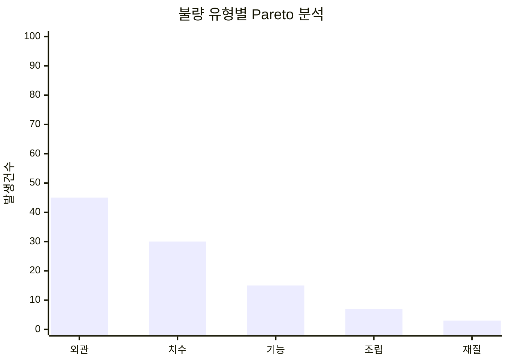
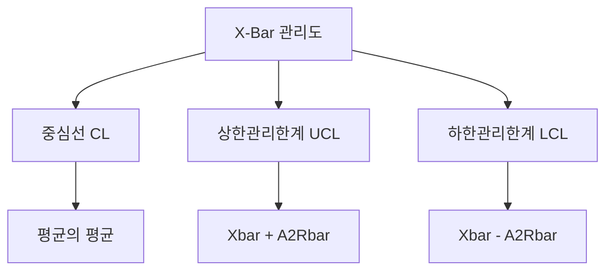
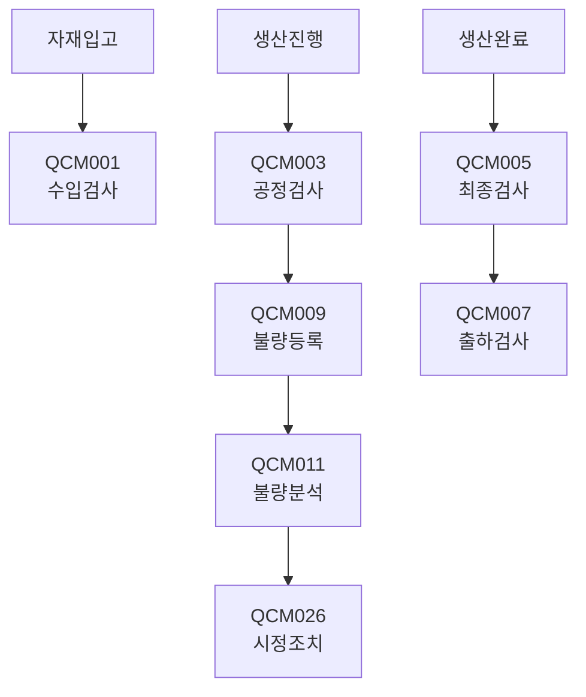

# 품질관리 (QCM Module)

품질 검사 및 불량 관리 화면입니다.

## 모듈 개요

| 항목 | 내용 |
|------|------|
| 모듈코드 | QCM |
| 화면수 | 28개 |
| 주요기능 | 검사관리, 불량관리, 품질기준관리 |

---

## 화면 목록

### 검사관리

| 화면ID | 화면명 | 설명 |
|--------|--------|------|
| QCM001 | 수입검사등록 | 원자재 수입검사 결과 등록 |
| QCM002 | 수입검사조회 | 수입검사 이력 조회 |
| QCM003 | 공정검사등록 | 생산 중 공정검사 등록 |
| QCM004 | 공정검사조회 | 공정검사 이력 조회 |
| QCM005 | 최종검사등록 | 완제품 최종검사 등록 |
| QCM006 | 최종검사조회 | 최종검사 이력 조회 |
| QCM007 | 출하검사등록 | 출하 전 검사 등록 |
| QCM008 | 출하검사조회 | 출하검사 이력 조회 |

### 불량관리

| 화면ID | 화면명 | 설명 |
|--------|--------|------|
| QCM009 | 불량등록 | 생산/검사 불량 등록 |
| QCM010 | 불량조회 | 불량 이력 조회 |
| QCM011 | 불량분석 | 불량 원인 분석 |
| QCM012 | 불량처리 | 불량품 처리 등록 |
| QCM013 | 반품관리 | 고객 반품 처리 |
| QCM014 | 클레임관리 | 품질 클레임 관리 |

### 품질기준관리

| 화면ID | 화면명 | 설명 |
|--------|--------|------|
| QCM015 | 검사기준등록 | 품목별 검사 기준 등록 |
| QCM016 | 검사항목관리 | 검사 항목 마스터 관리 |
| QCM017 | 품질기준서관리 | 품질 기준 문서 관리 |
| QCM018 | AQL기준관리 | 샘플링 검사 기준 관리 |

### SPC/통계분석

| 화면ID | 화면명 | 설명 |
|--------|--------|------|
| QCM019 | X-Bar관리도 | 평균 관리도 분석 |
| QCM020 | R관리도 | 범위 관리도 분석 |
| QCM021 | P관리도 | 부적합률 관리도 |
| QCM022 | 공정능력분석 | Cp, Cpk 분석 |
| QCM023 | 품질통계현황 | 품질 지표 종합 |

### 기타

| 화면ID | 화면명 | 설명 |
|--------|--------|------|
| QCM024 | 검사장비관리 | 검사 장비 관리 |
| QCM025 | 검사자격관리 | 검사원 자격 관리 |
| QCM026 | 시정조치관리 | 부적합 시정조치 |
| QCM027 | 품질심사관리 | 내부/외부 심사 관리 |
| QCM028 | 품질보고서 | 품질 현황 보고서 |

---

## 검사관리

### QCM001 - 수입검사등록

원자재 입고 시 품질 검사 결과를 등록합니다.

#### 검사 유형



#### 입력 항목

| 항목 | 필수 | 설명 |
|------|------|------|
| 검사일자 | Y | 검사 실시일 |
| 입고번호 | Y | 연관 입고 번호 |
| 품목코드 | Y | 검사 대상 품목 |
| LOT번호 | N | 검사 대상 LOT |
| 검사수량 | Y | 총 검사 대상 수량 |
| 샘플수량 | Y | 실제 검사 수량 |
| 합격수량 | Y | 합격 판정 수량 |
| 불량수량 | Y | 불합격 수량 |
| 검사결과 | Y | 합격/불합격/조건부 |
| 검사자 | Y | 검사 담당자 |

#### 검사 결과 처리



---

### QCM003 - 공정검사등록

생산 공정 중 품질을 검사합니다.

#### 입력 항목

| 항목 | 필수 | 설명 |
|------|------|------|
| 작업지시번호 | Y | 해당 작업지시 |
| 공정순서 | Y | 검사 공정 |
| 검사일자 | Y | 검사 실시일 |
| 검사항목 | Y | 검사 기준 항목 |
| 측정값 | Y | 실제 측정값 |
| 규격상한 | N | 허용 상한값 |
| 규격하한 | N | 허용 하한값 |
| 판정 | Y | OK/NG |

---

## 불량관리

### QCM009 - 불량등록

생산 및 검사 과정에서 발생한 불량을 등록합니다.

#### 불량 유형

| 코드 | 설명 |
|------|------|
| D01 | 외관불량 (스크래치, 변색 등) |
| D02 | 치수불량 (치수 초과/미달) |
| D03 | 기능불량 (작동 불량) |
| D04 | 조립불량 (조합 불량) |
| D05 | 재질불량 (소재 불량) |
| D99 | 기타 |

#### 입력 항목

| 항목 | 필수 | 설명 |
|------|------|------|
| 불량일자 | Y | 불량 발생일 |
| 구분 | Y | 생산/검사 |
| 작업지시번호 | N | 관련 작업지시 |
| 품목코드 | Y | 불량 품목 |
| 불량유형 | Y | 불량 분류 코드 |
| 불량수량 | Y | 불량 발생 수량 |
| 발생공정 | N | 불량 발생 공정 |
| 발생원인 | N | 상세 원인 |
| 조치내용 | N | 처리 내용 |
| 불량처리 | Y | 폐기/재작업/특采 |

---

### QCM011 - 불량분석

불량 데이터를 분석하여 개선점을 도출합니다.

#### 분석 유형

| 유형 | 설명 |
|------|------|
| Pareto 분석 | 불량 유형별 빈도 분석 |
| 추이 분석 | 기간별 불량 발생 추이 |
| 공정별 분석 | 공정별 불량 발생 현황 |
| 품목별 분석 | 품목별 불량률 분석 |

#### Pareto 차트 예시



---

## SPC 관리도

### QCM019 - X-Bar 관리도

공정의 중심 경향을 관리합니다.

#### 관리도 구성



#### 판정 규칙 (Zone 규칙)

| 규칙 | 설명 |
|------|------|
| 1 | 1점이 관리한계 외부 |
| 2 | 연속 9점이 중심선 동측 |
| 3 | 연속 6점이 지속적으로 상승/하강 |
| 4 | 연속 14점이 상하 교대 |

---

### QCM022 - 공정능력분석

공정의 품질 능력을 평가합니다.

#### 능력지수

| 지수 | 설명 | 판정기준 |
|------|------|----------|
| Cp | 공정능력지수 | Cp ≥ 1.33 양호 |
| Cpk | 공정능력지수(고려) | Cpk ≥ 1.33 양호 |
| Pp | 장기공정능력 | Pp ≥ 1.33 양호 |
| Ppk | 장기공정능력(고려) | Ppk ≥ 1.33 양호 |

#### 능력지수 계산

```
Cp = (USL - LSL) / 6σ
Cpk = min[(USL - μ)/3σ, (μ - LSL)/3σ]
```

---

## 품질기준관리

### QCM015 - 검사기준등록

품목별 검사 기준을 등록합니다.

#### 입력 항목

| 항목 | 필수 | 설명 |
|------|------|------|
| 품목코드 | Y | 검사 대상 품목 |
| 검사항목 | Y | 검사 항목 코드 |
| 검사방법 | Y | 측정/육안/시험 등 |
| 측정장비 | N | 사용 장비 |
| 규격값 | N | 목표값 |
| 상한값 | N | 허용 최대값 |
| 하한값 | N | 허용 최소값 |
| 샘플링방식 | Y | 전수/샘플링 |
| AQL | N | 샘플링 수준 |

---

## 관련 화면 흐름


