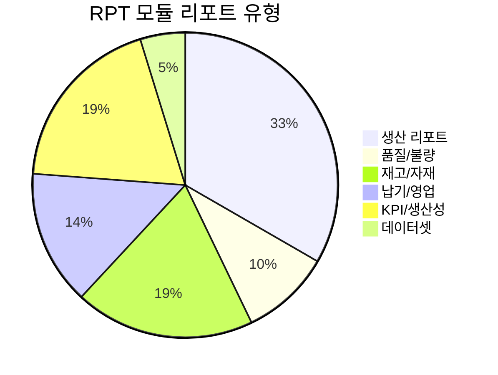

# 리포트 (RPT) 모듈

## 개요

| 항목 | 내용 |
|:---|:---|
| **모듈코드** | RPT |
| **구현 화면** | 22개 |
| **주요 역할** | 생산일보/월보, 불량현황, 설비가동, KPI 분석 |
| **주요 패키지** | PKGHNS_REPORT, PKGPRD_REPORT |

RPT 모듈은 시스템 전반의 데이터를 집계/분석하여 의사결정을 지원하는 리포트를 제공합니다.

## 구현 화면 목록

### 생산 리포트

| 화면ID | 화면명 | 주요내용 | 상태 |
|:---|:---|:---|:---:|
| RPTA201 | 생산일보 | 일별 생산 집계 | ✅ |
| RPTA202 | 생산월보 | 월별 생산 집계 | ✅ |
| RPTA203 | 생산현황 | 생산 종합현황 | ✅ |
| RPTA204 | 품목별생산현황 | 품목별 집계 | ✅ |
| RPTA205 | 공정별생산현황 | 공정별 집계 | ✅ |
| RPTA206 | 라인별생산현황 | 라인별 집계 | ✅ |
| RPTA207 | 작업자별생산현황 | 작업자별 실적 | ✅ |

### 품질/불량 리포트

| 화면ID | 화면명 | 주요내용 | 상태 |
|:---|:---|:---|:---:|
| RPTA208 | 불량현황 | 불량 분석 | ✅ |
| RPTA214 | 재작업현황 | 재작업 분석 | ✅ |

### 재고/자재 리포트

| 화면ID | 화면명 | 주요내용 | 상태 |
|:---|:---|:---|:---:|
| RPTA209 | 재고현황 | 재고 집계 | ✅ |
| RPTA210 | 입출고현황 | 수불부 | ✅ |
| RPTA211 | IQC현황 | 수입검사현황 | ✅ |
| RPTA212 | OQC현황 | 출하검사현황 | ✅ |

### 납기/영업 리포트

| 화면ID | 화면명 | 주요내용 | 상태 |
|:---|:---|:---|:---:|
| RPTA213 | 납기준수율 | 납기 분석 | ✅ |
| RPTA2131 | 납기준수율(상세) | 상세 분석 | ✅ |
| RPTA2132 | 납기준수율(집계) | 집계 보고 | ✅ |

### KPI/생산성 리포트

| 화면ID | 화면명 | 주요내용 | 상태 |
|:---|:---|:---|:---:|
| RPTA215 | 설비가동율 | 설비 효율 분석 | ✅ |
| RPTA216 | 인당생산성 | 생산성 분석 | ✅ |
| RPTA2161 | 인당생산성(상세) | 상세 분석 | ✅ |
| RPTA2162 | 인당생산성(집계) | 집계 보고 | ✅ |

### 데이터셋

| 화면ID | 화면명 | 설명 | 상태 |
|:---|:---|:---|:---:|
| RPTDS | 리포트데이터셋 | 리포트용 데이터셋 정의 | ✅ |

## 리포트 분류

## 연계 모듈

- **PRD**: 생산실적 데이터 기반 생산일보/월보
- **MAT**: 입출고/재고 데이터 기반 자재 리포트
- **SAL**: 수주/출하 데이터 기반 납기 분석
- **MNT**: 설비가동 데이터 기반 가동율 분석
