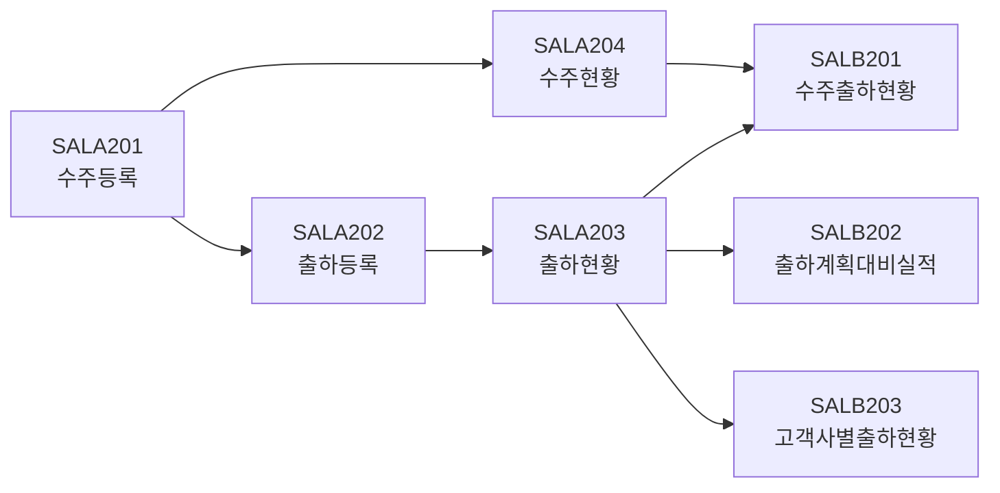

# 영업관리 (SAL) 모듈

## 개요

| 항목 | 내용 |
|:---|:---|
| **모듈코드** | SAL |
| **구현 화면** | 7개 (+ 팝업 2개) |
| **주요 역할** | 수주등록, 출하관리, 영업현황 리포트 |
| **주요 패키지** | PKGPRD_SALES |

SAL 모듈은 고객사 수주부터 제품 출하까지의 영업 프로세스를 관리합니다.

## 업무 흐름도

## 구현 화면 목록

### 등록/처리 화면

| 화면ID | 화면명 | 유형 | 설명 | 호출 프로시저 | 상태 |
|:---|:---|:---:|:---|:---|:---:|
| SALA201 | 수주등록 | 처리 | 고객사 수주 등록 | PKGPRD_SALES.* | ✅ |
| SALA202 | 출하등록 | 처리 | 제품 출하 등록 | PKGPRD_SALES.* | ✅ |
| SALA203 | 출하현황 | 조회 | 출하 현황 조회 | PKGPRD_SALES.* | ✅ |
| SALA204 | 수주현황 | 조회 | 수주 현황 조회 | PKGPRD_SALES.* | ✅ |

### 리포트 화면

| 화면ID | 화면명 | 유형 | 설명 | 상태 |
|:---|:---|:---:|:---|:---:|
| SALB201 | 수주출하현황 | 리포트 | 수주/출하 집계 | ✅ |
| SALB202 | 출하계획대비실적 | 리포트 | 계획 대비 분석 | ✅ |
| SALB203 | 고객사별출하현황 | 리포트 | 고객사별 분석 | ✅ |

### 팝업 화면

| 화면ID | 화면명 | 설명 |
|:---|:---|:---|
| POP_SAL01 | 수주선택 | 수주 팝업 |
| POP_SAL02 | 고객사선택 | 거래처 팝업 |

## 연계 모듈

- **MST**: 거래처/품목 마스터 참조
- **PRD**: 수주 정보 기반 작업지시 생성
- **MAT**: 출하 시 재고 차감
- **RPT**: 납기준수율 리포트 데이터 제공
