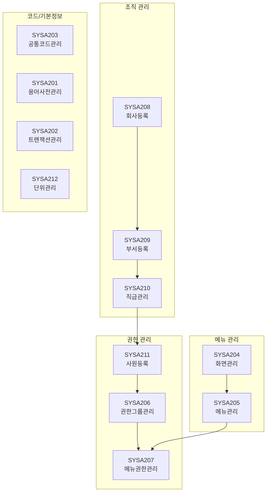
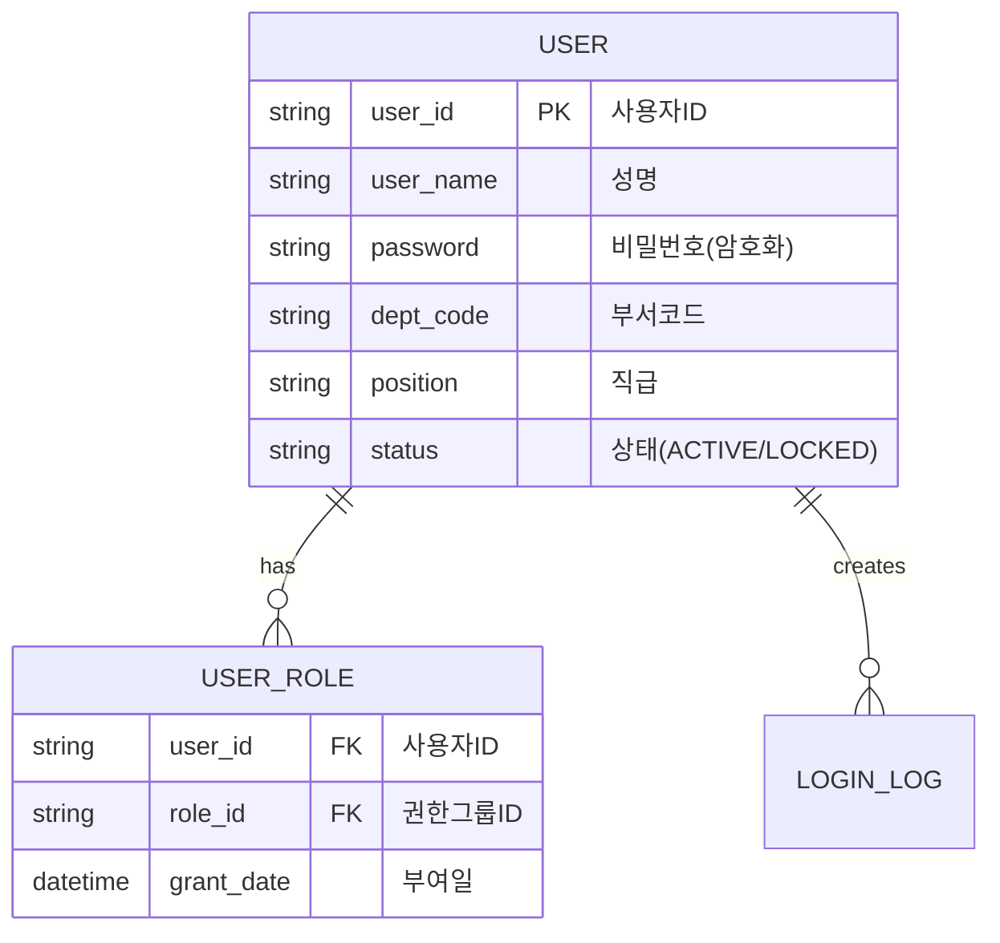
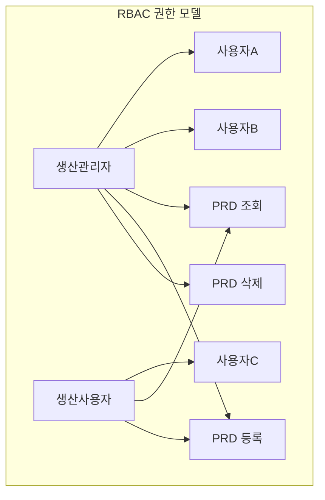
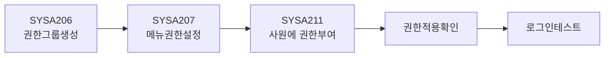
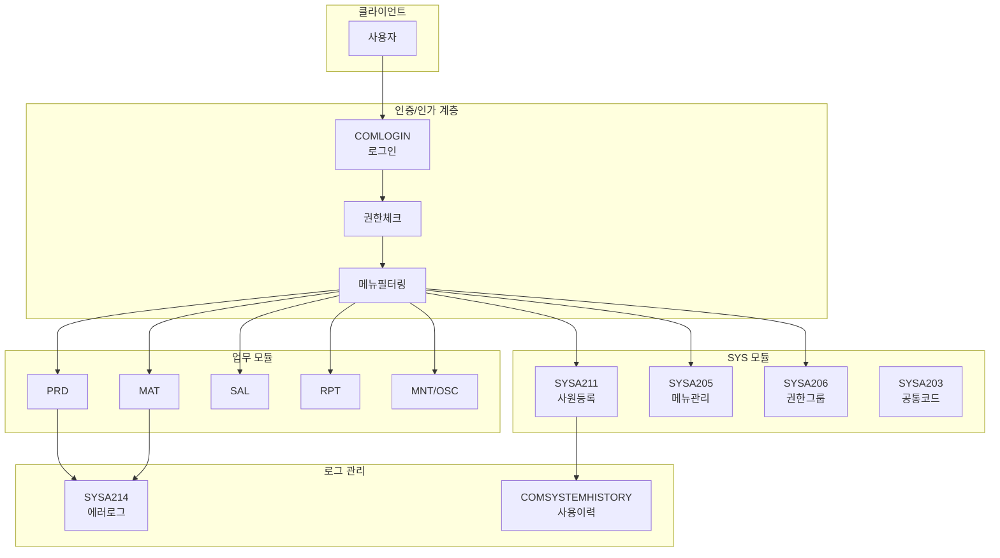
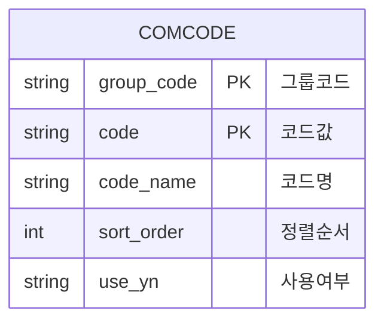
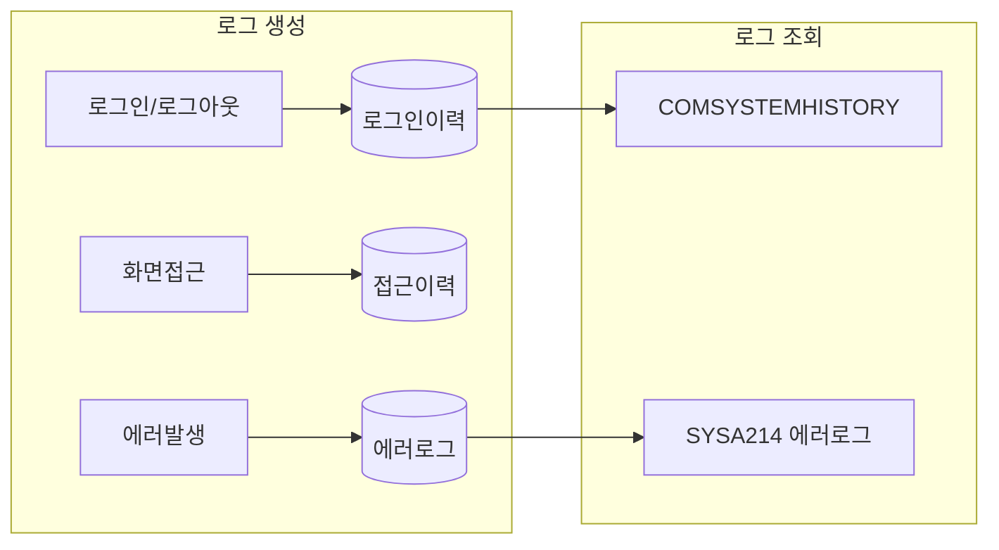

# 시스템관리 (SYS) 모듈

## 개요

| 항목 | 내용 |
|:---|:---|
| **모듈코드** | SYS |
| **구현 화면** | 15개 (+ 팝업 3개) |
| **주요 역할** | 코드관리, 메뉴/권한, 조직관리, 시스템 운영 |
| **주요 패키지** | PKGSYS_COMM, PKGSYS_MENU, PKGSYS_USER, PKGSYS_DBA |

SYS 모듈은 MES 시스템의 기반 환경을 설정하고 관리하는 핵심 모듈입니다.

## 업무 흐름도

## 구현 화면 목록

### 기본정보 관리

| 화면ID | 화면명 | 유형 | 설명 | 상태 |
|:---|:---|:---:|:---|:---:|
| SYSA201 | 용어사전관리 | 관리 | 다국어 용어 관리 | ✅ |
| SYSA202 | 트랜잭션관리 | 관리 | 트랜잭션 코드 관리 | ✅ |
| SYSA203 | 공통코드관리 | 관리 | 시스템 공통 코드 관리 | ✅ |
| SYSA212 | 단위관리 | 관리 | 단위코드 관리 | ✅ |

### 메뉴/권한 관리

| 화면ID | 화면명 | 유형 | 설명 | 상태 |
|:---|:---|:---:|:---|:---:|
| SYSA204 | 화면관리 | 관리 | 시스템 등록 화면(Form) 관리 | ✅ |
| SYSA205 | 메뉴관리 | 관리 | 트리메뉴 구성 및 관리 | ✅ |
| SYSA206 | 권한그룹관리 | 관리 | 역할(Role) 기반 권한그룹 | ✅ |
| SYSA207 | 메뉴권한관리 | 관리 | 권한그룹별 메뉴 접근권한 설정 | ✅ |

### 조직 관리

| 화면ID | 화면명 | 유형 | 설명 | 상태 |
|:---|:---|:---:|:---|:---:|
| SYSA208 | 회사등록 | 관리 | 회사(Client/Company) 관리 | ✅ |
| SYSA209 | 부서등록 | 관리 | 부서/조직 정보 관리 | ✅ |
| SYSA210 | 직급관리 | 관리 | 직급 코드 관리 | ✅ |
| SYSA211 | 사원등록 | 관리 | 사원정보/비밀번호 초기화/EHR연동 | ✅ |

### 시스템 운영

| 화면ID | 화면명 | 유형 | 설명 | 상태 |
|:---|:---|:---:|:---|:---:|
| SYSA213 | 공지사항관리 | 관리 | 공지사항 등록/조회 | ✅ |
| SYSA214 | 에러로그조회 | 조회 | 시스템 에러 로그 조회 | ✅ |
| SYSA215 | 테이블스페이스조회 | 조회 | DB 용량 모니터링 (DBA용) | ✅ |

### 팝업 화면

| 화면ID | 화면명 | 설명 |
|:---|:---|:---|
| POP_SYS01 | 공통코드그룹 | 공통코드 그룹 관리 팝업 |
| POP_SYSA202 | 공통코드그룹(팝업) | 트랜잭션용 코드그룹 팝업 |
| POP_SYSB002 | 공통코드그룹(관리) | 코드그룹 관리 팝업 |

## 주요 화면 상세

### SYSA211 - 사원등록

<iframe src="../assets/screen-visualizations/SYSA211.designer.html" width="100%" height="550" style="border:1px solid #ccc; border-radius:8px;"></iframe>

[전체 화면 보기](../assets/screen-visualizations/SYSA211.designer.html){ .md-button .md-button--primary }

사용자 계정을 등록하고 기본 정보 및 권한을 관리하는 핵심 화면입니다.

| 항목 | 내용 |
|:---|:---|
| **호출 프로시저** | PKGSYS_USER.PUT_DEFAULTPWD, PKGSYS_USER.PUT_EHR, PKGSYS_USER.GET_ROLE |

### RBAC 권한 모델

### 권한 부여 절차

### 권한 그룹 설계 예시

| 권한그룹 ID | 권한그룹명 | 접근 모듈 | 권한 수준 |
|:---:|:---|:---|:---|
| ADMIN | 시스템관리자 | 전체 | 모든 권한 |
| PROD_MGR | 생산관리자 | PRD, MAT | 조회/등록/수정/삭제 |
| PROD_OP | 생산운영자 | PRD, MAT | 조회/등록/수정 |
| QC_MGR | 품질관리자 | MAT, PRD | 조회/등록/수정/삭제 |
| VIEWER | 조회사용자 | 전체 | 조회만 |

## 시스템 아키텍처

## 공통코드 관리 (SYSA203)

시스템 전반에서 사용되는 공통 코드를 관리합니다.

| 코드그룹 | 설명 | 예시 코드값 |
|:---:|:---|:---|
| DEPT | 부서코드 | 1000:생산부, 2000:품질부 |
| POSITION | 직급코드 | 01:사원, 02:대리, 03:과장 |
| YESNO | 예/아니오 | Y:예, N:아니오 |
| STATUS | 상태코드 | ACTIVE:사용, INACTIVE:미사용 |
| UNIT | 단위코드 | EA:개, KG:킬로그램, M:미터 |

## 로그 관리 체계

## 연계 모듈

SYS 모듈의 설정값은 모든 업무 모듈에 영향을 미칩니다:

- **COM**: 로그인 시 SYS 모듈의 사용자/권한 정보 활용
- **MST**: 공통코드, 단위코드 참조
- **PRD/MAT/SAL**: 메뉴 권한에 따른 화면 접근 제어
- **RPT**: 조직 정보(회사/부서) 기반 리포트 필터링
