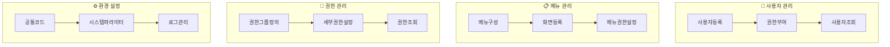
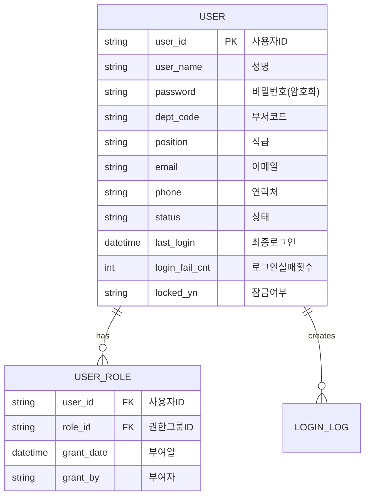
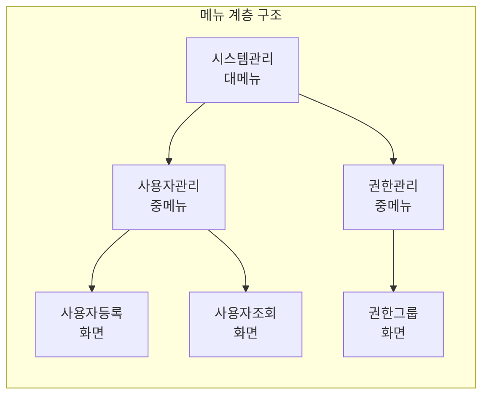
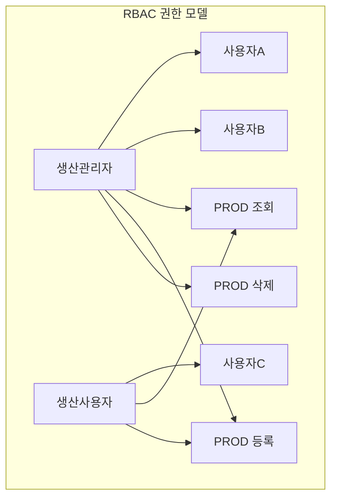
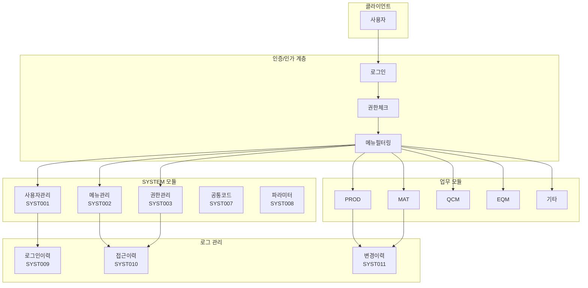
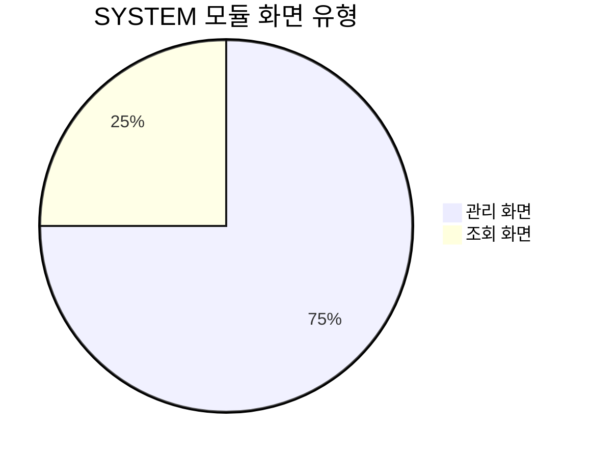
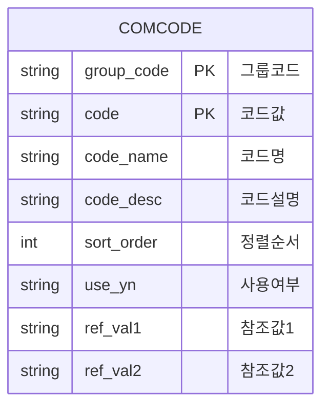
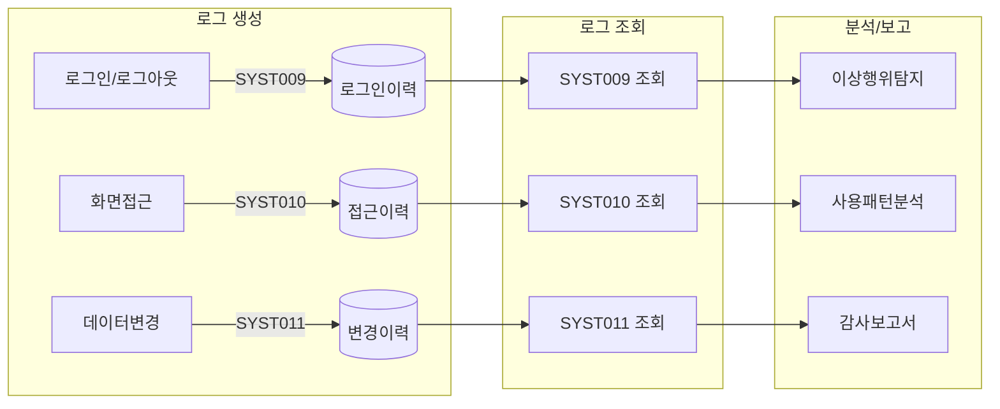
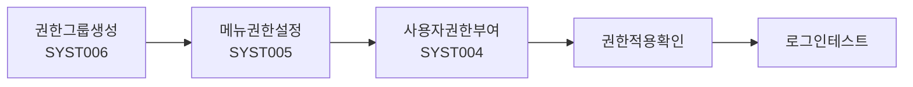
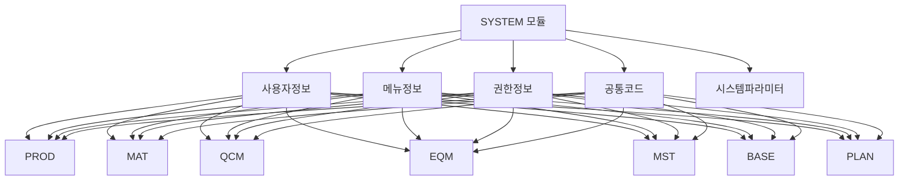

# 시스템 관리 (SYSTEM) 화면

SYSTEM 모듈은 HNSMES 시스템의 기반 환경을 설정하고 관리하는 **12개**의 화면으로 구성되어 있습니다.

## 개요



## 주요 화면

### SYST001 - 사용자관리

<iframe src="/assets/screen-visualizations/SYSA211.Designer.html" width="100%" height="550" style="border:1px solid #ccc; border-radius:8px;"></iframe>

[전체 화면 보기](/assets/screen-visualizations/SYSA211.Designer.html){ .md-button .md-button--primary }

!!! note "화면 설명"
    시스템 사용자를 등록하고 기본 정보 및 상태를 관리하는 핵심 화면입니다.

| 항목 | 내용 |
|:---|:---|
| **화면 ID** | SYST001 |
| **화면 유형** | 관리 |
| **주요 기능** | 사용자 등록/수정/삭제, 비밀번호 관리, 잠금/해제 |
| **입력 항목** | 사용자ID, 성명, 부서, 직급, 연락처, 이메일, 상태 |



#### 사용자 상태값

| 상태 | 코드 | 설명 |
|:---:|:---:|:---|
| 사용중 | ACTIVE | 정상 사용 가능 |
| 임시정지 | SUSPENDED | 관리자에 의한 일시 중지 |
| 잠금 | LOCKED | 비밀번호 오류 초과로 인한 잠금 |
| 퇴사 | INACTIVE | 퇴사 또는 사용 불가 |

### SYST002 - 메뉴관리

!!! tip "메뉴 구성"
    계층형 메뉴 구조를 설정하고 각 화면의 접근 경로를 관리합니다.



| 메뉴 속성 | 설명 |
|:---|:---|
| 메뉴ID | 고유 식별자 (계층코드) |
| 메뉴명 | 화면에 표시되는 이름 |
| 상위메뉴 | 부모 메뉴 ID |
| 순서 | 같은 레벨 내 표시 순서 |
| 화면ID | 연결된 화면 (SYST001 등) |
| 아이콘 | 메뉴 아이콘 클래스 |
| 사용여부 | 메뉴 표시 여부 |

### SYST003 - 권한관리

!!! warning "보안 주의"
    권한 변경은 즉시 시스템에 반영되며, 변경 이력이 기록됩니다. 신중하게 처리하세요.

| 기능 | 설명 |
|:---|:---|
| 권한그룹관리 | 역할 기반 권한 그룹 정의 |
| 사용자권한관리 | 개별 사용자에게 권한 그룹 부여 |
| 메뉴권한관리 | 권한 그룹별 접근 가능 메뉴 설정 |
| 세부권한관리 | 화면 내 버튼/기능 수준 권한 |



## 전체 화면 목록

| 화면 ID | 화면명 | 유형 | 설명 |
|:---:|:---|:---:|:---|
| **SYST001** | **사용자관리** | 관리 | 사용자 등록 및 정보 관리 |
| **SYST002** | **메뉴관리** | 관리 | 메뉴 구조 설정 |
| **SYST003** | **권한관리** | 관리 | 권한 그룹 및 권한 설정 |
| SYST004 | 사용자권한관리 | 관리 | 사용자별 권한 부여 |
| SYST005 | 메뉴권한관리 | 관리 | 메뉴별 접근 권한 설정 |
| SYST006 | 권한그룹관리 | 관리 | 권한 그룹 마스터 관리 |
| SYST007 | 공통코드관리 | 관리 | 시스템 공통 코드 관리 |
| SYST008 | 시스템파라미터 | 관리 | 시스템 환경 변수 설정 |
| SYST009 | 로그인이력조회 | 조회 | 사용자 로그인 이력 조회 |
| SYST010 | 화면접근이력 | 조회 | 화면 사용 이력 조회 |
| SYST011 | 데이터변경이력 | 조회 | 데이터 변경 추적 조회 |
| SYST012 | 시스템모니터링 | 조회 | 시스템 상태 모니터링 |

## 시스템 아키텍처



## 화면 유형별 분포



## 공통 코드 관리 (SYST007)

!!! note "코드 체계"
    시스템 전반에서 사용되는 공통 코드를 관리합니다.

| 코드그룹 | 설명 | 예시 코드값 |
|:---:|:---|:---|
| DEPT | 부서코드 | 1000:생산부, 2000:품질부 |
| POSITION | 직급코드 | 01:사원, 02:대리, 03:과장 |
| YESNO | 예/아니오 | Y:예, N:아니오 |
| STATUS | 상태코드 | ACTIVE:사용, INACTIVE:미사용 |
| UNIT | 단위코드 | EA:개, KG:킬로그램, M:미터 |



## 시스템 파라미터 (SYST008)

| 파라미터 그룹 | 파라미터명 | 설명 | 기본값 |
|:---|:---|:---|:---:|
| LOGIN | MAX_LOGIN_FAIL | 최대 로그인 실패 횟수 | 5 |
| LOGIN | PASSWORD_EXPIRE_DAYS | 비밀번호 만료 기간(일) | 90 |
| LOGIN | SESSION_TIMEOUT | 세션 타임아웃(분) | 30 |
| SYSTEM | BATCH_EXEC_TIME | 일배치 실행 시간 | 23:00 |
| SYSTEM | DATA_RETENTION_DAYS | 로그 보관 기간(일) | 365 |
| ALERT | STOCK_ALERT_EMAIL | 재고경고 수신 이메일 | admin@company.com |

## 로그 관리 체계



### 로그 데이터 구조

| 로그 유형 | 화면 | 저장 정보 |
|:---|:---|:---|
| 로그인이력 | SYST009 | 사용자ID, 일시, IP, 성공/실패, 실패사유 |
| 화면접근이력 | SYST010 | 사용자ID, 화면ID, 접근일시, IP |
| 데이터변경이력 | SYST011 | 테이블명, 변경유형, 변경전/후데이터, 변경자 |

!!! warning "로그 보관"
    로그 데이터는 감사 추적을 위해 설정된 보관 기간 동안 보존됩니다. 보관 기간이 지난 로그는 자동으로 삭제됩니다.

## 권한 설정 가이드

### 권한 그룹 설계 예시

| 권한그룹 ID | 권한그룹명 | 접근 모듈 | 권한 수준 |
|:---:|:---|:---|:---|
| ADMIN | 시스템관리자 | 전체 | 모든 권한 |
| PROD_MGR | 생산관리자 | PROD, MAT | 조회/등록/수정/삭제 |
| PROD_OP | 생산운영자 | PROD, MAT | 조회/등록/수정 |
| QC_MGR | 품질관리자 | QCM, PROD | 조회/등록/수정/삭제 |
| VIEWER | 조회사용자 | 전체 | 조회만 |

### 권한 부여 절차



## 시스템 모니터링 (SYST012)

| 모니터링 항목 | 설명 |
|:---|:---|
| 동시접속자 | 현재 시스템 접속 중인 사용자 수 |
| 세션현황 | 활성/비활성 세션 정보 |
| 성능지표 | CPU, 메모리, 디스크 사용률 |
| 배치상태 | 일배치 및 정기 작업 실행 상태 |
| 알림현황 | 시스템 알림 및 경고 메시지 |

```mermaid
gantt
    title 일일 시스템 점검 일정
    dateFormat HH:mm
    axisFormat %H:%M
    
    section 점검작업
    로그분석    :09:00, 30m
    백업확인    :09:30, 30m
    성능점검    :10:00, 30m
    
    section 정기작업
    일배치     :23:00, 2h
    주간백업   :sunday, 4h
```

## 연계 모듈

SYSTEM 모듈의 설정값은 모든 업무 모듈에 영향을 미칩니다:


