# 시스템 아키텍처

이 문서는 HNSMES UI의 전체 아키텍처와 주요 컴포넌트를 설명합니다.

## 개요

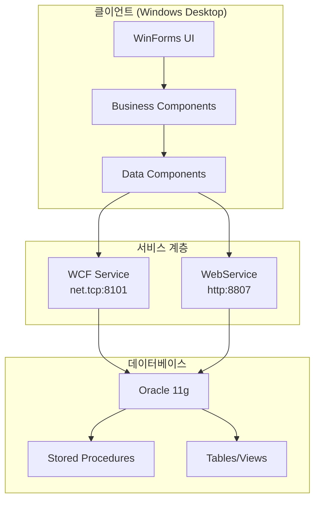

## 3계층 아키텍처

### 계층별 책임

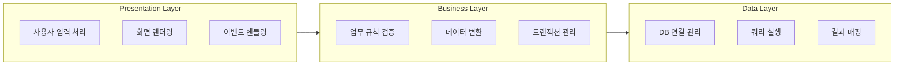

## 주요 컴포넌트

### 1. Base.Form (베이스 폼)

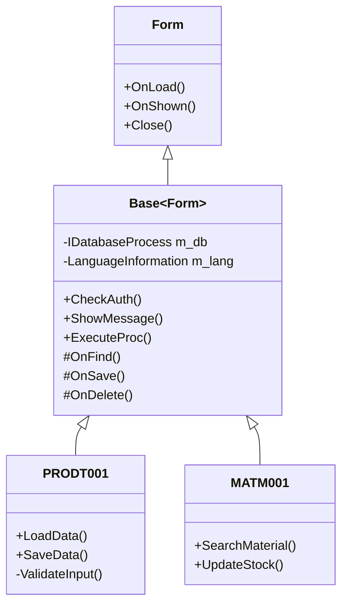

#### 핵심 기능

| 기능 | 설명 |
|------|------|
| **권한 체크** | 화면 로드 시 사용자 권한 검증 |
| **다국어 지원** | LanguageInformation 클래스 활용 |
| **공통 버튼** | itfButton 인터페이스 연동 |
| **데이터 접근** | IDatabaseProcess 인스턴스 제공 |

### 2. IDatabaseProcess (전략 패턴)

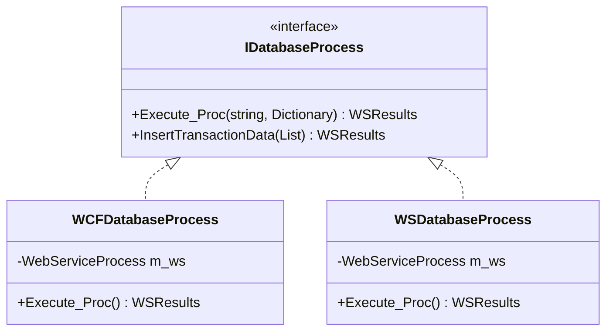

#### 사용 예시

```csharp
// 설정에 따라 구현체 선택
IDatabaseProcess dbProcess;

if (Global_Variable.UseWCF)
{
    dbProcess = new WCFDatabaseProcess();
}
else
{
    dbProcess = new WSDatabaseProcess();
}

// 동일한 인터페이스로 사용
var result = dbProcess.Execute_Proc("PKG_PROD.SELECT", param);
```

### 3. WebServiceProcess

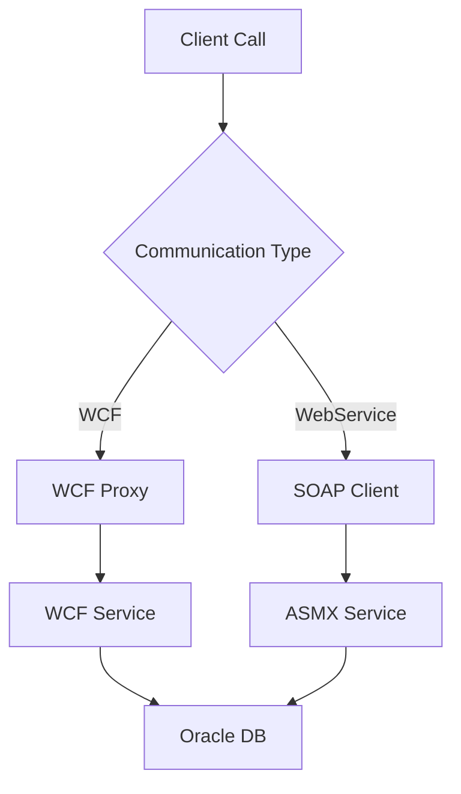

#### 주요 메서드

| 메서드 | 설명 |
|--------|------|
| `ExecuteProcCls()` | 프로시저 실행 (Dictionary 파라미터) |
| `ExecuteQry()` | 직접 SQL 실행 (보안 주의) |
| `GetWsConnectStatus()` | 연결 상태 확인 |
| `WsDownload()` | 파일 다운로드 |

### 4. itfButton (버튼 인터페이스)

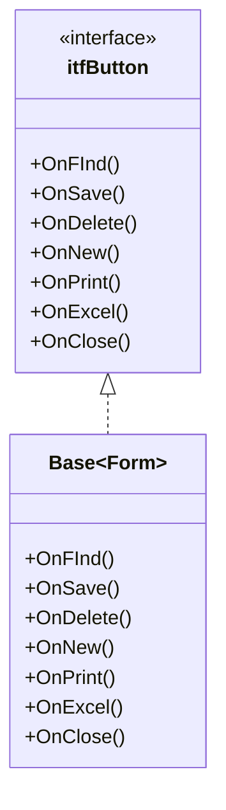

## 데이터 흐름

### 조회 프로세스

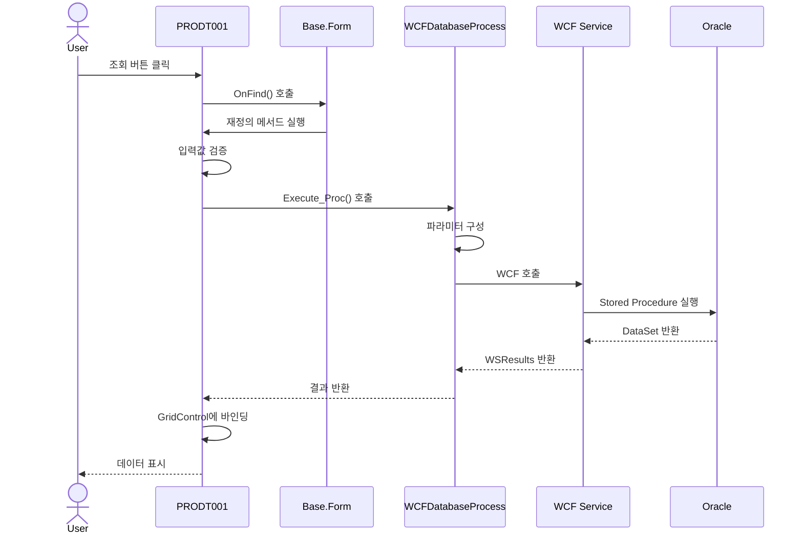

### 저장 프로세스

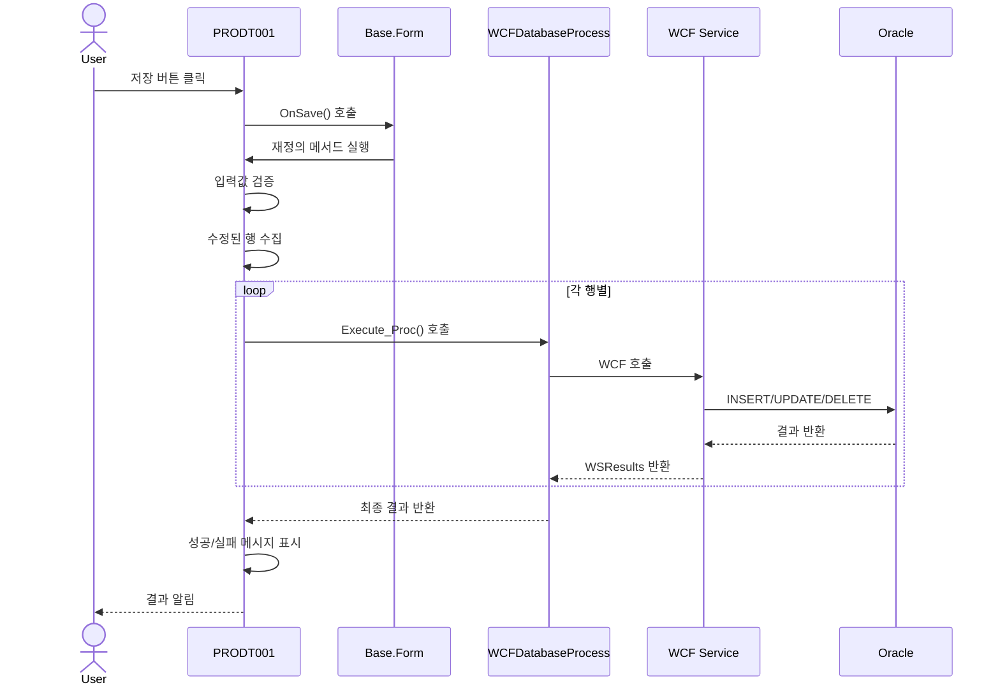

## 폼 상속 계층

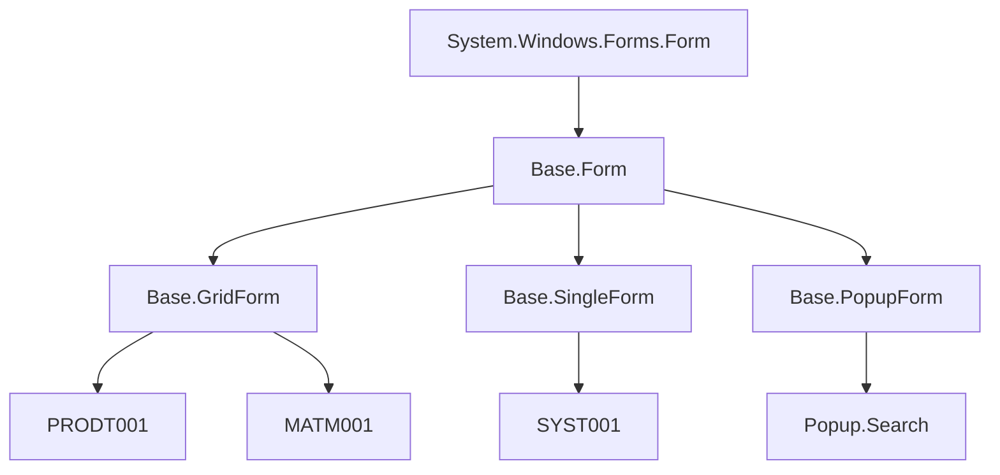

### 각 베이스 타입별 특징

| 타입 | 특징 | 사용 예시 |
|------|------|-----------|
| **Base.Form** | 기본 베이스, 공통 기능 | 단순 화면 |
| **Base.GridForm** | 그리드 기반, 다중 행 편집 | 생산실적, 자재입고 |
| **Base.SingleForm** | 단일 레코드 편집 | 기준정보 등록 |
| **Base.PopupForm** | 모달 팝업, 검색용 | 품목 검색, 공정 선택 |

## 모듈 구조

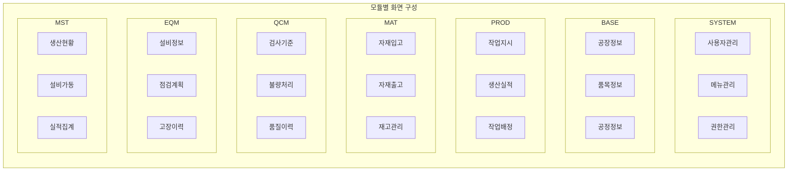

## 설정 및 구성

### Global_Variable

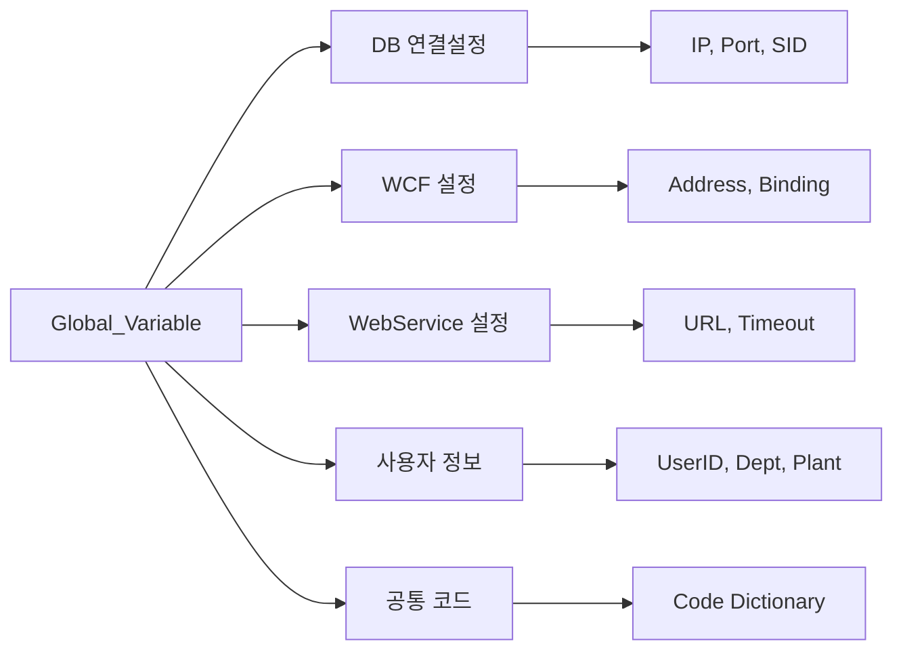

### 주요 설정 항목

```csharp
public static class Global_Variable
{
    // 시스템 설정
    public static string CLIENT = "HNS";
    public static string COMPANY = "001";
    
    // DB 연결
    public static string strOracle_IP = "10.x.x.7";
    public static string strOracle_Port = "1522";
    public static string strOracle_SID = "CDBHNSMES";

    // WCF 설정
    public static string strWCF_Address = "net.tcp://10.x.x.7:8101/WCF_SERVICE";
    public static bool UseWCF = true;
    
    // 사용자 정보
    public static string strUserID;
    public static string strUserName;
    public static string strDeptCode;
    public static string strPlantCode;
}
```

## 보안 아키텍처

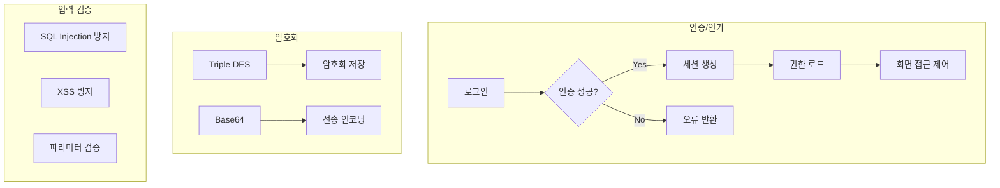

---

## 참고 자료

- [→ 개발 가이드](../guide/project-structure.md)
- [→ 데이터베이스](../database/overview.md)
- [→ 화면 명세](../screens/overview.md)
