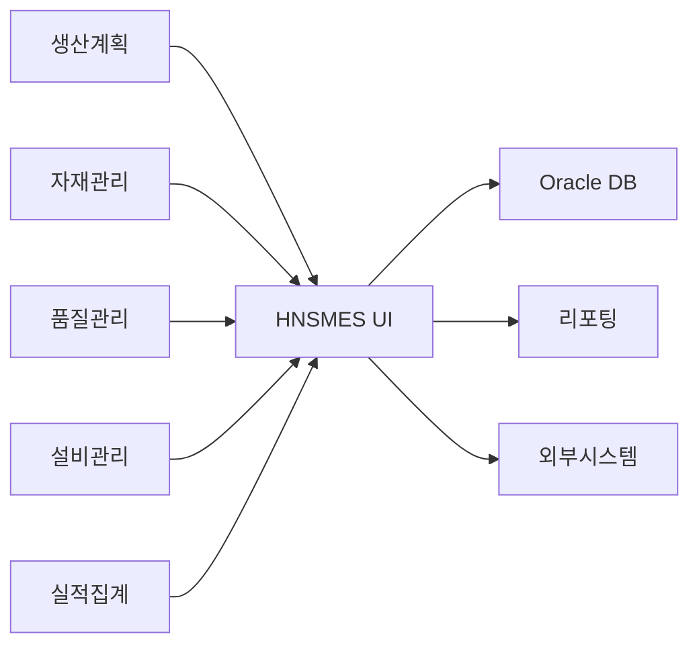
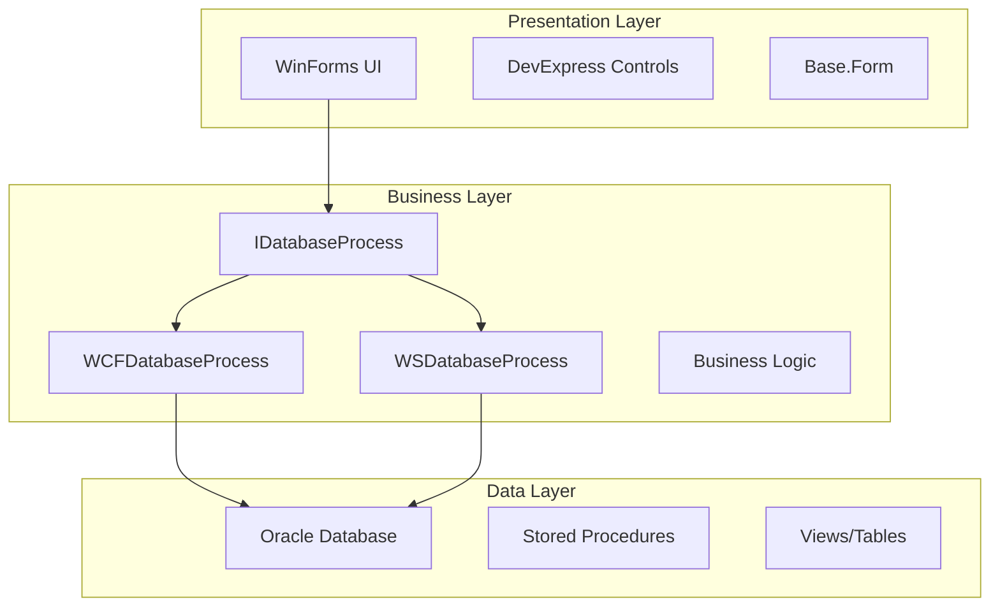
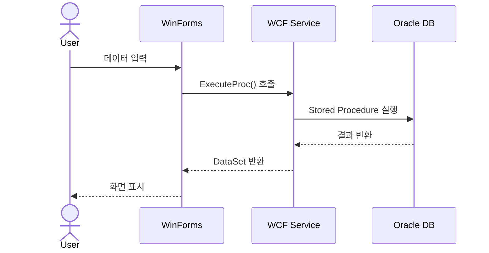

# 시스템 소개

## HNSMES UI 개요

**HAENGSUNG HNSMES UI**는 제조 실행 시스템(MES)의 프레젠테이션 계층으로, 생산 현장의 데이터를 실시간으로 수집·관리·분석하는 데스크톱 애플리케이션입니다.

## 시스템 목적



### 주요 기능

| 기능 영역 | 설명 | 화면 수 |
|-----------|------|---------|
| **시스템 관리** | 사용자/권한/코드 관리 | 12개 |
| **기준정보** | 공장/품목/공정 기본 정보 | 18개 |
| **생산계획** | 작업지시/일정 관리 | 15개 |
| **생산실적** | 작업실적/진행 현황 | 38개 |
| **자재관리** | 입출고/재고/이동 관리 | 31개 |
| **품질관리** | 검사/불량/이력 관리 | 28개 |
| **설비관리** | 점검/보전/고장 관리 | 22개 |
| **모니터링** | 실시간 현황/대시보드 | 25개 |

## 기술 스택

### 프레임워크 & 라이브러리

<div class="grid cards" markdown>

-   :material-microsoft-windows-classic:{ .lg .middle } __.NET Framework 4.0__

    ---

    Windows Forms 기반 데스크톱 애플리케이션

    - C# 4.0 언어 기능
    - .NET Framework 4.0 Class Library
    - Windows Forms 컨트롤

-   :material-chart-bar:{ .lg .middle } __DevExpress 13.2__

    ---

    고급 UI 컴포넌트 라이브러리

    - GridControl, ChartControl
    - Ribbon, Bars, Navigation
    - Scheduler, TreeList

-   :material-database:{ .lg .middle } __Oracle 11g__

    ---

    기업용 데이터베이스

    - PL/SQL Stored Procedures
    - 고성능 트랜잭션 처리
    - 대용량 데이터 관리

-   :material-server-network:{ .lg .middle } __WCF/WebService__

    ---

    서비스 지향 아키텍처

    - WCF (Windows Communication Foundation)
    - SOAP WebService
    - NetTcpBinding

</div>

### 개발 환경

| 항목 | 버전/사양 |
|------|-----------|
| IDE | Visual Studio 2012+ |
| OS | Windows 7/10/11 |
| DB Client | Oracle Client 11g |
| 필수 패키지 | DevExpress 13.2.5+ |

## 시스템 아키텍처

### 3계층 구조



### 데이터 흐름



## 주요 특징

### 1. 전략 패턴 적용

통신 방식(WCF/WebService)을 런타임에 전환할 수 있는 유연한 구조

```csharp
public interface IDatabaseProcess
{
    WSResults Execute_Proc(string proc, Dictionary<string, object> param);
}

// WCF 사용
IDatabaseProcess db = new WCFDatabaseProcess();

// WebService 사용  
IDatabaseProcess db = new WSDatabaseProcess();
```

### 2. Base.Form 상속 구조

모든 화면이 공통 베이스 클래스를 상속받아 일관된 동작 제공

```csharp
public partial class MyForm : Base.Form
{
    // 자동으로 제공되는 기능:
    // - 권한 체크
    // - 다국어 지원
    // - 공통 버튼 처리
    // - 데이터 조회/저장
}
```

### 3. 비즈니스 로직 중앙화

데이터베이스에서 Stored Procedure로 핵심 로직 관리

- **장점**: 보안, 성능, 유지보수 용이성
- **단점**: DB 의존성 증가, 테스트 복잡성

## 대상 사용자

| 사용자 유형 | 주요 사용 화면 |
|-------------|----------------|
| **시스템 관리자** | 사용자관리, 권한관리, 공통코드 |
| **생산 관리자** | 작업지시, 실적현황, 생산계획 |
| **작업자** | 작업실적입력, 불량처리, 자재투입 |
| **품질 관리자** | 검사기준, 불량분석, 품질현황 |
| **설비 관리자** | 점검계획, 고장이력, 보전관리 |

## 문서 구성

이 문서는 다음과 같은 구조로 구성되어 있습니다:

1. **[시작하기](../start/quickstart.md)** - 개발 환경 설정 및 첫 실행
2. **[개발 가이드](../guide/project-structure.md)** - 프로젝트 구조와 코딩 표준
3. **[데이터베이스](../database/overview.md)** - 테이블/프로시저 명세
4. **[화면 명세](../screens/overview.md)** - 189개 화면 상세 설명
5. **[API 문서](../api/wcf-service.md)** - 서비스 인터페이스 정의
6. **[운영 가이드](../operations/deployment.md)** - 배포 및 문제 해결
7. **[개선 제안](../improvements/roadmap.md)** - 미래 개선 방향

---

## 다음 단계

- [→ 빠른 시작 가이드](quickstart.md)에서 개발 환경을 설정하세요.
- [→ 아키텍처](architecture.md)에서 시스템 구조를 자세히 알아보세요.
